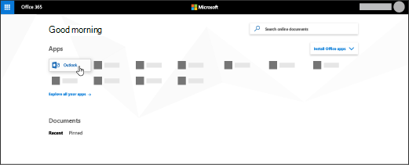

# 设置Outlook阅读电子邮件

你的 Microsoft 365 订阅附带基于 Web Outlook，但如果你的订阅包含 Office 客户端应用，你还将Outlook可以在个人计算机或设备上安装。
  
## 在电子邮件中设置Outlook

第一次打开 Outlook时，将打开自动帐户向导。 如果没有，请选择"**文件"，** 然后选择"**添加帐户"。**
  
1. 在"**电子邮件帐户"页上**，选择"下 **一** 步 \> **添加帐户"。**
    
2. 在"**自动帐户设置"** 页上，输入您的姓名、电子邮件地址和密码，然后选择"下一步 **完成** \> **"。**
    
阅读 [完整文章](https://support.microsoft.com/office/6e27792a-9267-4aa4-8bb6-c84ef146101b)。
  
## 如何安装应用Office，包括Outlook？

1. 转到["admin.microsoft.com/OLS/MySoftware"。](https://admin.microsoft.com/OLS/MySoftware.aspx)
    
2. 使用你的工作或学校帐户登录。
    
3. 在"管理安装"上，选择"**安装"。**
    
## 在 Outlook 2016 for Mac 中设置电子邮件帐户

第一次打开"Outlook时，将打开"设置我的收件箱"向导。 在向导中： 
  
1. 在"**设置我的收件箱"页上，** 选择"**添加帐户"。**
    
2. 在"**帐户"** 页上，选择 **"Exchange或Office 365"。**
    
3. 在"**输入你的Exchange** 帐户信息"页上，输入你的姓名、电子邮件地址和密码，然后选择"添加 **帐户"。**
    
阅读 [完整文章](https://support.microsoft.com/office/6e27792a-9267-4aa4-8bb6-c84ef146101b#PickTab=Outlook_for_Mac)。 
  
## 如何联机访问我的邮件？

登录帐户后，Microsoft 365选择 **"Outlook"。**
  

  
找不到需要的应用？ 从应用启动器中，选择"所有应用"以查看可供你Microsoft 365应用的字母列表。 可在此处搜索特定应用。 
  
## 我如何知道我的订阅是否包含Office应用？

Microsoft 365 商业标准版和Microsoft 365 商业应用版包括Office应用。 有关详细信息，请参阅[Microsoft 365商业计划或](https://go.microsoft.com/fwlink/p/?LinkId=723731)Office 365 企业版[计划](https://go.microsoft.com/fwlink/p/?LinkId=800029)。
  
## 如何确定我拥有哪个订阅？

若要确定订阅，请参阅我 [拥有哪些订阅？](../admin-overview/what-subscription-do-i-have.md)
  

