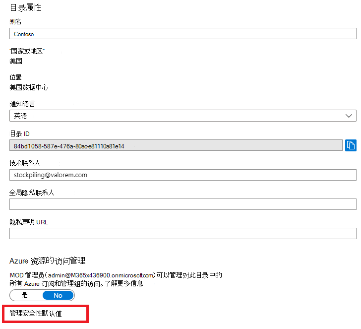
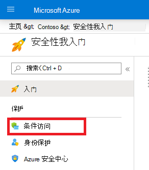
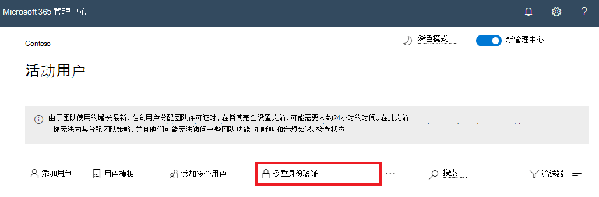

# 用于身份验证的多重Microsoft 365

密码是验证计算机或联机服务的登录的最常见方法，但它们也是最易受攻击的。 用户可以选择简单密码，并使用相同的密码进行不同计算机和服务的多个登录。

若要为登录提供一个额外的安全级别，必须使用多重身份验证 (MFA) ，它同时使用应强的密码和基于：

- 你拥有且不易复制的项，例如智能手机。
- 你唯一且明显拥有的属性，例如指纹、面部或其他生物识别属性。

在验证用户密码之前，不会采用其他验证方法。 使用 MFA，即使强用户密码受到威胁，攻击者也无需智能手机或指纹来完成登录。

## MFA 支持在 Microsoft 365

默认情况下，Microsoft 365和Office 365都支持用户帐户的 MFA，使用：

- 发送到电话的短信，要求用户键入验证码。
- 电话呼叫。
- 智能Microsoft Authenticator应用程序。

在这两种情况下，MFA 登录都使用"你拥有且不可轻易复制的项"方法进行附加验证。 可以通过多种方式为用户和用户启用 MFA Microsoft 365 Office 365：

- 使用安全默认值
- 使用条件访问策略
- 对于每个单独的用户帐户， (建议) 

这些方法基于你的Microsoft 365计划。

|计划|建议|客户类型|
|---|---|---|
|所有Microsoft 365计划|使用安全默认值，这要求所有用户帐户使用 MFA。 
 还可以对单个用户帐户配置每用户 MFA，但不建议这样做。|小型企业|
|Microsoft 365 商业高级版 
 Microsoft 365 E3 
 Azure Active Directory (Azure AD) 高级版 P1 许可证|使用条件访问策略根据组成员身份、应用或其他条件要求用户帐户进行 MFA。|小型企业到企业|
|Microsoft 365 E5 
 Azure AD Premium P2许可证|使用 Azure AD Identity Protection 根据登录风险条件要求 MFA。|企业|
||||

### 安全性默认值

安全性默认值是在 2019 年 10 月 21 日之后创建的 Microsoft 365 和 Office 365 付费或试用版订阅的一项新功能。 这些订阅启用安全默认值，即：

- 要求所有用户将 MFA 与 Microsoft Authenticator应用。
- 阻止旧式身份验证。

用户有 14 天的时间从其智能手机中通过 Microsoft Authenticator 应用登录 MFA，自启用安全性默认值后首次登录起计。 14 天后，除非 MFA 注册完成，否则用户将无法登录。

安全性默认值可确保所有组织均对默认启用的用户登录具有基本的安全级别。 可以禁用安全默认值，以使用条件访问策略支持 MFA。

你可以从 Azure 门户的"属性"窗格中为Azure AD启用或禁用安全默认值。

可以将安全默认值用于任何Microsoft 365计划。

有关详细信息，请参阅此[安全性默认值概述](/azure/active-directory/fundamentals/concept-fundamentals-security-defaults)。

### 条件访问策略

条件访问策略是一组规则，指定评估和允许登录的条件。 例如，你可以创建一个条件访问策略，指明：

- 如果用户帐户名是分配了 Exchange、用户、密码、安全性、SharePoint 或全局管理员角色的用户组的成员，则需要先进行 MFA，然后才能允许访问。

通过此策略，当为用户分配或取消分配了上述管理员角色时，你可以根据其组成员身份要求进行 MFA，而不是针对单个用户帐户进行 MFA 配置。

还可以将条件访问策略用于更高级的功能，例如要求特定应用使用 MFA，或者从兼容设备（如运行 Windows 10 的笔记本电脑）登录。

你可以从 Azure 门户的"安全"**窗格中为Azure AD** 配置条件访问策略。

可以将条件访问策略与：

- Microsoft 365 商业高级版
- Microsoft 365 E3 和 E5
- Azure AD Premium P1许可证Azure AD Premium P2许可证

对于具有 Microsoft 365 商业高级版 的小型企业，可以通过以下步骤轻松使用条件访问策略：

1. 创建一个组以包含需要 MFA 的用户帐户。
2. 启用" **要求全局管理员使用 MFA"** 策略。
3. 使用这些设置创建基于组的条件访问策略：
    - 工作>用户和组：上面的步骤 1 中的组名称。
    - 分配>云应用或操作：所有云应用。
    - 访问控制>授予>授予>要求多重身份验证的权限。
4. 启用策略。
5. 将用户帐户添加到上述步骤 1 中创建的组并进行测试。
6. 若要要求为其他用户帐户使用 MFA，请将其添加到步骤 1 中创建的组中。

此条件访问策略允许你按自己的节奏向用户推出 MFA 要求。

企业应该 [使用常见条件访问策略](/azure/active-directory/conditional-access/concept-conditional-access-policy-common) 来配置以下策略：

- [要求对管理员执行 MFA](/azure/active-directory/conditional-access/howto-conditional-access-policy-admin-mfa)
- [要求对所有用户执行 MFA](/azure/active-directory/conditional-access/howto-conditional-access-policy-all-users-mfa)
- [阻止传统身份验证](/azure/active-directory/conditional-access/howto-conditional-access-policy-block-legacy)

有关详细信息，请参阅此[条件访问概述](/azure/active-directory/conditional-access/overview)。

### Azure AD Identity Protection

借助Azure AD Identity Protection，你可以创建其他条件访问策略，以在登录风险为中或高时要求[MFA。](../../security/office-365-security/identity-access-policies.md#require-mfa-based-on-sign-in-risk)

可以将标识Azure AD和基于风险的条件访问策略用于：

- Microsoft 365 E5
- Azure AD Premium P2许可证

有关详细信息，请参阅此 [Azure AD 标识保护概述](/azure/active-directory/identity-protection/overview-identity-protection)。

### 不建议使用旧版每 (MFA) 

你应该使用安全默认值或条件访问策略来要求用户帐户登录使用 MFA。但是，如果无法使用其中任何一个，Microsoft 强烈建议为具有管理员角色的用户帐户（尤其是 全局管理员角色）执行 MFA。对于任何大小的订阅。

从"活动用户"窗格的"活动用户"窗格中为单个用户帐户Microsoft 365 管理中心。

启用后，用户下次登录时，系统将提示他们注册 MFA，并选择并测试其他验证方法。

### 结合使用这些方法

下表显示了通过安全性默认值、条件访问策略和每用户帐户设置启用 MFA 的结果。

|*项目*|已启用|Disabled|辅助身份验证方法|
|---|---|---|---|
|**安全性默认值**|不使用条件访问策略|可以使用条件访问策略|Microsoft Authenticator 应用|
|**条件访问策略**|如果启用了任何安全默认值，则不能启用安全默认值|如果已禁用所有条件访问策略，则可以启用安全性默认值|由用户在 MFA 注册期间指定|
|**不建议使用旧版每 (MFA)**|替代每次登录时要求 MFA 的安全默认值和条件访问策略|由安全默认值和条件访问策略替代|由用户在 MFA 注册期间指定|
||||

如果启用安全默认值，将提示所有新用户在下次登录时进行 MFA 注册Microsoft Authenticator使用应用。

## 管理 MFA 设置的方法

有两种方法可以管理 MFA 设置。

在 Azure 门户中，你可以：

- 启用和禁用安全默认值
- 配置条件访问策略

在Microsoft 365 管理中心中，你可以配置每用户和服务<a href="https://go.microsoft.com/fwlink/p/?linkid=2169174" target="_blank">MFA 设置</a>。

## 后续步骤

[为 MFA 设置Microsoft 365](set-up-multi-factor-authentication.md)

## 相关内容

[打开多重身份验证](../../business-video/turn-on-mfa.md)（视频）\
[为手机开启多重身份验证](https://support.microsoft.com/office/ace1d096-61e5-449b-a875-58eb3d74de14)（视频）