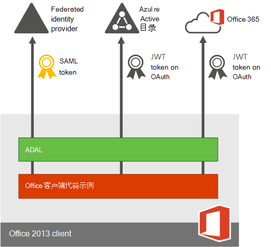

# Office 365 部署的多重身份验证计划Plan for multi-factor authentication for Office 365 Deployments

多重身份验证 (MFA) 是一种身份验证方法，要求使用多个验证方法，并向用户登录和交易添加第二层安全。该验证需要任意两个或多个以下验证方法来实现：Multi-factor authentication (MFA) is a method of authentication that requires the use of more than one verification method and adds a second layer of security to user sign-ins and transactions. It works by requiring any two or more of the following verification methods:
  
- 随机生成的密码A randomly generated pass code
    
- 电话联络A phone call
    
- 智能卡（虚拟或物理）A smart card (virtual or physical) 
    
- 生物识别设备A biometric device 
    
## Office 365 中的多重身份验证Multi-factor authentication in Office 365

Office 365 使用多重身份验证来帮助提供额外的安全性，并通过 Microsoft 365 管理中心进行管理。Office 365 uses multi-factor authentication to help provide the extra security and is managed from the Microsoft 365 admin center. Office 365 提供了以下 Azure 多重身份验证功能子集作为订阅的一部分：Office 365 offers the following subset of Azure Multi-Factor Authentication capabilities as a part of the subscription: 
  
- 能够启用和强制实施针对最终用户的多重身份验证The ability to enable and enforce multi-factor authentication for end users
    
- 使用移动应用（联机和一次性密码 [OTP]）作为第二身份验证因素The use of a mobile app (online and one-time password [OTP]) as a second authentication factor
    
- 使用电话联络作为第二身份验证因素The use of a phone call as a second authentication factor
    
- 使用短消息服务 (SMS) 消息作为第二身份验证因素The use of a Short Message Service (SMS) message as a second authentication factor
    
- 用于非浏览器客户端的应用程序密码（例如，Microsoft Lync 2013 通信软件）Application passwords for non browser clients (for example, the Microsoft Lync 2013 communications software)
    
- 身份验证电话联络期间的默认 Microsoft 问候语Default Microsoft greetings during authentication phone calls
    
有关新增功能的完整列表，请参阅 [Azure 多重身份验证版本比较](https://go.microsoft.com/fwlink/?LinkId=506927)。通过购买 Azure 多重身份验证服务，可始终获得完整功能。For the full list of added features, see [the comparison of Azure Multi-Factor Authentication version](https://go.microsoft.com/fwlink/?LinkId=506927). You can always get the full functionality by purchasing the Azure Multi-Factor Authentication service. 
  
获取的功能子集会有所不同，具体取决于是只进行 Office 365 的云部署，还是使用单一登录和 Active Directory 联合身份验证服务 (AD FS) 的混合设置。You get a different subset of capabilities depending on whether you have a cloud-only deployment for Office 365 or a hybrid set up with single sign-on and Active Directory Federation Services (AD FS). 
  
|**在哪里管理 Office 365 租户？****Where do you manage your Office 365 tenant?**|**MFA 第二因素选项****MFA second factor options**|
|:-----|:-----|
|仅云Cloud only    |Azure 多因素身份验证（文本或电话呼叫）Azure Multi-Factor Authentication (text or phone call)    |
|本地托管的混合设置Hybrid setup, managed on-premises    | 如果在本地管理用户身份，有以下几种选择：If you manage user identity on-premises, you have the following choices:     物理或虚拟智能卡（使用 AD FS 时）Physical or virtual smart card (when using AD FS)    [Azure 多因素身份验证](https://go.microsoft.com/fwlink/p/?LinkId=526677)（AD FS 模块）[Azure Multi-Factor Authentication](https://go.microsoft.com/fwlink/p/?LinkId=526677) (module for AD FS)     Azure Active Directory （Azure AD）多重身份验证Azure Active Directory (Azure AD) Multi-Factor Authentication    |
   
  
下图演示更新的 Office 2013 设备应用（用于 Windows）如何使用户能够使用 MFA 登录。Office2013 设备应用通过使用 [Active Directory 身份验证库 (ADAL)](https://go.microsoft.com/fwlink/p/?LinkId=526684) 支持多重身份验证。Azure AD 托管用户可登录的网页。标识提供程序可以是 Azure AD 或联合身份提供程序，如 AD FS。联合用户的身份验证执行以下步骤：The following figure shows how the updated Office 2013 device apps (on Windows) enable users to sign in with MFA. TheOffice 2013 device apps support multi-factor authentication through the use of the [Active Directory Authentication Library (ADAL)](https://go.microsoft.com/fwlink/p/?LinkId=526684). Azure AD hosts a webpage where users can sign in. The identity provider can be Azure AD or a federated identity provider like AD FS. The authentication for federated users follows these steps:
  
1. Azure AD 将用户重定向到由 Office 365 租户的记录的标识提供程序托管的登录网页。标识提供程序由用户登录名中指定的域来确定。Azure AD redirects the user to the sign-in web page hosted by the identity provider of record for the Office 365 tenant. The identity provider is determined by the domain specified in the user's sign in name.
    
2. 用户在其设备的登录网页上进行登录。The user signs in on the sign in web page on his or her device. 
    
3. 如果用户成功登录，标识提供程序会将一个令牌返回到 Azure AD。The identity provider returns a token to Azure AD when the user is successfully signed in.
    
4. Azure AD 将 JSON Web 令牌 (JWT) 返回到 Office 设备应用，并通过结合使用 JWT 和 Office 365 对设备应用进行身份验证。Azure AD returns a JSON Web Token (JWT) to the Office device app, and the device app is authenticated by using a JWT with Office 365. 
    
下图对此进行了详细说明：This is detailed in the following figure:
  

  
## 软件要求Software requirements

要启用适用于 Office 2013 客户端的 MFA，必须根据是具有[基于即点即用的安装](#click-to-run-based-installations)内容还是[基于 MSI 的安装](#msi-based-installations)内容，来安装以下软件（下面列出的版本或更高版本）。To enable MFA for Office 2013 client apps, you must have the following software installed (the version listed below, or a later version) based on whether you have a [Click-to-run based installations](#click-to-run-based-installations) or an [MSI-based installations](#msi-based-installations).
  
确定拥有的 Office 安装内容是基于即点即用的还是基于 MSI 的：To determine whether your Office installation is Click-to-run or MSI-base:
  
1. 启动 Outlook 2013。Start Outlook 2013.
    
2. 在 "**文件**" 菜单上，选择 " **Office 帐户**"。On the **File** menu, choose **Office Account**.
    
3. 对于 Outlook 2013 即点即用安装，将显示" **更新选项**"项。对于基于 MSI 的安装，将不会显示" **更新选项**"项。For Outlook 2013 Click-to-Run installations, an **Update Options** item is displayed. For MSI-based installations, the **Update Options** item is not displayed. 
    
    
  
### 基于即点即用的安装Click-to-run based installations

对于基于即点即用的安装，必须根据下面列出的文件版本或更高文件版本安装以下软件。如果文件版本不是或低于列出的文件版本，请按照下面的步骤进行更新。For Click-to-run based installations, you must have the following software installed, at file version listed below or a later file version. If your file version is not equal to or greater than the file version listed, update it using the steps below.
  
|**文件名****File name**|**计算机上的安装路径****Install path on your computer**|**文件版本****File version**|
|:-----|:-----|:-----|
|MSO.DLL.DLLMSO.DLL    |C:\Program Files\Microsoft Office 15\root\vfs\ProgramFilesCommonx86\Microsoft Shared\OFFICE15\MSO.DLLC:\Program Files\Microsoft Office 15\root\vfs\ProgramFilesCommonx86\Microsoft Shared\OFFICE15\MSO.DLL    |15.0.4753.100115.0.4753.1001    |
|CSI.DLLCSI.DLL    |CSI.DLL C:\Program Files\Microsoft Office 15\root\office15\csi.dllCSI.DLL C:\Program Files\Microsoft Office 15\root\office15\csi.dll    |15.0.4753.100015.0.4753.1000    |
|GrooveGroove.EXE    |C:\Program Files\Microsoft Office 15\root\office15\GROOVE.exeC:\Program Files\Microsoft Office 15\root\office15\GROOVE.exe    |15.0.4763.100015.0.4763.1000    |
|Outlook .exeOutlook.exe    |C:\Program Files\Microsoft Office 15\root\office15\OUTLOOK.exeC:\Program Files\Microsoft Office 15\root\office15\OUTLOOK.exe    |15.0.4753.100215.0.4753.1002    |
|ADAL.DLLADAL.DLL    |C:\Program Files\Microsoft Office 15\root\vfs\ProgramFilesCommonx86\Microsoft Shared\OFFICE15\ADAL.DLLC:\Program Files\Microsoft Office 15\root\vfs\ProgramFilesCommonx86\Microsoft Shared\OFFICE15\ADAL.DLL    |1.0.2016.6241.0.2016.624    |
|Iexplore.exeIexplore.exe    |C:\Program Files\Internet ExplorerC:\Program Files\Internet Explorer    |变量varies    |
   
### 基于 MSI 的安装MSI-based installations

对于基于 MSI 的安装，必须根据下面列出的文件版本或更高文件版本安装以下软件。如果文件版本不是或低于列出的文件版本，请使用"更新 KB 文章"列中的链接进行更新。For MSI-based installations, you must have the following software installed, at file version listed below or a later file version. If your file version is not equal to or greater than the file version listed, update it using the link in the Update KB Article column.
  
|**文件名****File name**|**计算机上的安装路径****Install path on your computer**|**获取更新的位置****Where to get the update**|**版本****Version**|
|:-----|:-----|:-----|:-----|
|MSO.DLL.DLLMSO.DLL    |C:\Program Files\Common Files\Microsoft Shared\OFFICE15\MSO.DLLC:\Program Files\Common Files\Microsoft Shared\OFFICE15\MSO.DLL    |[KB3085480KB3085480](https://support.microsoft.com/kb/3085480)   |15.0.4753.100115.0.4753.1001    |
|CSI.DLLCSI.DLL    |C:\Program Files\Common Files\Microsoft Shared\OFFICE15\Csi.dllC:\Program Files\Common Files\Microsoft Shared\OFFICE15\Csi.dll    |[KB3085504KB3085504](https://support.microsoft.com/kb/3085504)   |15.0.4753.100015.0.4753.1000    |
|GrooveGroove.exe    |C:\Program Files\Microsoft Office\Office15\GROOVE.EXEC:\Program Files\Microsoft Office\Office15\GROOVE.EXE    |[KB3085509KB3085509](https://support.microsoft.com/kb/3085509)   |15.0.4763.100015.0.4763.1000    |
|Outlook .exeOutlook.exe    |C:\Program Files\Microsoft Office\Office15\OUTLOOK.EXEC:\Program Files\Microsoft Office\Office15\OUTLOOK.EXE    |[KB3085495KB3085495](https://support.microsoft.com/kb/3085495)   |15.0.4753.100215.0.4753.1002    |
|ADAL.DLLADAL.DLL    |C:\Program Files\Common Files\Microsoft Shared\OFFICE15\ADAL.DLLC:\Program Files\Common Files\Microsoft Shared\OFFICE15\ADAL.DLL    |[KB3055000KB3055000](https://support.microsoft.com/kb/3055000)   |1.0.2016.6241.0.2016.624    |
|Iexplore.exeIexplore.exe    |C:\Program Files\Internet ExplorerC:\Program Files\Internet Explorer    |[MS14-052MS14-052](https://support.microsoft.com/kb/2977629)   |不适用Not applicable    |
   
## 启用 MFAEnable MFA

要启用 MFA，必须完成以下操作：To enable MFA, you have to complete the following:
  
1. 启用用于新式验证的客户端：Enable clients for modern authentication:
    
  - [在 Windows 设备上启用适用于 Office 2013 的新式验证](enable-modern-authentication.md) 。[Enable Modern Authentication for Office 2013 on Windows devices](enable-modern-authentication.md) . 
    
  - 使用第三方目录服务设置 Azure 多重身份验证。Set up Azure Multi-Factor Authentication with third-party directory services.
    
    有关可接受此程序的特定标识提供程序的信息，请参阅[使用 Azure 多重身份验证和第三方 VPN 解决方案的高级方案](https://docs.microsoft.com/azure/active-directory/authentication/howto-mfaserver-nps-vpn)。See the [Advanced scenarios with Azure Multi-Factor Authentication and third-party VPN solutions](https://docs.microsoft.com/azure/active-directory/authentication/howto-mfaserver-nps-vpn) for information on specific identity providers accepted to this program. 
    
2. [为 Office 365 设置多重身份验证Set up multi-factor authentication for Office 365](set-up-multi-factor-authentication.md)
    
3. 告知单个用户如何通过 MFA 进行登录：[通过 2 步验证登录 Office 365](https://support.office.com/article/2b856342-170a-438e-9a4f-3c092394d3cb.aspx)。Tell individual users how to sign in by MFA: [Sign in to Office 365 with 2-step verification](https://support.office.com/article/2b856342-170a-438e-9a4f-3c092394d3cb.aspx).
    
> [!IMPORTANT]
> 如果已为您的用户启用了 Azure 多重身份验证，并且这些设备具有运行 Office 2013 的任何设备，而这些设备未启用新式验证，则需要在这些设备上使用 AppPasswords。If you have enabled your users for Azure Multi-Factor Authentication and they have any devices running Office 2013 that are not enabled for Modern Authentication, they will need to use AppPasswords on those devices. 有关应用密码以及应在何时、何处和如何使用的详细信息，可访问此处进行了解：[用于 Azure 多重身份验证的应用密码](https://go.microsoft.com/fwlink/p/?LinkId=528178)More information on AppPasswords and when/where/how they should be used can be found here: [App Passwords with Azure Multi_Factor Authentication](https://go.microsoft.com/fwlink/p/?LinkId=528178). 
  
## 常见问题FAQ

[新式验证常见问题解答 wiki 文章FAQ about Modern Authentication wiki article](https://go.microsoft.com/fwlink/p/?LinkId=530064)
  
 **已知问题：****Known issues:**
  
[Office 2013 和 Office 365 专业增强版新式验证：载入前注意事项Office 2013 and Office 365 ProPlus modern authentication : Things to know before onboarding](https://social.technet.microsoft.com/wiki/contents/articles/30214.office-2013-and-office-365-proplus-modern-authentication-things-to-know-before-onboarding.aspx)
  
 **Azure 多重身份验证疑难解答：****Troubleshooting Azure Multi-Factor Authentication:**
  
请参阅[对 Azure 多重身份验证进行故障排除](https://support.microsoft.com/help/2937344/troubleshooting-azure-multi-factor-authentication-issues)。See [Troubleshoot Azure Multi-Factor Authentication](https://support.microsoft.com/help/2937344/troubleshooting-azure-multi-factor-authentication-issues).
  
[使用 AD FS 时，如何解决 Office 2013 新式验证的登录问题How to troubleshoot sign-in issues with Office 2013 modern authentication when you use AD FS](https://support.microsoft.com/kb/3052203/)
  
 **如果备选 ID 不起作用：****When alternate IDs don't work:**
  
[如何使用 PowerShell 修复 UPN 重复How to use PowerShell to fix duplicate UPN](https://go.microsoft.com/fwlink/p/?LinkId=396730)
  
[用于修复用户主体名称重复的脚本Script to fix duplicate user principal names](https://go.microsoft.com/fwlink/p/?LinkId=396725)
  
 **客户端访问筛选：****Client access filtering:**
  
[Office 2013 和 Office 365 专业增强版新式验证和客户端访问筛选策略：载入前注意事项Office 2013 and Office 365 ProPlus modern authentication and client access filtering policies : Things to know before onboarding](https://social.technet.microsoft.com/wiki/contents/articles/30214.office-2013-and-office-365-proplus-modern-authentication-things-to-know-before-onboarding.aspx)
  
 **哪些应用支持 MFA？****Which apps support MFA?**
  
|**Windows****Windows**|**Mac****Mac**|**iOS****iOS**|**Android 手机****Android phone**|**Android 平板电脑****Android tablet**|
|:-----|:-----|:-----|:-----|:-----|
|此版本支持用于 Word 2013、Word 2016、Excel 2013、Excel 2016、PowerPoint 2013、PowerPoint 2016、OneNote 2013、OneNote 2016、Project 2013、Project 2016、Visio 2013、Visio 2016、Lync 2013 和 Skype for Business 的新式验证。Modern authentication for Word 2013, Word 2016, Excel 2013, Excel 2016, PowerPoint 2013, PowerPoint 2016, OneNote 2013, OneNote 2016, Project 2013, Project 2016, Visio 2013, Visio 2016, Lync 2013, and Skype for Business is supported with this release.    |此版本支持用于 Word 2016 for Mac、Excel 2016 for Mac 和 PowerPoint 2016 for Mac 的新式验证。Modern authentication for Word 2016 for Mac, Excel 2016 for Mac, and PowerPoint 2016 for Mac is supported with this release.    |此版本支持用于 Word for iPad、Excel for iPad 和 PowerPoint for iPad 的新式验证。Modern authentication for Word for iPad, Excel for iPad, and PowerPoint for iPad is supported with this release.    |此版本支持用于 Word for Android、Excel for Android 和 PowerPoint for Android 的新式验证。Modern authentication for Word for Android, Excel for Android, and PowerPoint for Android is supported with this release.    |此版本支持用于 Word for Android、Excel for Android 和 PowerPoint for Android 的新式验证。Modern authentication for Word for Android, Excel for Android, and PowerPoint for Android is supported with this release.    |
|此版本支持用于 Outlook 2013 和 Outlook 2016 的新式验证。Modern authentication for Outlook 2013 and Outlook 2016 is supported with this release.    |此版本支持用于 Outlook 2016 for Mac 的新式验证。Modern authentication for Outlook 2016 for Mac is supported with this release.    |此版本支持用于 Outlook for iPad 的新式验证。Modern authentication for Outlook for iPad is supported with this release.    |||
   

