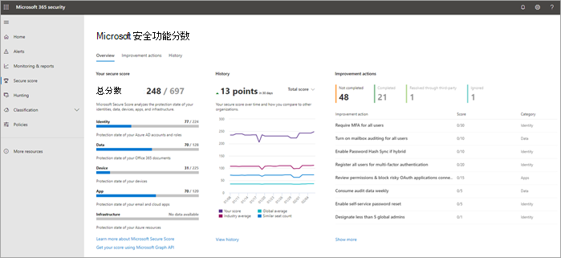
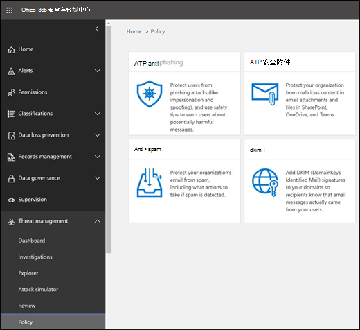

# 保护业务Microsoft 365的十大方法

如果你是使用 Microsoft 业务计划之一的中小型组织，并且你的组织类型被网络犯罪和黑客攻击，请使用本文中的指导提高组织的安全性。 本指南可帮助你的组织实现《时分学校网络安全宣传活动手册》中所述 [的目标](https://go.microsoft.com/fwlink/p/?linkid=2015598)。

## 观看：安全性概述

> [!VIDEO https://www.microsoft.com/videoplayer/embed/RE4mzxI?autoplay=false]

Microsoft 365 商业高级版提供了威胁防护、数据保护和设备管理功能，可帮助你保护公司免受联机威胁和未经授权的访问，以及保护和管理手机、平板电脑和计算机上的公司数据。

## 完成首要安全任务

Microsoft 建议你完成下表中列出的适用于你的服务计划的任务。

|*Number*|任务|Microsoft 365 商业标准版|Microsoft 365 商业高级版|
|---|---|---|---|
|1|[设置多重身份验证](secure-your-business-data.md#setup)|||
|2|[培训用户](secure-your-business-data.md#train)|||
|3|[使用专用管理员帐户](secure-your-business-data.md#admin)|||
|4|[提高邮件中恶意软件防护级别](secure-your-business-data.md#malware)|||
|5|[防范勒索软件](secure-your-business-data.md#ransomware)|||
|6 |[停止电子邮件的自动转发](secure-your-business-data.md#forwarding)|||
|7 |[使用Office邮件加密](secure-your-business-data.md#encryption)|||
|8 |[保护电子邮件免受网络钓鱼攻击](secure-your-business-data.md#phishing)|||
|9 |[防范恶意附件和带附件保险箱文件](secure-your-business-data.md#atp)|||
|10 |[使用链接抵御网络钓鱼保险箱攻击](secure-your-business-data.md#phishingatp)|||

如有 Microsoft 商业高级版，设置安全性并开始安全协作的最快方法是遵循此库中的指南：[面向小型企业和活动的 Microsoft 365](../../campaigns/index.md)。 本指南是与 Microsoft 防御百年团队合作开发的，可保护所有小型企业客户免受复杂黑客发起的网络威胁。

在开始之前，请查看Microsoft 365[门户](../../security/defender/microsoft-secure-score.md)中的安全Microsoft 365 Defender<a href="https://go.microsoft.com/fwlink/p/?linkid=2077139" target="_blank">分数</a>。 在集中式仪表板中，你可以监视并改进Microsoft 365标识、数据、应用、设备和基础结构的安全性。 你可以获得配置建议安全功能、执行与安全相关的任务 (如查看报告) ，或者使用第三方应用程序或软件解决建议。 通过进一步深入了解一组更广泛的 Microsoft 产品和服务，你可以确信地报告组织的安全运行状况。

## 1：设置多重身份验证

使用多重身份验证是提高组织安全性的最简单且最有效的方法之一。 它比这听起来容易 - 登录时，多重身份验证意味着你将从手机键入代码，以访问Microsoft 365。 如果黑客知道您的密码，这可以防止黑客接管。 多重身份验证也称为 2 步验证。 个人可以轻松将 2 步验证添加到大多数帐户，例如，添加到其 Google 或 Microsoft 帐户。 下面将分两步 [验证添加到你的个人 Microsoft 帐户](https://go.microsoft.com/fwlink/p/?linkid=2016403)。

对于使用 Microsoft 365 的企业，添加要求用户使用多重身份验证登录的设置。 进行此更改时，用户下次登录时将提示他们设置手机进行双重身份验证。
若要观看有关如何设置 MFA 以及用户如何完成设置的培训视频，请参阅 [设置 MFA](../../business-video/turn-on-mfa.md) 和 [用户设置](https://support.microsoft.com/office/ace1d096-61e5-449b-a875-58eb3d74de14)。

若要设置多重身份验证，请打开"安全性默认值"：

对于大多数组织来说，安全性默认值提供很好的额外登录安全性级别。 有关详细信息，请参阅[什么是安全性默认值？](/azure/active-directory/fundamentals/concept-fundamentals-security-defaults)

如果你的订阅是新的，则可能已自动为你启用安全性默认值。

可通过 Microsoft Azure 门户中 Azure Active Directory (Azure AD) 的“**属性**”窗格启用或禁用安全性默认值。

1. 使用全局管理员凭据登录 [Microsoft 365 管理中心](https://admin.microsoft.com)。
2. 在左侧导航栏中，选择“**显示所有**”，然后在 **管理中心** 下，选择 “**Azure Active Directory**”。
3. 在 **Azure Active Directory 管理中心** 里选择 “**Azure Active Directory** > **属性**”。
4. 在页面底部，选择“**管理安全性默认值**”。
5. 选择“**是**”启用安全性默认值，或选择“**否**”禁用安全性默认值，然后选择“**保存**”。

为组织设置多重身份验证后，用户需要设置其设备的两步验证。 有关详细信息，请参阅设置两步验证[Microsoft 365。](https://support.microsoft.com/office/ace1d096-61e5-449b-a875-58eb3d74de14)

有关完整详细信息和完整建议，请参阅 [为用户设置多重身份验证](set-up-multi-factor-authentication.md)。

## 2：培训用户

美国国家/地区学校网络安全 [宣传活动](https://go.microsoft.com/fwlink/p/?linkid=2015598) 手册提供了有关在组织中建立强大的安全意识文化的指导，包括培训用户识别网络钓鱼攻击。

除了本指南之外，Microsoft 还建议你的用户执行本文中所述的操作：保护你的帐户和设备免受黑客和 [恶意软件的攻击](https://support.microsoft.com/office/066d6216-a56b-4f90-9af3-b3a1e9a327d6)。 这些操作包括：

- 使用强密码

- 保护设备

- 在 mac 和 Windows 10 上启用安全功能

Microsoft 还建议用户采取以下文章中建议的操作来保护其个人电子邮件帐户：

- [帮助保护 Outlook.com 电子邮件帐户](https://support.microsoft.com/office/a4f20fc5-4307-4ece-8231-6d4d4bd8a9ba)

- [使用 2 步验证保护 Gmail 帐户](https://go.microsoft.com/fwlink/p/?linkid=2015688&)

## 3：使用专用管理员帐户

用于管理您的管理帐户Microsoft 365提升的权限。 这些是黑客和网络黑客的有价值目标。 仅将管理员帐户用于管理。 管理员应具有单独的用户帐户，用于常规的非管理用途，并且仅在必要时使用其管理帐户来完成与其工作职能相关联的任务。 其他建议：

- 请确保管理员帐户还设置为多重身份验证。

- 使用管理员帐户之前，请关闭所有不相关的浏览器会话和应用，包括个人电子邮件帐户。

- 完成管理员任务后，请务必注销浏览器会话。

## 4：提高邮件中恶意软件防护的级别

你的Microsoft 365环境包括恶意软件防护，但您可以通过阻止包含通常用于恶意软件的文件类型的附件来增强此保护。 若要在电子邮件中加强恶意软件保护，请观看简短的 [培训视频](../../business-video/anti-malware.md)，或完成以下步骤：

1. 转到 <https://protection.office.com> ，然后使用管理员帐户凭据登录。

2. 在安全&合规中心的左侧导航窗格中，在"**威胁** 管理"下，选择"**策略** \> **""反恶意软件"。**

3. 双击默认策略以编辑此公司范围内的策略。

4. 选择“**设置**”。

5. 在 **"常见附件类型筛选器"下，** 选择"**打开"。** 被阻止的文件类型将在此控件正下方的窗口中列出。 如果需要，稍后可以添加或删除文件类型。

6. 选择 **"保存"。**

有关详细信息，请参阅 EOP 中的反 [恶意软件保护](../../security/office-365-security/anti-malware-protection.md)。

## 5：防范勒索软件

勒索软件通过加密文件或锁定计算机屏幕来限制对数据的访问。 然后，它尝试通过请求"勒索"（通常采用加密货币（如"为"用户"）来勒索资金，以交换对数据的访问权限。

您可以通过创建一个或多个邮件流规则来阻止通常用于勒索软件的文件扩展名，或警告通过电子邮件接收这些附件的用户，从而防范勒索软件。 一个很好的起点是创建两个规则：

- 在打开包含Office的文件附件之前警告用户。 勒索软件可以隐藏在宏内，因此我们将警告用户不要从他们不知道的人打开这些文件。

- 阻止可能包含勒索软件或其他恶意代码的文件类型。 我们将从下表中列出的可执行文件 (一个) 。 如果组织使用这些可执行类型中的任意一种，并且希望通过电子邮件发送这些类型，请将其添加到上一规则中 (警告用户) 。

若要创建邮件传输规则，请观看简短的 [培训视频](../../business-video/prevent-ransom-in-email.md)，或完成以下步骤：

1. 转到 [Exchange 管理中心](https://go.microsoft.com/fwlink/p/?linkid=2059104)。

2. 在"**邮件流"** 类别中，选择"规则 **"。**

3. 选择 **+** ，然后选择 **"创建新规则"。**

4. 选择对话框底部的****以查看完整的选项集。

5. 针对每个规则应用下表中的设置。 将其余设置保留为默认值，除非您要更改这些设置。

6. 选择 **保存**。
    
| 设置 | 在打开文件附件之前Office警告 | 阻止可能包含勒索软件或其他恶意代码的文件类型 |
|:-----|:-----|:-----|
|名称    |反勒索软件规则：警告用户    |反勒索软件规则：阻止文件类型    |
|在 中应用此规则。 . .    |任何附件 。 . . 文件扩展名匹配 。 . .    |任何附件 。 . . 文件扩展名匹配 。 . .    |
|指定单词或短语    |添加以下文件类型：    dotm、docm、xlsm、sltm、xla、xlam、xll、pptm、potm、ppam、ppsm、sldm    |添加以下文件类型：    ade、adp、ani、bas、 bat， chm， cmd， com， cpl， crt， hlp， ht， hta， inf， ins， isp， job， js， jse， lnk， mda， mdb， mde， mdz， msc， msi， msp， mst， pcd， reg， scr， sct， shs， url， vb， vbe， vbs， wsc， wsf， wsh， exe， pif    |
|执行以下操作。 . .    |在免责声明前添加    |阻止邮件 。 . . 拒绝邮件并包含说明    |
|提供消息文本    |不要打开这些类型的文件（除非你希望打开它们，因为这些文件可能包含恶意代码，并且知道发件人并不能保证安全）。    ||
   
> [!TIP]
> 您还可以将想要阻止的文件添加到步骤 4 中的"反恶意软件 ["列表中](#4-raise-the-level-of-protection-against-malware-in-mail)。

有关详细信息，请参阅：

- [勒索软件：如何降低风险](https://www.microsoft.com/security/blog/2020/04/28/ransomware-groups-continue-to-target-healthcare-critical-services-heres-how-to-reduce-risk/)

- [还原OneDrive](https://support.microsoft.com/office/fa231298-759d-41cf-bcd0-25ac53eb8a15)

## 6：停止电子邮件的自动转发

通过配置邮箱以自动转发电子邮件，获得用户邮箱访问权限的黑客可能会窃取邮件。 即使没有用户感知，也可能发生此情况。 您可以通过配置邮件流规则来防止发生这种情况。

创建邮件传输规则：

1. 转到 [Exchange 管理中心](https://go.microsoft.com/fwlink/p/?linkid=2059104)。

2. 在"**邮件流"** 类别中，选择"规则 **"。**

3. 选择 **+** ，然后选择 **"创建新规则"。**

4. 选择 **对话框** 底部的"更多选项"以查看完整的选项集。

5. 应用下表中的设置。 将其余设置保留为默认值，除非您要更改这些设置。

6. 选择 **保存**。

|设置|拒绝自动将电子邮件转发到外部域|
|---|---|
|名称|阻止电子邮件自动转发到外部域|
|如果 ...|发件人 。 . . 是外部/内部 。 . . 组织内部|
|添加条件|收件人 。 . . 是外部/内部 。 . . 组织外部|
|添加条件|邮件属性 。 . . 包括邮件类型 。 . . 自动转发|
|执行以下操作...|阻止邮件 。 . . 拒绝邮件并给出说明。|
|提供消息文本|出于安全考虑，阻止在此组织外自动转发电子邮件。|

## 7：Office邮件加密

Office邮件加密包含在Microsoft 365。 已设置。 使用Office加密，组织可以在组织内外人员之间发送和接收加密的电子邮件。 Office 365 邮件加密可与 Outlook.com、Yahoo!、Gmail 和其他电子邮件服务搭配使用。 电子邮件加密有助于确保只有预期收件人才能查看邮件内容。

Office邮件加密提供了两种邮件保护选项：

- 不要转发

- Encrypt

你的组织可能配置了将标签应用于电子邮件的其他选项，例如"机密"。

### 发送受保护的电子邮件

In Outlook for PC， select **Options** in the email， and then choose **Permissions**.

在 Outlook.com 中，选择 **电子邮件** 中的"保护"。 默认保护是"**不要转发"。** 若要将其更改为加密，请选择"**更改权限""** \> **加密"。**

### 接收加密电子邮件

如果收件人拥有 Outlook 2013 或 Outlook 2016 以及 Microsoft 电子邮件帐户，他们将在阅读窗格中看到有关项目受限权限的警报。 打开邮件后，收件人可以像查看任何其他邮件一样查看邮件。

如果收件人使用的是其他电子邮件客户端或电子邮件帐户（如 Gmail 或 Yahoo），他们将看到一个链接，允许他们登录阅读电子邮件或请求一次密码以在 Web 浏览器中查看邮件。 如果用户未收到电子邮件，请让他们检查其"垃圾邮件"或"垃圾邮件"文件夹。

有关详细信息，请参阅在适用于电脑的 Outlook 中发送[、查看和回复加密邮件](https://support.microsoft.com/office/eaa43495-9bbb-4fca-922a-df90dee51980)。

## 8. 保护您的电子邮件免受网络钓鱼攻击

如果已针对您的安全环境配置了一个或多个自定义Microsoft 365，您可以配置目标防钓鱼保护。 防钓鱼保护是 Microsoft Defender Office 365的一部分，可帮助保护组织免受基于恶意模拟的网络钓鱼攻击和其他网络钓鱼攻击。 如果您尚未配置自定义域，则无需这样做。

我们建议你通过创建一个策略来保护最重要的用户和自定义域来开始使用此保护。

若要在 Defender for Office 365 创建防钓鱼策略，请观看简短的培训视频，或完成以下步骤：

1. 转到 <https://protection.office.com>。

2. 在安全&合规中心的左侧导航窗格中，在"威胁管理"**下，选择**"策略 **"。**

3. 在"策略"页上，选择 **"防钓鱼"。**

4. 在"防钓鱼"页面上，选择 **"+ 创建"。** 向导将启动，可分步定义防钓鱼策略。

5. 指定策略的名称、说明和设置，如下图所示。 有关[更多详细信息，请参阅了解 Microsoft Defender 中的反网络钓鱼Office 365选项](../../security/office-365-security/set-up-anti-phishing-policies.md)。

6. 查看设置后，选择"创建 **此策略"或** " **保存**"（如果适用）。

|设置或选项|推荐设置|
|---|---|
|名称|域和最有价值的宣传活动人员|
|说明|确保不会模拟最重要的员工和域。|
|添加要保护的用户|选择 **+ 添加条件，收件人是**。 键入用户名或输入候选人、市场活动经理和其他重要员工成员的电子邮件地址。 您最多可以添加 20 个要防止模拟的内部和外部地址。|
|添加要保护的域|选择 **+ 添加条件，收件人域为**。 如果定义了自定义域，请输入Microsoft 365订阅关联的自定义域。 可以输入多个域。|
|选择操作|如果电子邮件是由模拟用户发送的：选择"将邮件重定向到其他电子邮件地址"，然后键入安全管理员的电子邮件地址;例如，securityadmin@contoso.com。   如果电子邮件是由模拟域发送的：请选择"隔离 **邮件"。**|
|邮箱智能|默认情况下，创建新的反钓鱼策略时，将选择邮箱智能。 最好将此设置保留为“打开”。|
|添加受信任的发件人和域|在此示例中，不要定义任何替代项。|
|应用于|选择“收件人域为”。 在“以下任何项”中，选择“选择”。 选择“+ 添加”。 选中域名称旁边的复选框，例如，contoso.com，在列表中， **然后选择添加**。 选择“**完成**”。|
|

有关详细信息，请参阅在 Defender for [Office 365 中设置防钓鱼Office 365。](../../security/office-365-security/configure-atp-anti-phishing-policies.md)

## 9：防范恶意附件和带附件保险箱文件

人们定期发送、接收和共享附件，如文档、演示文稿、电子表格等。 通过查看电子邮件来判断附件是安全还是恶意并不总是那么容易。 Microsoft Defender for Office 365包括保险箱附件保护，但此保护默认未打开。 我们建议您创建一个新规则以开始使用此保护。 此保护扩展到 SharePoint、OneDrive 和 Microsoft Teams 中的文件。

若要创建保险箱策略，请观看简短的[培训视频](../../business-video/safe-attachments.md)，或完成以下步骤：

1. 转到 <https://protection.office.com> ，然后使用管理员帐户登录。

2. 在安全&合规中心的左侧导航窗格中，在"威胁管理"**下，选择**"策略 **"。**

3. 在"策略"页上，选择 **"保险箱附件"。**

4. 在"保险箱附件"页上，通过选中"打开 **ATP for SharePoint、OneDrive** 和 Microsoft Teams"复选框来广泛应用此保护。

5. 选择 **+** 以创建新策略。

6. 应用下表中的设置。

7. 查看设置后，选择"创建 **此策略"或** " **保存**"（如果适用）。

|设置或选项|推荐设置|
|---|---|
|名称|使用检测到的恶意软件阻止当前和将来的电子邮件。|
|说明|使用检测到的恶意软件阻止当前和未来的电子邮件和附件。|
|保存附件未知恶意软件响应|选择 **"阻止 - 阻止当前和将来的电子邮件和带检测到的恶意软件的附件"。**|
|检测时重定向附件|启用重定向 (选中此框)    输入管理员帐户或邮箱设置以隔离。   如果恶意软件扫描附件时间过或出现错误，请应用 (选中此框) 。|
|应用于|收件人域为 。 . . 选择你的域。|
|

有关详细信息，请参阅在 Defender for [Office 365 中设置防钓鱼Office 365。](../../security/office-365-security/configure-atp-anti-phishing-policies.md)

## 10：使用链接抵御网络钓鱼保险箱攻击

黑客有时会在电子邮件或其他文件中的链接中隐藏恶意网站。 保险箱链接是 Microsoft Defender for Office 365 的一部分，可通过提供电子邮件和 Office 文档中 Web 地址 (URL) 的单击时间验证来帮助保护你的组织。 保护通过链接保险箱定义。

我们建议您执行以下操作：

- 修改默认策略以提高保护。

- 添加面向域中所有收件人的新策略。

To get to 保险箱 Links， view a [short training video](../../business-video/safe-links.md)， or complete the following steps：

1. 转到 <https://protection.office.com> ，然后使用管理员帐户登录。

2. 在安全&合规中心的左侧导航窗格中，在"威胁管理"**下，选择**"策略 **"。**

3. 在"策略"页上，选择 **"保险箱链接"。**

修改默认策略：

1. 在"保险箱链接"页上的"适用于整个组织的策略"**下**，双击"默认 **策略**"。

2. 在 **设置应用于** 跨 Office 365 内容的 URL 下，输入要阻止的 URL（如 example.com _）并选择_ **+** 。

3. 在 **设置** 应用于电子邮件以外的内容"下，选择"Office 365 **应用程序**"、"不跟踪用户单击安全链接时"和"不允许用户单击指向原始 **URL 的安全链接"。**

4. 选择 **保存**。

要创建面向域中所有收件人的新策略，请执行：

1. On the 保险箱 links page， under **Policies that apply to specific recipients**， select to create a new **+** policy.

2. 应用下表中列出的设置。

3. 选择 **保存**。

|设置或选项|推荐设置|
|---|---|
|名称|保险箱域中所有收件人的链接策略|
|为邮件中的未知潜在恶意 URL 选择操作|选择打开 - 当用户单击链接时，URL 将被重写，并针对 **已知恶意链接列表进行检查**。|
|对指向文件的可疑链接应用实时 URL 扫描|选中此框。|
|应用于|收件人域为 。 . . 选择你的域。|
|

有关详细信息，请参阅 microsoft [Defender for 保险箱 中的链接Office 365。](../../security/office-365-security/atp-safe-links.md)

## 相关内容

[本文Microsoft 365 (](multi-factor-authentication-microsoft-365.md)多重) \
[管理和监视优先级帐户 (](../setup/priority-accounts.md) 文章) \
[Microsoft 365中心中的报告 (](../activity-reports/activity-reports.md)视频) 
