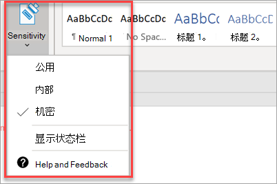

# 设置合规性功能

你的Microsoft 365 商业高级版附带用于保护你的数据和设备的功能，并且可帮助你保护你和客户敏感信息的安全。

## 设置 DLP 功能

请参阅 [从模板创建 DLP](../../compliance/create-a-dlp-policy-from-a-template.md) 策略，了解如何设置策略以防范个人数据丢失的示例。 
  
DLP 附带许多适用于许多不同区域设置的现成策略模板。 例如，澳大利亚财务数据、加拿大个人信息法案、美国财务数据等。 有关 [完整列表，请参阅 DLP](../../compliance/what-the-dlp-policy-templates-include.md) 策略模板包含的内容。 所有这些模板都可以启用，类似于 PII 模板示例。 
  
## 设置电子邮件保留时间Exchange Online Archiving

 **Exchange Online Archiving** 许可证功能通过保留电子数据展示的电子邮件内容来帮助维护合规性和法规标准。 它还有助于在有诉讼时降低风险，并提供一种在安全漏洞或需要恢复已删除项目时恢复数据的方法。 您可以使用诉讼保留保留用户的所有内容，或使用保留策略自定义要保留的内容。
  
**诉讼保留：** 通过将用户的整个邮箱置于诉讼保留状态，可以保留所有邮箱内容，包括已删除的项目。 
    
若要将邮箱置于诉讼保留状态，在管理中心：
    
1. 在左侧导航中，转到"用户 \> **""活动用户"。**
    
2. 选择要将其邮箱置于诉讼保留状态的用户。 在用户窗格中，展开"**邮件设置"，****在"更多** 设置"旁边，选择"编辑 **Exchange属性"。**
    
3. On the mailbox page for the user， choose ** mailbox features ** on the left nav， and then choose the **Enable** link under **Litigation hold**.
    
4. 在 **"诉讼保留** "对话框中，您可以在"诉讼保留持续时间"字段中指定 **诉讼保留** 持续时间。 如果希望将字段留空，请保留无限期保留。 您还可以添加注释，将邮箱所有者引导到网站，您可能必须解释有关诉讼保留的更多内容。 \>**保存**。
    
**保留：** 例如，您可以启用自定义保留策略以保留特定时间，或在保留期结束时永久删除内容。 若要了解更多信息，请参阅 [保留策略概述](../../compliance/retention.md)。

## 设置敏感度标签

敏感度标签随 Azure 信息保护 (AIP) 计划 1 一起提供，可帮助你通过应用标签对文档和电子邮件进行分类和选择性保护。 标签可自动由定义规则和条件的管理员应用，由用户手动应用，也可结合使用为用户提供建议。

若要设置敏感度标签，请 [观看创建和管理敏感度标签](../../business-video/create-sensitivity-labels.md) 视频。

### 手动安装 Azure 信息保护客户端

若要手动安装 AIP 客户端，请执行以下操作：

1. 从 **AzinfoProtection_UL.exe**[下载中心下载文件](https://www.microsoft.com/download/details.aspx?id=53018)。
 
2. 您可以通过查看 Word 文档并确保"开始"选项卡上提供"敏感度"选项来验证安装 **是否** 有效。
 

有关详细信息，请参阅安装 [客户端](/azure/information-protection/infoprotect-tutorial-step3)。