# 申请由世纪互联运营的 Office 365 的发票

可以在付款后三天左右向世纪互联发票管理系统提交发票申请。 提交发票申请后，会在两天内对此请求进行处理。
  
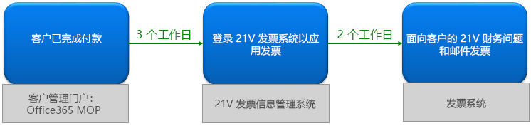
  
## 步骤 1：申请发票

可通过两种方式申请发票：
  
1. 在由世纪互联运营的 Office 365 网站上付款后，将收到订单确认电子邮件，其中包含订单号和发票管理系统的链接。 您可以使用电子邮件中的链接在 <a href="https://go.microsoft.com/fwlink/p/?linkid=837466" target="_blank">世纪互联发票信息管理中心</a>。

    或

2. 可以通过<a href="https://go.microsoft.com/fwlink/p/?linkid=850627" target="_blank">管理中心</a>申请发票。

    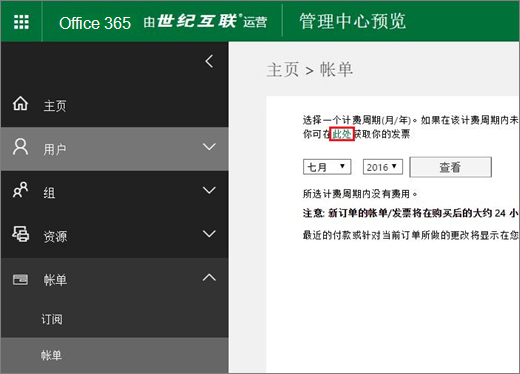
  
## 步骤 2：注册世纪互联发票管理系统帐户

> [!NOTE]
> 可以使用与 Office 365 帐户相同的电子邮件名和密码，或者可以使用不同的电子邮件名和密码。
  
1. 转到<a href="https://go.microsoft.com/fwlink/p/?linkid=837466" target="_blank">世纪互联发票信息管理系统</a>。

2. 在注册窗体中，输入订单编号、电子邮件地址和密码，然后选择 **注册**。

    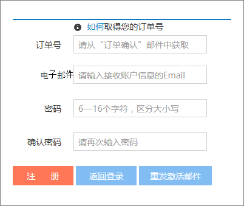
  
3. 注册完成后，系统会向你的电子邮件地址发送激活电子邮件。 打开电子邮件，然后选择链接以激活帐户。

## 步骤 3：提交帐单申请发票

1. 登录发票 <a href="https://go.microsoft.com/fwlink/p/?linkid=837465" target="_blank">管理中心</a>。

2. 选择帐单记录，然后选择 **账单**。

    > [!NOTE]
    > 支付系统位于第三方平台，需要三天时间同步订单和付款记录。
  
    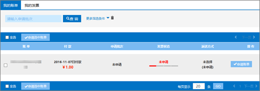
  
3. 选择发票类型，输入所需信息，然后选择 **下一**。

    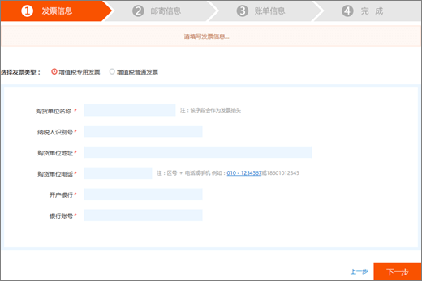
  
    > [!NOTE]
    > - 对于增值税普通发票，只需输入购货商的名字。
    > - 如有必要，可以申请具有不同抬头的发票。 但是，你只能在系统中为一份帐单申请一个发票抬头。 如果要将发票拆分为不同的金额或标题， <a href="https://portal.partner.microsoftonline.cn/Support/SupportOverview.aspx" target="_blank">请在管理中心内提交</a>。
    > - 下一次申请发票时，系统会自动显示上次的发票信息。
    > - 如果需要购买证书或申请退款，则付款人姓名必须与发票抬头一致。

4. 选择运送方式，并输入邮寄信息。 可以选择韵达快递或顺丰（运费到付）。 你也可以到世纪互联上海分公司获取发票。 选择 **下一步**。

    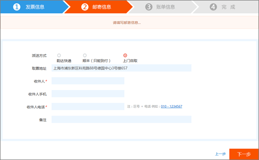
  
    **世纪互联上海分公司地址：**

    上海市浦东新区科苑路 88 号，德国中心，3 号楼，657 号

    **联系信息：**

    朱琴琴 021-28986102

5. 验证信息是否正确，然后选择 **确认**。

    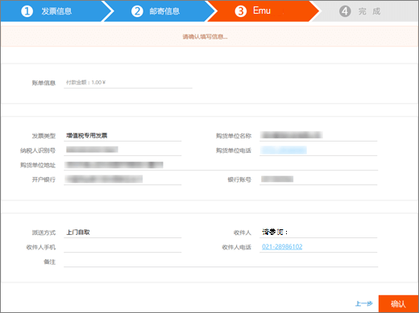
  
## 步骤 4：查看申请进度

申请将自动传送到世纪互联服务中心，并将在两个工作日内完成。
  
提交申请后，可以随时查看进度。 我们会使用“**已开具**”或“**已邮寄**”等备注更新申请状态。
  
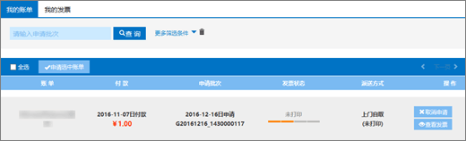
  
当票源紧张时，系统会发出公告并告知预计寄票时间。
  

  
## 常见问题

### 您可以通过在线支持得到哪些服务？

查询开票进度，及未收到发票的问题查询。
  
如果想要更改发票抬头，请寄回发票，我们会重新开具发票。 可以通过管理中心 <a href="https://portal.partner.microsoftonline.cn/Support/SupportOverview.aspx" target="_blank">提交</a>。
  
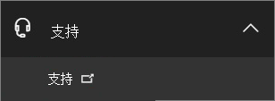
  
### 如何自助修改登录邮箱，密码？

1. 登录发票 <a href="https://go.microsoft.com/fwlink/p/?linkid=837465" target="_blank">管理</a>，然后选择 **更改**。

    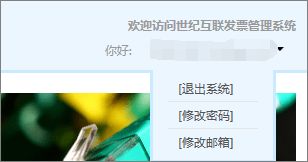
  
2. 如果忘记了登录密码，可以使用登录电子邮件地址重置密码。 发票管理系统会向电子邮件地址发送新密码。 可以使用新密码登录。

    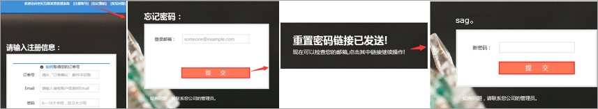
  
3. 如果您忘记了登录邮箱，请致电世纪互联客户服务：(86) 400-089-0365。

### 如何查找订单 ID？

1. 在 [管理中心](https://go.microsoft.com/fwlink/p/?linkid=850627)，转到 **帐单** \> **和付款页面** 页面。

2. 查找想要的发票，选择以查看或选择下载 PDF。

### 如果注册时填错邮箱地址怎么办？

如果注册时输入的电子邮件地址错误，将不会收到激活电子邮件。 电子邮件中的注册链接将在 24 小时后自动过期。 你可以返回注册 <a href="https://go.microsoft.com/fwlink/p/?linkid=837466" target="_blank">页面</a> 正确的电子邮件地址重新注册。
  
### 如果没有收到账户激活邮件怎么办？

如果注册后的 24 小时内没有收到帐户激活邮件，可以到世纪行发票信息管理系统 <a href="https://go.microsoft.com/fwlink/p/?linkid=837466" target="_blank">上至第</a>中，输入你的电子邮件地址，然后选择 **重新发送激活电子邮件**。 系统将重新向注册的电子邮件地址发送帐户激活电子邮件。
  

  
如果仍然没有收到激活邮件，请致电世纪互联客户服务：(86) 400-089-0365。
