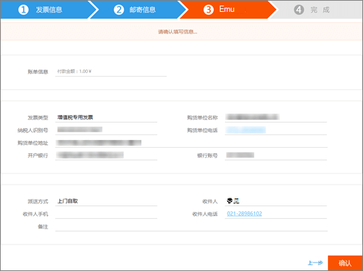

# 申请由世纪互联运营的 Office 365 的发票Apply for a Fapiao for Office 365 operated by 21Vianet

可以在付款后三天左右向世纪互联发票管理系统提交发票申请。You can submit your Fapiao request to the 21Vianet Fapiao management system about three days after you have paid. 提交发票申请后，会在两天内对此请求进行处理。After you submit your Fapiao request, it will be processed in two days.
  

  
## 步骤 1：申请发票Step 1: Apply for a Fapiao

可通过两种方式申请发票：There are two ways to apply for a Fapiao:
  
1. 在由世纪互联运营的 Office 365 网站上付款后，将收到订单确认电子邮件，其中包含订单号和发票管理系统的链接。After making a payment in the Office 365 operated by 21Vianet website, you'll receive an order confirmation email that contains your order number and a link to the Fapiao management system. 您可以使用电子邮件中的链接在 <a href="https://go.microsoft.com/fwlink/p/?linkid=837466" target="_blank">世纪互联发票信息管理中心</a>。You can use the link in the email to create an account in the <a href="https://go.microsoft.com/fwlink/p/?linkid=837466" target="_blank">21Vianet Fapiao information management system</a>.

    或Or

2. 可以通过<a href="https://go.microsoft.com/fwlink/p/?linkid=850627" target="_blank">管理中心</a>申请发票。You can apply for a Fapiao from the <a href="https://go.microsoft.com/fwlink/p/?linkid=850627" target="_blank">admin center</a>.

    
  
## 步骤 2：注册世纪互联发票管理系统帐户Step 2: Register with the 21Vianet Fapiao management system

> [!NOTE]
> 可以使用与 Office 365 帐户相同的电子邮件名和密码，或者可以使用不同的电子邮件名和密码。You can use the same email name and password as your Office 365 account, or you can use something different.
  
1. 转到<a href="https://go.microsoft.com/fwlink/p/?linkid=837466" target="_blank">世纪互联发票信息管理系统</a>。Go to the <a href="https://go.microsoft.com/fwlink/p/?linkid=837466" target="_blank">21Vianet Fapiao information management system</a>.

2. 在注册窗体中，输入订单编号、电子邮件地址和密码，然后选择 **注册**。In the registration form, enter your order number, email address, and password, then select **Registration**.

    
  
3. 注册完成后，系统会向你的电子邮件地址发送激活电子邮件。After your registration is complete, the system will send an activation email message to your email address. 打开电子邮件，然后选择链接以激活帐户。Open the email message and select the link to activate your account.

## 步骤 3：提交帐单申请发票Step 3: Submit your bill for a Fapiao

1. 登录发票 <a href="https://go.microsoft.com/fwlink/p/?linkid=837465" target="_blank">管理中心</a>。Log in to the <a href="https://go.microsoft.com/fwlink/p/?linkid=837465" target="_blank">Fapiao management system</a>.

2. 选择帐单记录，然后选择 **账单**。Select the billing record, then select **Apply bill**.

    > [!NOTE]
    > 支付系统位于第三方平台，需要三天时间同步订单和付款记录。The payment system is on a third-party platform and takes three days to synchronize the order and payment record.
  
    
  
3. 选择发票类型，输入所需信息，然后选择 **下一**。Select the Fapiao type, enter the required information, then select **Next**.

    
  
    > [!NOTE]
    > - 对于增值税普通发票，只需输入购货商的名字。For a normal VAT Fapiao, you only need to enter the buyer's name.
    > - 如有必要，可以申请具有不同抬头的发票。If necessary, you can apply for a Fapiao with different a title. 但是，你只能在系统中为一份帐单申请一个发票抬头。However, you can only apply one Fapiao title for one bill in the system. 如果要将发票拆分为不同的金额或标题， <a href="https://portal.partner.microsoftonline.cn/Support/SupportOverview.aspx" target="_blank">请在管理中心内提交</a>。If you want to split the Fapiao into different amounts or titles, please <a href="https://portal.partner.microsoftonline.cn/Support/SupportOverview.aspx" target="_blank">submit your request in the admin center</a>.
    > - 下一次申请发票时，系统会自动显示上次的发票信息。The next time you apply for a Fapiao, the system automatically presents the previous Fapiao information.
    > - 如果需要购买证书或申请退款，则付款人姓名必须与发票抬头一致。If you need a purchase certificate or a refund, the payer name and the Fapiao title must match.

4. 选择运送方式，并输入邮寄信息。Select a shipping method and enter the mailing information. 可以选择韵达快递或顺丰（运费到付）。You can choose Yunda or SF (freight collect). 你也可以到世纪互联上海分公司获取发票。You can also go to the 21Vianet Shanghai branch to get the Fapiao. 选择 **下一步**。select **Next**.

    
  
    **世纪互联上海分公司地址：****21Vianet Shanghai branch company address:**

    上海市浦东新区科苑路Shanghai, Pudong New Area Keyuan Road No. 88 号，德国中心，3 号楼，657 号88, German Center, building 3, 657

    **联系信息：****Contact information:**

    朱琴琴 021-28986102Zhu qin qin 021-28986102

5. 验证信息是否正确，然后选择 **确认**。Verify that the information is correct, then select **Confirm**.

    
  
## 步骤 4：查看申请进度Step 4: Check application progress

申请将自动传送到世纪互联服务中心，并将在两个工作日内完成。Your application is automatically transmitted to the 21Vianet Service Center, and will be completed in two working days.
  
提交申请后，可以随时查看进度。After you submit the application, you can check the progress at any time. 我们会使用“**已开具**”或“**已邮寄**”等备注更新申请状态。We will update the status of your application with remarks like **Issued** or **Mailed out**.
  

  
当票源紧张时，系统会发出公告并告知预计寄票时间。When Fapiao is out of use, the system will display a notice, and will indicate the expected time to issue the Fapiao.
  

  
## 常见问题FAQs

### 您可以通过在线支持得到哪些服务？What services can I get from online support?

查询开票进度，及未收到发票的问题查询。You can check the progress of your Fapiao request, and find out why you haven't received the Fapiao.
  
如果想要更改发票抬头，请寄回发票，我们会重新开具发票。If you want to change the Fapiao title, please send the Fapiao back to us and we will reissue the Fapiao. 可以通过管理中心 <a href="https://portal.partner.microsoftonline.cn/Support/SupportOverview.aspx" target="_blank">提交</a>。You can submit the request through the <a href="https://portal.partner.microsoftonline.cn/Support/SupportOverview.aspx" target="_blank">admin center</a>.
  

  
### 如何自助修改登录邮箱，密码？How do I change my login email address and password?

1. 登录发票 <a href="https://go.microsoft.com/fwlink/p/?linkid=837465" target="_blank">管理</a>，然后选择 **更改**。Log in to the <a href="https://go.microsoft.com/fwlink/p/?linkid=837465" target="_blank">Fapiao management system</a>, then select **Change email address**.

    
  
2. 如果忘记了登录密码，可以使用登录电子邮件地址重置密码。If you forgot your login password, you can use your login email address to reset the password. 发票管理系统会向电子邮件地址发送新密码。The Fapiao management system will send a new password to your email address. 可以使用新密码登录。You can use the new password to login.

    
  
3. 如果您忘记了登录邮箱，请致电世纪互联客户服务：(86) 400-089-0365。If you forgot your login email address, please contact 21Vianet customer service at (86) 400-089-0365.

### 如何查找订单 ID？How do I find my order ID?

1. 在 [管理中心](https://go.microsoft.com/fwlink/p/?linkid=850627)，转到 **帐单** \> **和付款页面** 页面。In the [admin center](https://go.microsoft.com/fwlink/p/?linkid=850627), go to the **Billing** \> **Bills & payments** page.

2. 查找想要的发票，选择以查看或选择下载 PDF。Find the invoice you want, select to view, or choose to download the PDF.

### 如果注册时填错邮箱地址怎么办？What if I enter the wrong email address when I register?

如果注册时输入的电子邮件地址错误，将不会收到激活电子邮件。If you enter the wrong email address when you register, you won't receive the activation email. 电子邮件中的注册链接将在 24 小时后自动过期。The registration link in the email will automatically expire after 24 hours. 你可以返回注册 <a href="https://go.microsoft.com/fwlink/p/?linkid=837466" target="_blank">页面</a> 正确的电子邮件地址重新注册。You can return to the <a href="https://go.microsoft.com/fwlink/p/?linkid=837466" target="_blank">registration page</a> and register again with the correct email address.
  
### 如果没有收到账户激活邮件怎么办？What if I don't receive an activation email?

如果注册后的 24 小时内没有收到帐户激活邮件，可以到世纪行发票信息管理系统 <a href="https://go.microsoft.com/fwlink/p/?linkid=837466" target="_blank">上至第</a>中，输入你的电子邮件地址，然后选择 **重新发送激活电子邮件**。If you don't receive an account activation email within 24 hours after you register, go to the <a href="https://go.microsoft.com/fwlink/p/?linkid=837466" target="_blank">21Vianet Fapiao information management system</a>, enter your email address, then select **Resend the activation email**. 系统将重新向注册的电子邮件地址发送帐户激活电子邮件。The system will resend the account activation email to your registered email address.
  

  
如果仍然没有收到激活邮件，请致电世纪互联客户服务：(86) 400-089-0365。If you still don't receive an activation email, please contact 21Vianet customer service at (86) 400-089-0365.