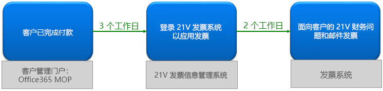
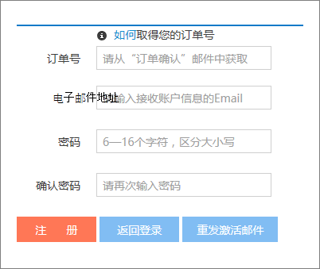

# 申请由世纪银行运营的 Office 365 的 Fapiao

> [!NOTE]
> 管理中心正在发生改变。 如果你的体验与此处提供的详细信息不匹配，请参阅[有关新版 Microsoft 365 管理中心](https://docs.microsoft.com/microsoft-365/admin/microsoft-365-admin-center-preview?view=o365-21vianet&preserve-view=true)。

在付费后大约三天，你可以向世纪报 21 Fapiao 管理系统提交你的 Fapiao 请求。 提交 Fapiao 请求后，将在两天内进行处理。
  

  
## 步骤 1：申请 Fapiao

有两种方法可申请 Fapiao：
  
1. 在由世纪银行运营的 Office 365 网站中付款后，您将收到一封订单确认电子邮件，其中包含订单编号和指向 Fapiao 管理系统的链接。 您可以使用电子邮件中的链接创建 <a href="https://go.microsoft.com/fwlink/p/?linkid=837466" target="_blank">21Vianet Fapiao 信息管理系统中的帐户</a>。

    或

2. 你可以从管理中心申请一个<a href="https://go.microsoft.com/fwlink/p/?linkid=850627" target="_blank">Fapiao。</a>

    
  
## 步骤 2：注册世纪世纪报管理系统

> [!NOTE]
> 可以使用与 Office 365 帐户相同的电子邮件名称和密码，也可以使用不同的方法。
  
1. Go to the <a href="https://go.microsoft.com/fwlink/p/?linkid=837466" target="_blank">21Vianet Fapiao information management system</a>.

2. 在注册表单中，输入订单编号、电子邮件地址和密码，然后选择"注册 **"。**

    
  
3. 注册完成后，系统将向您的电子邮件地址发送激活电子邮件。 打开电子邮件并选择链接以激活你的帐户。

## 步骤 3：提交发票帐单

1. 登录到 <a href="https://go.microsoft.com/fwlink/p/?linkid=837465" target="_blank">Fapiao 管理系统</a>。

2. 选择计费记录，然后选择"**应用帐单"。**

    > [!NOTE]
    > 付款系统位于第三方平台上，需要三天时间同步订单和付款记录。
  
    
  
3. 选择 Fapiao 类型，输入所需信息，然后选择"下 **一步"。**

    
  
    > [!NOTE]
    > - 对于正常的 VAT 发票，你只需输入购买者的姓名。
    > - 如有必要，你可以申请具有不同标题的 Fapiao。 但是，你只能在系统中为一个帐单应用一个 Fapiao 标题。 如果你想要将 Fapiao 拆分为不同的金额或标题，请在管理中心 <a href="https://portal.partner.microsoftonline.cn/Support/SupportOverview.aspx" target="_blank">提交你的请求</a>。
    > - 下次申请 Fapiao 时，系统会自动显示以前的 Fapiao 信息。
    > - 如果你需要购买证书或退款，付款人名称和发票标题必须匹配。

4. 选择送货方法并输入邮件信息。 你可以选择"使用 (或 SF) 。 还可以转到世纪第 21Vianet 中国区分支获取 Fapiao。 选择 **"下一步"。**

    
  
    **世纪net 中国世纪银行中国分公司地址：**

    北京，布都明新区基都路 No。 88， 德国中心，3 号，657 号

    **联系人信息：**

    021-28986102 的世纪之人

5. 验证信息是否正确，然后选择"确认 **"。**

    
  
## 步骤 4：检查应用程序进度

您的应用程序将自动传输到世纪银行服务中心，将在两个工作日后完成。
  
提交应用程序后，你随时都可以检查进度。 我们将使用"已发出"或"已发送邮件"等备注 **更新应用程序的状态**。
  

  
当 Fapiao 不使用时，系统将显示一个通知，并指示发出 Fapiao 的预期时间。
  

  
## 常见问题

### 可以从联机支持获得哪些服务？

您可以检查 Fapiao 请求的进度，并找出您未收到 Fapiao 的原因。
  
如果要更改 Fapiao 标题，请将 Fapiao 发送回我们，我们将重新发出 Fapiao。 可以通过管理中心提交 <a href="https://portal.partner.microsoftonline.cn/Support/SupportOverview.aspx" target="_blank">请求</a>。
  

  
### 如何更改我的登录电子邮件地址和密码？

1. 登录到 <a href="https://go.microsoft.com/fwlink/p/?linkid=837465" target="_blank">Fapiao 管理系统</a>，然后选择"**更改电子邮件地址"。**

    
  
2. 如果忘记了登录密码，可以使用登录电子邮件地址重置密码。 Fapiao 管理系统会向您的电子邮件地址发送新密码。 可以使用新密码登录。

    
  
3. 如果你忘记了登录电子邮件地址，请联系世纪 (86) 400-089-0365。

### 如何查找订单 ID？

1. 在 [管理中心](https://go.microsoft.com/fwlink/p/?linkid=850627)，转到"帐单& \> **付款** 页面。

2. 查找您想要的发票、选择查看或选择下载 PDF。

### 如果我在注册时输入了错误的电子邮件地址，该做什么？

如果在注册时输入的电子邮件地址错误，将不会收到激活电子邮件。 电子邮件中的注册链接将在 24 小时后自动过期。 你可以返回到注册 <a href="https://go.microsoft.com/fwlink/p/?linkid=837466" target="_blank">页面，</a> 然后再次使用正确的电子邮件地址注册。
  
### 如果我没有收到激活电子邮件，该做什么？

如果你在注册后的 24 小时内没有收到帐户激活电子邮件，请转到 <a href="https://go.microsoft.com/fwlink/p/?linkid=837466" target="_blank">世纪</a>银行信息管理系统，输入您的电子邮件地址，然后选择"重新发送激活 **电子邮件**"。 系统会将帐户激活电子邮件重新发送到注册的电子邮件地址。
  

  
如果仍没有收到激活电子邮件，请联系世纪 (86) 400-089-0365。