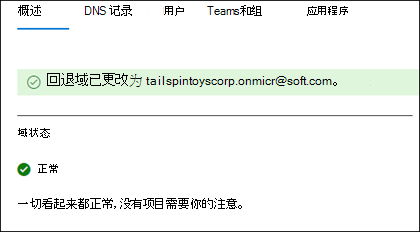

# 在Microsoft 365中添加和替换 onmicrosoft.com 回退域

注册Microsoft 365时，Microsoft 会提供 *onmicrosoft.com* 域（你的 **回退域**）以防你没有域，或者不想将其连接到Microsoft 365 (例如 tailspintoys.onmicrosoft.com) 。 默认情况下，回退域在：

- 用户名和电子邮件地址
- Microsoft 365团队&组电子邮件别名
- 自动域依赖项移动

它充当Microsoft 365环境的默认电子邮件路由地址。 当使用邮箱设置用户时，电子邮件会路由到回退域。  即使使用自定义域 (例如 tailspintoys.com) ，如果从Microsoft 365环境中删除该自定义域，回退域也可确保成功路由用户的电子邮件。

可以在Microsoft 365 管理中心中更改回退域。 客户更改回退域的常见原因包括：

- 不知道首次注册Microsoft 365时要使用的公司名称。 既然他们知道公司名称，他们希望用户拥有合适的登录帐户名称。 
- 他们希望在创建新网站时更改 Sharepoint URL 的外观。 SharePoint基于回退域名创建Microsoft 365环境中的 URL。 如果首次注册时未使用正确的公司名称，则在创建新的SharePoint网站时，站点的SharePoint URL 将继续使用该名称。 

虽然可以添加其他 onmicrosoft.com 域，但只能将一个 onmicrosoft.com 域用作回退域。 本文中的步骤介绍如何：
- 创建新的 onmicrosoft.com 域
- 将其分配为回退域

> [!NOTE]
> Microsoft 365环境中总共有五个 onmicrosoft.com 域。 添加后，当前无法删除它们。 
  
## 准备工作

若要添加、修改或删除域，**必须** 是 [企业或企业计划的](https://products.office.com/business/office)**域名管理员** 或 **全局管理员**。 这些更改会影响整个租户; *自定义管理员* 或 *普通用户* 将无法进行这些更改。

## 添加新的 onmicrosoft.com 域

1. 在Microsoft 365 管理中心中，选择 **设置**，然后选择 **"域**"。
2. 选择 onmicrosoft.com 默认域。

    
  
3. 在"域属性"页上的" **关于此域** "部分中，选择 **"添加 onmicrosoft 域**"。

    

4. 在 **"添加 onmicrosoft 域** "页的 **"域名** "框中，键入新 onmicrosoft.com 域的名称。 

    

    > [!NOTE]
    > 请确保验证输入的域名的拼写和准确性。 只有 5 个 onmicrosoft.com 域，当前无法在创建域后将其删除。     

5. 选择 “**添加域**”。 成功添加后，你将看到一条消息，指出这一点。 
    
    

## 将新 onmicrosoft.com 域设置为回退域

> [!NOTE]
> 在将回退域更改为新的 onmicrosoft.com 域之前，可能需要考虑更改 onmicrosoft.com SharePoint域。 创建其他 onmicrosoft 域并将其用作回退域不会对 SharePoint Online 执行重命名。 现有的SharePoint和OneDrive URL 将保持不变。  可以通过SharePoint[域重命名预览](/sharepoint/change-your-sharepoint-domain-name)版中提供的 PowerShell 步骤更改.onmicrosoft SharePoint域 (当前可供) 网站少于 1，000 个的租户使用。

创建新的 onmicrsoft.com 域后，请执行以下操作将其更改为回退域。

1. 在Microsoft 365 管理中心中，选择 **设置**，然后选择 **"域**"。 

2. 选择已创建的新 onmicrosoft.com 域。

     

3. 在域的属性页上，选择 **"生成回退域**"。
 
     

4. 页面上将显示一条消息，指出回退域已更改为新域。

     

## 相关内容

[域常见问题](domains-faq.yml) （文章） 
[什么是域？](../get-help-with-domains/what-is-a-domain.md)  (文章)  
[在Microsoft 365 (文章中购买域名](../get-help-with-domains/buy-a-domain-name.md))  
[添加 DNS 记录以连接域](../get-help-with-domains/create-dns-records-at-any-dns-hosting-provider.md) (文章)  
[更改名称服务器以使用任意域注册机构设置 Microsoft 365](../get-help-with-domains/change-nameservers-at-any-domain-registrar.md)（文章）
