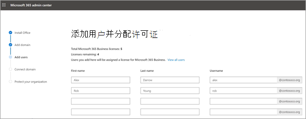

# 在Microsoft 365 商业高级版向导中设置网站

## 观看：Microsoft 365概述

观看此视频，大致了解Microsoft 365 商业高级版设置。  

> [!VIDEO https://www.microsoft.com/videoplayer/embed/RE4jZwg] 

## 观看：设置Microsoft 365 商业高级版

> [!VIDEO https://www.microsoft.com/videoplayer/embed/RE471FJ?autoplay=false]

1. 登录到 <a href="https://go.microsoft.com/fwlink/p/?linkid=2024339" target="_blank">"Microsoft 365 管理中心"，</a>然后选择"**转到设置"。** 安装向导将启动。
1. 设置完成后，返回到 Microsoft 管理中心。 在管理中心，你可以继续在"设置"Windows 10设置策略、DLP **等** 功能。

## 添加域、用户和设置策略

当你购买Microsoft 365 商业高级版时，可以选择使用你拥有的域，或在注册期间购买一[个](../admin-overview/sign-up-for-office-365.md)域。

- 如果你在注册时购买了新域，则域已全部设置好，你可以继续[添加用户并分配许可证](#add-users-and-assign-licenses)。

### 添加你的域以个性化设置登录名

1. 使用全局管理员凭据登录到 [Microsoft 365 管理中心](https://admin.microsoft.com)。 

2. 选择“**转到设置**”以启动向导。

    

3. 在“**安装 Office 应用**”页面上，可选择在自己的计算机上安装应用。
    
4. 在“**添加域**”步骤中，输入要使用的域名（如 contoso.com）。

    > [!IMPORTANT]
    > 如果您在注册期间购买了域，您将不会在此处看到 **添加域** 步骤。 转至 [添加用户](#add-users-and-assign-licenses)。

    

    
4. 按照向导中的步骤，在验证您是否拥有该域的任何 DNS Microsoft 365创建[DNS](/office365/admin/get-help-with-domains/create-dns-records-at-any-dns-hosting-provider)记录。 如果你知道域主机，另请参阅[向Microsoft 365](/microsoft-365/admin/setup/add-domain)添加域。

    如果你的托管服务提供商是 GoDaddy 或启用了 [domain connect](/office365/admin/get-help-with-domains/domain-connect) 的其他主机，则此过程很简单，系统会自动要求你登录并让 Microsoft 代表你进行身份验证。

    

### 添加用户并分配许可证

你可以在向导中添加用户，但你也可以[以后在管理中心添加用户](../add-users/add-users.md)。 此外，如果你具有本地域控制器，则可以使用 [Azure AD Connect](/azure/active-directory/hybrid/how-to-connect-install-express) 添加用户。

#### 在向导中添加用户

在向导中添加的任何用户都会自动获得Microsoft 365 商业高级版许可证。

1. 如果你Microsoft 365 商业高级版订阅的现有用户 (，例如，如果你已使用Azure AD 连接) ，则你现在可以选择为其分配许可证。 继续操作，并为这些用户添加许可证。

2. 添加用户之后，还将显示与添加的新用户共享凭据的选项。可以选择打印、通过电子邮件发送或下载凭据。

### 连接你的域

> [!NOTE]
> 如果你选择使用 .onmicrosoft 域或使用 Azure AD Connect 设置用户，将不会看到此步骤。
  
必须更新 DNS 主机或域注册机构的一些记录才能设置服务。
  
1. 安装向导通常将检测你的注册机构，并提供更新注册机构网站上 NS 记录分步说明的链接。 如果没有，请更改[名称服务器以设置Microsoft 365注册机构的名称](../get-help-with-domains/change-nameservers-at-any-domain-registrar.md)。 

    - 如果你有现有的 DNS 记录（例如现有网站），但你的 DNS 主机已启用 [domain connect](/office365/admin/get-help-with-domains/domain-connect)，请选择“**为我添加记录**”。 在“**选择联机服务**”页面上，接受所有默认设置，选择“**下一步**”，然后在DNS 主机页面上选择“**授权**”。
    - 如果具有具有其他 DNS 主机的现有 DNS 记录（未对域连接启用），需要管理自己的 DNS 记录以确保现有服务保持连接。有关详细信息，请参阅[域基础知识](/office365/admin/get-help-with-domains/dns-basics)。

        

2. 请按照向导中的步骤进行操作，然后将为你设置电子邮件和其他服务。

### 保护组织 

在向导中设置的策略将自动应用于名为 ["](/office365/admin/create-groups/compare-groups#security-groups) 所有用户" *的安全组*。 还可以创建其他组，以在管理中心向分配策略。

1. 在 **"增强对高级** 网络威胁的保护"上，建议你接受默认设置，让高级威胁防护 Office 365扫描应用中的文件和Office链接。

    

2. 在"防止泄露敏感数据"页上，接受默认设置以启用 Office 365 数据丢失防护 (DLP) ，以跟踪 Office 应用中的敏感数据并防止在组织外部意外共享这些数据。

3. On the **Protect data in Office for mobile** page， leave mobile app management on， expand the settings and review them， and then select Create mobile app management **policy**.

    

## 保护 Windows 10 电脑

在左侧导航上，选择"**设置**"，然后在"登录和安全"下，选择"Windows 10 **计算机"。** 选择 **"视图** "开始。 有关[完整说明，Windows 10](secure-win-10-pcs.md)保护计算机安全。

## 部署Office 365客户端应用

如果你选择在安装期间自动安装 Office 应用，则当用户使用工作凭据从 Windows 设备登录到 Azure AD 后，这些应用将安装在 Windows 10 设备上。

若要在Office iOS 或 Android 设备上安装移动设备，请参阅为 Microsoft 365 商业高级版[设置移动设备](set-up-mobile-devices.md)。

也可以单独安装Office安装。 有关[说明Office，请参阅在 PC 或 Mac 上](https://support.microsoft.com/office/4414eaaf-0478-48be-9c42-23adc4716658)安装设备。

## 相关内容

[Microsoft 365 商业版培训视频](../../business-video/index.yml)(链接页面)
