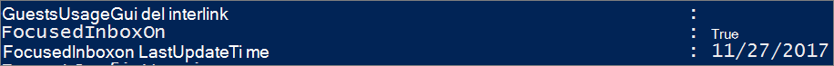

# <a name="configure-focused-inbox-for-everyone-in-your-organization"></a>为组织中的每个人配置重点收件箱

如果你负责配置公司中每个人的电子邮件使用方式，则本文正好适合你！其中说明了如何为你的公司自定义或关闭电子邮件，还解答了[常见问题](#faq-for-focused-inbox)。  

如果只想关闭重点收件箱，请参阅[关闭重点收件箱](https://support.microsoft.com/office/f714d94d-9e63-4217-9ccb-6cb2986aa1b2)。  

如果想确保用户收到特定业务的电子邮件（例如来自 HR 或薪酬专员），可配置重点收件箱，让这些邮件出现在“重点”视图中。还可控制组织内部用户的邮箱中是否显示重点收件箱。
  
## <a name="turn-focused-inbox-on-or-off-in-your-organization"></a>在组织中打开或关闭重点收件箱

你将使用 PowerShell 为组织中的每个人打开或关闭重点收件箱。是否想在 Microsoft 365 管理中心执行此操作？请联系我们的工程团队。 **[请在此投票！](https://go.microsoft.com/fwlink/?linkid=862489)**
  
**关闭重点收件箱：**
  
以下 PowerShell 示例演示如何在组织中 **关闭** 重点收件箱。但是，它不会阻止用户使用此功能。如果用户想使用，仍可在其每个客户端上重新启用重点收件箱。 
  
1. [使用远程 PowerShell 连接到 Exchange Online](/powershell/exchange/connect-to-exchange-online-powershell)。

2. 需要分配有权限，然后才可执行此程序。要查看需要哪些权限，请参阅[邮件策略和符合性权限](/exchange/messaging-policy-and-compliance-permissions-exchange-2013-help)中的"传输规则"条目。

3. 运行 **Get-OrganizationConfig** cmdlet。 

    ```powershell
    Get-OrganizationConfig
    ```

4. 查找 **FocusedInboxOn** 以查看其当前设置： 

    
  
5. 运行以下 cmdlet 来关闭重点收件箱。

    ```powershell
    Set-OrganizationConfig -FocusedInboxOn $false
    ```

6. 再次运行 **Get-OrganizationConfig** cmdlet，可以看到 FocusedInboxOn 已设置为 $false，这表示重点收件箱已关闭。 

**打开重点收件箱：**
  
- 在上述步骤 5 中，运行以下 cmdlet 来打开重点收件箱。

  ```powershell
  Set-OrganizationConfig -FocusedInboxOn $true
  ```
    
## <a name="what-do-users-see-after-i-turn-on-focused-inbox"></a>打开重点收件箱后，用户会看到什么？ 

用户关闭并重启 Outlook​​ 后才可看到“重点”视图。重启 Outlook​​ 后，用户会在 Outlook​​ 用户界面中看到一条提示，其中含有使用新“重点收件箱”的选项。
  

  
如果从待筛选邮件切换到重点收件箱，用户可决定启用（"试用"）或关闭该功能。如果用户拥有多个（受支持的）客户端，可在每个客户端上单独启用/禁用重点收件箱。将出现如下所示的提示：
  

  
用户决定开始使用重点收件箱后，将自动禁用待筛选邮件。“待筛选邮件”文件夹转换成标准文件夹，用户可以重命名或将其删除。
  
## <a name="turn-focused-inbox-on-or-off-for-specific-users"></a>为特定用户打开或关闭重点收件箱

本示例会为 Contoso 组织中的 Tim Matthews **关闭** 重点收件箱。但是，这并不禁止他使用此功能。如果他想使用，仍可在其每个客户端上重新启用重点收件箱。 
  
1. [使用远程 PowerShell 连接到 Exchange Online](/powershell/exchange/connect-to-exchange-online-powershell)。

2. 需要分配有权限，然后才可执行此程序。要查看需要哪些权限，请参阅邮件策略和合规性权限主题中的“传输规则”条目。

3. 运行 **Get-FocusedInbox** cmdlet，例如： 

    ```powershell
    Get-FocusedInbox -Identity <tim@contoso.com>
    ```

4. 查找 FocusedInboxOn 以查看其当前设置：

    
  
5. 运行以下 cmdlet 来关闭重点收件箱：

    ```powershell
    Set-FocusedInbox -Identity <tim@contoso.com> -FocusedInboxOn $false
    ```

    或者，运行以下 cmdlet 将其打开：

    ```powershell
    Set-FocusedInbox -Identity <tim@contoso.com> -FocusedInboxOn $true
    ```

## <a name="use-the-ui-to-create-a-transport-rule-to-direct-email-messages-to-the-focused-view-for-all-your-users"></a>利用 UI 创建传输规则，将电子邮件定向到所有用户的“重点”视图

1. 转到 <a href="https://go.microsoft.com/fwlink/p/?linkid=2059104" target="_blank">Exchange 管理中心</a>。

2. 导航到“**邮件流**”\>“**规则**”。选择“”，然后选择“**新建规则...**”。 

3. 创建新规则完成后，选择 **“保存”** 启动该规则。

    下图介绍了一个示例，其中来自"工资单管理部门"的所有邮件均被定向到了重点收件箱。

    

    > [!NOTE]
    > 此示例中的邮件头值文本为 **X-MS-Exchange-Organization-BypassFocusedInbox**。
  
## <a name="use-powershell-to-create-a-transport-rule-to-direct-email-messages-to-the-focused-view-for-all-your-users"></a>使用 PowerShell 创建传输规则，将电子邮件定向到所有用户的“重点”视图

1. [使用远程 PowerShell 连接到 Exchange Online](/powershell/exchange/connect-to-exchange-online-powershell)。

2. 需要分配有权限，然后才可执行此程序。要查看需要哪些权限，请参阅[邮件策略和符合性权限](/exchange/messaging-policy-and-compliance-permissions-exchange-2013-help)中的"传输规则"条目。

3. 例如，运行以下命令即可允许所有来自"工资单管理部门"的邮件定向到重点收件箱。

    ```powershell
    New-TransportRule -Name <name_of_the_rule> -From "Payroll Department" -SetHeaderName "X-MS-Exchange-Organization-BypassFocusedInbox" -SetHeaderValue "true"
    ```

> [!IMPORTANT]
> 在本示例中，"X-MS-Exchange-Organization-BypassFocusedInbox"和"true"都需区分大小写。另外，重点收件箱遵循绕过待筛选邮件的 X 标头，因此若在待筛选邮件中使用此设置，则此设置也将用于重点收件箱。有关语法和参数的详细信息，请参阅[New-TransportRule](/powershell/module/exchange/new-transportrule)。

### <a name="how-do-you-know-this-worked"></a>如何知道操作成功？

你可以检查电子邮件标头，查看电子邮件是否因为绕过重点收件箱的传输规则而发送到收件箱中。从应用了重点收件箱传输规则的组织邮箱中选择一封电子邮件。查看邮件上标记的标头，应当可看到 **X-MS-Exchange-Organization-BypassFocusedInbox: true** 标头。这表示已绕过该规则。请参阅 [查看电子邮件的 Internet 标头信息](https://go.microsoft.com/fwlink/p/?LinkId=822530)文章，获取有关如何查找标头信息的内容。

### <a name="what-will-the-user-see"></a>用户将看到什么？

如果传输规则已存在，将显示有关覆盖的通知。 Outlook 网页版将禁用“始终移动到其他”并显示工具提示。 Outlook 桌面客户端将允许选择“始终移动到其他”并会弹出对话框。

## <a name="turn-onoff-clutter"></a>打开/关闭待筛选邮件

我们已收到一些报告，了解到某些用户的待筛选邮件会突然停止工作。如果发生此情况，可为特定用户再次启用待筛选邮件。请参阅[为组织配置待筛选邮件](../email/configure-clutter.md)。

## <a name="faq-for-focused-inbox"></a>重点收件箱的常见问题解答

下面是重点收件箱常见问题的答案。

### <a name="can-i-control-how-i-roll-out-focused-inbox-in-my-organization"></a>我能否控制重点收件箱在组织中的推广方式？

可以。可为整个组织打开或关闭重点收件箱，也可为特定用户执行此操作。具体步骤请见上文。
  
### <a name="is-the-focused-inbox-feature-only-available-for-office-2016-clients"></a>重点收件箱功能是否仅供 Office 2016 客户端使用？

是的，仅影响 Office 2016 的用户。Outlook 2013 或更早版本不应用此功能。
  
### <a name="how-long-does-it-take-for-focused-inbox-changes-to-take-place-in-outlook"></a>对重点收件箱所作的更改需多长时间才可在 Outlook 中生效？

在你打开或关闭重点收件箱后，用户一旦关闭再重启 Outlook，设置就会生效。
  
### <a name="what-happens-to-clutter-once-i-turn-on-focused-inbox"></a>启用重点收件箱后，待筛选邮件有什么变化？

切换后，待筛选邮件文件夹中将不再接收可操作性较低的电子邮件。相反，电子邮件将分散位于收件箱的“重点”和“其他”选项卡上。将项目移动到待筛选邮件文件夹时所用的同一算法现支持重点收件箱，这意味着设置为“移至待筛选邮件”的任何电子邮件现都将移动到“其他”。在你决定删除或移动之前，待筛选邮件文件夹中已存的任何邮件都将保留在此处。
  
请查看由 Microsoft 的 MVP [Tony Redmond](https://www.petri.com/author/tony-redmond) 撰写的该文章： [重点收件箱如何替换 Office 365 中的待筛选邮件](https://www.petri.com/focused-inbox-office-365)。
  
### <a name="can-i-keep-users-on-clutter-what-is-microsofts-recommendation-when-it-comes-to-using-clutter-vs-focused-inbox"></a>能否让用户继续使用待筛选邮件？在使用待筛选邮件还是重点收件箱方面，Microsoft 有何建议？

可以，可让用户继续使用待筛选邮件并禁用重点收件箱，但重点收件箱最终将完全替换待筛选邮件，因此 Microsoft 建议立即移到重点收件箱。若要详细了解何时在 Exchange Online 中使用待筛选邮件，请参阅以下博客文章：[Update on Focused Inbox and our plans for Clutter](https://techcommunity.microsoft.com/t5/Outlook-Blog/Update-on-Focused-Inbox-and-our-plans-for-Clutter/ba-p/136448)（重点收件箱上的更新及针对待筛选邮件的计划）。
  
### <a name="should-i-disable-clutter-for-my-end-users-if-we-are-going-to-move-everyone-to-focused-inbox"></a>如果要将每个人均移动到重点收件箱，则我是否应对最终用户禁用待筛选邮件？

不。可运行 Set-Clutter cmdlet，以显式禁用邮箱的待筛选邮件。但是，如果执行此操作，邮箱所有者将发现曾经重定向到待筛选邮件文件夹的邮件保留在收件箱中，而他们需要处理这些邮件，直到其客户端升级到支持重点收件箱的版本。因此最好在升级的客户端可用之后，再禁用待筛选邮件。
  
### <a name="why-are-there-two-different-cmdlets-for-managing-focused-inbox"></a>为何存在两个不同的 cmdlet 用于管理重点收件箱？

重点收件箱与两个状态关联。
  
- **组织级别**：重点收件箱状态，具有关联的最后更新时间戳。

- **邮箱级别**：重点收件箱状态，具有关联的最后更新时间戳 

### <a name="how-does-outlook-decide-to-show-the-focused-inbox-experience-with-these-two-states"></a>Outlook 决定如何呈现有这两种状态的重点收件箱体验？

Outlook​​ 通过选择具有最新时间戳的 cmdlet 来决定显示相应的体验。两个时间戳均默认为“null”，且本例启用了此功能。
  
### <a name="why-does-the-get-focusedinbox-cmdlet-return-true-when-ive-turned-focused-inbox-off-in-my-organization"></a>我已在组织中关闭重点收件箱，但为何 Get-FocusedInbox cmdlet 返回 “true”？

存在两个 cmdlet 来控制重点收件箱。对邮箱运行 Get-FocusedInbox 时，将返回此功能的邮箱级别状态。根据 cmdlet 状态修改时间的先后，在 Outlook​​ 中选择相应的体验。
  
### <a name="can-i-run-a-script-to-see-who-has-turned-on-focused-inbox"></a>我能通过运行脚本来查看谁启用了重点收件箱吗？

不能，这是由设计决定的。启用重点收件箱是客户端设置，cmdlet 仅能告知你用户的邮箱是否符合客户端体验的条件。可在一些客户端中启用它，同时在另一些客户端中禁用它，例如，在 Outlook 应用和 Outlook Mobile 中启用，但在 Outlook 网页版中禁用。

## <a name="related-content"></a>相关内容

[为组织配置待筛选邮件](../email/configure-clutter.md)（文章）\
[配置共享邮箱设置](../email/configure-a-shared-mailbox.md)（文章）\
[创建签名和免责声明](create-signatures-and-disclaimers.md)（视频）
