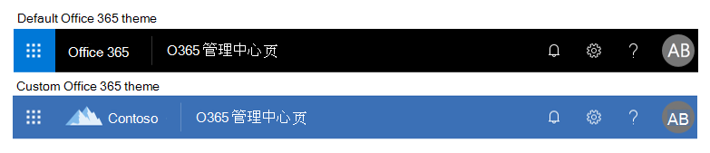

# 自定义您的组织的 Office 365 主题

了解如何在 Microsoft 365 管理中心中自定义你的主题。 作为 Office 365 商业版 订阅的管理员，可为组织中的每个用户更改顶部导航栏中显示的默认主题。 您可以添加公司徽标并更改颜色，使其与品牌的其余部分相匹配。 您甚至可以添加目标链接，以便用户在选择您的徽标时导航到该链接。 你可以在此处查看 Office 365 中的默认主题和自定义主题结果。
  

  
## 在管理中心中自定义您的主题

1. 在管理中心中，转到 "**设置** \> "**设置**，然后选择 "**组织配置文件**" 选项卡。

2. 在 "**组织配置文件**" 选项卡上，选择 "**自定义主题**"。

3. 在 "**海关主题**" 面板上，更改您的组织所需的主题元素：
    
    - **使用自定义徽标图像**：选择是使用 URL 中的图像还是上载图像。 如果使用 URL，请确保该 URL 使用 HTTPS，其格式为 200 x 30 像素，任意大小的任意格式。 您可以在 10 KB 下上传一个徽标为 200 x 30 像素（JPG、PNG、GIF 或 SVG 格式）。

      > [!NOTE]
      > 若要在 SharePoint 移动应用程序中显示徽标，请仅使用 SVG 图像。 以任何其他格式上载的图像不会显示在应用程序中。 在 SharePoint 移动应用程序中，徽标不可单击。

    - **使徽标可单击**：您可以将导航栏中的徽标用作指向任何公司资源的链接。 您可以在此处输入徽标的 URL，从 http://或 https://开始。 这是可选的。

    - **选择 "背景图像**"：选择图像，然后上传您自己的分辨率为 1366 x 50 像素的 JPG、PNG 或 GIF，不大于 15 KB。 背景图像将显示在每页的顶部导航栏中。

      > [!NOTE]
      > 包含文本的图像可能不会按预期显示。出现在导航栏右侧和左侧的内置元素可能因服务不同而异，文本可能会被这些元素遮住。由于导航栏的动态性质，目前我们还无法提供实现一致体验所需的图像填充指南。 

    - **导航栏颜色**：选择要用于导航栏背景的颜色。 显示在每页顶部。

    - **文本和图标**：选择要为顶部导航栏上的文本和图标使用的颜色。

    - **强调文字颜色**：选择用于导航栏按钮悬停颜色和页面强调元素（如按钮和特定应用程序上的文本）的颜色。

     - **阻止用户覆盖主题**：翻转此开关可阻止用户从主题选择中选择自己的主题。 这并不能阻止用户设置高对比度主题。

    - **显示用户名**：选择是否在用户登录时，在页面右上角的 "客户" 的入口点显示用户的完整名称。 默认情况下，如果尚未上载照片，则用户将看到照片或姓名的缩写。
    
4. 选择“**保存更改**”。
    
你将立即在管理中心中看到新主题，在短暂延迟之后，你将在 Office 365 中看到它，包括 Outlook 中的页面、SharePoint、 [sharepoint mobile app For iOS](https://support.office.com/en-us/article/SharePoint-mobile-app-for-iOS-339402ce-16bb-4c97-9475-0c5375ccef7a)和[适用于 Android 的 sharepoint 移动应用](https://support.office.com/en-us/article/SharePoint-mobile-app-for-Android-d875654b-fb0a-4dbe-a17a-a676cf936284)。 请参阅下图，了解从管理中心自定义主题更改的示例。

可随时删除自定义图标或自定义颜色。 只需返回主题页面，然后选择 "**删除自定义主题**"。
  
## 最佳做法

选择**徽标图像**时，建议尽可能使用 SVG 文件类型，以便您的徽标在所有屏幕和所有缩放级别上都具有高分辨率外观。

选择 "自定义颜色" 时，请选择与您选取的**徽标图像**具有高对比度的**导航栏背景色**。 此外，选择与**导航栏背景颜色**具有高对比度比率的**文本和图标**颜色，以确保所有文本和图标都能轻松可见。

选择自定义颜色时，选取在白色或浅色背景上显示的**强调文字颜色**。 **强调文字颜色**用于为显示在白色或浅色背景上的一些链接和按钮着色。 例如，在用户的收件箱和其 Office.com 门户页面上的元素中使用**强调文字**颜色。 
  
文本、图标或按钮颜色与背景色之间的推荐对比度为4.5：1。

下面是一个简单的流程图，可帮助你快速为你的组织设置具有视觉冲击力的自定义 Office 365 主题：
  - 我想要使用我们的徽标的彩色版本。
    - 建议采用以下设置：
      - **徽标图像**：你的组织的彩色徽标。
      - **导航栏颜色**：中性色。 我们建议 #FAF9F7 亮色，并 #252423 的颜色为黑色。
      - **文本和图标颜色**：用于对比**导航栏颜色**的颜色。 我们建议 #FAF9F7 亮色，并 #252423 的颜色为黑色。
      - **强调文字颜色**：一种深品牌。 对于某些应用程序，此颜色在浅色背景中必须可见。
  - 我希望使用徽标的非特定版本，并在导航栏中表示颜色。
    - 建议采用以下设置：
      - **徽标图像**：您的组织的中性徽标。
      - **导航栏颜色**：一种与徽标对比的品牌颜色。
      - **文本和图标颜色**：选择一种颜色，以与您为**导航栏颜色**选择的品牌颜色相对比。 我们建议对黑色 #252423，并 #FAF9F7 亮色。
      - **强调文字颜色**：一种深品牌。 对于某些应用程序，此颜色在浅色背景中必须可见。
  
## 相关文章

[向"我的应用"页面和应用启动器添加自定义磁贴](../manage/customize-the-app-launcher.md)
  
  

