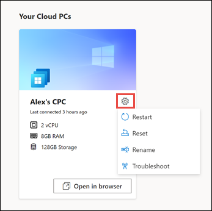

# Windows 365 商业版和云电脑入门

本文适用于计划购买和设置 365 商业Windows 365 商业版的人。
  
[Windows 365 商业](https://www.microsoft.com/windows-365/business)版是 Windows 365 的一个版本，专为小型公司 (最多 300 个席位) 。 它使组织能够轻松、简化地向用户提供云电脑。  借助 Windows 365 云电脑，你可以从 Microsoft 云流式传输应用、数据、内容、设置和存储。

> [!NOTE]  
> 在启动之前，请确保用户可能将设备加入 Azure **AD** 的 [Azure AD](/azure/active-directory/devices/device-management-azure-portal#configure-device-settings)设备设置设置为"全部 **"。**

   
## 先决条件
没有设置 365 商业版Windows先决条件。

为了获得最佳载入体验，请参阅设置疑难解答指南，以确保你的环境首选项已针对 Windows 365 商业版进行了优化。 

## 购买订阅

有两种不同的方法可以让用户Windows 365 商业版订阅：

- Windows [365 产品网站](https://www.microsoft.com/windows-365/business/compare-plans-pricing)
- Microsoft 365 管理中心

购买订阅后，可以使用 Microsoft 365 管理中心向组织用户分配许可证。

### 通过 Windows 365 产品网站购买订阅

如果还没有购买Microsoft 365，可以在 Windows 365 产品网站上购买 Windows [365 商业版订阅](https://www.microsoft.com/windows-365/business/compare-plans-pricing)。 使用以下步骤通过 Windows 365 产品页面购买 Windows 365 商业版订阅。

1. 在 ["Windows 365 商业版](https://www.microsoft.com/windows-365/business)"页上，选择 **"查看计划和定价"。**
2. On the next page， select the subscription you want to purchase， and then select **Buy now**.
3. 在 **"感谢您选择 Windows 365 商业版**"页上，按照步骤设置您的帐户。
4. 在 **"步骤 5 -** 确认详细信息"中，如果已准备好向用户分配许可证，请选择"开始"转到 Windows 365 主页（位于 https://windows365.microsoft.com ）。
5. 在 Windows 365 主页上的"快速操作"部分，选择"**管理您的组织"。** 这会将你Microsoft 365 管理中心向用户分配许可证。

没有全局或帐单管理员角色的用户可以使用自助购买直接从 Windows 365 商业版 Windows [365 商业版购买订阅](https://www.microsoft.com/windows-365/business?rtc=1)。 通过此方式购买订阅的用户将被授予 Microsoft 365 管理中心 的有限视图，他们可以在此视图中将订阅的许可证分配给其组织的其他用户。 将许可证分配给其他用户会自动为其创建 Windows 365 商业云电脑，可以从[Windows 365 主页访问。](https://windows365.microsoft.com/)

> [!NOTE]
> 自助购买不适用于印度或政府或教育客户。

若要详细了解自助服务购买，请参阅 [自助服务购买常见问题解答](../../commerce/subscriptions/self-service-purchase-faq.yml)。

### 通过 Microsoft 管理中心购买订阅

如果你已有一个 Microsoft 365 租户，并且是全局管理员或帐单管理员，可以使用 Microsoft 365 管理中心 为组织购买 Windows 365 商业版订阅。

1. In the Microsoft admin center， go to the **Billing > Purchase services** page.
2. 在"**购买服务**"页上，搜索 **"Windows 365 商业版"。** 找到它后， **选择详细信息**。
3. On the **Windows 365 Business** page， in the **Processor/Ram/存储 Options** section， use the Select a subscription menu to select **a** subscription for your users based on their CPU， RAM， and storage needs. 请参阅[Windows 365 商业](windows-365-business-sizing.md)版大小调整选项，以指导如何选择最符合用户需求的订阅。
4. 在 **"结** 帐"页上，输入要购买的订阅数以及付款信息。 然后选择下 **订单**。
5. **全部设置！** 页面显示确认购买。

## 向用户分配许可证

无论是通过 Windows 365 产品网站还是通过 Microsoft 365 管理中心 购买订阅，都可以通过 Microsoft 365 管理中心 中的"计费"页面向用户分配Microsoft 365 管理中心。 

您可以根据Windows业务需求向用户分配不同的 365 商业版许可证类型。 请参阅[Windows 365 商业](windows-365-business-sizing.md)版大小调整选项，获取有关哪种许可证类型可能适合你的用户的指南。

> [!IMPORTANT]
> 首次在租户上分配 Windows 365 许可证时，系统帐户 **Windows 365 BPRT 永久** 用户将自动Azure Active Directory。 请勿删除此帐户或更改该帐户 (例如更改名称或 UPN) 。 如果删除系统帐户，则安装可能会失败。 此系统帐户可确保设置过程顺利，并且除 Windows 365 商业版的范围服务功能外，其他任何写入功能或租户访问权限。 如果删除此用户，请按照以下 [疑难解答步骤操作](/microsoft-365/admin/setup/troubleshoot-windows-365-business?#step-2-verify-that-the-windows-365-bprt-permanent-user-system-account-is-active)。

## 让用户开始使用云电脑

分配许可证后，让用户知道有两种不同的方式可以访问其云电脑：

- 通过 Windows 365 主页 (https://windows365.microsoft.com)
- 使用 Microsoft 远程桌面 客户端

### Windows 365 主页

用户可以导航到 **https://windows365.microsoft.com** 以访问其云电脑。  

在 Windows 365 主页上，用户可以看到他们有权访问的云电脑部分。 

用户可以选择" **在浏览器中打开"** 以打开他们的云电脑。

> [!NOTE]  
> 移动设备当前不受支持。

#### 用户行动

在 Windows 365 主页上，用户可以通过选择云电脑卡上的齿轮图标，在云电脑上执行操作。

- **重启**：重启云电脑。

- **重置**：Reset 执行以下操作：

    - 重新安装Windows 10。
    - 删除个人文件。
    - 删除对设置进行的任何更改。
    - 删除应用。

    > [!IMPORTANT]  
    > 在重置云电脑之前，请确保备份需要保留到云存储服务或外部存储的任何重要文件。 重置云电脑将删除这些文件。

- **重命名**：更改在 365 主页上向用户Windows电脑的名称。

- **疑** 难解答：排查并尝试修复可能阻止用户连接到其云电脑的任何问题。 下表介绍了检查结果的状态。

    | 状态 | 说明 |
    |:-----|:-----|
    |未检测到问题 |未运行任何检查，都发现云电脑中的问题。 |
    |已解决的问题 |检测到并修复了问题。 |
    |无法连接到云电脑。 We're working to fix it， try again later. |连接所需的 Microsoft 服务不可用。 请稍后重试连接。 |
    |我们无法修复云电脑的问题。 请与管理员联系。 |检测到问题，但无法修复。 这可能是由于正在进行的更新Windows问题。 如果此错误长时间持续，可能需要重置云电脑。 |

### 远程桌面

该Microsoft 远程桌面应用允许用户访问和控制远程电脑，包括云电脑。 Windows 365 用户可以从 Windows 365 主页下载和安装所需的远程桌面客户端。

#### 安装 Microsoft 远程桌面 应用

若要设置其远程桌面客户端，用户请按照以下步骤操作：

1. 在 Windows **365** 主页上，选择&quot;Microsoft 远程桌面 **应用**&quot; (&quot;主页图标") "。
2. 在 **"Microsoft 远程桌面应用"** 页上，下载并安装所需的远程桌面应用。

   

有关操作系统的客户端列表，请参阅远程 [桌面客户端](/windows-server/remote/remote-desktop-services/clients/remote-desktop-clients)。

## 安装应用

用户可以在云电脑上安装应用，就像在 Windows 中一样，方法为从应用程序的网站下载应用，或者从应用程序下载Microsoft Store。

所有 Windows 365 商业版用户都对云电脑具有本地管理员权限，因此他们应拥有将应用安装到其工作区所需的权限。

> [!IMPORTANT]
> 如果用户尝试在云电脑上使用 Microsoft 365 商业标准版 许可证，他们可能会看到以下错误："帐户问题：在共享计算机方案中，我们在你的帐户中找到的产品不能用于激活 Office。" 在此方案中，用户必须卸载其云Office安装的版本，然后从 Office.com 安装新副本。

## 通过 Intune 管理

如果组织和用户已获得正确许可，则云电脑可以使用相同的过程注册到 Intune，Windows 10[注册到 Intune。](/mem/intune/user-help/enroll-windows-10-device)

## 不支持使用端口 25 发送出站电子邮件

不支持在端口 25 上直接从 Windows 365 商业云电脑发送出站电子邮件。 出于安全考虑，在 Windows 365 业务网络层阻止通过端口 TCP/25 的通信。 如果您的电子邮件服务使用简单邮件传输协议 (SMTP) 电子邮件客户端应用程序，您可以使用其 Web 界面（如果可用）。 或者，您可以请求您的电子邮件服务提供商帮助配置其电子邮件客户端应用程序，以通过传输层安全性 (TLS) （它使用不同的端口）使用安全 SMTP。

## 如何获得帮助

如果需要在设置 365 商业Windows获取Microsoft 365 管理中心，请参阅获取[帮助或支持](/microsoft-365/business-video/get-help-support)。

## 相关内容

[Windows 365 商业版](https://www.microsoft.com/windows-365/business)  
[Windows 365 商业版大小调整选项](windows-365-business-sizing.md)  
[Windows 365 商业版计划比较](https://www.microsoft.com/windows-365/business/compare-plans-pricing)  
[远程桌面客户端应用比较](/windows-server/remote/remote-desktop-services/clients/remote-desktop-app-compare) 
[在Microsoft Teams中设置业务](/microsoftteams/deploy-small-business)
