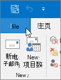
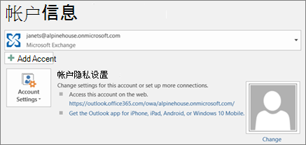

# 将电子邮件和联系人迁移到 Microsoft 365

将电子邮件从 Gmail 或其他电子邮件提供商导入或迁移到Microsoft 365。
  
 **需要有关此的帮助？**  [联系Microsoft 365联系商业支持人员](../../business-video/get-help-support.md)。 
  
对于此任务，你需要Outlook桌面安装的版本。 Outlook大多数计划都包含Microsoft 365[计划](https://go.microsoft.com/fwlink/p/?LinkId=723731)。
  
### 将 Gmail 迁移到 Microsoft 365

按照以下步骤将电子邮件、联系人和日历从 Gmail 导入或迁移到Outlook邮箱Microsoft 365：
  
- [将 Gmail 导入Outlook](https://support.microsoft.com/office/20fdb8f2-fed8-4b14-baf0-bf04b9c44bf7)
    
- [将联系人导入到 Outlook](https://support.microsoft.com/office/bb796340-b58a-46c1-90c7-b549b8f3c5f8)
    
- [导入 Google 日历](https://support.microsoft.com/office/098ed60c-936b-41fb-83d6-7e3786437330)

## 观看：导入日历
    
> [!VIDEO https://www.microsoft.com/videoplayer/embed/c1e45708-9a92-475b-910b-f5aa40614d92?autoplay=false]
  
### 将Outlook pst 文件导入Microsoft 365 (桌面) 

按照以下步骤将电子邮件、联系人和日历从 Outlook 导出到 .pst 文件，然后将该文件导入到Outlook文件Microsoft 365：
  
1. [导出电子邮件、联系人和日历](https://support.microsoft.com/office/14252b52-3075-4e9b-be4e-ff9ef1068f91)
    
2. [导入邮件、联系人和日历](https://support.microsoft.com/office/431a8e9a-f99f-4d5f-ae48-ded54b3440ac)
    
如果只需要联系人，请按照以下步骤操作：
  
1. [从联系人导出Outlook](https://support.microsoft.com/office/10f09abd-643c-4495-bb80-543714eca73f)
    
2. [将联系人导入到 Outlook](https://support.microsoft.com/office/bb796340-b58a-46c1-90c7-b549b8f3c5f8)
    
若要启动此过程，请打开"Outlook **并选择"文件** \> **""打开 &amp; 导出** \> **导入/导出"。**
  

  
## 请参阅电子邮件中的其他Outlook

只想查看来自其他提供商的电子邮件， (Gmail、Yahoo 或 Live.com) Outlook？ 无需导入或迁移。 你可以设置Outlook或Outlook Web App，以便你可以从 Microsoft 365 邮箱相同的位置访问其他帐户，并发送、接收和阅读发送到这些帐户的电子邮件。
  
### Outlook (桌面) 

将帐户（如专用 Gmail 帐户）添加到Outlook。
  
- 打开Outlook"，然后转到"文件 \> **""添加帐户"。**
    
是否需要更详细的步骤？ 请参阅 [添加帐户](https://support.microsoft.com/office/6e27792a-9267-4aa4-8bb6-c84ef146101b)。
  

  
## 多个邮箱：管理员可以将电子邮件、联系人和日历批量导入Microsoft 365

根据您的源电子邮件系统，您可以从多种批量迁移方法中选择。 阅读[将多个电子邮件帐户迁移到](/Exchange/mailbox-migration/mailbox-migration)Microsoft 365来决定哪种方法适合你。

## 相关内容

[Plan your setup of Microsoft 365 for business](plan-your-setup.md) (article) \
[Install Office applications (](install-applications.md) link page) \
[Microsoft 365 管理中心概述](../../business-video/admin-center-overview.md)（视频）