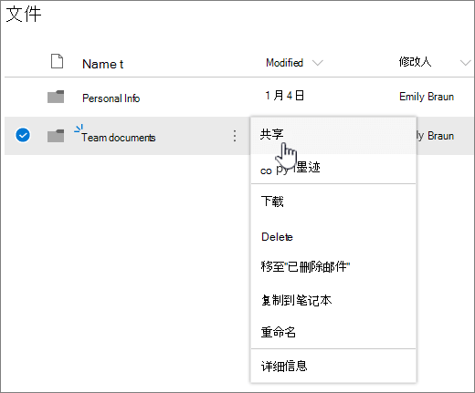
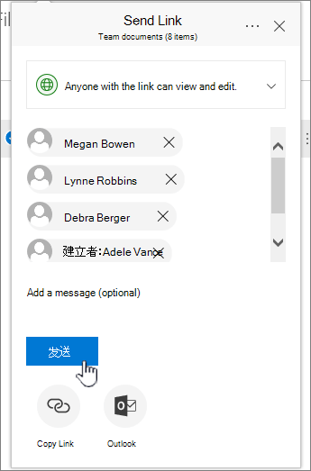

# 在文件中设置文件存储和Microsoft 365

为企业设置文件存储和共享的最佳方法之一是OneDrive网站和团队网站。 如果是只有几名员工的小型企业，此方法非常合适。

## 观看：文件存储位置Office 365

> [!VIDEO https://www.microsoft.com/videoplayer/embed/RE1FTHX] 

如果你发现此视频有帮助，请查看[适用于小型企业和 Microsoft 365 新用户的完整培训系列](../../business-video/index.yml)。

## Microsoft 365文档存储和管理

- OneDrive专为个人使用而设计的，偶尔共享文件。

- 团队网站旨在定期共享和协作处理文件。 团队网站非常适合存储具有共享所有权的文件，其中多个人员拥有文件并可能协作处理这些文件。 创建 Microsoft 团队以添加团队网站。 [有关详细信息，请通过 Teams](https://support.microsoft.com/office/174adf5f-846b-4780-b765-de1a0a737e2b)创建团队。

网站OneDrive团队网站都提供你和员工的任何访问。
  

  
以下是在将网站和工作组网站一OneDrive存储在每个位置的内容的建议： 

  
|存储位置|它有什么用|在此存储的内容|
|:-----|:-----|:-----|
|**OneDrive** |将内容存储在OneDrive就像在计算机上存储文件一样;其他人都无法访问它们。  有关详细信息，请参阅[什么是OneDrive for Business？](https://support.microsoft.com/office/187f90af-056f-47c0-9656-cc0ddca7fdc2)   |其他工作组成员无需定期协作处理或访问的业务文件。  |
|**SharePoint 团队网站**   |协作。 创建 Microsoft 365 组 (例如，在 Microsoft 365 管理中心、Outlook 或在 Microsoft Teams) 中创建团队时，会为该组创建 SharePoint 团队网站。 同样，当您从 SharePoint 主页或从新 SharePoint 管理中心创建新的 SharePoint 团队网站时，Microsoft 365组。 有关详细信息，请参阅[什么是团队SharePoint？](https://support.microsoft.com/office/75545757-36c3-46a7-beed-0aaa74f0401e)和在 SharePoint Online 中[创建团队网站](https://support.microsoft.com/office/ef10c1e7-15f3-42a3-98aa-b5972711777d)。    |具有共享所有权的文件。 我们建议为组织的每个工作单元创建单独的工作组网站。 例如，若要将人员文档和财务文档保留为小型团队专用，请创建单独的团队网站。    |

> [!NOTE]
> SharePoint还有可用于企业的其他类型网站。 可以使用 Intranet [中的通信](https://support.microsoft.com/office/7fb44b20-a72f-4d2c-9173-fc8f59ba50eb) 网站来发布供广大受众使用的信息。 此外，您还可以 [使用中心网站](https://support.microsoft.com/office/fe26ae84-14b7-45b6-a6d1-948b3966427f) 连接 Intranet 中的网站。
  
## 开始使用OneDrive团队网站

### 团队成员可以将自己的文件存储在OneDrive

你的企业中分配有 Microsoft 365 许可证的每个人 (SharePoint在线) OneDrive云存储。 他们可以在此处存储与业务相关的文件，以从任何设备访问，并且它们仅可供该用户使用。 例如，他们可能会存储草稿提案、其会议笔记或要放映的演示的脚本。
  
员工还可以共享OneDrive和文件夹。 如果员工离开公司或离开公司，其他人可以访问存储在团队OneDrive (OneDrive共享文件夹中的共享) 。
  
下面将说明团队中的每个人如何设置OneDrive共享文件。

1. 转到<a href="https://admin.microsoft.com/ " target="_blank">"Microsoft 365 管理中心"，</a>然后使用用户名和密码登录。

2. 从应用启动器中，选择 **"OneDrive"。**

3. 在OneDrive中，团队成员可以存储自己的业务相关文件。 可以共享单个文件或整个文件夹。 选取文件或文件夹，右键单击，然后选择"共享 **"。**

    
  
4. 在"**发送链接"** 页上，保留默认选择"具有链接的 **任何人都可以查看和编辑"。**

    键入要有权访问文件夹的团队成员的姓名或电子邮件地址，并添加可选邮件。

    如果需要要发送的电子邮件的自己的副本，请向列表中添加您的电子邮件地址。

    
  
5. 输入要共享的人后，请选择"发送 **"。** 该电子邮件会立即发送给受邀人员。

    
  
6. 以下是电子邮件的外观。 

    
  
### Upload文件到团队网站进行联机协作

团队网站提供一个存储文件的位置，称为文档库。  
  
下面是添加文件的步骤：
  
1. 在团队网站的主页上，从左侧导航菜单中选择"文档"。 执行此操作后，会进入" **文档库**"。
  
2. 当你仍登录到 Microsoft 365时，Windows任务栏或其他位置打开"文件资源管理器"。  转到你想要向工作组网站上载的文件。

3. 选择要上载到团队网站的文件，然后将其拖动到文档 **库**。
  
4. 完成后，文件会被同时存储在工作组网站和你的计算机中。
  
5. 你可以从计算机中删除文件。 下一步， [将联机](#sync-online-files-with-your-pc-or-mac)文件与电脑或 Mac 同步，你将在计算机上为这些文件创建一个新位置。

    如果您有许多文件或大型文件要上载到团队网站，请阅读以下有关将大文件或多个文件上载 [到库的提示](https://support.microsoft.com/office/da549fb1-1fcb-4167-87d0-4693e93cb7a0#__toc384119242)。

    如果需要更多存储空间，请参阅[更改订阅的存储空间](../../commerce/add-storage-space.md)。

### 使用电脑或 Mac 同步联机文件

现在，你的团队网站中已经有了文件，你可以进行设置以便与电脑或 Mac 同步。 这样，你可以从电脑或 Mac 处理文件，而不是在 Microsoft Edge、Chrome 或其他浏览器中工作。 当需要访问文件但未连接到 Internet 时，计算机上有一份已同步文件的版本也很重要。
  
将文件设置为与计算机同步后，当您连接到 Internet 时，将自动同步这些文件。
  
下面介绍了如何在工作组网站上与你的桌面同步文件：
  
1. 在团队网站的主页上，从左侧导航菜单中选择"文档"。 这会将您带至您的文档库。

    > [!TIP]
    > 在团队网站上同步文件时，你将同步网站上每个文件库，而不是同步整个网站。
  
2. 选择 **"同步** "以同步所有文件。 或浏览到要同步的特定文件夹。

3. 如果系统提示切换应用，请选择"**是"。** OneDrive执行同步的过程。
  
4. 如果随后 **收到"设置** OneDrive提示，则使用工作或学校帐户登录。

    
  
5. 如果尚未同步你的OneDrive，你可能会看到"这是你的OneDrive **文件夹** 屏幕。 检查你的文件夹 **下OneDrive文件夹位于此处**。 如果要 **使用不同的** 路径，请选择"更改位置"，然后选择"下一步 **"。**

    
  
6. 团队网站中的文件将显示在"文件资源管理器"的左窗格中，并按组织名称显示。 文件OneDrive将显示在"OneDrive \<Name of Organization\> -"下

    
  
7. 通过打开您计算机上团队文件夹中的文件来测试同步。 进行更改，然后选择" **保存**"。

## 文件存储和共享的最佳做法

以下是从团队网站或团队OneDrive获取SharePoint提示。
  
### 针对其他类型的小型企业的文件存储和协作建议

- **唯一** 的OneDrive：使用 OneDrive 存储你自己的文件，并基于情况与客户共享这些文件。

- **共同所有权**：两个所有者OneDrive并来回共享文件。

- **具有需要访问文件** 的外部客户端或合作伙伴的企业：创建新的团队网站，以存储和共享面向特定客户的文档。 设置网站以仅允许该客户访问。 然后，你无需担心一个客户会意外获得针对另一个客户的信息的访问权限。

### 保持私人文件的私密性

当你将文件存储在OneDrive只有你才能访问它，除非你与他人共享它。 共享文件时，可以选择创建可转发或仅与特定人员共享的链接。 你也可以在 OneDrive 中创建单独的文件夹，分别用于不同用途，如用于公共、个人或单个项目。 每个文件夹可共享给不同人员或组，或其他人。
  
有关共享详细信息，另请参阅使用 Microsoft 365[共享文件和Microsoft 365。](https://support.microsoft.com/office/72f26d6c-bf9e-432c-8b96-e3c2437f5b65)
  
### 跟踪还剩余多少空间

To see how much storage space you have left in OneDrive， see [Manage your OneDrive for Business storage](https://support.microsoft.com/office/31519161-059C-4764-B6F8-F5CD29F7FE68).
  
### 哪些文件可以存储在OneDrive网站中？

虽然几乎可以上载所有类型的文件，但不允许使用文件名中的某些文件名和字符。 有关详细信息，请参阅中[无效的文件字符和](https://support.microsoft.com/office/64883A5D-228E-48F5-B3D2-EB39E07630FA)OneDrive for Business。
  
### 启用或禁用第三方存储服务

您可以在网站中为用户启用第三方存储Microsoft 365以便他们可以使用 Dropbox 等服务和团队网站OneDrive文档。 对于提供用户可能已在用于或倾向于用于业务项目的服务，这可能是一种非常好的方法。 如果您不希望组织中使用 Office在第三方服务中打开文件，请按照以下步骤将其关闭。
  
> [!IMPORTANT]
> 默认情况下，第三方存储已启用，因此，如果你不希望用户能够使用，则需要马上执行这些步骤。
  
1. 登录到管理 <a href="https://go.microsoft.com/fwlink/p/?linkid=2024339" target="_blank">中心</a>。

2. 转到 **"设置** \> <a href="https://go.microsoft.com/fwlink/p/?linkid=2053743" target="_blank">**组织设置"**</a>页。

3. 在"**服务"** 选项卡上，选择 **"Office web 版"。**

4. 选中或取消选中复选框以打开或关闭第三方存储，然后选择保存 **更改**。

## 后续步骤

- [自定义用于文件存储和共享的团队网站](customize-team-site.md)。 此分步教程演示如何利用更多的存储和协作功能。

- **在平板电脑和手机上设置 Office 应用**。 需要这样做，以便可以从平板电脑或手机编辑存储在OneDrive团队网站中的文件。 如果你没有为平板电脑或手机Office应用程序，你将可以查看文件，但不能编辑它们。

  - [在 Android Office安装并设置Microsoft 365](https://support.microsoft.com/office/cafe9d6f-8b0c-4b03-b20a-12438a82a22d)

  - [在具有 Office 的 iPhone 或 iPad 安装和Microsoft 365](https://support.microsoft.com/office/9df6d10c-7281-4671-8666-6ca8e339b628)

  - [在Office Windows Phone设置Microsoft 365](https://support.microsoft.com/office/2b7c1b51-a717-45d6-90c9-ee1c1c5ee0b7)

## 相关内容

[为订阅添加存储空间 (](../../commerce/add-storage-space.md) 文章) \
[使用 Business Microsoft 365 视频 (](https://support.microsoft.com/office/share-files-and-folders-with-microsoft-365-business-72f26d6c-bf9e-432c-8b96-e3c2437f5b65)共享文件和) \
[自定义团队网站以存储文件和共享](customize-team-site.md) (文章) 
