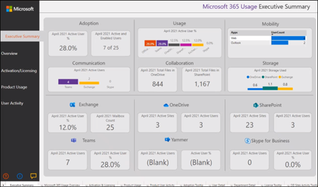

# 连接使用情况Microsoft 365 政府社区云 (GCC) 数据

使用以下过程通过 Microsoft 365 租户中的"使用情况分析"Microsoft 365 政府社区云 (GCC) 数据。 

> [!NOTE]
> 这些说明专用于Microsoft 365 GCC租户。 

## 准备工作

若要最初配置Microsoft 365使用情况分析： 

- 你需要成为全局管理员Microsoft 365才能启用数据收集。 
- 您需要[Power BI Desktop应用程序](https://powerbi.microsoft.com/en-us/desktop/)来使用模板文件。 
- 您需要具有[Power BI Pro或](https://go.microsoft.com/fwlink/p/?linkid=845347)高级版和查看报告所需的许可证或容量。 

## 步骤 1：使组织的数据可用于Microsoft 365使用情况分析报告

1. In the Microsoft 365 管理中心， expand the navigation menu， select **Reports**， then select **Usage**. 
2. 在"**使用率报告"** 页上的"Microsoft 365使用情况分析"部分，选择 **"入门"。** 
3. 在 **"Power BI** 使用情况分析"下，选择"将组织使用情况数据提供给 Microsoft Power BI **使用情况** 分析"，然后选择"保存 **"。**

     

    这将启动一个过程，使组织数据可供此报告访问，并且你将看到一条消息，指出我们正在准备你的数据，Microsoft 365 **使用情况分析**。 请注意，此过程可能需要 24 小时才能完成。 

4. 当组织数据准备就绪时，刷新页面将显示一条消息，指出你的数据现已可用，并且还会提供你的 **租户 ID** 号。 在稍后的步骤中，当您尝试连接到租户数据时，将需要使用租户 ID。 
 
     
 
    > [!IMPORTANT]
    > 当数据可用时，不要选择"转到 **Power BI"，** 这将转到 Power BI Marketplace。  GCC Marketplace 中Power BI此报告的模板应用。  

## 步骤 2：下载Power BI模板、连接到数据并发布报告

Microsoft 365 GCC用户可以下载并使用Microsoft 365分析报告模板文件连接到其数据。 你将需要Power BI Desktop打开并使用模板文件。 

 > [!NOTE]
 > 目前，Microsoft 365使用情况分析报告的模板应用不适用于 GCC Marketplace Power BI租户。  

1. 下载模板后Power BI[模板](https://download.microsoft.com/download/7/8/2/782ba8a7-8d89-4958-a315-dab04c3b620c/Microsoft%20365%20Usage%20Analytics.pbit)，使用 Power BI Desktop。 
2. 当系统提示你输入 **TenantID** 时，输入你在步骤 1 中为此报告准备组织数据时收到的租户 ID。 然后选择加载。 加载数据需要几分钟时间。 

     

3. 加载完成后，将显示报告，并且你将看到数据的执行摘要。 

     
 

4. 保存对报表所做的更改。 
5. 选择"Power BI Desktop"菜单中的"发布"，将报告发布到 Power BI Online 服务中，可在其中查看报告。 这需要一个Power BI Pro许可证或Power BI Premium容量。 作为发布过程的[一部分](/power-bi/create-reports/desktop-upload-desktop-files#to-publish-a-power-bi-desktop-dataset-and-reports)，你需要选择目标以发布到 Power BI Online Service 中的可用工作区。

## 相关内容

[关于使用情况分析](usage-analytics.md)  
[获取最新版本的使用情况分析](get-the-latest-version-of-usage-analytics.md)  
[导航和利用 Microsoft 365 使用情况分析中的报表](navigate-and-utilize-reports.md)  