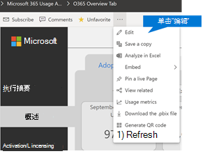
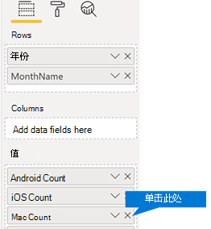

# 自定义 Microsoft 365 使用情况分析中的报告Customize the reports in Microsoft 365 usage analytics

Microsoft 365 使用情况分析在 Power BI 中提供了一个仪表板，可提供用户采用和使用 Microsoft 365 的见解。Microsoft 365 usage analytics provides a dashboard in Power BI that offers insights into how users adopt and use Microsoft 365. 这个仪表板只是与使用情况数据进行交互的起点。The dashboard is just a starting point to interact with the usage data. 可以自定义报表，从而获得更加个性化的见解。The reports can be customized for more personalized insights.
  
还可以使用 Power BI Desktop 将报表连接到其他数据源来进一步自定义报表，以获得有关业务的更加丰富的见解。You can also use the Power BI desktop to further customize your reports by connecting them to other data sources to gain richer insights about your business.
  
## 在浏览器中自定义报表Customizing reports in the browser

以下两个示例显示了如何修改现有视觉对象以及如何创建新的视觉对象。The following two examples show how to modify an existing visual and how to create a new visual.
  
### 修改现有视觉对象Modify an existing visual

本示例演示如何修改"激活/许可 **"\*\*\*\*报告中的"激活"选项卡**。This example shows how to modify the **Activation** tab within the **Activation/Licensing** report. 
  
1. 在" **激活/许可"** 报告中，选择" **激活"** 选项卡。Within the **Activation/Licensing** report, select the **Activation** tab.
    
2. 通过选择顶部的"编辑 **"** 按钮，通过 Power BI 按钮中的"更多页面"按钮进入  模式。Enter the edit mode by choosing the **Edit** button on the top through the  button. 
    
    
  
3. 在右上方，选择"**复制此页面"。**On the top right, choose **Duplicate this page**.
    
    
  
4. 在右下角，选择显示基于操作系统（如 Android、iOS、Mac 等）激活的用户数的任何条形图。In the bottom right, choose any of the bar-charts showing the count of users activating based on the OS such as Android, iOS, Mac, etc.
    
5. 在 **右侧"可视化"** 区域中，若要从视觉对象中删除 **Mac Count，** 请选择其旁边的 **X。**In the **Visualizations** area to the right, in order to remove **Mac Count** from the visual, select the **X** next to it.

        
    
### 创建新的视觉对象Create a new visual

以下示例演示如何创建新的视觉对象，以按月跟踪新的 Yammer 用户。The following example shows how to create a new visual to track new Yammer users on monthly basis.
  
1. 使用左侧 **导航转到"产品** 使用情况"报告，然后选择 **"Yammer"** 选项卡。Go to the **Product Usage** report using the left nav and select the **Yammer** tab.
    
2. 通过选择 Power BI 中的"  "编辑"切换到 **编辑模式**。Switch to edit mode by choosing  and **Edit**. 
    
3. 在页面底部，选择At the bottom of the page, select the  创建新页面。to create a new page.
  
4. 在右侧 **"可视化"** 区域中，选择顶部 (的堆积条形图，从左到左) 。In the **Visualizations** area to the right, choose the **Stacked bar chart** (top row, first from left).

    
    
5. 选择可视化效果的右下角，并拖动使其变大。Select the bottom right of that visualization and drag to make it larger.

6. 在右侧 **"字段** "区域中，展开 **"日历"** 表。In the **Fields** area to the right, expand the **Calendar** table.

7. 将" **MonthName**"拖动到字段区域，该区域位于" **可视化效果**"区域中" **坐标轴**"标题的正下方。Drag **MonthName** to the fields area, directly below the **Axis** heading in the **Visualizations** area.
 
    
    
8. 在右侧的" **字段**"区域中，展开" **TenantProductUsage**"表。In the **Fields** area to the right, expand the **TenantProductUsage** table.

9. 将" **FirstTimeUsers**"拖动到字段区域，该区域位于" **值**"标题的正下方。Drag **FirstTimeUsers** to the fields area, directly below the **Value** heading.

10. 将" **产品**"拖动到" **筛选器**"区域，该区域位于" **视觉级筛选器**"标题的正下方。Drag **Product** to the **Filters** area, directly below the **Visual level filters** heading.

11. 在出现的" **筛选器类型**"区域中，选中" **Yammer**"复选框。In the **Filter Type** area that appears, select the **Yammer** check box.

    
  
12. 在可视化效果列表正下方，选择 Power  BI Visualizaions 中的"格式"图标  。Just below the list of visualizations, choose the **Format** icon .

13. 展开标题并将" **标题文本**"值更改为" **每月首次使用 Yammer 的用户**"。Expand Title and change the **Title Text** value to **First-Time Yammer Users by Month**.
    
14. 将" **文本大小**"值更改为" **12**"。Change the **Text Size** value to **12**.
    
15. 通过编辑右下角页面的名称来更改新页面的标题。Change the title of the new page by editing the name of the page on bottom right.

16.  单击顶部的"阅读视图"，然后单击"保存"，以保存 **报告**。Save out the report by Clicking on **Reading View** on top and then **Save**.
    
## 自定义 Power BI Desktop 中的报表Customizing the reports in Power BI Desktop

对于大多数客户而言，在 Power BI Web 版中修改报表和图表视觉对象已经足够。但是，对于某些客户而言，可能需要将此数据与其他数据源联接，以获得与其业务上下文有关的更加丰富的见解，在这种情况下，可以使用 Power BI Desktop 自定义并生成其他报表。可以免费下载 [Power BI Desktop](https://go.microsoft.com/fwlink/p/?linkid=849797)。For most customers modifying the reports and chart visuals in Power BI web will be sufficient. For some however, there may be a need to join this data with other data sources to gain richer insights contextual to their own business, in which case they can customize and build additional reports using Power BI Desktop. You can download [Power BI Desktop](https://go.microsoft.com/fwlink/p/?linkid=849797) for free. 
  
### 使用报告 APIUse the reporting APIs

你可以从支持这些报告的 Microsoft 365 直接连接到 ODATA 报告 API 开始。You can start by connecting directly to the ODATA reporting APIs from Microsoft 365 that power these reports.
  
1. 转到" **获取数据**"\>" **其他**"\>" **ODATA 源**"\>" **连接**"。Go to **get data** \> **Other** \> **ODATA Feed** \> **Connect**.
    
2. 在"URL"窗口中，输入 <i></i> "https:// \<tenantid\> reports.office.com/pbi/v1.0/"In the URL window enter "https://<i></i>reports.office.com/pbi/v1.0/\<tenantid\>"
    
    **注意：** 报告 API 为预览版，在进入生产阶段之前可能会更改。**NOTE:** The reporting APIs are in preview and are subject to change until they go into production. 
  
    
  
3. 系统提示时，输入 (Microsoft 365) 或学校管理员凭据以向 Microsoft 365 进行身份验证。Enter your Microsoft 365 (organization or school) admin credentials to authenticate to Microsoft 365 when prompted.
    
    有关 [谁](usage-analytics.md#faq) 可以访问 Microsoft 365 Adoption 模板应用报告，请参阅常见问题解答。See the [FAQ](usage-analytics.md#faq) for more information about who is allowed to access the Microsoft 365 Adoption template app reports. 
    
4. 授权连接后，将看到显示可连接到的数据集的"导航器"窗口。Once the connection is authorized, you will see the Navigator window that shows the datasets available to connect to.
    
    全选 **，然后选择加载**。Select all and choose **Load**.
    
    这会将数据下载到 Power BI Desktop。This will download the data into your Power BI Desktop. 保存该文件，然后可以开始创建所需报表。Save this file and then you can start creating the reports you need.
    
    
  
### 使用 Microsoft 365 使用情况分析模板Use the Microsoft 365 usage analytics template

还可以将对应于 Microsoft 365 使用情况分析报表的 Power BI 模板文件用作连接到数据的起点。You can also use the Power BI template file that corresponds to the Microsoft 365 usage analytics reports as a starting point to connect to the data. 使用 pbit 文件的优点是它已建立连接字符串。The advantage of using the pbit file is that it has the connection string already established. 也可以利用已创建的所有自定义度量值，在基础架构所返回数据的基础上进一步进行构建。You can also take advantage of all the custom measures that are created, on top of the data that the base schema returns and build on it further.
  
可以从 Microsoft 下载中心下载 Power BI [模板文件](https://download.microsoft.com/download/7/8/2/782ba8a7-8d89-4958-a315-dab04c3b620c/Microsoft%20365%20Usage%20Analytics.pbit)。You can download the Power BI template file from the [Microsoft Download Center](https://download.microsoft.com/download/7/8/2/782ba8a7-8d89-4958-a315-dab04c3b620c/Microsoft%20365%20Usage%20Analytics.pbit). 下载 Power BI 模板文件后，请按照以下步骤开始：After you download the Power BI template file, follow these steps to get started:
  
1. 打开 pbit 文件。Open the pbit file.
    
2. 在对话框中输入租户 ID 值。Enter your tenant id value in the dialog.
    
    
  
3. 当系统提示时，输入管理员凭据以向 Microsoft 365 进行身份验证。Enter your admin credentials to authenticate to Microsoft 365 when prompted.
    
     有关允许谁访问 Microsoft 365 使用情况分析报告的信息。for more information about who is allowed to access the Microsoft 365 usage analytics reports. 
    
    获得授权后，将刷新 Power BI 文件中的数据。Once authorized, the data will be refreshed in the Power BI file.
    
    数据加载可能需要一些时间，完成加载后，可以将文件保存为 .pbix 文件，并继续自定义报表或向此报表添加其他数据源。Data load may take some time, once complete, you can save the file as a .pbix file and continue to customize the reports or bring an additional data source into this report.
    
4. 请遵循[开始使用 Power BI](/power-bi/fundamentals/desktop-getting-started) 文档，了解如何生成报表、将其发布到 Power BI 服务以及与组织共享。按照此路径进行自定义和共享可能需要其他 Power BI 许可证。请参阅 Power BI [授权指南](https://go.microsoft.com/fwlink/p/?linkid=849803)了解详细信息。Follow [Getting started with Power BI](/power-bi/fundamentals/desktop-getting-started) documentation to understand how to build reports, publish them to the Power BI service, and share with your organization. Following this path for customization and sharing may require additional Power BI licenses. See Power BI [licensing guidance](https://go.microsoft.com/fwlink/p/?linkid=849803) for details. 
