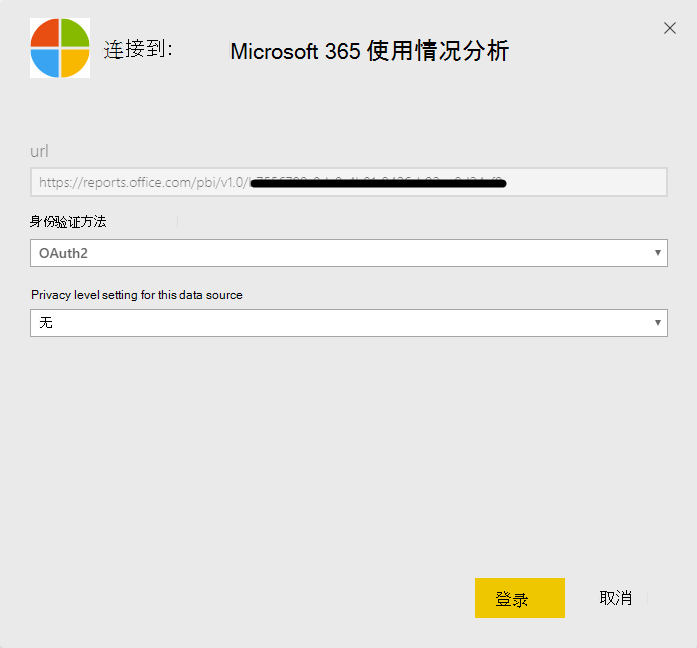

# 启用 Microsoft 365 使用情况分析

Microsoft 365 美国政府社区也提供 microsoft 365 的使用情况分析。
  
## 启用 Microsoft 365 使用情况分析的步骤

若要开始使用 Microsoft 365 使用情况分析，您必须先使数据在 Microsoft 365 管理中心中可用，然后在 Power BI 中启动模板应用。
  
### 获取 Power BI

如果你尚不具有 Power BI，则可以[注册 POWER Bi Pro](https://go.microsoft.com/fwlink/p/?linkid=845347)。 选择 "**免费试用**" 注册试用版，或**立即购买**以获取 Power BI Pro。
  
  
也可展开" **产品**"，购买某一版 Power BI。 

> [!NOTE]
> 您需要使用 Power BI Pro 许可证来安装、自定义和分发模板应用程序。 有关详细信息，请参阅[先决条件](https://docs.microsoft.com/power-bi/service-template-apps-install-distribute?source=docs#prerequisites)。

你需要使用 Power BI Pro 许可证来共享你的内容，以及你将其与之共享的人员，或者内容需要位于[高级容量](https://docs.microsoft.com/power-bi/service-premium-what-is)的工作区中。 
  
### 启用模板应用程序

若要启用模板应用程序，您必须是**全局管理员**、**报告读者**、 **Exchange 管理员**、 **Skype for business 管理员**或**SharePoint 管理员**。 
  
有关详细信息，请参阅[关于管理员角色](../add-users/about-admin-roles.md)。 
  
1. 在管理中心，转到“**报表**”\> <a href="https://go.microsoft.com/fwlink/p/?linkid=2074756" target="_blank">使用情况</a>页面。 
    
2. 在 "**使用情况**" 页上，找到 " **Microsoft 365 使用情况分析**卡"，然后选择 "**开始**"。
    
3. 在打开的 "报告" 面板中，设置 "将**数据提供给 Microsoft 365 使用情况分析以供 Power BI** **保存** **"** \> 。 
  
这将启动数据收集过程，并将在2到48小时内完成，具体取决于租户的大小。 数据收集完成后，"**转到 POWER BI** " 按钮将处于启用状态（不再为灰色）。 
    
### 启动模板应用程序

若要启动模板应用程序，您必须是**全局管理员**、**报告读者**、 **Exchange 管理员**、 **Skype for business 管理员**或**SharePoint 管理员**。 
  
1. 复制租户 Id，然后选择 "**转到 POWER BI**"。
    
2.  转到 Power BI 后，请进行登录。 选择 "应用-从导航菜单 >获取应用程序"。    
  
3. 在 "**应用程序**" 选项卡中，在 "搜索" 框中键入 microsoft 365，然后选择 " **microsoft 365 使用率分析** \> **现在获取它**"。

    
    
4.  安装应用程序后。 单击磁贴以打开它。

5.  单击 "**浏览应用**程序" 以查看包含示例数据的应用程序。 单击 "**连接**" 将应用程序连接到您的组织的数据。

6.  **单击 "连接"** 后，在 "**连接到 Microsoft 365 使用情况分析**" 屏幕上键入您在步骤（1）中\>复制的 "租户 Id" （**下一**步）。
    
7. 在下一个屏幕上，选择 " **oAuth2** " 作为**身份验证方法** \> **登录**。 如果选择任何其他身份验证方法，则与模板应用程序的连接将失败。
    
    
  
8. 模板应用程序实例化后，Microsoft 365 使用情况分析仪表板将在 Power BI 网页版中提供。 仪表板的初始加载将需要2到30分钟时间。
  
租户级别聚合将在所有报告中可用。 **用户级别的详细信息仅在选择 "日历" 月的第一天或第15天后才会变为可用**。 这将影响 "用户活动" 下的所有报告（有关如何查看和使用这些报告的提示，请参阅[在 Microsoft 365 使用情况分析中导航和利用报告](navigate-and-utilize-reports.md)）。
    
## 使收集的数据匿名

若要使收集的所有报表数据匿名，你必须是全局管理员。 这将在报告中和模板应用程序中隐藏可识别信息，如用户、组和网站名称。
  
1. 在管理中心中，转到 "**设置** \> "**设置**，在 "**服务**" 选项卡下，选择 "**报告**"。
    
2. 选择 "**报告**"，然后选择 "**显示匿名标识符**"。 此设置既可应用于使用情况报告，也可应用于模板应用。
  
3. 选择“**保存更改**”。
