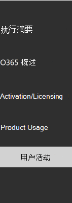
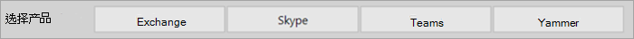
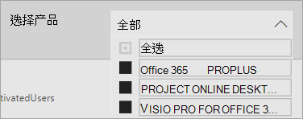
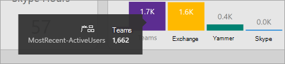

# 导航和利用 Microsoft 365 使用情况分析中的报表

仪表板提供有关主要用途和采用指标的快速概述。 通过选择顶级指标，可以访问可提供更多详细信息和见解的报告。 每个报告选项卡都包含特定于组织的使用和采用方面的数据可视化。 收集的数据在每个报告的标题中进行了说明，将出现一个图块，其中包含有关正在查看的报告选项卡上的可视化效果的进一步信息。

若要开始使用报表，下面是一些提示：

- 使用左侧或"执行摘要"页上相关指标上的导航选项卡导航到每个顶级报告。

    

- 使用每个顶级报告顶部的导航选项卡导航到该级别中的不同报告。

    

- 许多报表都包含一个切片器，您可以在其中筛选要查看的产品、AAD 属性或活动。 可以是单选或多选。

    

    

- 将鼠标悬停在数据点上，以查看包含详细信息的标注。

    

实例化模板应用的用户将能够根据自己的需求自定义报告。 自定义模板应用：

- 选择 **报告顶部的** "编辑报告"。

    

- 使用基础[数据集](usage-analytics-data-model.md)创建自己的视觉对象。

- 使用 Power BI Desktop引入您自己的数据源。

若要共享报告，只需选择"共享"按钮  位于页面顶部。

若要了解如何自定义报告，请参阅自定义Microsoft 365[分析中的报告](customize-reports.md)。

可以在 Power BI 帮助文档中找到许多额外信息：

- [Power BI基本概念](/power-bi/service-basic-concepts)

    了解仪表板、数据集、报表和其他Power BI概念。

- [Power BI 入门](/power-bi/service-get-started?wt.mc_id=O365_Reports_PBI_contentpack)

    了解 Power BI 中的基本功能。查找关于如何使用 Power BI Desktop 的链接。

- [共享仪表板和报表](/power-bi/service-share-dashboards)

    了解如何与组织外部的同事或人员共享报告。 您还可以共享报告或已筛选的报告版本。