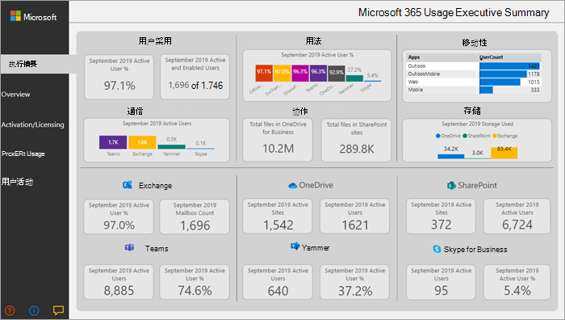

# Microsoft 365 使用情况分析

在Microsoft 365内使用Power BI使用情况分析，以深入了解组织如何采用组织中各种Microsoft 365。 你可以可视化和分析Microsoft 365数据、创建自定义报告并在组织内部共享见解。 您还可以深入了解特定区域或部门如何使用Microsoft 365。
  
Microsoft 365使用情况分析，可以访问预建仪表板，该仪表板提供过去 12 个月的跨产品视图，并包含大量预建报表。 每种报表为你提供特定的使用情况见解。 上一个完整日历月提供特定于用户的信息。
  
支持 [模板](usage-analytics-data-model.md) 应用的数据模型包括 Active Directory 中的用户属性，从而能够在某些报告中进行透视。 包括以下 Active Directory 属性：位置、部门和组织。 
  
请参阅[启用 Microsoft 365 使用情况分析](enable-usage-analytics.md)来开始收集数据。 
  
Microsoft 365使用情况分析包含以下各节中详述的很多报告。 

您可以通过选择数据表来访问每个区域的详细报告。 可以通过选择网站底部的选项卡来查看所有预建报告。 有关更详细的说明，请阅读 [导航和利用报表](navigate-and-utilize-reports.md) 和 [自定义报告](customize-reports.md)。

## 执行摘要

执行摘要是 Microsoft 365 for Business 采用、使用情况、移动性、通信、协作和存储报表的概括性概览，适用于业务决策者。 它基于已启用的所有用户和处于活动状态的用户，提供一些单独服务的使用方式的视图。 报告中显示的月的所有值都指最新完整月份。 

通过此摘要，可以快速了解企业Office以及员工协作方式和位置。

## 概述

本Microsoft 365概述报告包含以下报告。 您可以通过选择报告页面顶部的选项卡来查看它们。 报告顶部显示的月份的所有值都指最新完整月份。

- **采用** &ndash; 提供采用趋势的汇总。 使用本节中的报告可了解用户如何采用Microsoft 365，以及各个服务的整体使用情况在一个月内是如何更改的。 你可以查看用户如何启用、组织中有多少人正在使用 Microsoft 365、有多少是返回用户以及有多少用户第一次使用该产品。

- **用法** &ndash; 提供一个深入了解活动用户的数量以及过去 12 个月内每个产品的关键活动。 使用本节中的报告可了解组织中人员如何使用Microsoft 365。

- **通信** &ndash;你可以一目了然地查看组织成员是否喜欢使用 Teams、Yammer、电子邮件或Skype保持联系。 你可以观察员工之间的通信工具使用模式是否变化。 

- **协作** &ndash;了解组织中人员如何使用 OneDrive 和 SharePoint 来存储文档和相互协作，以及这些趋势如何逐渐变化。 还可以查看在内部或外部共享文档的用户数，以及使用 SharePoint 或 OneDrive 帐户的用户数（按所有者和其他协作者细分）。

- **存储** &ndash;使用此报告可跟踪邮箱、OneDrive和SharePoint存储。

- **移动性** &ndash;跟踪用户用于连接到电子邮件、Teams、Skype 或 Yammer 的客户端Yammer。

## 激活和许可

激活和许可证页提供有关激活Microsoft 365报告;即，有多少用户已下载并激活Office应用以及你的组织已分配的许可证数。 顶部月份值表示当前月，指标反映从该月开始到当前日期聚合的值。

- **激活** &ndash;跟踪服务 (，例如Microsoft 365 企业应用版、Project Visio) 激活。 拥有 Office 许可证的每个人可以在最多五台设备上安装产品。 还可使用此部分中的报告查看用户已安装Office设备。 请注意，若要激活计划，用户必须安装应用，然后使用其帐户登录。

- **许可** &ndash; 此报告概述了许可证类型、分配了每种许可证类型的用户数以及每月的许可证分配分配。 顶部月份值表示当前月，指标反映从该月开始到当前日期聚合的值。

## 产品使用情况

此报告包含每个 Microsoft 365 服务的单独报告，包括 Exchange、Microsoft 365 组、OneDrive、SharePoint、Skype、Teams 和 Yammer。 每个报告都包含启用总数和活动用户报告总数、实体计数（如邮箱、网站、组和帐户）以及活动类型报告（如果适用）。 报告顶部显示的月份的所有值都指最新完整月份。

## 用户活动

用户活动报告可用于某些单个服务。 这些报告提供与 Active Directory 属性联接的用户级别详细使用情况数据。 此外，通过部门采用报告，你可以按 Active Directory 属性进行切片，以便你可以查看所有单个服务中的活动用户。 所有指标将聚合到最新完整月份。 若要查看内容日期，请导航到表页并选择 UserActivity 表，其中 TimeFrame 下的值提供报告时间段。 

> [!NOTE]
> 全局读者和使用情况摘要报告读取者没有查看用户活动报告的权限。 

## 常见问题

### 此模板应用是通过购买提供还是免费？

这不是免费的，你将需要一个Power BI Pro许可证。 有关详细信息， [请参阅安装](/power-bi/service-template-apps-install-distribute#prerequisites) 、自定义和分发模板应用的先决条件。

若要与他人共享仪表板，请参阅共享仪表板[和报表。](/power-bi/service-how-to-collaborate-distribute-dashboards-reports#share-dashboards-and-reports)

### 谁可以连接到 Microsoft 365 使用情况分析？

你必须是全局管理员、Exchange管理员、Skype for Business 管理员 **、SharePoint** 管理员、全局读取者、报告读取者、使用情况摘要报告读取者，才能建立与模板应用的连接。   有关详细信息 [，请参阅](../add-users/about-admin-roles.md) 关于管理员角色。 **注意：****全局阅读器** 和使用情况摘要报告阅读器仅允许访问 Microsoft 365 使用情况分析中的租户级别聚合，并且他们无权查看用户活动报告。 

### Who自定义使用率分析报告吗？

只有与模板应用建立初始连接的用户才能在 Web 界面中自定义报告或Power BI报告。 有关[说明，请参阅自定义Microsoft 365使用情况分析](customize-reports.md)中的报表。

### 我能否仅从 Web 界面自定义Power BI报告？

除了从 Power BI Web 界面自定义报告之外，用户还可使用 Power BI Desktop 直接连接到 Microsoft 365 报告服务来生成自己的报告。

### 如何获取与此仪表板关联的 pbit 文件？

你可以从 Microsoft 下载中心访问 pbit [文件](https://download.microsoft.com/download/7/8/2/782ba8a7-8d89-4958-a315-dab04c3b620c/Microsoft%20365%20Usage%20Analytics.pbit)。 

### Who仪表板和报表吗？

如果已连接到模板应用，可以使用共享功能与任何人 [共享它](/power-bi/collaborate-share/service-share-dashboards)。 Power BI许可要求用户共享和与之共享仪表板的用户Power BI Pro或Power BI Premium。

### 任何用户都可以共享仪表板，还是必须是连接到仪表板的用户才能共享仪表板？

共享仪表板时，可以允许用户与他人重新共享仪表板。 可以在共享时设置此选项。

### 是否可能与一组人员一起处理和自定义同一模板应用？

是。 若要使一组管理员能够共同处理同一模板应用，可以利用 Power BI 的应用工作区功能，有关详细信息，请参阅我应该如何协作和共享仪表板[和报表？](/power-bi/collaborate-share/service-how-to-collaborate-distribute-dashboards-reports) 

### 可以使用哪些时间范围的数据？

大多数报告都显示前 12 个月的数据。 但是，由于不同产品和报表的数据收集在不同时间启动，因此，整个 12 个月的数据可能不可用，因此某些图表可能显示较少的历史记录。 所有报告最终将生成最多 12 个月的历史记录。 显示用户级别详细信息的报告显示前一完整月份的数据。

### 模板应用程序中包含哪些数据？

模板应用中的数据当前涵盖活动报告中可用的同一组 [活动指标](../activity-reports/activity-reports.md)。 当报告添加到活动报告中时，它们将被添加到模板应用中，在将来的版本中。

### 模板应用中的数据与使用情况报告中的数据如何不同？

在模板应用中看到的基础数据与你在活动报告中看到的数据Microsoft 365 管理中心。 主要区别是管理中心数据可用于过去 7/30/90/180 天，而模板应用每月显示数据最多 12 个月。

此外，模板应用中的用户级别详细信息仅适用于分配了产品许可证并执行了活动的用户的上一个完整月。

### 何时应该使用模板应用以及使用情况报告？

[活动报告](../activity-reports/activity-reports.md)是了解活动使用情况和采用情况的良好Microsoft 365。 模板应用结合了Microsoft 365使用情况数据和组织的 Active Directory 信息，使管理员能够使用 Power BI 的可视化分析功能来分析数据集。 这使管理员不仅能够可视化和分析Microsoft 365数据，还可以按 Active Directory 属性（如部门、位置等）对其进行切片。他们还可以创建自定义报告，并在其组织内部共享见解。 

### 数据的刷新频率是多高？ 

首次连接到模板应用时，该应用将自动填充过去 12 个月的数据。 此后，模板应用数据将每周刷新一次。 如果客户使用此数据需要不同的更新节奏，可以选择修改刷新计划。

后端服务Microsoft 365每天刷新数据，并提供自当前日期起延迟 5-8 天的数据。

每个 **数据集** 中的"内容日期"列表示模板应用程序中数据的新鲜度日期。

### 如何定义活动用户？

活动用户的定义与活动报告中活动 [用户](../activity-reports/active-users.md) 的定义相同。

### SharePoint 报表中包含哪些 SharePoint 网站集合？

模板应用的当前版本包括来自团队网站和SharePoint网站SharePoint活动。

### 哪些组包含在"组Microsoft 365报告中？

模板应用的当前版本包括Outlook组、Yammer组和SharePoint使用情况。 它不包括与 planner 或 planner Microsoft Teams组。

### 模板应用的更新版本何时可用？

对模板应用的主要更改将每年发布两次，其中可能包括新报表或新数据。 对报告进行细微更改可能会更加频繁地发布。

### 是否可以将模板应用的数据集成到现有解决方案中？ 

模板应用中的数据可以通过预览版中的 Microsoft 365 API (检索) 。 当它们发货到生产环境时，它们将被合并到[Microsoft](https://go.microsoft.com/fwlink/p/?linkid=848843)Graph报告 API 中。 

### 是否计划扩展模板应用以显示其他 Microsoft 产品的使用情况数据？

将考虑进行此改进，以用于将来的改进。 请查看Microsoft 365[路线图](https://www.microsoft.com/microsoft-365/roadmap)了解更新。

### 如何按 Active Directory 中的公司信息进行透视？

公司信息包含在模板应用中的 Active Directory 字段之一，可以在产品用户活动报告中将公司信息视为 **预** 建筛选器。 它在 **UserState 表中作为列** 提供。

### 是否可以从 Active Directory 引入其他字段？

通过连接到 Microsoft 报告 API，可以对此数据进行[Graph，](https://go.microsoft.com/fwlink/p/?linkid=848843)以拉取数据的其他字段Azure Active Directory并加入数据集。 

### 是否可跨多个订阅聚合模板应用中的信息？

目前，模板应用适用于单个订阅，因为它与最初用于连接到它的凭据相关联。

### 是否按计划查看使用情况， (E1、E3) ？

在模板应用中，使用情况按产品级别表示。 提供了分配给用户的各种订阅的数据，但无法将用户活动与分配给用户的订阅关联。

### 是否可以将其他数据集集成到模板应用中？

可以使用 Power BI Desktop 连接到预览Microsoft 365中的 (API) 引入与模板应用数据组合的其他数据源。

有关详细信息，请参阅 [自定义文档](customize-reports.md)。

### 是否可以看到特定时间段的"热门用户"报告？

所有用户级别报告都显示上个月的聚合数据。

### 模板应用将被本地化吗？ 

当前不在路线图中。

### 对于我的组织的相关数据，我有一个具体问题。我可以与谁联系？

可以使用管理中心活动概述页面中的反馈按钮，也可以打开支持案例获取有关模板应用的帮助。  

### 合作伙伴如何访问数据？

如果合作伙伴具有委派的管理员权限，则他/她可以代表其客户连接到模板应用。

### 是否可以在报表中隐藏可识别身份的信息（例如用户、组和网站名称）？

是，请参阅[将收集的数据匿名。](enable-usage-analytics.md#make-the-collected-data-anonymous)

## 相关内容

[启用 Microsoft 365 使用情况分析](enable-usage-analytics.md)（文章）\
[导航和利用 Microsoft 365 使用情况分析 (](navigate-and-utilize-reports.md)中) \
[查看视频Microsoft 365 (](../../business-video/act-on-report.md)中的使用情况) 
