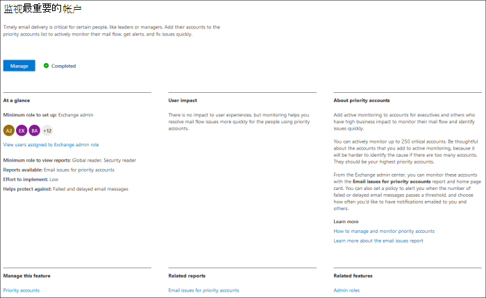
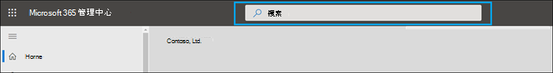
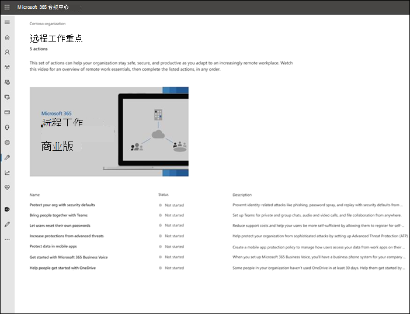
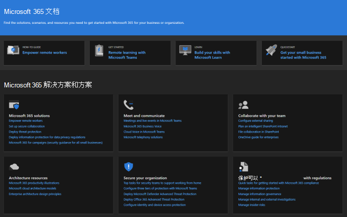
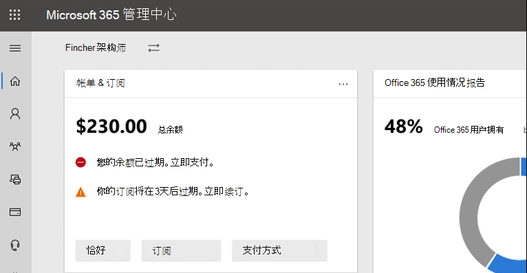

# Microsoft 365 管理中心

::: moniker range="o365-21vianet"

> [!NOTE]
> 本文中的某些信息可能不适用于由世纪Office 365运营的组。

::: moniker-end

我们正在不断将新功能添加到 [Microsoft 365 管理中心] (概述[Microsoft 365 管理中心，](admin-overview/admin-center-overview.md)修复我们了解的问题，并基于你的反馈进行更改。 请看下面的内容，了解现在可供你使用的信息。 一些功能以不同的速度推出给客户。 如果尚未看到功能，请尝试 [将自己添加到定向发布](manage/release-options-in-office-365.md)。

如果你希望了解其他 Microsoft 云服务的新增功能：

- [Azure Active Directory](/azure/active-directory/fundamentals/whats-new)
- [Exchange管理中心的新增功能](/Exchange/whats-new)
- [Microsoft Intune 新增功能](/mem/intune/fundamentals/whats-new)
- [最新功能Microsoft 365 合规中心](/Office365/SecurityCompliance/whats-new)
- [Microsoft 365 Defender 的新增功能](../security/mtp/whats-new.md)
- [SharePoint管理中心的新增功能](/sharepoint/what-s-new-in-admin-center)
- [Office 更新](/OfficeUpdates/)
- [如何检查Windows发布运行状况](/windows/deployment/update/check-release-health)

## 2021 年 7 月

### Microsoft 365 管理中心搜索

现在，可以在搜索中搜索事件<a href="https://go.microsoft.com/fwlink/p/?linkid=2091030" target="_blank">Microsoft 365 管理中心。</a> 可以通过社交媒体、行业出版物或其他管理员了解当前事件。 现在，你可以转到管理中心，查找有关事件的更多详细信息并了解对组织的影响。 只需在管理中心搜索事件 ID。

:::image type="content" source="../media/incident-id.png" alt-text="Screenshot： Searching for incident ID in the admin center":::

### 支持顶级组织的票证见解

我们添加了两个 **图，称为**"按产品表示的量趋势"和"量趋势"，可直观地了解支持量。

如果组织每月 **的支持** 案例数在增加或减少，"量趋势"选项卡下的绘制图将突出显示趋势。 你可以将鼠标悬停在图形上，检查每个月创建的支持案例数。

:::image type="content" source="../media/SuppInsight-voltrnd.PNG" alt-text="Screenshot： Graph that highlights the trend if support cases are increasing or decreasing for your organization month over month":::

" **按产品表示的** 量趋势"图显示了每个月支持案例最高的前 3 种产品。 我们已在表中启用筛选，你现在可以按产品、严重性和日期筛选 **结果**。  

:::image type="content" source="../media/SuppInsight-voltrndproduct.PNG" alt-text="Screenshot： Graph shows the top 3 products of each month with the highest support cases":::

我们还在"查看服务请求"表中添加了"严重性"和"关闭日期"这两个新字段，可让你了解有关票证的更多见解。 

:::image type="content" source="../media/SuppInsight-date-sev.PNG" alt-text="Screenshot： Table that shows support ticket sorting by severity and date.":::

To check out these updates in <a href="https://go.microsoft.com/fwlink/p/?linkid=2166757" target="_blank">Microsoft 365 管理中心</a>， go to **Support**  >  **View Service requests** in left navigation pane.

## 2021 年 6 月

### Microsoft 365 管理中心搜索

我们已向搜索功能添加了几个新类别。

- 现在可以在全局搜索中Microsoft 365管理员角色，并快速查看和管理任何页面中的角色分配。 例如，搜索 **Intune 管理员**。

- 现在，可以通过全局搜索找到简化的安装体验。 这有助于你和团队快速开始使用新功能。 例如，搜索 **将密码设置为永不过期**。

若要了解有关管理中心中的搜索功能，请参阅在管理中心[Microsoft 365 管理中心。](manage/search-in-the-mac.md)

## 2021 年 5 月

### 管理移动应用

### 使用管理移动应用跟踪支持票证更新

对于在租户中创建的所有服务请求，你现在可以跟踪票证状态、查看票证详细信息，以及通过向附件添加注释来提供/请求&信息。

:::image type="content" source="../media/Keep-track-support-ticket-updates2.PNG" alt-text="屏幕截图：跟踪支持票证更新":::

### 随时了解应用和你的应用订阅的Microsoft 365更新

- 通过消息中心推送通知了解 Microsoft 365 订阅的所有主要更新， (默认启用) 。

- 使用新增功能部分跟踪应用中 **提供的最新** 功能。 转到 **设置**  >  **新增功能？**

:::image type="content" source="../media/Stay-on-top-of-updates.PNG" alt-text="Screenshot： Track major updates and features":::

## 2021 年 4 月

### 管理移动应用

### 管理管理移动应用中的许可证和帐单

- 你现在可以查看订阅的所有可用和分配的许可证。 还可以向用户分配或取消分配许可证，以及添加或删除许可证。
- 你现在可以查看应用中的详细发票。
- 这些更新在 [Android](https://go.microsoft.com/fwlink/p/?linkid=2159786) 和 [iOS 设备上](https://go.microsoft.com/fwlink/p/?linkid=2159787) 均可用。

:::image type="content" source="../media/assign-license-mobile-app2.png" alt-text="Screenshot： Admin mobile app assign license page":::
:::image type="content" source="../media/license-screen-mobile-app2.png" alt-text="Screenshot： Admin mobile app screen with users and their licenses":::
:::image type="content" source="../media/invoice-summary-mobile-app.png" alt-text="Screenshot： Admin mobile app invoice summary page":::

### 管理移动应用中的更新消息中心源

- 现在，你可以更灵活地阅读消息中心源。 现在，你能够基于服务或标签筛选邮件，将邮件标记为收藏。 还添加了用于将邮件标记为已读、未读或已存档的批量操作。
- 这些更新在 [Android](https://go.microsoft.com/fwlink/p/?linkid=2159786) 和 [iOS 设备上](https://go.microsoft.com/fwlink/p/?linkid=2159787) 均可用。

:::image type="content" source="../media/mc-feed-mobile-app.png" alt-text="Screenshot： Admin mobile app Message center feed page":::

## Ignite 2021 (年 3) 

欢迎使用 Microsoft Ignite。 我们希望你能够参加我们的一些会话 [：Microsoft Ignite 2021](https://myignite.microsoft.com/sessions)。 下面是我们在 Ignite 上谈到的一些内容。
> [!NOTE]
> 并非所有功能都可供所有人使用。 如果看不到新功能，请加入定向 [发布](manage/release-options-in-office-365.md)。

### 消息中心

我们更新了消息中心以帮助你发现相关消息，并添加了更灵活的阅读体验。 我们添加了一个新的" **服务** "列，可帮助您扫描邮件应用于的服务，并按服务和其他元数据筛选消息。 可以收藏邮件以将其标记为后续操作，选择消息列表中显示哪些列，然后使用"后退"和"下一步"按钮在邮件之间导航。 我们还改进了此过程，以便更轻松地提供有关消息中心帖子的反馈。

:::image type="content" source="../media/message-center.png" alt-text="Screenshot： Message center home page showing inbox and messages":::

若要了解有关新功能的信息，请查看消息 [中心](manage/message-center.md)。

### 新增功能

我们改进了在应用中查看用户"新增功能"Office功能。 现在，您可以在用户可以看到的"新增功能"窗格中看到丰富的内容。 您还可以在决定让用户了解该功能之前了解有关该功能的更多信息。 有关详细信息，请查看管理哪些[Office功能显示在新增功能中](manage/show-hide-new-features.md)。

:::image type="content" source="../media/power-bi-whats-new2.png" alt-text="Screenshot： Office apps what's new page showing improvements to Power BI":::

## Ignite 2020 (& 9) 

欢迎使用 Microsoft Ignite - 我们的第一个仅联机 Ignite。 我们希望在我们的其中一个会话中看到你 [：Microsoft Ignite 2020 会话目录](https://myignite.microsoft.com/sessions)。 下面只是我们将在 Ignite 上讨论的一些内容。
> [!NOTE]
> 并非所有功能都可供所有人使用。 如果看不到新功能，请加入定向 [发布](manage/release-options-in-office-365.md)。

### 多租户管理

我们已为多租户管理员（如你）开发了一组功能，以更快、更有效地完成工作。 有关详细信息，请参阅 [管理多个租户](multi-tenant/manage.md)。

- **租户**：快速切换你管理的租户。
- **所有** 租户：一个新页面，可在其中快速查看所有租户服务的运行状况、任何打开的服务请求、产品和帐单、建议的安装任务以及该租户中的用户数。
- **设置**：多租户设置页面提供了"设置"页的列表视图，但针对许多租户进行组织。 你可以看到哪些功能未打开，哪些任务针对所有租户完成，哪些任务是租户仍然需要完成的任务。 此视图将帮助您跟踪功能采用并确保始终完成建议的安装程序任务。
- **服务** 运行状况：服务运行状况视图显示是否有事件或公告影响租户。 它甚至会告诉您受影响的托管租户数。 只需选择事件，在"概述"选项卡上获取详细信息，然后切换到"受影响的租户"选项卡，向下钻取和支持该租户。
- **跨租户邮箱迁移** 是一项现在公开预览版中的新服务，允许你在租户之间移动邮箱，而无需离开并载入邮箱。 
- **跨租户域共享**：很快，你可以加入专用预览版，以便跨多个租户共享域。 例如，如果 Contoso 获取 Wingtip Toys，Contoso 可以与 Wingtip Toys 共享域，以便两个租户中的用户可以使用"contoso.com"作为他们的电子邮件地址。

### 监视最重要的帐户

您可以监视和跟踪发送给业务影响较高的用户（如 CEO）的失败或延迟的电子邮件。 通过向优先级帐户列表中添加用户来跟踪优先级<a href="https://go.microsoft.com/fwlink/p/?linkid=2024339" target="_blank">Microsoft 365 管理中心。</a> 添加有权访问敏感或高优先级信息的主管人员、领导、经理或其他用户。

优先级帐户仅适用于满足以下两个要求的组织：

- Office 365 E3、Microsoft 365 E3、Office 365 E5 或 Microsoft 365 E5。
- 至少 10，000 个许可证和至少 50 个每月活动Exchange Online用户。

有两种方法可以开始：

- 转到 **"用户"，** 然后在"执行更多操作 (菜单中) 管理优先级 **帐户** "，将用户添加到列表中。
- 转到"**设置"，** 找到"监视 **最重要的** 帐户"设置任务，然后选择"**开始使用"。**

有关优先级帐户详细信息，请查看监视 [优先级帐户](./setup/priority-accounts.md)。

### 搜索速度更快，并且从任何页面获得更好的结果

我们已开始为管理中心推出新的搜索体验，我们在等待你试用。 

- The Search box moved to the header area where it says Microsoft 365 管理中心" so you now search from any page， not just the Home page. 我们甚至有一个快捷方式 **：Alt+S**。
- 搜索更智能，可以更快地提供更好的结果。 尝试键入"2fa"以开始。
- 搜索结果按您可以执行的项目或操作类型进行组织。
  - **用户**：选择用户的名称，你可以直接编辑该用户。 如果选择其名称旁边的三个点 (菜单) 更多操作，可以重置其密码。 可以按电子邮件地址、显示名称、名字、用户名或主电子邮件地址以及电子邮件别名进行搜索。 但是，若要获取完全匹配项，请按主电子邮件地址或用户名进行搜索。
  - **组**：从任何页面编辑组、添加成员、分配所有者。
  - **操作**：与搜索用户然后重置其密码的方式类似，您还可以从任何页面搜索"重置密码"，然后为用户重置一个或多个密码。
  - **导航**：导航下的结果可以快速帮助你快速访问管理中心中的页面。 例如，搜索"角色"将你访问"角色"页，查找Azure AD角色。
  - **设置：** 搜索与组织、订阅的服务以及安全和隐私设置相关的任何设置。 
  - **域**：你可以找到指向域的快速链接，然后该链接将你指向该域的"概述和运行状况"页。
  - **文档**：如果我们找不到结果，我们将尝试查找一些文档来提供帮助。 文章的已选择列表需要更长的时间来查找匹配项，因此请等待一秒钟，让搜索找到结果。 
  - **反馈**：找不到要查找的内容？ 从搜索向我们发送反馈。 我们将在管理中心内为更多页面和更多功能添加搜索功能。

### Microsoft 365管理移动应用

订阅[Microsoft 365](https://www.microsoft.com/microsoft-365/business/manage-office-365-admin-app)管理移动应用，可让你从移动设备管理 Microsoft 365，以便你可以离开桌面执行日常任务。 事实上，应用中有 90 多个功能，我们刚刚添加了一些功能：

- **对 Microsoft Intune** 的移动应用程序管理和条件访问策略的支持：你现在可以使用你的个人设备管理 Microsoft 365即使你的组织已打开 Intune 的移动应用程序管理和条件访问策略。
- **邮件中心通知**：如果希望收到有关新邮件中心 **帖子的通知**，设置通知中打开  >  邮件中心通知。 通过通知，我们希望确保你及时了解租户中的重要信息和事件。
- **计费警报**：如果你希望获取设备上计费通知（如果订阅即将过期设置，还可以在"通知"中打开  >  计费通知。
- **深色** 模式：欢迎使用移动应用的深色部分。 这是我们请求最多的功能之一。 转到 **设置**  >  **主题**"以将其打开。
- **报告问题**：你现在可以报告应用中的问题或查看其他管理员报告的问题。 请访问 **服务运行状况** 以签出它。

### 中小型企业的使用建议

如果组织中的某些人员未主动使用 Teams、OneDrive 或 Office 应用，中小型企业可能会在主页上收到建议。  当你查看建议时，你可以快速向非活动用户发送 Microsoft 培训电子邮件，以帮助他们开始使用应用，并确保从订阅获取完整价值。

### 远程工作集合

10 月，我们将添加远程工作集合，以帮助小型企业所有者及其员工实现联机和远程工作。  **远程工作要素** 设置是 Microsoft 建议安全启用远程工作并有效协作的所有功能的一个特别推荐列表。 在几周内，可以在设置远程工作要素  >  **中试用**。

若要详细了解如何安全允许远程工作和易于记忆和共享的方便 Web 地址，请转到 aka.ms/remote-business [。](https://aka.ms/remote-business)

### 需要帮助？移动到更多管理中心

我们正在持续查看和更新内容和工具，以与产品的变化保持一样。 现在，我们提供了更多自助诊断工具，可帮助你快速高效地解决问题。 下面是最近添加的一些：

- 更改Exchange Web 服务限制策略
- 检查特定Teams设置和验证的状态
- 修复 DKIM 设置问题
- 诊断 Intune 用户注册错误

我们正在向其他一些管理中心推出你已Microsoft 365 管理中心改进的新支持体验。  Teams管理中心和安全与合规管理中心已拥有此新体验。 很快 **，Exchange管理** 中心、SharePoint管理中心和 **Office.com** 将随这一新的管理员帮助体验一起更新。

### 使用 Microsoft Planner 管理更改

5 月，我们宣布你将很快能够将消息中心帖子同步到 Microsoft Planner，现在可供所有人使用。  现在，你可以从邮件创建任务、分配任务并将其跟踪到完成。 第一次选择 **Planner 同步** 时，你需要连接到相应的计划。

若要了解有关它的信息，请查看此文章和视频以查看其工作方式：在 Planner 中跟踪邮件 [中心帖子](/Office365/Planner/track-message-center-tasks-planner)

### 文档、培训和视频

- 全新的 Microsoft Ignite 实时功能，即[虚拟中心](https://adoption.microsoft.com/virtual-hub/)。 深入了解针对 IT 专业人员和开发人员的技术培训。 快速查找大约 20 个新视频，作为 #SIDETRACKED的一部分，这是 Ignite 管理员跟踪今年的名称。
- [Microsoft 365](https://www.youtube.com/watch?v=OVjb2lGJ4GU&t=2s)视频系列的新增功能：本月，我们将介绍适用于 Teams 的白板和 Web 上的新功能、如何自动将用户预配自动化到 Azure AD、Teams 中的新 Power Automate 触发器和操作等。 请继续关注下个月，我们将回顾 Ignite 上发生的所有重大事件！
- 我们重新设计了一个[Microsoft 365](/microsoft-365)文档页，该页面首先侧重于解决方案。 当新解决方案在此页面上可用时，我们将突出显示它们，因此请留意这一点。

## 2020 年 7 月

### 准备 Ignite 2020

当我们进入 Microsoft 的 Ignite 之年时，我们不会发布太多功能，因此在会话期间我们有很多要讨论的功能。

本文的下一个更新将在我们第一个仅联机 Ignite 的开始日进行。 今年，可以免费参加！ 请查看，注册[：Microsoft Ignite 2020。](https://www.microsoft.com/ignite)

### 你的产品

订阅管理中已完成大量工作，使页面加载速度更快、查找所查找内容更快，并且符合 Web 辅助功能标准 ([WCAG 2.1](http://www.w3.org/TR/WCAG21/) 准则) 。

- **表重新设计**：该表已经过重新设计，以便你可以对类似的订阅进行分组。 转到"**计费**  >  **""你的产品"。**
- **产品详细信息**：通过在列表中选择产品，获取比以往更多的订阅详细信息。
- **从此处执行所有工作**：你不必四处跳转多个页面来管理一个产品。 例如，如果需要取消订阅，面板将打开，立即执行该操作。

### 域

域管理可能很复杂，我们发布了一项新功能来简化这一过程。 转到设置 >域"，然后选择一个域，获取有关您的域和域运行状况详细信息。

:::image type="content" source="../media/MAC-WN-DomainDNS.PNG" alt-text="域详细信息页面 contoso.com。":::

### 2020 年 7 月 (文档、培训和) 

[Microsoft 365](https://youtu.be/m1Nu8WJgCDY)视频系列的新增功能：本月，我们将介绍 Web 和移动版的新 Yammer 体验、如何集成适用于 Microsoft Teams 的 Yammer 社区应用、支持一线工作人员和经理的新策略包等。

## 2020 年 6 月

### 了解Office新增管理

在几个月之前，我们添加了一个设置，允许你管理显示在用户应用中的新增Office消息。 本月，我们发布了新的主页卡，该卡将帮助您快速操作并跟踪您希望向组织用户显示的"新增功能"邮件。

### ) 年 6 月 (文档、培训和视频

- [Teams](https://support.microsoft.com/office/6723dc43-dbc0-46e6-af49-8a2d1c5cb937)

## 2020 年 5 月

### 适用于用户的新更新Office

5 月 12 日，我们宣布提供适用于每月频道Office频道Enterprise频道。 此更新频道在每月的第二个星期二Office一次新的更新功能。

如果你允许用户从门户自助安装Office，你可以为用户选择每月Enterprise频道。 为此，请登录到 Microsoft 365 管理中心并转到显示所有 设置 Org  >   >  **设置**  >  <a href="https://go.microsoft.com/fwlink/p/?linkid=2053743" target="_blank">**服务**</a>  >  **Office软件下载设置。** 如果选择每月一 **次 (Monthly Enterprise Channel) ，** 则 Office 的任何新的自助安装均配置为使用每月频道Enterprise频道。

结合每月频道Enterprise，我们还正在修改现有更新频道的名称。 例如，每月频道被重命名为当前频道。 新名称将于 2020 年 6 月 9 日生效。

有关详细信息，请参阅[对 Microsoft 365 应用版的更新频道所做的更改](/DeployOffice/update-channels-changes)。

### 新的管理员角色

我们已将一些新的 Azure Active Directory 管理员角色添加到 <<a href="https://go.microsoft.com/fwlink/p/?linkid=2024339" target="_blank">Microsoft 365 管理中心</a>。

- 混合标识管理员角色授予用户管理云预配和身份验证服务的权限。
- 网络管理员角色允许用户管理网络位置并查看适用于软件Microsoft 365服务应用的网络见解。
- 打印机管理员角色授予管理打印机和打印机连接所有方面的权限。
- 打印机技术人员是打印机管理员角色的子集，在这些角色中，这些用户可以注册和注销打印机，并更新打印机状态。
若要了解有关这些角色的更多信息，请参阅关于 [管理员角色](./add-users/about-admin-roles.md)。

### 导出组列表

我们收到许多管理员的意见，要求他们向无法访问管理中心的用户共享有关组及其使用情况的信息。 现在可以将组列表导出到 CSV 文件进行审核，这意味着可以抛出旧的 PowerShell 脚本。 若要试用，请转到"组""组  >  **"，** 然后从命令栏中选择"导出组"。

### Microsoft 365 解决方案和体系结构中心

刚刚在本月，我们在 docs.microsoft.com 上发布了一个称为[Microsoft 365](../solutions/index.yml)解决方案和体系结构中心的新网站，该网站整合了了解、规划和实施集成 Microsoft 365 解决方案所需的技术指导，实现安全合规的协作。 在此中心，你将找到：

- 基础解决方案指南
- 工作负载解决方案和方案指南
- 解决方案和体系结构图示 (海报!!!) 
- 行业特定指南
- Enterprise体系结构设计主体

### 5 月提供的文档、 (视频) 

- **Microsoft 365** 视频系列中的新增功能：本月，我们将介绍 Teams 管理和安全与合规中心中的新支持体验、Planner 与消息中心的集成以及 Microsoft Teams 中新的 3x3 视频布局。 
- 已[Microsoft 365 管理中心](./index.yml)帮助中心页面，以帮助你更快找到所需的内容。 如果你立即查看该页面，我们添加了一张卡片，告知你重要更新和更改。

## 2020 年 4 月

### Intune 角色管理

[2020 年 4 月](#april-2020)

我们这样做了！ 我们针对统一角色体验已执行第二步，你现在可以在 Microsoft 365 管理中心 中<a href="https://go.microsoft.com/fwlink/p/?linkid=2024339" target="_blank">管理 Intune 角色</a>。 您还可以利用搜索角色和查看角色权限等功能。 这意味着，无需使用两个单独的工具来管理 Microsoft 365 和 Intune 的角色。 当你登录到 Microsoft 365 管理中心时，你将看到"角色"页面上有两个透视表，一个适用于 Azure AD，一个适用于 Intune。

### 将消息中心帖子同步到 Planner

从 5 月开始，目标版本中的管理员将开始在消息中心看到"Planner 同步"按钮。 现在，你可以跟踪需要操作的邮件、选择要跟踪的邮件类型、将要跟踪的邮件分配为任务并标记邮件供以后关注。

[加入定向发布](manage/release-options-in-office-365.md) 以开始！

### "需要帮助吗？" 在安全Teams合规&管理中心中启动

现在Teams管理中心、安全中心和合规中心使用相同的"需要帮助？" 用于查找<a href="https://go.microsoft.com/fwlink/p/?linkid=2166757" target="_blank">Microsoft 365 管理中心</a>联系支持人员的功能。 我们收到了许多来自管理员的反馈，你希望获得相同级别的帮助和支持，并且我们乐意为你带来帮助和支持。 试一试，并告诉我们你的反馈！

#### 需要聊天？

我们的支持代理一直在在家工作，同时在家工作时仍接受客户案例和 Internet 带宽限制可能会影响客户呼叫质量。 为了继续支持你，我们已为商业客户在 Microsoft 365 管理中心 中启动<a href="https://go.microsoft.com/fwlink/p/?linkid=2166757" target="_blank">实时聊天Microsoft 365 管理中心。</a>

创建服务请求时，除了电话和电子邮件外，你现在还会看到聊天选项。 选择"聊天"作为首选的通信通道并创建请求。 创建请求后，可以在准备好与 Microsoft 代理聊天时开始聊天。

### Teams更新

随着应用程序Teams，我们添加了一些功能来帮助你管理这些功能。

- 管理中心主页上的新建议卡显示哪些用户 30 天内未Teams用户。 你可以向这些用户发送培训电子邮件，让他们开始使用Teams。
- **将人员与** 团队汇集在一起：转到设置以查看新页面，帮助你为许可用户打开 Teams 并允许来宾访问，以便你可以与 Teams 中的外部客户合作。
- 默认情况下Microsoft Teams卡已固定到主页。 它显示Teams是否打开，以及是否允许来宾访问。 它还允许你检查新授权用户的安装Teams，并检查网络问题是否可能会影响Teams用户。
- 最后，Teams购买包含许可证的许可证，则此许可证现在是初始设置流中的一Teams。

### 工作效率分数

Productivity Score 提供人们如何使用 Microsoft 云服务和支持它们的技术体验的见解。 分数反映你的组织与员工和技术体验度量的绩效，并将你的分数与像你这样的组织进行比较。 本月，我们将向预览体验引入以下新概念：

- 主页和类别详细信息页面上的主要见解的趋势视图 - 添加到技术体验的 Endpoint Analytics 和网络连接类别
- 员工体验类别中显示的相关技术体验见解
- 作为员工体验的一部分的新通信类别
- 员工体验类别中具有组织元数据的用户详细信息

若要了解更多信息，请查看博客：测量和改进 microsoft [productivity Score](https://techcommunity.microsoft.com/t5/microsoft-365-blog/measure-and-improve-the-microsoft-365-experience-with-microsoft/ba-p/1348618)Microsoft 365体验。 工作效率分数目前为个人预览版。 [加入生产力分数专用预览](https://aka.ms/productivityscorepreview) 版开始。

### 组更新

我们本月已获取两个组更新：

- 现在，您可以编辑 Office 365 组的电子邮件地址 (也称为 Outlook 中的组，并且很快Microsoft 365组) 。
- 我们收到你的反馈，并且添加了更明确的错误消息，说明你无法将组转换为 Microsoft 团队的原因。

###  (年 4 月提供的文档、视频和) 

**Microsoft 365** 视频系列中的新增功能：本月，我们将介绍帮助小型企业过渡到远程工作的提示和资源，包括如何推出 Microsoft Teams、远程工作培训资源以与客户端和合作伙伴保持联系，以及新的 Microsoft 365 商务语音 计划。 [Microsoft 365](https://go.microsoft.com/fwlink/p/?linkid=2118096)

#### 对于用户

- [安排会议](https://support.microsoft.com/office/943507a9-8583-4c58-b5d2-8ec8265e04e5)
- [加入Teams会议](https://support.microsoft.com/office/078e9868-f1aa-4414-8bb9-ee88e9236ee4)
- [创建全组织范围小组](/microsoftteams/create-an-org-wide-team)
- [创建带来宾的团队](https://support.microsoft.com/office/fccb4fa6-f864-4508-bdde-256e7384a14f)
- [作为来宾加入团队](/microsoftteams/guest-experience)
- [创建组电子邮件地址](https://support.microsoft.com/office/3f73d218-52d6-4f88-a733-9ff37073ee4c)

#### 对于管理员和业务所有者

- [通过远程工作为小型企业提供支持](https://support.microsoft.com/office/9b91a85a-39b4-40a6-a590-0f9bea0ba8e6)
- [运行远程小型企业](admin-overview/sign-up-for-office-365.md)
- [注册 Microsoft Business Basic]()
- [设置双重登录](admin-overview/sign-up-for-office-365.md)

## 2020 年 3 月

### 特色反馈修复：提高许可的"添加用户"可靠性

我们收到了许多来自管理员的反馈，反馈内容是添加用户时分配许可证有多困难。 我们对此修补程序进行了第一次更新，并且已迁移到更可靠的后台服务，以处理这些请求。 如果出现错误，现在将看到一条错误消息，让您重试。

### Microsoft Teams主页卡

随着使用情况的Teams，一些组织将获取固定的仪表板卡片，这样Teams更可发现。 该卡片还具有指向培训和文档的链接，可帮助你的组织过渡到远程工作。 只需转到 **主页** 查看新卡片。

### 自定义组织的移动应用SharePoint主题

通过使用<a href="https://go.microsoft.com/fwlink/p/?linkid=2024339" target="_blank">Microsoft 365 管理中心，</a>现在可以在适用于 iOS 的 SharePoint 中自定义组织的主题，SharePoint Android 移动应用中自定义组织的主题。 此功能便捷地提供移动 Intranet 应用体验，可匹配SharePoint员工在线体验。 主题自定义包括徽标图像、导航栏颜色、文本和图标颜色以及主题色，便于识别。

### 对"添加组"向导的改进

当管理员创建了一个新组，并同时将其创建为团队时，他们可分配没有包含此组许可证Teams。 这导致一些麻烦。 我们更新了向导流，以验证所有者是否Teams许可证，以及是否禁用了将组转换为团队的选项。

### Microsoft 365中小型企业提供的产品/服务

我们知道这是下个月的公告，但我们希望确保你已做好准备。

从 4 月 21 日起，我们将更改与中小型企业的 Office 365 订阅相关的更改，并Office 365 专业增强版。 这些产品现在将使用Microsoft 365品牌。

新产品名称于 2020 年 4 月 21 日生效。 This is a change to the product name only， and there are no pricing or feature changes at this time.

|当前名称 |新的名称  |
|---------|---------|
|Office 365 商业协作版     |   Microsoft 365 商业基础版      |
|Office 365 商业高级版     |    Microsoft 365 商业标准版     |
|Microsoft 365 商业版     |    Microsoft 365 商业高级版     |
|Office 365 商业版     |    Microsoft 365 商业应用版       |
|Office 365 ProPlus    |   Microsoft 365企业应用      |

### 视频、培训和文档

[Microsoft 365 Web](https://go.microsoft.com/fwlink/p/?linkid=2118096)系列中的新增功能：在本月的剧集，我们重点介绍 Microsoft Teams 的 3 周年纪念日，并涵盖新功能，包括在线会议中改进的音频质量、面向使用 Shifts 应用的一线经理的定向通信、Teams 和 Skype 消费者互操作性等。

## 2020 年 2 月

### 特色反馈修复：多组织切换程序

我们收到了合作伙伴和管理员对管理多个 Microsoft 云组织的挑战的很多反馈。 我们第一个多组织管理功能之一是组织切换器，它使你只需单击 2 次即可在管理的组织之间更改。
> [!TIP]
> 只要至少是一个组织的记录合作伙伴，就不必执行任何操作来使组织切换程序显示。

1. 在<a href="https://go.microsoft.com/fwlink/p/?linkid=2024339" target="_blank">"Microsoft 365 管理中心"</a>中，选择组织名称。

2. 在组织切换器中，选择要管理的组织。

就字面来说!!!

### 组

本月组区域中的一些更改：

- **按组名称排序**：可以通过选择"组名称"列，按字母顺序对 **组列表** 进行排序。
- **Restore deleted Microsoft 365 groups**： You don't have to go to the Exchange admin center to restore deleted Microsoft 365 groups. 转到 **"Microsoft 365 管理中心** \> **组**"" \>  \> 已删除 ("从"还原"组) \> **选择组**。 它将组还原回组 **列表** ，并还原组的电子邮件、对话、笔记本、文件和日历。

### 2 月的视频、培训和 (文档) 

- **Microsoft 365** 视频系列中的新增功能：本月，我们专注于 SharePoint Online 的自定义搜索功能、Office"新增功能"管理功能，通过应用内帮助窗格向最终用户显示或隐藏特定功能、Yammer 中的最新安全性和合规性更新等。 以下是最新一集：最近[更新Microsoft 365](https://go.microsoft.com/fwlink/p/?linkid=2118096)

- **文档移动**：我们将Office 365管理 Web 文章与Microsoft 365内容相结合，你可能已注意到新的 URL。 例如，本文以前托管在 **：docs.microsoft.com/Office365/Admin/whats-new-in-preview**，但 URL 现在为 **：docs.microsoft.com/microsoft-365/admin/whats-new-in-preview**。 如果为页面添加书签，应更新链接;但是，内容链接将重定向到新的内容存储库。
