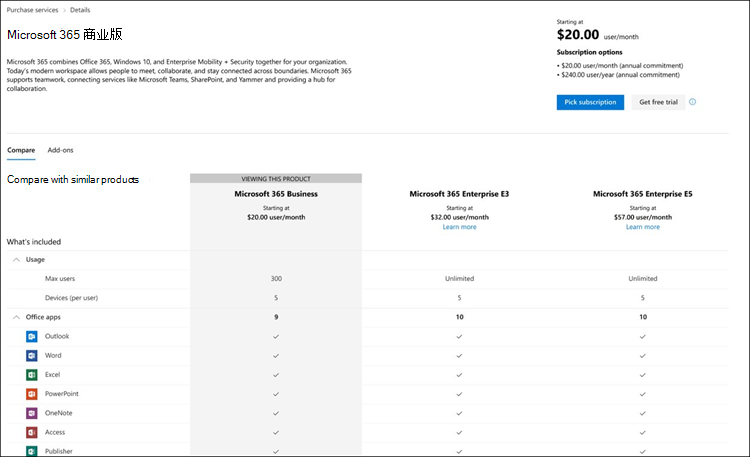
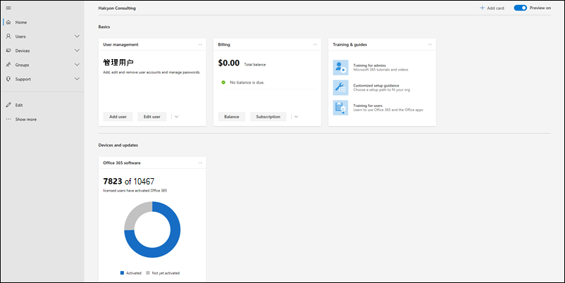
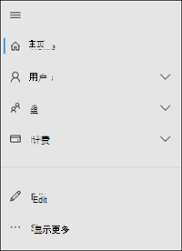
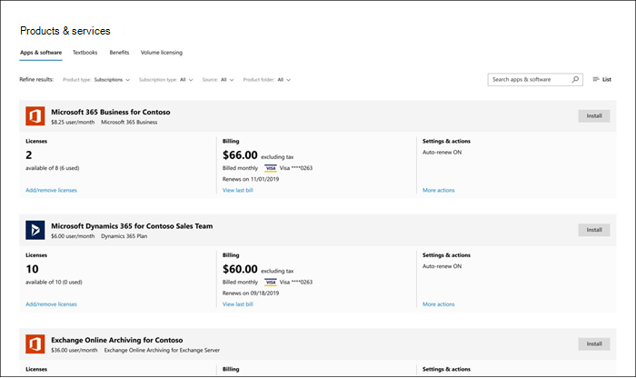
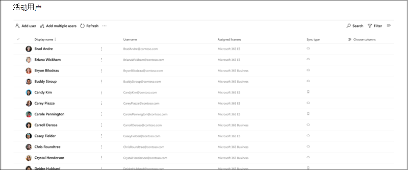
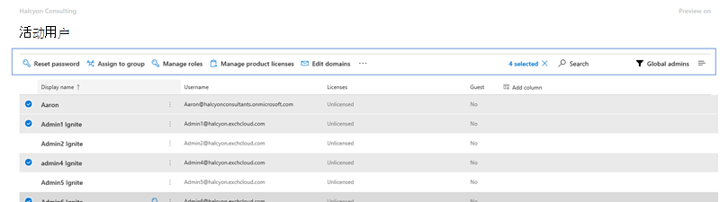
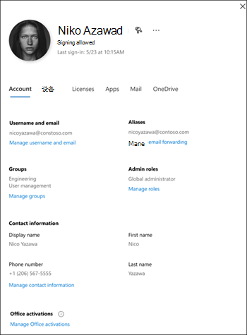

# Microsoft 365 管理中心的新增功能What's new in the Microsoft 365 admin center

我们不断将新功能添加到[Microsoft 365 管理中心](microsoft-365-admin-center-preview.md)，修复了我们了解的问题，并根据你的反馈进行了更改。We're continuously adding new features to [the Microsoft 365 admin center](microsoft-365-admin-center-preview.md), fixing issues we learn about, and making changes based on your feedback. 请查看下面的内容，查看今天可为你提供的内容。Take a look below to see what's available for you today. 有些功能以不同的速度向客户推出。Some features get rolled out at different speeds to our customers. 如果尚未看到功能，[请尝试将自己添加到目标版本](manage/release-options-in-office-365.md)。If you aren't seeing a feature yet, [try adding yourself to targeted release](manage/release-options-in-office-365.md).

如果你对其他管理中心的新增内容感兴趣：And if you're interested in what's new in other admin centers:

- [Microsoft 365 合规性中心的新增功能What's new in the Microsoft 365 compliance center](https://docs.microsoft.com/Office365/SecurityCompliance/whats-new)
- [SharePoint 管理中心的新增功能What's new in the SharePoint admin center](https://docs.microsoft.com/sharepoint/what-s-new-in-admin-center)

## 2020年1月-新年快乐！January 2020 - Happy New Year!

> [!NOTE]
> 您是否知道 YouTube 上的[Microsoft 365 视频系列中有哪些新增功能](https://go.microsoft.com/fwlink/p/?linkid=2118096)？Did you know that there's a [What's New in Microsoft 365](https://go.microsoft.com/fwlink/p/?linkid=2118096) video series on YouTube? 它突出显示了我们向用户推出的最新功能。It highlights the latest features that we've rolled out to users. 在每个月，我们将开始链接到 "[视频、培训和文档](#videos-training-and-docs)" 部分中的最新剧集。Every month, we'll start linking to the latest episode in the [Videos, training, and docs](#videos-training-and-docs) section.     以下是 January's： [1 月 2020-Microsoft 365 中的新增功能](https://go.microsoft.com/fwlink/p/?linkid=2118096)Here's January's episode: [January 2020 - What's New in Microsoft 365](https://go.microsoft.com/fwlink/p/?linkid=2118096)

### 深色模式Dark mode

当我们首次推出深色模式时，它仅在主页上可用。When we first rolled out dark mode, it was only available on the Home page. 深色模式现在处于预览阶段，位于管理中心内的大多数页面的目标版本中。Dark mode is now out of preview and is in Targeted release across most pages in the admin center.

1. 首先，需要打开目标版本：转到 "**设置** \> \*\*\*\* \> " "**组织配置文件** \> **发布首选项**"。First, you'll need to turn on Targeted Release: Go to **Settings** \> **Settings** \> **Organization profile** \> **Release preferences**. 
1. 然后，若要打开深色模式，请转到**主页**，然后选择 "**深色模式**" 按钮。And then to turn on dark mode, go to the **Home** page, and then select the **Dark mode** button. （它位于**搜索**字段旁边，这篇文章的 "**新增内容**" 链接。）(It's next to the **Search** field and this article's **What's new** link.)
1. 对于任何可用的深色模式的页面，该按钮位于页面顶部，位于**新管理中心**切换的旁边。For any page that has dark mode available, the button is at the top of the page, next to **The new admin center** toggle.

### Office 的新增功能管理Office What's New management

管理员希望控制 Microsoft 如何在 Office 应用程序中向其用户传达 "新增功能"，现在您可以使用该控件。Admins want control over how Microsoft communicates "What's New" to their users in the Office apps - and you now have that control. 转到 "**设置** \> " " **Office 新增功能管理预览**"。Go to **Settings** \> **Office What's New management Preview**. 选择要查看其详细信息的功能，如果您不希望您的用户看到特定的 "最近更新" 消息，则可以选择 "**从用户隐藏**" 按钮。Select a feature to view its details, and then you can select the **Hide from users** button if you don't want your users to see a particular "what's new" message. 例如，你的组织可能正在等待用户了解功能，直到你的组织中的所有人都接受培训。For example, your organization might be waiting to let users know about a feature until everyone in your org is trained on it.

此功能首次发布以在11月预览，但有几个功能更新需要了解： [Office 新增内容管理预览更新现已推出](https://techcommunity.microsoft.com/t5/microsoft-365-blog/office-what-s-new-management-preview/ba-p/1020438)This feature was first released to preview in November, but there have been a few feature updates that you should know about: [Office What's New management preview updates now available](https://techcommunity.microsoft.com/t5/microsoft-365-blog/office-what-s-new-management-preview/ba-p/1020438)

### 合作伙伴Partners
Howdy，合作伙伴！Howdy, Partners! （无法帮助我自己。）我们也为你提供了本月的更新。(Couldn't help myself.) We've got an update for you this month, as well. 我们提供了一项新功能，允许合作伙伴为 CSP 客户提供在管理中心的 "**付费帐户**" 部分接受其 Microsoft 客户协议（MCA）的选项。There's a new feature that allows Partners to give CSP customers the option to accept their Microsoft Customer Agreement (MCA) in the **Billing accounts** section of the admin center. 在这一新体验中：In this new experience:

1. 客户接收带有链接的邀请电子邮件，以接受合作伙伴关系和 MCA。The customer receives an invitation email with a link to accept the partner relationship and the MCA.
2. 客户登录后，他们可以查看和接受来自管理中心的 MCA 和合作伙伴权限。After the customer signs in, they can view and accept the MCA and partner permissions - right from the admin center.

### 资源邮箱Resource mailboxes

已将资源邮箱列表更新为新样式。The Resource mailboxes list has been updated to the new style. 在 Microsoft 365 管理中心，请转到**Resources** \> **会议室 & 设备**。In the Microsoft 365 admin center, go to **Resources** \> **Rooms & equipment**.

### 视频、培训和文档Videos, training, and docs

查看我们在1月发布的小型企业管理员培训：Check out the small business admin training that we released in January:

- [创建业务网站Create your business website](https://support.office.com/article/3325d50e-d131-403c-a278-7f3296fe33a9)
- [查找答案和帮助Find answers and help](https://support.office.com/article/7f681212-c649-4a3e-a43b-32b1d1e58988)
- [获取帮助或支持Get help or support](https://support.office.com/article/18948a4c-3eb1-4b30-b1bc-a4cc29eb7655)
- [删除用户Delete a user](https://support.office.com/article/6bcdad7b-732a-4260-997a-8c176bc3d9d6)
- [选择 Microsoft 订阅Choose a Microsoft subscription](https://support.office.com/article/b9f7c78e-430f-4117-89ec-2eeb1dced2ca)
- [Microsoft 365 商业安全概述Overview of Microsoft 365 Business security](https://support.office.com/article/3274b159-a825-46d7-9421-7d6e209389d1)

## 11月和12月2019November and December 2019

我们正在组合11月和12月的新闻，因为在 Ignite 后，我们要做的通知很少。We're combining November's and December's news because after Ignite we had very few announcements to make. 在新年中看到你！See you in the new year!

### 从信用卡更改为发票付款Change from credit card to invoice payment

我们开始推出将支付方式从信用卡更改为发票的功能。We've starting to roll out the ability to change your payment method from credit card to an invoice. 转到 "**付费**\> **产品 & 服务**"，选择订阅，然后选择信用卡付款旁边的 "**编辑**" 链接。Go to **Billing**\> **Products & services**, select a subscription, and then select the **Edit** link next to the credit card payment.

想要了解更多相关信息？Want to read more about it? [从信用卡或银行帐户更改为发票Change from credit card or bank account to invoice](../commerce/billing-and-payments/change-payment-method.md#change-from-credit-card-or-bank-account-to-invoice)

### 全局读取者Global reader

我们在[10 月 2019-Ignite Edition](#october-2019---ignite-edition)中提到了全局读者角色，但随着它更广泛地推出，我们将讨论一些详细信息：We mentioned the Global reader role in the [October 2019 - Ignite Edition](#october-2019---ignite-edition), but as it’s rolling out more broadly, let’s discuss some details:

- 全局读取器角色是全局管理员角色的只读对应角色。The Global reader role is the read-only counterpart to the Global admin role. 全局读者可以查看全局管理员有权执行的所有操作。The Global reader can see everything that the Global admin has permission to do.
- 除了一些例外情况（如某些合规性和安全功能），全局读者有权查看您的组织授权使用的所有 Microsoft 云管理中心。With a few exceptions, like some compliance and security features, Global readers have access to view all of the Microsoft cloud admin centers that your org is licensed to use.
- 将全局读者角色分配给需要 it 人员进行规划、审核和调查的用户。Assign the Global reader role to users who need it for planning, audits, and investigations.
- 您还可以将全局读者角色与具有较少权限的另一个角色结合使用。You can also combine the global reader role with another role that has fewer permissions. 例如，可能会为小型企业所有者分配**帐单管理** + **全局读者**角色，以便他们可以支付帐单并随时了解其云组织的更改。For example, a small business owner might be assigned the **Billing admin** + **Global reader** roles so that they can pay the bills and stay on top of changes to their cloud organization.
- 全局读者可以转到 Microsoft 365 管理中心中的任何页面。Global readers can go to any page in the Microsoft 365 admin center. 当用户打开可编辑页面时，顶部会出现一条警告，告知他们没有保存更改的权限，并且 "保存" 按钮将被禁用。When they open an editable page,  there will be a warning at the top telling them that they don't have permission to save changes, and the save button will be disabled.

我们乐意向你提供有关全局读者角色的反馈以及你希望将来查看的任何基于角色的权限。We’d love to get your feedback about the global reader role and any of the role-based permissions that you’d like to see in the future. [为基于角色的权限提供反馈Give feedback for role-based permissions](https://office365.uservoice.com/forums/273493-office-365-admin/suggestions/10115430-have-a-consistent-experience-when-assigning-admin)

### 新设置页New Settings page

**组织配置文件**、**安全性 & 隐私**和**服务 & 加载项**页面已全部组合到一个具有3个垂直选项卡的页面中。The **Organization profile**, **Security & privacy**, and **Services & add-ins** pages have all been combined into one page with 3 vertical tabs. 和最佳部件--从一个位置开始，您现在可以搜索所有设置。And the best part -- from one single location, you can now search for all settings.

### 培训 & 文档Training & Docs

此部分是本文的一项新功能，我们将开始链接到我们认为你会感兴趣的新培训和文档。This section is a new feature of this article, where we'll start linking to new training and documentation that we think you will find interesting.

在11月，我们发布了非常多[关于 Microsoft 学习](https://docs.microsoft.com/learn/)网站的学习途径，可帮助 IT 专业人员学习并获得 microsoft 365 的培训。In November, we released quite a few learning paths to [Microsoft Learn](https://docs.microsoft.com/learn/) website to help IT pros learn about and get trained on Microsoft 365. 将其签出：Check them out:

- [Microsoft 365 基础知识Microsoft 365 fundamentals](https://docs.microsoft.com/learn/paths/m365-fundamentals/)
- [扩展 Office 基础Extend Office fundamentals](https://docs.microsoft.com/learn/paths/extend-office-fundamentals/)
- [Microsoft 365-使用 Windows 10 和 Office 365 专业增强版现代化企业级部署Microsoft 365 - Modernize your enterprise deployment with Windows 10 and Office 365 ProPlus](https://docs.microsoft.com/learn/paths/m365-getmodern/)
- [使用 Microsoft 365 管理企业级部署Manage your enterprise deployment with Microsoft 365](https://docs.microsoft.com/learn/paths/manage-enterprise-deployment-m365/)
- [按比例升级 Microsoft OfficeUpgrade Microsoft Office for IT at scale](https://docs.microsoft.com/learn/paths/m365-office-for-it/)
- [通过 Windows 虚拟桌面提供 Azure 中的远程桌面和应用Deliver remote desktops and apps from Azure with Windows Virtual Desktop ](https://docs.microsoft.com/learn/paths/m365-wvd/)
- [使用 Microsoft 365 和 Surface for Business 使你的工作场所现代化Modernize your workplace with Microsoft 365 and Surface for Business](https://docs.microsoft.com/learn/paths/modernize-workplace-with-m365-and-surface/)
- [使用 Microsoft 365 保护身份和访问Protect identity and access with Microsoft 365](https://docs.microsoft.com/learn/paths/m365-identity/)
- [使用 Microsoft 365 保护企业信息Protect enterprise information with Microsoft 365](https://docs.microsoft.com/learn/paths/m365-information-protection/)
- [使用 Microsoft 365 管理安全性Manage security with Microsoft 365](https://docs.microsoft.com/learn/paths/m365-security-management/)
- [抵御 Microsoft 365 和 Microsoft 威胁防护的威胁Defend against threats with Microsoft 365 and Microsoft threat protection](https://docs.microsoft.com/learn/paths/m365-security-threat-protection/)
- [使用 Microsoft 团队管理团队协作Manage team collaboration with Microsoft Teams](https://docs.microsoft.com/learn/paths/m365-manage-team-collaboration/)
- [在 Microsoft 365 中与 SharePoint 协作Collaborate with SharePoint in Microsoft 365](https://docs.microsoft.com/learn/paths/m365-teams-sharepoint/)

## 10月 2019-Ignite EditionOctober 2019 - Ignite Edition

欢迎使用 Microsoft 365 管理中心中新增功能的 Ignite 版本！Welcome to the Ignite Edition of the What's new in the Microsoft 365 admin center! 当然，这不是通知的完整列表，但这里有几个突出介绍。Of course, this isn't a complete list of announcements, but here are a few highlights. 此外，请查看 Ignite 博客，获取有关发布的更好的信息：Also, check out the Ignite blogs for more great info about releases:

- [Microsoft 365 的管理员安全性、生产力和网络增强功能](https://techcommunity.microsoft.com/t5/Microsoft-365-Blog/ADMIN-Security-Productivity-and-Network-Enhancements-for/ba-p/964019)。[ADMIN - Security, Productivity, and Network Enhancements for Microsoft 365](https://techcommunity.microsoft.com/t5/Microsoft-365-Blog/ADMIN-Security-Productivity-and-Network-Enhancements-for/ba-p/964019).
- [Microsoft 团队中的新增功能-Ignite 2020](https://techcommunity.microsoft.com/t5/Microsoft-Teams-Blog/What-s-New-in-Microsoft-Teams-Ignite-2019/ba-p/937025)。[What's New in Microsoft Teams - Ignite 2020](https://techcommunity.microsoft.com/t5/Microsoft-Teams-Blog/What-s-New-in-Microsoft-Teams-Ignite-2019/ba-p/937025).

### 基于角色的访问控制Role-based access control 

由于我们在6月开始推出，对管理中心中的角色进行了大量更改：There have been a lot of changes for Roles in the admin center since we started rolling out in June:

- **比较角色**-最多选择3个角色以比较每个角色的权限。**Compare roles** - Select up to 3 roles to compare the permissions for each one. 这将帮助您找到要分配给用户的最小的许可角色。This will help you find the least permissive role to assign to users. 转到 "**角色**"，使用第一列中的 "多重选择" 复选框选择最多3个角色，然后选择 "**比较角色**"。Go to **Roles**, use the multi-select checkbox in the first column to choose up to 3 roles, and then select **Compare roles**.

    

- **收藏夹**-您可以将星形添加到您喜欢的角色或大多数使用的角色，以便通过对列进行排序或创建筛选器来轻松地找到它们。**Favorites** - You can add a star to your favorite or most-used roles, so that you can easily find them by sorting the column or creating a filter.
- **活动用户** > **管理角色**-已对此进行了更新以适应角色中的更改。**Active users** > **Manage roles** - This has been updated to align with the changes in Roles. 与 "角色" 列表一样，我们已将角色的默认列表范围限定为最有用，但您可以通过展开 "**按类别显示所有**角色" 来查看所有角色。As with the Roles list, we've scoped the default list of roles to the most useful, but you can see all roles by expanding **Show all by category**.
- **全局读者角色**-你需要了解！**Global reader role** - You asked for it! 没问题！You got it! [全局读者](add-users/about-admin-roles.md#roles-available-in-the-microsoft-365-admin-center)角色！The [Global reader](add-users/about-admin-roles.md#roles-available-in-the-microsoft-365-admin-center) role!

### 报告问题Report an issue

服务运行状况已更新为新样式，如果您受到您的服务运行状况仪表板上未显示的问题的影响，您可以**报告问题**以让 Microsoft 知道。Service health has been updated to the new style and if you are impacted by an issue that is not showing up on your Service health dashboard, you can **Report an issue** to let Microsoft know. 转到**运行状况** > **服务运行状况**。Go to **Health** > **Service health**.

### "病毒" 订阅"Viral" subscriptions

如你所知，用户可以打开对大量产品（如 Power BI 和应用程序连接）的免费订阅。As you know, users can turn on free subscriptions to a myriad of products like Power BI and App Connect. 现在，你可以看到你的用户尝试的 "病毒订阅"。You can now see the "viral subscriptions" that your users have been trying. 转到 "**付费** > **产品 & 服务**"。Go to **Billing** > **Products & services**. 选择 "订阅" 选项卡上的 "**帐户类型**" 筛选器，以查看用户购买的订阅。Select the **Account type** filter on the subscriptions tab to see the user-purchased subscriptions. 如果需要，你现在可以从你的帐户中删除这些订阅。If needed, you now have the ability to remove these subscriptions from your account.

### 用户模板User templates

模板使您可以通过保存和重用这些用户的共享设置来轻松地添加多个用户。Templates allow you to easily add many users by saving and reusing the shared settings for these users. 您可以保存角色的值、已分配的许可证、联系人信息、位置等。You can save values for roles, licenses assigned, contact information, location, and more. 使用模板创建新用户时，将自动获取这些设置的保存值。When you use the template to create a new user, they will automatically get the saved value for these settings. 转到 "**用户** > **活动用户**"，然后选择 "**用户模板**" 以试用。Go to **Users** > **Active users**, and then select **User templates** to try it out.

### Office "什么是新增功能" 管理（预览）Office "What's New" management (Preview)
将重要的 Office 功能发布到 Office 应用程序时，用户将获得 "新增功能" 卡片以了解新功能。When an important ‎Office‎ feature is released to an Office app, users will get a "What's new" card to learn about the new feature. 如果不希望用户看到该卡片，可以将其隐藏。If you don't want users to see the card, you can hide it. 您还可以选择希望用户通过显示来查看卡片的时间。You can also choose when you'd like users to see the card by showing it. 转到 "**设置** > " "**Office 新增功能管理**" 以将其签出。Go to **Settings** > **Office What's New management** to check it out.

### SharePoint URL 更改SharePoint URL change
从技术上讲，这不是 Microsoft 365 管理中心的新闻，但我们非常兴奋我们想确保你看到以下新闻：Technically, this isn't the Microsoft 365 admin center's news to tell, but we're so excited we wanted to make sure you see this news:
> [!IMPORTANT]
> 现在，你可以使用常规 URL 访问 SharePoint 管理中心：https://admin.microsoft.com/SharePointYou can now get to the SharePoint admin center with a regular URL: https://admin.microsoft.com/SharePoint

有关详细信息，请参阅[SharePoint 管理中心中的新增功能](https://docs.microsoft.com/sharepoint/what-s-new-in-admin-center)For more info, see [What's new in the SharePoint admin center](https://docs.microsoft.com/sharepoint/what-s-new-in-admin-center)

## 2019 年 9 月September 2019

我们将在 Ignite 2019 推出一些激动人心的功能版本，因此我们只宣布在九月发布了几个新功能。We are ramping up for some exciting feature releases at Ignite 2019, so we're only announcing a few new features that were released in September. 但请密切关注下个月的文章，它将在 Ignite 的第一天发布！But stay tuned for next month's article, it'll be published on the first day of Ignite!

### 特色反馈修复–将已删除用户的邮箱转换为共享邮箱的选项将会恢复！Featured Feedback Fix – The option to convert the deleted user’s mailbox to a shared mailbox is back!

我们听到你的反馈很大并清楚，我们重新提供了让其他人通过将已删除用户的邮箱转换为**共享邮箱**来访问该邮箱的功能。We heard your feedback loud and clear and we brought back the ability to give someone else access to a deleted user’s mailbox by converting it to a **shared mailbox**. 将此项添加回 "删除用户" 向导，可以决定要对数据执行的操作：Adding this back to the delete user wizard lets you decide what to do with the data:

- 电子邮件：通过将其转换为共享邮箱，让其他人能够访问已删除用户的邮箱。Email: Give someone else access to the deleted user's mailbox by converting it to a shared mailbox.
- 文件：保存其 OneDrive 文件并为他人提供访问权限。Files: Save their OneDrive files and give someone else access.
- 权限：如果其他人有权访问此邮箱，则删除权限。Permissions: Remove permissions if others had access to this mailbox.
- 别名：删除电子邮件别名，使其可立即用于其他用户。Aliases: Remove email aliases so they are available to use for another user right away.

### 初始设置Initial setup

我们的初始安装向导有一个更新： Microsoft 365 for business。There's been an update to another of our initial setup wizards: Microsoft 365 for business. 这些步骤已经过简化，我们已将两个设置任务移动到设置页面：The steps have been streamlined and we've moved two of the set up tasks into the Setup page:

- **安全 windows 10 计算机**-设置策略以更好地保护 Windows 10 设备免受受黑客攻击的病毒、恶意软件和攻击。**Secure Windows 10 computers** - set up policies to better protect your Windows 10 devices from viruses, malware, and attacks by hackers.
- **自动安装 Office** -当你启用此设置且用户已将其电脑连接到 Microsoft 365 商业版时，其计算机会自动更新到最新的 Office 应用程序，并保持最新。**Automatically install Office** - When you turn this on and users have connected their PCs to Microsoft 365 Business, their computers will automatically update to the latest Office apps - and stay up to date.

## 2019 年 8 月August 2019

### 计费Billing

本月我们提供了有关帐单和订阅的一些更新：We've got some updates for billing and subscriptions this month:

- 基于设备的订阅：可以向 Microsoft 365 管理中心内的设备分配或取消分配**Office 365 专业增强版 For 教育（设备）** 许可证。Device-based subscriptions: You can assign or unassign **Office 365 ProPlus for Education (device)** licenses to devices in the Microsoft 365 admin center. **Office 365 专业增强版教育版（设备）** 是一个附加许可证，允许您向设备分配许可证。**Office 365 ProPlus for Education (device)** is an add-on license that will lets you to assign a license to a device. 转到 "**付费** > **产品 & 服务**" 以查找和购买许可证。Go to **Billing** > **Products & services** to find and purchase the license.
- 基于用户的许可证管理：我们已更新了如何将**用户** > **活动用户**中的许可证分配给新样式。User-based license management: We've updated how you assign licenses in **Users** > **Active users** to the new style. 有关详细信息，请参阅：For more information, see:
    - [向用户分配许可证Assign licenses to users](manage/assign-licenses-to-users.md)
    - [取消分配用户许可证Unassign licenses from users](manage/remove-licenses-from-users.md)

### 设置页面更新Setup page updates

安装程序现在有类别和分区，包括**建议用于您**在打开功能和设置组织时，我们会在其中智能地建议下一步。Setup now has categories and sections, including a **Recommended for you** section where we intelligently suggest your next step in turning on features and setting up your organization. 我们还添加了一个新的功能来设置：We've also added a new feature to set up:

- **Office 高级威胁防护**-如果你的组织授权使用 Office ATP，但尚未对其进行配置或将其打开，你将看到此页面。**Office Advanced Threat Protection** - If your org is licensed to use Office ATP and you haven't configured it or turned it on yet, you'll see this page. 请转到 "**设置**" 以试用。Go to **Setup** to try it out.

### 报告问题Report an issue

如果您受到您的服务运行状况仪表板上未展示的问题的影响，则**报告问题**功能将为您提供一种快速而简单的方式，让我们知道。If you are impacted by an issue that is not showing up on your Service health dashboard, the **Report an issue** feature will provide you with a quick and easy way to let us know. 转到**运行状况** > **服务运行状况**。Go to **Health** > **Service health**.

## 2019 年 7 月July 2019

### 消息中心Message center

邮件中心已更新为新的设计，看起来非常惊人！The Message center has been updated to the new design and it looks amazing! 

- 您现在可以**按状态查看邮件**。You can now view **Messages by status**. 只需选择其中一个选项卡：**所有活动邮件**、**重要性较高**、**未读邮件**和**消除的邮件**。Just select one of the tabs: **All active messages**, **High importance**, **Unread messages**, and **Dismissed messages**.
- 您还可以按类别**数据隐私**进行筛选 **、规划更改**、**防止或解决问题**并**及时**了解消息类别。You can also filter by category **Data privacy**, **Plan for change**, **Prevent or fix issues**, and **Stay informed** message categories.
- 从列表中选择一封邮件，并在命令栏中有几个选项： "**取消**"、"**标记为已读**" 或 "**标记为未读**" 或 "**共享**"。Select a message from the list and you have a few options in the command bar: **Dismiss**, **Mark as read** or **Mark as unread**, or **Share**. 
- 打开邮件时，您可以获得更多选项：And when you open a message, you have even more options:
    - 将邮件的链接复制到您的剪贴板，以供以后保存或与同事共享。Copy a link of the message to your clipboard to save it for later or to share it with colleagues. 
    -  将邮件标记为已**读**或**未读**。Mark messages as **Read** or **Unread**. 
    -  通过选择 "**喜欢**" 或 "不**喜欢**" 来提供有关邮件的反馈，则会打开一个反馈窗格，要求您对该邮件的赞或不喜欢的内容提供特定反馈。Give feedback about a message by selecting **Like** or **Dislike**, a feedback pane opens asking you to provide specific feedback on what you liked or didn't like about this message.

### 导航窗格智能Navigation pane intelligence

 导航窗格现在会记住你的最后一项操作，并向你显示你上次离开它的状态中的窗格。The navigation pane now remembers your last actions and shows you the pane in the last state that you left it in. 它还会使常用项目在默认情况下可见。It will also make frequently used items visible by default.

### 初始设置 & 安装程序页面Initial setup & the Setup page
我们已获得一些令人兴奋的更改，可帮助你设置你的组织。We've got some exciting changes to help you get your organization set up. 首先，让我们讨论一下**安装程序**与**设置页面**之间的区别。First off, let's discuss the difference between **setup** and the **Setup page**. **安装程序**是指用于集成 Microsoft online 服务的初始安装向导。**Setup** refers to the initial setup wizard that you used to onboard to Microsoft's online services. 这通常包括三个具体步骤：**连接域**、**添加用户**和**下载 Office 应用**。That usually includes three specific steps: **Connect a domain**, **Add users**, and **Download the Office apps**. "**安装程序" 页面**是 "管理中心" 中的页面，建议设置任务以确保您最大限度地利用了你购买了许可证的功能。The **Setup page** is the page in the admin center that has recommended set up tasks to ensure that you're getting the most out of your subscriptions - like turning on features you've purchased licenses for.

- **安装**程序-已更新**Office 365 for Business**订阅的初始安装向导。**Setup** - The initial setup wizard has been updated for **Office 365 for Business** subscriptions. 这一新设计将帮助新的组织更快地完成向导，并获得更大的成功。This new design will help new organizations get through the wizard faster and with greater success.
- "**设置" 页**-"**设置**" 页可帮助您完成设置并保护订阅附带的服务。**Setup page** - The **Setup** page helps you finish setting up and securing the services that come with your subscriptions. 您还可以在 "**设置**" 页上查看任何已消除的建议。You can also see any dismissed recommendations on the **Setup** page. 若要查看它是否适用于你的订阅，请转到**Microsoft 365 管理中心** > **设置**。To see if it's available for your subscriptions yet, go to the **Microsoft 365 admin center** > **Setup**.

### 帐单 & 订阅Billing & subscriptions

- **软件**产品类型-你现在可以查看通过云服务提供商（CSP）购买的软件产品。**Software** product type - You can now view software products purchased through a Cloud Service Provider (CSP). 若要查看你的下载和密钥，请转到**计费** > **产品 & 服务** > **软件**"选项卡。To see your downloads and keys, go to **Billing** > **Products & services** > **Software** tab.
- 你可以从 Microsoft 365 管理中心查看新式 Azure 产品和服务，无论你是从 Microsoft 还是第三方提供商处购买的。You can view Modern Azure products and services from the Microsoft 365 admin center, whether you purchased them from Microsoft or a third-party provider. 包括新式 Azure 产品的示例：Examples of Modern Azure products included:
    - Azure 保留虚拟实例Azure Reserved Virtual Instances
    - Azure 支持计划Azure Support Plans
    - Azure 混合使用权益（AHUB）Azure Hybrid Use Benefits (AHUB)
    - 管理应用程序Manage Applications
    - 设备服务Device Services
    - Azure 订阅Azure Subscriptions

### 简化多因素身份验证Simplify multi-factor authentication

管理员有权访问组织中的敏感信息。Admins have access to sensitive information in your organization. 在登录时要求所有管理员使用多重身份验证。Require all admins to use multi-factor authentication when signing in. "新建" 向导可帮助您只需一步即可完成此操作。The new wizard helps you get it done with just one step. 若要试用，请转到 "**设置** > "**加强登录安全性**。To try it out, go to **Setup** > **Strengthen sign-in security**.

### 用户Users

"**已删除用户**" 和 "**来宾用户**" 页面更新为新样式。The **Deleted users** and **Guest users** pages were updated to the new style.

- **来宾用户**：通过邀请用户在 SharePoint 或 OneDrive 中查看或共享文件来添加来宾用户。**Guest users**: You add guest users by inviting them to view or share files from SharePoint or OneDrive. 您可以从**用户** > 的**来宾用户**查看来宾用户。You can view guest users from **Users** > **Guest users**.
- **已删除用户**：在 "更新的**已删除用户**" 页面上，您可以执行在旧管理中心中可以执行的所有操作，但现在可以添加和删除列。**Deleted users**: On the updated **Deleted users** page, you can do all the actions that you could in the older admin center, but now you add and remove columns. ，我们有许多列选项可供选择。And we have a lot of column options to choose from. 实际上，它与在 "**活动用户**" 页面上选择的列相同。In fact, it's the same columns that you can choose on the **Active users** page.

## 2019 年 6 月June 2019

### 特色反馈请求-深色模式Featured feedback request - Dark mode

在深色模式下查看管理中心是预览！Viewing the admin center in dark mode is in preview! 您可以立即在**主页**上测试此页面。You can test it out on the **Home** page only right now. 在**主页**上，"**深色模式**" 按钮位于 "新增**内容**" 链接旁边的命令栏中。On the **Home** page, the **Dark mode** button is in the command bar next to the **What's new** link.

### 角色管理Roles management

6月结束时，我们开始推出新的方法来管理管理员角色。At the end of June we started rolling out new way to manage admin roles. 为你提供此功能时，请转到**角色** > **角色**。When it's available for you, go to **Roles** > **Roles**. 在此之前，请先看看它是非常棒！Until then, take a look - it's awesome!
    

通过这一新体验，可以更轻松地查看谁拥有管理员权限，并分配为您的管理员授予适当级别的访问权限的角色。This new experience makes it easier to see who has admin permissions and to assign roles that grant the right level of access to your admins. 此外，我们还从 Azure AD 添加了更多角色，这样您就不会浪费时间转到多个管理中心。And we also added more roles from Azure AD so that you don't waste time going to multiple admin centers.
你还可以在此处执行哪些操作？What else can you do here?
- 导出在 Microsoft 365 中分配了 Azure Active Directory 角色的组织中所有管理员的列表。Export a list of all admins in your org who are assigned Azure Active Directory roles in Microsoft 365.  
- 查看分配给特定角色的所有管理员、在特定角色中添加或删除管理员、按名称和关键字搜索角色，以及了解每个角色允许用户执行的操作的详细信息。View all admins assigned to a specific role, add or remove admins from a specific role, search for roles by name and keyword, and learn more about what each role allows a user to do. 
- 快速搜索特定角色并创建筛选器。Quickly search for a specific role and create filters.

### 支付方式Payment method
我们已更新你的订阅付费方式。We've updated how you pay for your subscriptions. 转到**帐单** > 付款 **& 付款** > **方法**。Go to **Billing** > **Bills & payments** > **Payment methods**. 您可以在列表视图中查看您的付款方式。You can see your payment methods in a list view. 选择列表中的任何项目以将其删除，对其进行编辑，并轻松查看与付款方式相关联的订阅。Select any item in the list to remove it, edit it, and easily see which subscription that payment method is associated with.

## 2019 年 5 月May 2019

### 可能的功能修复-区分大小写May's featured fix - Case sensitivity
现在，当您搜索共享邮箱、联系人、资源和邮箱权限时，您的搜索词不一定区分大小写。Now when you search for shared mailboxes, contacts, resources, and mailbox permissions, your search terms don't have to be case-sensitive. 

**用户和组管理**本月，我们更新了 "**阻止用户**"、"**重置密码**"、"**联系人**列表" 视图、"**组**列表" 视图和 "**组**详细信息" 页到新的管理中心样式。**User and group management** This month, we updated **Block user**, **Reset password**, **Contacts** list view, **Groups** list view, and the **Groups** details pages to the new admin center style.
- 使用 "新建**组**" 列表视图，可以获取有关组的更丰富的数据，并且可以自定义查看数据的方式，并且 "组" 列表记住了您希望查看数据的方式。With the new **Groups** list view, you get richer data about your groups, and you can customize the way you see your data -- and the groups list remembers how you want to see your data. 例如，现在可以将**组与团队**进行筛选，以查看您的组是否是团队的一部分，并且可以添加 "**团队状态**" 列。For example, you can now filter on **Groups with Teams** to see if your groups are part of a Team and you can add the **Teams status** column.
- "组" 列表还提供了我们对用户管理中的列表体验所做的所有改进，包括快速操作和上下文命令栏。The groups list also brings with it all the improvements we made to the list experience in user management, including quick actions and the contextual command bar. 

**推荐****Recommendations** 
你可能会在你的管理中心看到一个新的建议弹出窗口，我们刚刚添加了4个新的。You might see a new recommendation pop-up in your admin center - we just added 4 new ones. 当然，如果我们认为它将对你的组织有益，你将只会看到建议。Of course, you'll only see recommendations if we think it will benefit your organization. 但请不要等到我们向你提出建议-你可以从卡片库添加它。But don't wait until we show you the recommendation - you can add it from the card library.
- **密码到期**-建议将密码设置为**永不过期**。**Password expiry** - We recommend that passwords get set to **Never expire**. 如果你的组织有不同的设置，你可能只会看到此建议。And if your org has a different setting, you might just see this recommendation. 
- **全局管理员过多**-由于全局管理员过多而导致安全威胁，如果全局管理员超过4个，将会看到此建议。**Too many global admins** - Because having too many global admins is a security threat, if you have more than 4 global admins, you'll see this recommendation. 建议仅为用户提供完成工作所需的访问权限。We suggest giving users only the access they need to get their job done.
- **Intune 设备保护**-如果你的许可证包括 intune，并且我们检测到你尚未完成设置 intune 或注册设备，我们建议你创建 Intune 策略，以便在用户从其移动设备访问组织的文件时对其进行保护。**Intune device protection** - If your licenses include Intune and we detect that you either haven't finished setting up Intune or enrolled your devices, we'll recommend that you create an Intune policy to protect your organization's files when users access them from their mobile devices.
- **获取每月 office 功能更新**-我们从非常小的客户那里获得了反馈，当他们获得每月 office 功能更新时，他们的用户会感到更开心。**Get monthly Office feature updates** - We've gotten feedback from our very small customers that when they get monthly Office feature updates, their users are  happier. 因此，如果你是一位非常小的企业，并且你目前每六个月都可以获得 Office 功能更新，你将看到此建议。So, if you're a very small business and you're currently get your Office feature updates every six months, you'll see this recommendation.

**设置****Settings**  
对于设置，已进行了很多更改。As for settings, there have been quite a few changes. 大多数情况下，只需将现有设置更新为新的管理中心样式即可。Mostly, just updating the existing settings to the new admin center style. 当我们继续发展并添加以前从未见过的新设置时，我们将在此处开始提及它们。As we're moving forward and add new settings that you've never seen before, we'll start mentioning them here. 同时，我们还准备了一个完整的设置来宣布：**新式验证**。And we've got one-whole setting to announce: **Modern authentication**. 是的，有新的设置可启用**新式验证**！Yes, there is a new setting to turn on **Modern authentication**! 若要将其签出，请转到**Settings** > **Services & 外接程序** > **新式身份验证**。To check it out, go to **Settings** > **Services & add-ins** > **Modern authentication**.

## 2019 年 4 月April 2019

对于管理中心来说，事情看起来非常出色。Things are looking great for the admin center. 我们已阅读你的反馈和建议，回答其中的大部分问题，并真正让你必须向心形说。We've been reading your feedback and suggestions, answering most of them, and really taking all you have to say to heart. 当然，我们仍在执行工作，以确保与旧管理中心的所有内容都能进行奇偶校验。Of course, we're still doing the work to make sure everything is up to parity with the old admin center. 请记住，在我们推出新功能时，你可能无法立即获得。And please remember - as we roll out new features, you might not get it right away.

### 特色功能-添加用户Featured feature - Add users

对于四月份，我们提供了可指导您完成的 "**添加用户**向导"。等待它 .。。添加用户。For April, we're featuring the **Add user** wizard that walks you through...wait for it...adding users. 本分步介绍了如何添加用户的基本信息，如电子邮件和显示名称、分配许可证和角色、添加联系人信息，然后在提交之前查看用户帐户。It's a step-by-step to add the user's basic info like email and display name, assigning a license and a role, adding their contact information, and then reviewing the user's account before you commit. **为什么要进行此更改？****Why did we make this change?** 我们听说你不喜欢几乎无限滚动以在以前的体验中添加用户的反馈。We heard your feedback that you didn't like the nearly infinite scroll to add users in the previous experience.
    

有两种方法可以将其签出：There are two ways you can check it out:  

1. 从**主页**中，选择 "从**用户管理**卡**添加用户**"。From the **Home** page, select **Add user** from the **User management** card. 向导将在此处打开，因此您无需从在**主页**上执行的任何工作中进行导航。The wizard opens right there, so you don't have to navigate from any work you're doing on the **Home** page.
2. 转到 "**用户** > **活动用户**"，然后从命令栏中选择 "**添加用户**"。Go to **Users** > **Active users**, and then select **Add user** from the command bar.
  
我们已经对**用户管理**进行了一些更改，下面是一个快速列表：We've made a few more changes to **user management**, here's a quick list:
- "**管理角色**" 窗格已更新为新样式且可访问。The **Manage roles** pane has been updated to the new style and is accessible. 我们还更新了**阻止用户**并删除了新样式的**用户**窗格。We've also updated the **Block user** and **Delete user** panes to the new style.
- 管理命令栏中的 "**产品许可证**更改位置"。**Manage product licenses** changed position in the command bar.
- 现在，更改用户照片变得更加简单。Changing a user's photo is now easier. 在 "**活动用户**" 中，选择一个用户，然后更改其图片下的**照片**。In **Active users** select a user, and then **Change photo** under their picture.

### 但请等待！But wait! 还有更多 .。。There's more...
- **主页**上有一个新的安装标题，如果尚未完成设置步骤（如添加域、添加用户和下载 Office 应用），您将看到此标题。There's a new setup banner on the **Home** page that you'll see if you haven't finished the set up steps, like adding a domain, adding users, and downloading the Office apps.
- **组**列表和详细信息窗格已更新为新样式。The **Group** list and details pane have been updated to the new style. 转到 "**组** > "**组以查看**更改。Go to **Groups** > **Groups** to view the changes. 
    - 说到组，我们还向组详细信息窗格添加了**Microsoft 团队**选项卡，您可以在其中将任何 Office 365 组转到团队中。Speaking of groups, we've also added a **Microsoft Teams** tab to the groups details pane where you can turn any Office 365 group into a Team. 若要从列表中选择 "teamify" 组，请从列表中选择 "Office 365" 组，选择 " **Microsoft 团队**" 选项卡，然后**创建 "团队**"。To "teamify" a group select any Office 365 group from the list, select the **Microsoft Teams** tab, and then **Create Team**. 如果该组已经是团队，您将获得从**团队管理中心**管理它的链接。If the group is already a Team, you'll get a link to manage it from the **Teams admin center**.
    - 最后，您可以将**团队状态**添加到 "**组**" 列表中。Finally, you can add the **Teams status** to the **groups** list. 在列标题上，选择 "**选择列** > **团队状态** > **保存**"。On the column header, select **Choose columns** > **Teams status** > **Save**.
- **新的有限管理员角色**-我们已发布了一些新的管理员角色，以便用户只能为用户提供所需的访问权限。**New limited admin roles** - We've release some new admin roles so that you can give users only the access they need.
    -  **Kaizala admin**：此角色中的用户具有在 Microsoft Kaizala 中执行所有管理任务的权限，包括在 Kaizala 目录中创建和管理用户、管理 Kaizala 组、管理操作卡和连接器以及创建服务请求。**Kaizala admin**: Users in this role have permission to perform all management tasks within Microsoft Kaizala, including create and manage users in Kaizala directory, manage Kaizala groups, manage action cards and connectors, and create service requests.
    - **搜索管理员**：此角色中的用户拥有对 microsoft 365 管理中心中所有 microsoft 搜索管理功能的完全访问权限。**Search admin**: Users in this role have full access to all Microsoft Search management features in the Microsoft 365 admin center. 搜索管理员可以将搜索管理和搜索编辑器角色委派给用户，并创建和管理内容，如书签、Q&项目和位置。Search admins can delegate the Search admin and Search editor roles to users, and create and manage content, like bookmarks, Q&A items, and locations. 此外，这些用户可以查看消息中心、监视服务运行状况和创建服务请求。Additionally, these users can view the Message center, monitor service health, and create service requests.
    - **搜索编辑器**：此角色中的用户可以在 microsoft 365 管理中心中创建、管理和删除 microsoft Search 的内容，包括书签、Q&项目和位置。**Search editor**: Users in this role can create, manage, and delete content for Microsoft Search in the Microsoft 365 admin center, including bookmarks, Q&A items, and locations.
- 本月有一 bonanza**帐单**更改 .。。There's a bonanza of **Billing** changes this month...
    - 您现在可以更新现有信用卡的 CVV，而无需将其删除并再次添加它。You can now update the CVV for existing credit cards without having to delete it and add it again. 您可以通过转到**帐单** > **支付方法**更新 CVV。You can update the CVV by going to **Bills** > **Payment methods**.
    - 我们使你的**发票**更易于查找，并了解你的帐户可能遇到的任何帐单问题。We've made it easier to locate your **Invoices** and understand any billing issues your account may be having. 现在，您可以在 web 浏览器中查看您的帐单，而无需下载 PDF。And now you can see your Bills in the web browser instead of having to download the PDF. 转到 "**汇票** > **发票**"。Go to **Bills** > **Invoices**.
    - 在 "**产品 & 服务**" 页上，如果您有多个相同类型的订阅，我们现在聚合您的订阅信息。On the **Products & services** page, we now aggregate your subscription information if you've got multiple subscriptions of the same type.

## 2019年3月-我们正式发布了管理中心！March 2019 - We've officially released the admin center!

嗯，如果你错过了令人兴奋的新闻，我们正式发布了新的和改进的 Microsoft 365 管理中心！Well, if you missed the exciting news, we've officially release the new and improved Microsoft 365 admin center! 下面是我们宣布发布的博客文章：现已[推出新的 Microsoft 365 管理中心](https://techcommunity.microsoft.com/t5/Microsoft-365-Blog/The-new-Microsoft-365-admin-center-available-today/ba-p/377870)。Here's the blog post where we announced it: [The new Microsoft 365 admin center available today](https://techcommunity.microsoft.com/t5/Microsoft-365-Blog/The-new-Microsoft-365-admin-center-available-today/ba-p/377870). 在三月份，我们将依靠博客文章查看已发布的功能-此外，您还可以阅读在不久的将来发布的功能的帖子，我们不允许在核心内容中执行此操作。For March, we'll rely on the blog post for you to check out the features released - plus, you can also read the post for the features that are getting released in the near future, which we're not allowed to do in core content.
    
我们对**帐单 & 订阅**区域有一处更改，我们想提。We do have one change to the **Billing & subscriptions** area that we'd like to mention. 我的意思是，y'all 不能认为我们在改进它之后做了吗？I mean, y'all didn't think we were done with improving it, did you? 因为我们不是这样！Because we're not! 事实上，我们添加了管理与**计费** > **帐户**之间的合作伙伴关系的能力。In fact, this month we added added the ability to manage your partner relationships to **Billing** > **Billing accounts**. 您可以从这里查看您在各顾问、CSP 和间接分销商之间的合作伙伴关系。From here you can review your partner relationships across Advisor, CSP, and Indirect resellers. 您还可以接受新的合作伙伴关系请求，包括委派的管理员权限。You can also accept new partner relationship requests, including delegated admin permissions.

正如往常一样，你的反馈对我们非常重要，因此将其保持起来！As always, your feedback is important to us, so keep it coming! 在管理中心的任何页面上，**通过选择 "** **需要帮助"** 旁边的右下方提供反馈，可以提供反馈。On any page in the admin center, you can give feedback by selecting **Give feedback** in the bottom-right, next to **Need help?**

## 二月 2019-帐单 & 订阅版February 2019 - Billing & Subscriptions Edition

本月，我们将重点介绍我们对 affectionately 称为 "付费和订阅" 的领域所做的所有改进。This month, we're going to focus on all the improvements we've made to the areas affectionately referred to as "Billing and subscriptions". 过去，您可能没有参考这些内容 affectionately，但我们认为你现在将 .。。In the past, you probably didn't refer to those things affectionately, but we think you will now...

- **付款方式**-我们听到你的反馈，即更新你的付款方式很困难，我们已在其周围进行了大量更改。**Payment methods** - We heard your feedback that updating your payment method was difficult and we've made a lot of changes around it. 转到 "**付费** > **支付方式**"。Go to **Billing** > **Payment methods**. 您可以轻松地查看您的付款方式，如您的签证卡片以及与之关联的订阅。You can easily see your payment methods, like your Visa card, and which subscription it is associated with. 在付款方法列表中，选择 "**更多**" 菜单（到期日期旁边有3个点），然后选择 "**查看订阅**"。In your list of payment methods, select the **More** menu (3 little dots next to the expiration date), and then select **View subscriptions**. 您还可以使用 "**更多**" 菜单编辑和删除付款方式。You can also edit and delete your payment methods using the **More** menu.
- **付费帐户**定向发布客户将首先看到新的帐单帐户页面，然后将其汇总到世界范围。**Billing account** - Targeted release customers will see the new Billing account page first and then we'll roll it out to world-wide. 如果可供你使用，请转到 "**付费** > **帐单帐户**"。When it's available for you, go to **Billing** > **Billing account**. 您可以对新的帐单帐户页执行哪些操作？What can you do on the new billing account page? 很高兴你询问：I'm glad you asked:
  - 直接从此页面更新组织配置文件中的地址和其他联系人信息。Update the address and other contact information in your organizational profile directly from this page. 除非需要，否则无需转到 "**设置** > **组织配置文件**"。You don't have to go to **Settings** > **Organization profile**, unless you want to.
  - 我们正在为直接或批量许可客户提供更轻松的工作，您可以接受并查看**帐单帐户**中的客户协议。And we're making life easier for Direct or Volume licensing customers, you can accept and review customer agreements from **Billing accounts**. 您还可以使用其他 emc 连接，从而将 emc 链接在一起，以共享许可证和资源。You can also connect with other orgs allowing you to link the orgs together to share licenses and resources.
- 我们还完成了一些较小的增强和错误修复：We've also done a few smaller enhancements and bug fixes:
  - 重新激活具有发票付款的订阅Reactivate a subscription with an Invoice payment
  - 编辑订阅的服务使用地址Edit the service usage address for your subscriptions
  - 在 "清点详细信息" 页上，我们添加了一些通知增强功能，我们将你链接到实际可执行工作的页面，并对库存详细信息卡片执行更多操作。And on the Inventory details page, we've added some notification enhancements, we link you to the actual page where you can do the work, and there are more actions on the inventory details card. 转到 "**记帐** > **汇票** > " 查看任何发票上的**详细信息**。Go to **Billing** > **Bills** > **View details** on any invoice.

## 2019年1月-新年快乐！January 2019 - Happy New Year!

- 仍在**服务 & 加载项**中添加-我们已更新了多个**设置 > 服务 & 外接程序**页面。Still adding in **Services & add-ins** - We've updated more of the **Settings > Services & add-ins** pages. 尝试集成的应用或报告以查看最新的。Try Integrated Apps or Reports to see the latest.
- **搜索改进？****Searching for improvements?** 在命令栏中的**搜索**框中不会再进行查找。Look no further than the **Search** box in the command bar. 已将其更新为允许您搜索任务。It's been updated to let you search for tasks. 例如，尝试 "密码重置" 或 "添加用户"。For example, try "password reset" or "add a user".

### 特色反馈修复-许可证和应用Featured Feedback Fix - Licenses and apps

根据你的反馈，我们在用户详细信息窗格中重新组合**许可证和应用**。We re-combined **Licenses and apps** in the user details pane based on your feedback. 我们最初分离了这两个功能，以提供有关所有许可证和所有应用程序可能性的详细信息。We initially separated the two features to provide space for the details of all license and all app possibilities. 我们听说你将许可证和应用分成两个相混淆的窗格。We heard from you that separating licenses and apps into two panes added confusion. 我们听取了许可证和应用，并将许可证和应用重新组合到一个选项卡中。现在，您可以确保在一个窗格中为用户分配的所有许可证中的应用程序处于关闭状态。We listened, and brought licenses and apps back together into one tab. Now you can make sure that an app is turned off in all licenses assigned to a user in one pane. 牛奶和 cookies。Milk and cookies. 许可证和应用。Licenses and apps. 我们现在可以获取它。We get it now.

将其签出：**用户 > 活动用户 > 编辑**或**添加用户 > 许可证和应用**。Check it out: **Users > Active users > Edit** or **Add user > Licenses and Apps**.

## 2018 年 12 月December 2018

- **服务 & 外接**程序-在10月，我们使用新的设计样式更新了**settings** \> **Services & 加载项**，但所有设置页仍在经典样式中。**Services & add-ins** - In October we updated **Settings** \> **Services & add-ins** with our new design style, but all of the settings pages were still in the classic style. 本月，我们已开始将实际设置更新为新的设计。This month, we've started updating the actual settings to the new design. 查看 "**预订**" 以查看新的外观。Check out **Bookings** to see the new look.
- **User management** -管理用户名、别名、主电子邮件地址。**User management** - Manage username, alias, primary email address.
- 我们已将两个家庭卡片添加到库中。We've added two Home cards to the library. 您可以在库中阅读它们的完整说明。You can read their full descriptions in the library.
  - **Intune 设备注册****Intune Device enrollment**
  - **域****Domains**
- **建议**-你可能会在管理中心看到一个新的建议弹出窗口。**Recommendations** - You might see a new recommendation pop-up in your admin center. 当然，如果我们认为它将对你的组织有益，你将只会看到建议。Of course, you'll only see recommendations if we think it will benefit your organization. 但请不要等到我们向你提出建议-你可以从卡片库添加它。But don't wait until we show you the recommendation - you can add it from the card library.
  - **保护敏感信息**-我们建议创建数据丢失防护（DLP）策略，以检测何时将包含敏感信息的项目与组织外部的人员共享。**Protect sensitive info** - We recommend creating a data loss prevention (DLP) policy to detect when items containing sensitive info are shared with people outside your organization.

## 2018 年 11 月November 2018

- 搜索框为后退！The Search box is back! 我们会略微移动它。And we moved it slightly. 它仍在主页的顶部，但现在位于页面右侧的 "**添加卡**" 按钮旁边。It's still at the top of the Home page, but it's now on the right-side of the page near the **Add card** button.   

- 我们为仪表板添加了卡片。We've added cards for the dashboard. 只需转到管理中心并选择 "**添加卡**" 即可查看新卡：Just go to the admin center and select **Add card** to see the new cards:
  - **Office 365 活动用户报告**-监视你购买的 office 365 服务的使用情况。**Office 365 Active users report** - Monitor the usage of the Office 365 services you've purchased.
  - **Office 365 软件**-安装或部署 Office 365 专业增强版软件，并查看许可用户已激活的用户数。**Office 365 software** - Install or deploy Office 365 ProPlus software and see how many licensed users have activated it.
  - **Azure Active Directory** -使您能够快速访问常见的 Azure AD 任务，如自助密码重置、自定义登录和添加应用。**Azure Active Directory** - Gives you quick access to common Azure AD tasks like self-serve password resets, customizing sign-in, and adding apps.
- "**导出用户**快速任务" 已添加到 "活动用户" 页面上的命令栏中。The **Export users** quick task has been added to command bar on the Active users page. 
- 购买服务在11月中有额外的增强功能。Purchase services has additional enhancements for November. 它们都很棒！And they are ALL good! 若要获取此服务，请转到 "付费 > 购买服务"。To get there, go to Billing > Purchase services.  
  > 1.  在页面顶部，您可以在业务和教育计划之间进行透视。At the top of the page, you can pivot between Business and Education plans. 这将帮助您找到要查找的内容。That will help you find what you're looking for.
  > 2.  我们添加了一个搜索框，因此无需进行无限滚动即可找到您要查找的内容。We added a search box so you don't have to scroll endlessly to find what you're looking for.
  > 3.  最后，我们以逻辑方式对您可以购买到可以展开和折叠的部分的计划进行排序。Finally, we logically sorted the plans you can purchase into sections that you can expand and collapse. 不需要购买任何**Office 应用和服务**？Don't need purchase any of the **Office apps and services**? 折叠该部分并重点关注 Microsoft 365 计划。Collapse that section and focus on Microsoft 365 plans.

## 2018 年 10 月October 2018

- 有一种在 Microsoft 365 管理中心购买订阅的新方法。There's a new way to buy subscriptions in the Microsoft 365 admin center. 转到 "**购买服务**" 以查看完全重新设计的购物体验，使其易于搜索、比较计划和其他强大的新功能，从而更轻松地购买订阅。Go to **Purchase services** to see the completely redesigned shopping experience that makes it easy to search, compare plans, and other great new features that helps make purchasing a subscription easier.  

- "**服务和外接程序**" 页已更新为新的外观，但所有其他内容的工作方式完全相同。The **Services and add-ins** page has been updated to the new look and feel, but everything else works exactly the same. 当然，您应查看命令栏以查看您可以执行的新操作，如筛选和更改列表以压缩视图。Of course, you should check out the command bar to see what new things you can do, like filtering and changing the list to compact view. 在导航窗格中，转到 "**设置** \> **服务&amp;外接程序**" 以将其签出。In the navigation pane, go to **Settings** \> **Services &amp; add-ins** to check it out.  

## 2018 年 9 月September 2018

- **主页改进**主页已完全重新完成，我们无法等待你试用并查看你的想法。**Home improvements** The Home page has been completely re-done and we can't wait for you to try it out and see what you think. 这是你的个人主页，不会影响组织中其他管理员的主页。This is your personal Home page and you won't affect the Home pages of other admins in your organization.  

  - 您可以在主页周围添加、删除和移动主页卡。You can add, remove, and move home page cards around the Home page. 在右上角选择 " **+ 添加卡片**" 以查看哪些卡在卡片库中可用，然后将其拖动到主页上的任意位置。Select **+ Add card** in the top right corner to see which cards are available in the card library, and then drag them anywhere on the Home page. 不喜欢它的进入到？Don't like where it landed? 将其拖动到所需位置。Drag it to where you want it. 您甚至不必再保存更多。You don't even have to save any more.

  - 通过将卡片分组为几个部分，将组织转到下一个级别。Take organization to the next level by grouping cards into sections. 我们已为你创建了两个默认部分：**基本**和**设备和更新。**We've created two default sections for you: **Basics** and **Devices and updates.** 很快，你将能够添加、删除和重命名分区，以设计适合你的主页。Very soon, you'll be able to add, remove, and rename sections to design a Home page that works for you.

  - 大部分卡片都是信息性的，这意味着你将提供实时信息，以帮助你更快、更智能地完成日常任务。Most of the cards are informative and actionable, which means that you'll be provided with just-in-time information to help you do your daily tasks faster and smarter.

  - 导航窗格已重新组织，您可以对其进行自定义，以实现快速任务。The navigation pane has been re-organized and you can customize it for your quick tasks. 只需从导航窗格底部选择 "**编辑**" 即可开始自定义。Just select **Edit** from the bottom of the navigation pane to start customizing.  

- **帐单**你可能会注意到 "帐单" 部分中的 Microsoft 365 管理中心的一些最大更改。**Billing** You'll probably notice some of the biggest changes to the Microsoft 365 admin center in the Billing section. 您可以管理从 Microsoft 或其他供应商购买的订阅和应用程序，包括库存管理、订单历史、付款方式和开票的新体验。You can manage subscriptions and apps you've bought from Microsoft or another vendor, including new experiences for inventory management, order history, payment methods, and invoicing.

  - 订阅管理已经过重新设计，为您提供了有关更多产品类型（包括应用程序、软件和外接程序）的新清单管理体验。现在它称为**产品&amp;服务**，可更好地反映对要添加的新产品类型的支持。Subscription management has been redesigned to give you a new inventory management experience for more product types including apps, software, and add-ins. It's now called **Products &amp; services** to better reflect the support for new product types being added. 现在，您可以选择拥有产品和服务的卡片或表格视图，并且可以搜索和筛选以快速查找您要查找的内容。You can now choose to have a card or table view of the products and services, and you can search and filter to quickly find what you're looking for.  

  - 现在，将产品许可证分配给用户比以往更轻松。It's now easier than ever to assign a product license to your users. 选择您购买的产品，然后可以分配产品。Select your purchased product and then you can assign the product. 您还可以查看已为哪些用户分配了特定产品。You can also see which users have already been assigned a particular product.  

  - **切换计划**现在称为 \* \* upgrade \* \*，最后订阅升级在幕后发生，因此您无需观看升级完成。**Switch plans** is now called \*\* Upgrades \*\* and finally the subscription upgrades happen behind the scenes so you don't have to watch the upgrade complete. 最后，升级不会再提供许可证限制。Lastly, there is no longer a license limitation on upgrades.

- **用户管理**我们已对用户管理进行了大量更改，以帮助你更快地完成工作。**User management** We've made a lot of changes to user management to help you get your work done faster. 我们已更新了 \* \* 活动用户 \* \* 页面和用户的详细信息窗格。We've updated the \*\* Active users \*\* page and the user's details pane. 以下是一些更超想的更改：Here's some of the more awesome changes:

  - 向 "**活动用户**" 页面提供了新的设计和新布局。There's a new design and new layout to the **Active users** page. 不喜欢列表的显示方式？Don't like the way the list looks? 选择 "**更改视图**" （"**筛选**" 旁边），然后可以将列表从 "**普通" 列表**更改为 "**压缩**列表"。Select **Change view** (next to **Filter**) and you can change the list from **Normal list** to **Compact list**. 如果你的组织中有大量用户，压缩列表尤其有用。Compact list is especially helpful if you've got a lot of users in your organization.  

  - 命令栏（**搜索**生存情况）是动态的，并且操作列表将根据您选择的用户数量而发生变化：无用户、一个用户或多个用户。The command bar (where **Search** lives) is dynamic and the list of actions will change depending on the number of users you've selected: no users, one user, or multiple users. 您还将看到您在**搜索**旁边选择了多少个用户。You'll also see how many users you have selected next to **Search**.  

  - 您可以执行快速任务，如直接从列表视图重置单个或多个用户的密码。You can perform quick tasks like resetting passwords for single or multiple users directly from the list view.

  - 现在，用户的详细信息和设置按以下选项卡进行组织：**帐户**、**设备**、**许可证**、**应用**、**邮件**和**OneDrive**。The User's details and settings are now organized by the following tabs: **Account**, **Devices**, **Licenses**, **Apps**, **Mail**, and **OneDrive**. 以前，其中很多设置都位于多个屏幕上。Previously, many of these settings were located across multiple screens.   
