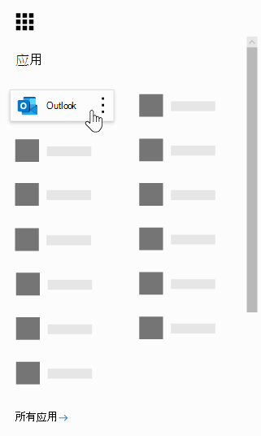
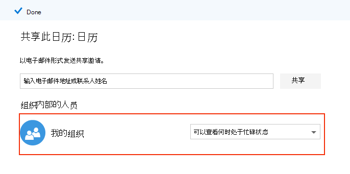
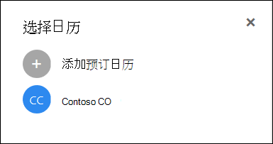

# Microsoft 预定常见问题Microsoft Bookings Frequently Asked Questions

## 常规General

### 什么是 Microsoft 预订？What is Microsoft Bookings?

Microsoft 预订是 Microsoft 365 应用程序，可以轻松地安排和管理约会。Microsoft Bookings is a Microsoft 365 app that makes scheduling and managing appointments easy. 预订 incudes 基于 Web 的预订日历，并与 Outlook 集成以优化员工的日历，使客户能够灵活地预订最适合他们的时间。Bookings incudes a Web-based booking calendar and integrates with Outlook to optimize your staff’s calendar, giving your customers flexibility to book a time that works best for them. 自动化通知电子邮件减少了无显示，并且组织通过减少重复的日程排定任务节省了时间。Automated notification emails reduce no-shows, and organizations save time with a reduction in repetitive scheduling tasks. 预订可帮助您通过 Skype 或 Microsoft 团队轻松执行虚拟约会，并帮助您通过团队中的预订应用程序管理日常计划。Bookings helps you easily conduct virtual appointments via Skype or Microsoft Teams, and helps you manage day-to-day scheduling via the Bookings app in Teams. 通过内置的自定义功能，预订旨在满足任何组织的多个部件的需求。With built-in ability to customize, Bookings is designed to meet the needs of multiple parts of any organization.

### 如何使用 Microsoft 预订？How do I use Microsoft Bookings?

预订是一种在线服务，因此您无需下载任何内容。Bookings is an online service, so you don't need to download anything. 只需转到 Microsoft 365 Web 体验中的应用程序选择器即可。Just go to the app chooser within the Microsoft 365 Web experience. 管理员还可以使用预订辅助应用程序，以了解有关客户及其约会的最新信息。Administrators can also use the Bookings companion app to stay current with the latest information about customers and their appointments.

### 谁有权访问 Microsoft 预订？Who has access to Microsoft Bookings?

默认情况下，在全球范围内的 Microsoft 365 商业高级版、A3、A5、E3 和 E5 客户提供预订并处于活动状态。Bookings is available and active by default for Microsoft 365 Business Premium, A3, A5, E3, and E5 customers worldwide. 在由世纪互联运营的 Office 365 中也提供了预订。Bookings is also available in Office 365 operated by 21Vianet.

### 我的客户是否会看到我的个人或业务日历？Will my customers see my personal or business calendar?

您的客户将仅看到您为您选择的服务、时间和员工在线发布的预订日历。Your customers will only see the Bookings calendar that you publish online for the services, times, and staff that you choose to register.

### 最终用户如何访问预订应用？How do end users access the Bookings app?

授予 Microsoft 365 商业高级版、A3、A5、E3、E5 或的任何人作为教职员工成员在管理员或查看者角色中添加的任何人都可以在 Microsoft 365 Web 体验中的应用程序选择器中访问预订。Anyone who is licensed for Microsoft 365 Business Premium, A3, A5, E3, E5, or is added as a staff member in either the Administrator or Viewer roles can access Bookings in the app chooser within the Microsoft 365 Web experience. 此外，还提供适用于 iOS 和 Android 的配套应用。There is also a companion app available for iOS and Android.

### 我是否可以在我自己的网站中使用预订？Can I use Bookings in my own Web site?

是。Yes. 我们为你提供了一种通过 iFrame 在网站中嵌入你的预定日历的方法。We provide a way for you to embed your Bookings calendar in your site via an iFrame. 链接嵌入代码位于预订应用程序内的 " **预定页面** " 选项卡中。Link embedding code is located in the **Bookings page** tab within the Bookings app.

### 即使我没有业务网页，也可以使用预订吗？Can I use Bookings even if I don’t have a Web page for my business?

是。Yes. 我们在 Web 应用的 " **预定页面** " 选项卡中提供了一个指向你的预定页面的链接。We provide a link to your booking page within the **Booking page** tab in the Web app. 您只需向客户或客户端提供该链接，他们就会看到您的企业的最新可用性信息。You just need to provide that link to your customers or clients, and they will see the latest availability information for your business. 此外，还可以在社交媒体中共享预定页面，甚至可以使用嵌入功能将其托管在 iFrame 中。Alternatively, you can share the booking page in social media or even use the embed feature to host it in an iFrame. 您还可以通过禁用直接搜索引擎索引并将访问限制为仅组织中的用户来控制谁可以访问此页面。You also have the ability to control who can access the page by disabling direct search engine indexing and restricting access to only those within your organization.

### 我们的 IT 部门是否可以控制最终用户是否可以访问预订？Can our IT department control whether end users can access Bookings?

默认情况下，预订在商业高级版、M365 A3/A5 和 E3/E5 租户中可用，但如果他们选择，管理员可以在 Microsoft 365 管理中心中将其关闭。Bookings is available in Business Premium, M365 A3/A5 and E3/E5 tenants by default, but administrators can turn it off in the Microsoft 365 admin center if they choose. 为此，请 [按照以下说明](turn-bookings-on-or-off.md)操作。To do so, [follow these instructions](turn-bookings-on-or-off.md).

如果客户希望对租户中的某些符合条件的许可证禁用对预订的访问权限，则可以使用组策略来限制许可证，也可以实施 OWA 邮箱策略来限制可以创建新的预订日历的用户。If a customer wants to disable access to Bookings for certain eligible licenses in their tenant, they can either user a group policy to restrict licenses or implement an OWA Mailbox policy that will restrict who is able to create new Bookings calendars.

如果使用 OWA 邮箱策略禁用对预订的访问权限，则所有用户都将拥有一个预订许可证，但在尝试访问该应用程序时，他们将只会成功，如果它们是策略的一部分或者已将其作为员工添加到现有的预订日历中。If you use an OWA Mailbox policy to disable access to Bookings, all users will have a Bookings license, however when they attempt to access the app, they will only be successful if they are part of the policy or if they have been added to an existing Bookings calendar as staff. [此处](turn-bookings-on-or-off.md)的详细信息，请单击 "仅允许所选用户创建预订日历" 部分。Details [here](turn-bookings-on-or-off.md) in the “Allow only selected users to create Bookings calendars” section.

### 是否可自定义预订？Is Bookings customizable?

是的，可自定义预订并可用于多种不同的方案。Yes, Bookings is customizable and can be used for a variety of different scenarios. 设置预定日历时，基于 Web 的日程安排页面的许多方面都可以自定义您的业务信息、员工详细信息、服务类型和日程安排策略。When setting up a Bookings calendar, many aspects of the Web-based scheduling page, your business information, staff details, service types, and scheduling policies can be customized.

### 在 Microsoft 团队中是否提供原始的预订 Web 应用程序的所有功能？Is all the functionality of the original Bookings Web app available in Microsoft Teams?

现已在团队中作为应用程序提供了一种轻型版本的预订。A lightweight version of Bookings is now available as an app in Teams. 请在 [此处](https://www.microsoft.com/microsoft-365/blog/2020/03/06/empowering-care-teams-with-new-tools-in-microsoft-365/)查找初始通知。Please find the initial announcement [here](https://www.microsoft.com/microsoft-365/blog/2020/03/06/empowering-care-teams-with-new-tools-in-microsoft-365/). 有深层链接功能可在 Web 应用程序中进行弹出，在安装完成后，可以在不离开团队的情况下完成预订的日常使用。There is deep link functionality to pop out in the Web app, and after setup, day-to-day use of Bookings can be done without ever leaving Teams. 跨平台的信息流。Information flows across platforms.

### 是预订小型企业服务还是企业服务？Is Bookings a small business offering or an Enterprise offering or both?

预订是企业和小型企业客户的理想解决方案，可跨多种行业使用。Bookings is an ideal solution for both Enterprise and small business customers, across a variety of industries. 使用案例包括：Use cases include:

- 金融服务Financial services
    - consultationsconsultations
    - 银行和保险服务banking and insurance services
    - 税收存档tax filings

- 人力资源 (人力资源) Human resources (HR)
    - 应聘者访谈candidate interviews
    - 加入onboarding
    - 福利帮助benefits assistance
    - 培训和研讨会training and seminars

- 医疗Healthcare
    - 患者访问patient visits
    - 提供程序间协作provider-to-provider collaboration
    - 保险咨询insurance consults

- 政府 & 公共部门Government & Public Sector
    - 法庭 hearings 和实验court hearings and trials
    - 公共服务public services
    - 部门约会department appointments

- 教育版--12Education -- K-12
    - 父-教师会议parent-teacher conferences
    - 学校城镇厅school town hall
    - 学生-counselor 访问student-counselor visits

- 教育版--较高的 EdEducation -- Higher Ed
    - 办公时间office hours
    - tutoringtutoring
    - 学生服务student services
    - 考试注册exam sign-up

- 零售Retail
    - 辅助购物assisted shopping
    - 合同工日程安排contractor scheduling
    - 设计服务design services

- 一般企业和小型企业需求General Enterprise and small business needs
    - 客户和客户会议customer and client meetings
    - 技术支持tech support
    - 法律审查legal reviews
    - 办公facilities

## 定价和许可Pricing and licensing

### 如何获取 Microsoft 预订？How do I get Microsoft Bookings?

预订在 Microsoft 365 中适用于具有商业高级版、A3、A5、E3 和 E5 许可证的客户，以及 iOS 和 Android 附属应用。Bookings is available in Microsoft 365 for customers with Business Premium, A3, A5, E3, and E5 licenses, along with an iOS and Android companion app. 预订不可作为独立应用程序提供。Bookings is not available as a standalone app. 必须启用 outlook Web App 或 Web 上的 Outlook 才能使用预订，因为它将数据存储在 Outlook 中。Outlook Web App or Outlook on the web must be enabled to use Bookings, as it stores data within Outlook.

预订许可证为产品提供了完整功能，包括创建和管理日历。A Bookings license provides full functionality to the product, including creating and managing calendars. 此外，还允许用户在管理员或查看者角色中将这些用户添加为员工时查看和编辑现有日历。It also enables the ability for users to view and edit existing calendars, when those users are added as staff in an Administrator or Viewer role.

### 我是否需要将我的电子邮件帐户从我的当前提供商迁移到 Microsoft 365？Do I need to migrate my email account from my current provider to Microsoft 365?

您可以保留当前提供程序，但预订将向 Microsoft 365 帐户中使用的电子邮件发送所有通知。You can keep your current provider, but Bookings will send all notifications to the email used in your Microsoft 365 account.

### 我的员工是否可以使用没有 Microsoft 365 帐户的预定？Can my employees use Bookings without a Microsoft 365 account?

是。Yes. 你可以使用任何电子邮件添加你的员工，并且当某人与他们一起预订约会时，仍会收到电子邮件确认和日历邀请。You can add your staff with any email, and they will still get the email confirmation and the calendar invite when someone books an appointment with them.

### 是否可以在同一个 Microsoft 365 帐户下创建多个预订日历，并在它们之间切换？Can I create more than one Bookings calendar under the same Microsoft 365 account and switch between them?

是。Yes. 您可以使用一个帐户创建和管理多个预订日历。You can create and manage more than one Bookings calendar with one account. 您可以使用预定 Web 应用中公司名称旁边的脱字号在它们之间进行切换。You can switch between them using the caret next to the business name in the Bookings Web app.

### 如果我的组织具有带 F1/F3、E1 和 E3/E5 的混合许可证，该怎么办？What if my organization has mixed licenses with F1/F3, E1, and E3/E5?

我们认识到许多组织混合了 Microsoft 365 许可。We recognize that many organizations have a mixture of Microsoft 365 licensing. 例如，客户可能对其总部中的员工具有 M365 E3 许可证，但 M365 E1 (或 F1 或 F3) 许可证用于其商店员工。For example, a customer may have M365 E3 licenses for employees in their headquarters, but M365 E1 (or F1 or F3) licenses for their store employees.

在此示例中，具有 M365 E3 许可证的总部员工具有对预订的完全访问权限，这意味着他们可以创建新的日历、编辑设置、添加员工、发布预定页面、创建和管理日历中的约会以及拉取报告。In this example, the headquarters employees with an M365 E3 license have full access to Bookings, which means they can create new calendars, edit settings, add staff, publish a booking page, create and manage appointments within the calendar, and pull reports.

这些具有 E1/F1/F3 许可证或不带许可证的存储员工仍可以作为员工添加到来宾角色中的日历，然后将其预订给约会，并且他们将在他们预定的时候收到确认电子邮件。Those store employees with E1/F1/F3 licenses, or with no licenses, can still be added as staff to calendars in a Guest role and then booked for appointments, and they will receive confirmation emails when they are booked. 他们仍可在其可用/预定时间内预定，如 "教职员工" 选项卡中所示。预订日历可用性根据其设置的小时数和服务时间限制 bookable 次数。They can still be booked during their available/scheduled hours as listed in the staff tab. The Bookings calendar availability constrains bookable times by their set hours and service hours.

如果已通过预定 Web 应用在该时间计划了约会，则商店员工在预订中也会显示为不可用。The store employees will also display as unavailable in Bookings if an appointment has already been scheduled at that time through the Bookings Web app. 通过预订预定的约会将在预订中反映为教职员工成员的日历上的忙碌状态。Appointments booked via Bookings will reflect as busy on a staff member's calendar within Bookings. 具有非预订启用的许可证的员工仍然可以影响其个人日历对其在预订中的可用性的影响，前提是它们在同一个租户中。Staff with a non-Bookings enabled license can still have their personal calendar impact their availability in Bookings, provided they are within the same tenant.

来宾角色中的人员可以查看客户在初始约会创建过程中提供的任何信息。People in the Guests role can view any of the information the customer has provided within the initial appointment creation. 例如，如果预定约会的商店代表需要在约会之前调用客户，则他们将能够访问在计划过程中客户提供的信息。For example, if the store representative who is booked for the appointment is required to call the customer prior to the appointment, they will have access to the information the customer provides during the scheduling process. 预订的教职员工成员将有权访问确认电子邮件中显示的所有信息，以及 " (" 中的 "ics 日历" 事件，如客户电话号码) 输入。The staff member who is booked will have access to all information that appears in the confirmation email, as well as the .ics calendar event (such as the customer phone number if it was entered).

来宾角色中的人员将无法访问预订 Web 应用来更改设置，也无法查看和管理约会 (添加、取消和重新安排) 。People in the Guest role will not have the ability to access the Bookings Web app to change settings or to view and manage appointments (add, cancel, and reschedule). 但是，他们可以使用自助服务页面代表客户创建约会，其方式与客户创建约会的方式相同。However, they can make appointments on behalf of customers using the Self-service page, in the same way that a customer would make an appointment.

我们建议使用符合预定资格的许可证为每个存储授权业务经理或管理员，以设置和管理页面和约会。We recommend licensing a business manager or administrator of each store with a Bookings-eligible license to set up and manage pages and appointments. 然后，其余的员工将与使用预订许可的员工合作，以便重新安排或取消预定。The rest of the staff would then work with the employee licensed with Bookings in order to reschedule or cancel a booking.

## 产品功能Product features

### 预订日历在我的 Microsoft 365 租户中显示在哪里？ \* \*Where do Bookings calendars show up in my Microsoft 365 tenant?\*\*

每个新的预订日历都会在 Exchange 中创建相应的邮箱，以及 Azure Active Directory (AAD) 中的相关条目，其中条目以未授权用户的形式列出。Each new Bookings calendar creates a corresponding mailbox in Exchange, as well as a related entry in Azure Active Directory (AAD), where the entry is listed as an unlicensed user.

### 我可以删除以前创建的预订日历吗？Can I delete a previously created Bookings calendar?

若要删除预定日历，必须在 Exchange 中删除关联的邮箱。In order to delete a Bookings calendar you must delete the associated mailbox in Exchange.

### 如果我创建日历，而其他人有权访问预订，是否可以查看我的日历？If I create a calendar and someone else has access to Bookings, would they be able to see my calendar?

仅有权访问您通过 Web 应用)  (创建的预订日历的用户是在管理员或查看者角色中作为员工添加的任何人。The only people who have access to Bookings calendars that you create (through the Web app) is anyone who has been added as staff, in either an Administrator or Viewer role. 租户管理员将能够查看 Exchange 和 AAD 中所有预订邮箱的列表。Tenant admins will be able to see a list of all Bookings mailboxes in Exchange and AAD.

### 视频会议会议是否已集成到预订应用程序？Are video conferencing meetings integrated into the Bookings app?

在使用 Skype 或 Microsoft 团队客户端的预订中，可以使用联机会议。Online meetings are available within Bookings when using the Skype or Microsoft Teams clients. 可以在服务级别启用联机会议，并且您选择的会议客户端 (Skype 或团队) 将成为预订的教职员工成员的默认设置。Online meetings can be enabled at the service-level, and the meeting client you choose (Skype or Teams) will be the one set by default for a booked staff member. 若要加入联机会议，每个新约会都将有一个附加到约会的唯一会议链接，此外，事件和确认电子邮件中还包含易于加入的选项。To join the online meetings, each new appointment will have a unique meeting link attached to the appointment, and in addition, easy join options are included in the event and in confirmation emails.

### 计划策略的工作原理是什么？How does scheduling policy work?

一个名为 " **最长提前期** " 的设置决定了提前 (的最远距离（以天为单位）) 可以进行预订。A setting called **Maximum lead time** determines the farthest in advance (measured in days) that a booking can be made. **最短提前**期 (最短提前期（以小时为单位）的最短提前期和最长提前期之间必须至少24小时) 和最长提前期。There must be at least 24 hours between **Minimum lead time** (the minimum lead time, in hours, for bookings and cancellations) and Maximum lead time. 如果最短提前期设置为0小时，则最长提前期可以设置为一天，在这种情况下，客户可以取消登记，直到约会在第二天内。Maximum lead time can be set to one day if Minimum lead time is set to 0 hours, which in this case means a customer can cancel a booking up until the time that it starts, and customers can only schedule bookings if the appointment is within the next day.

:::image type="content" source="media/bookings-faq-scheduling.png" alt-text="在预订中安排":::

### 预订如何跨时区进行工作？How does Bookings work across time zones?

默认情况下，所有时间都在业务时区 (本地时区) 。All times are in the business time zone (your local time zone) by default. 这意味着，您为预订日历（如工作时间）配置的任何设置都将显示在此时区中。This means any setting you configure for a Bookings calendar, such as working hours, will appear in this time zone. 自助服务页面能够在最终用户的时区中显示所有约会时间，如果需要，可以将其关闭。The Self-service page has the ability to display all the appointment times in the end-user's time zone, which can be turned off if desired.如果 "在预订页面" 选项卡上 **始终显示 "仍在营业时区中显示时间段** "，则访问该页面的人员将在其自己的本地时区中看到时间段。 If **Always show time slots in business time zone** remains unchecked on the Bookings page tab, then people visiting the page will see time slots in their own local time zones.

:::image type="content" source="media/bookings-faq-region.png" alt-text="预订区域和时区设置":::

没有规定为预订中的员工设置时区。There is no provision to set time zone for staff in Bookings. 员工时区，因而营业时间将在业务时区中。Staff time zone, and thus business hours, will be in the business time zone.

### 电子邮件通知是否可以作为租户域名发送？Can email notifications be sent as the tenant domain name?

电子邮件地址在 Microsoft 365 设置级别进行控制和管理，具体取决于域配置设置。The email addresses are controlled and managed at the Microsoft 365 settings level and depend on the domain configuration settings there. 可在 [此处](https://docs.microsoft.com/powershell/module/exchange/mail-flow/get-accepteddomain?view=exchange-ps)找到详细信息。More information can be found [here](https://docs.microsoft.com/powershell/module/exchange/mail-flow/get-accepteddomain?view=exchange-ps).

### 是否能够根据不同的服务或特定配置发送 SMS 消息？Is the ability to send SMS messages dependent on a different service or specific configuration?

SMS 消息目前在北美可用，Skype 或 Twilio 帐户将用于短信传递。SMS messages are currently available in North America, and a Skype or Twilio account will be used for SMS delivery.

### 预订约会如何在人员的日历上显示？How can Bookings appointments show up on a person’s calendar?

预订的确认将同时发送到服务提供商和客户的 "收件箱"。The confirmation of the booking is sent to both the service provider’s and customer’s inboxes. 确认电子邮件包含一个 \* 的文件附件，随后可将其添加到用户的日历中，并提供所有相关的约会详细信息。The confirmation email contains an \*.ics file attachment, which can then be added to the user’s calendar with all relevant appointment details.

### 什么触发服务提供商或员工和客户电子邮件？What triggers service provider or staff and customer emails?

根据预定 Web 应用中的 "服务" 选项卡中的设置触发电子邮件。Emails are triggered based on settings in the Services tab in the Bookings Web app. 由客户在自助服务页面或在预定 Web 应用程序的 "日历" 选项卡上进行的预订将触发确认和/或提醒电子邮件。A booking made by the customer on the Self-service page, or on the Calendar tab in the Bookings Web app, will trigger a confirmation and/or a reminder email. 当有人通过确认电子邮件中的 " **管理预定** " 按钮或 Web 应用程序对预定进行更改时，将会发生同样的情况。The same thing will happen when someone makes a change to the booking via the **Manage booking** button in the confirmation email or within the Web app. 提醒电子邮件在约会之前的指定时间段内发送，如预订 Web 应用中的 "服务" 选项卡中的详细信息。Reminder emails are sent at a specified time period prior to an appointment, as detailed in the Services tab in the Bookings Web app.

### 我能否预订课堂风格的约会1：多（而不是1:1）？Can I book classroom-style appointments that are 1:many instead of 1:1?

是的，我们有一个组预订功能，它允许多人同时预订同一约会 (例如，对于健身) 的课程。Yes, we have a group bookings functionality that allows multiple people to book the same appointment at the same time (such as for a fitness class). [此处](https://techcommunity.microsoft.com/t5/microsoft-bookings-blog/microsoft-bookings-now-supports-online-meetings-and-group/ba-p/1214120)详细介绍了此功能。This functionality is described in detail [here](https://techcommunity.microsoft.com/t5/microsoft-bookings-blog/microsoft-bookings-now-supports-online-meetings-and-group/ba-p/1214120).

### 日历是否可以保持未发布状态 (不面向公众的) ，但仍可供指定用户访问？Can calendars remain unpublished (not public-facing) but still accessible to designated users?

是。Yes. Web 应用中的 "预定页面" 选项卡上有一个复选框： **需要 Microsoft 365 或 Office 365 帐户从 "我的组织" 到 "书籍**"。There is a check box on the Booking page tab in the Web app: **Require a Microsoft 365 or Office 365 account from my organization to book**. 选中此复选框会将自助服务页面访问限制为仅限租户中的用户访问。Selecting this check box restricts Self-service page access to only those that are within your tenant. 在用于创建和管理的 Web 应用程序中的预订日历只能由以管理员或查看者角色添加到页面的人员访问。The Bookings calendar that sits within the Web app for creation and management can only be accessed by those individuals added as staff to the page with Administrator or Viewer roles.

:::image type="content" source="media/bookings-faq-access-ctrl.png" alt-text="预订中的预订页面访问控制":::

### 主页更新的频率是多少？How frequently does the Home page update?

每次加载 Web 应用时，都会检索链接到主页的最新数据。The latest data linked to your Home page is retrieved  whenever the Web app is loaded. 有关预订所跟踪的信息类型的更多详细信息，请参阅此 [支持文章](metrics-and-activity-tracking.md)。For further details on the type of information tracked by Bookings, see this [support article](metrics-and-activity-tracking.md).

### 我是否可以关闭电子邮件通知关闭时间？Can I turn off the email notifications for Time Off?

在预订 Web 应用程序中录制的时间将始终触发向教职员工成员发出通知的电子邮件。Recording Time Off within the Bookings Web app will always trigger a notification email to staff members. 如果有任何员工对通知感到困惑，我们建议您在 "停止时间" 通知的备注或标题中添加更多详细信息，以便更好地通知员工在管理方面发生的情况。If any staff members are confused about the notification, we recommend you add more detail in the notes or title of the Time Off notification, to better inform staff about what is occurring on the admin side.

### 预订日历是否可以进行克隆或复制，是否可以 templatized 以方便扩展？Can Bookings calendars be cloned or duplicated, and can they be templatized for easy scaling?

当前可通过 PowerShell 获取复制页面的功能。The ability to duplicate pages is currently available via PowerShell. 该过程将使用 Graph API 获取邮箱详细信息，然后使用这些详细信息创建新邮箱。The process would be to use the Graph API to get mailbox details, and then use those details to create a new mailbox. API 文档在 [这里](https://docs.microsoft.com/graph/api/resources/booking-api-overview?view=graph-rest-beta)。API documentation is [here](https://docs.microsoft.com/graph/api/resources/booking-api-overview?view=graph-rest-beta).

### 预订中提供了哪些报告？What reporting is available in Bookings?

分配给管理员角色的所有预订员工都可以 ( 中下载以制表符分隔的值。TSV) 文件，在过去的120天内进行的所有预订。All Bookings staff assigned to the Administrator role can download a tab-separated values (.TSV) file with all bookings made in the past 120 days. 可在中下载预订报告。在 "主页" 选项卡中预订页面的 TSV 表单。Bookings reports can be downloaded in .TSV form from the Home tab of the Bookings page. 还可以使用预订 API 来收集此数据，以实现更好的自定义和特定目的。The Bookings API can also be used to collect this data for more customized and specific purposes.

### 一次只能在自助服务页面上共享一项服务吗？Is it possible to share only one service on the Self-service page at a time?

可以，可以为每个服务创建单独的预订日历，也可以转到 "服务" 选项卡、"编辑服务"，然后在页面顶部看到 "仅为该特定服务共享 URL" 的选项。Yes, you can either create separate Bookings calendars for each service, or you can go to the Services tab, edit a service, and at the top of the page you will see an option to share a URL only for that specific service.

### 哪些选项可用于嵌入许可表单或为这些预订约会披露？What options are available for embedding a consent form or disclosure for those booking an appointment?

我们建议在预定页面启用 " **客户数据使用许可** " 复选框，并自定义措辞以正确地传达组织的披露或同意要求。We recommend enabling the **Customer data usage consent** check box in the Booking page and customizing the wording to properly convey your organization's disclosure or consent requirements. 另一种方法是向服务添加一个自定义字段，其中包括同意表单的链接，并要求客户先确认他们已完成该表单，然后才能继续进行约会。Another option is to add a custom field to the service that includes a link to the consent form, and require customers to confirm that they have completed the form before they can proceed with making an appointment. 您还可以在确认和提醒电子邮件中将许可表单 URL 作为附加备注添加，但这不会阻止用户预定约会。You can also add the consent form URL as additional notes in confirmation and reminder emails, but this will not prevent users from booking an appointment.

### 在自助服务预定页面上可以对员工选择功能进行哪些更改？What changes can be made to the staff selection capability on the Self-service booking page?

通过取消选中 "允许客户从预定页面或服务" 部分 **选择 "预定的特定人员"** 选项来完全删除预定时，客户选择特定员工成员的能力。The ability for customers to select specific staff members when booking can be removed completely by de-selecting the **Allow customers to choose a specific person for the booking** option from the Booking page or the Services section. 预订将根据员工的可用性，自动将可用的教职员工成员分配给预定。Bookings will automatically assign an available staff member at random to the booking, based on staff availability.

### 预订是否可以支持多个并发预订请求和自助服务页面访问？Can Bookings support many concurrent booking requests and Self-service page visits?

预订可支持一次大量的访问者和预订。Booking can support a large quantity of visitors and bookings at one time. 如果页面遇到大量流量，则用户将收到 "服务器忙碌" 错误。If the page experiences a very large volume of traffic, users will receive a “server busy” error. 在加载页面时以及在进行预订时，会更新约会可用性。Appointment availability is updated when the page is loaded, as well as when a booking is made. 如果多人试图一次同时预订同一约会，则预订将只允许一个人预订该时间，并向其他潜在客户提供通知消息，并提示他们查找不同的时间。If multiple people are trying to book the same appointment at one time, Bookings will only let one person book that time and give a notification message to the other potential customers, and prompt them to find a different time.

## 隐私Privacy

### 预订数据存储在哪里？Where is Bookings data stored?

预订是 Microsoft 365 应用程序，这意味着所有数据都存储在 Microsoft 365 平台和 Exchange 中。Bookings is a Microsoft 365 app, meaning all data is stored within the Microsoft 365 platform and in Exchange. 预订遵循由 Microsoft 设置的所有数据存储策略，这些策略与所有 Office 应用都遵循相同的策略。Bookings follows all data storage policies set by Microsoft, which are the same policies followed by all Office apps. 预订使用 Exchange 中的共享邮箱来存储客户、人员、服务和约会详细信息。Bookings uses shared mailboxes in Exchange to store customer, staff, service, and appointment details. Exchange 中共享邮箱的合规性策略也适用于预订邮箱。Compliance policies for shared mailboxes in Exchange also apply for Bookings mailboxes. 所有客户数据 (，其中包括客户在预订) 在预订中捕获并存储在应用程序中时提供的信息，因此它存储在 Exchange 中。All customer data (including information provided by customers when booking) is captured in Bookings and is stored within the app, thus it is stored within Exchange. Microsoft 预订使用 Microsoft 365 使用的相同策略，您可以在此处找到该策略 [。](https://www.microsoft.com/online/legal/v2/?docid=22&langid=en-us)Microsoft Bookings uses the same policies used by Microsoft 365, which you can find [here.](https://www.microsoft.com/online/legal/v2/?docid=22&langid=en-us)

### 有什么方法可以集中管理所有用户的预订日历吗？Is there a way to centrally manage Bookings calendars for all users?

每个预订日历都独立进行维护。Each Bookings calendar is maintained independently. 在主页上单击脱字号后，不会出现除搜索下拉外的所有合并视图。There is no consolidated view, other than the search drop-down after clicking the caret on the home page.

### 如何对用户进行身份验证？How are users authenticated?

对预订 Web 应用的访问权限涉及通过常规 Azure Active Directory (AAD) 身份验证进行的身份验证。Access to the Bookings Web app involves authentication through the regular Azure Active Directory (AAD) authentication. "自助式预订" 页面可供具有网页链接的所有用户使用。The Self-service booking page can be made available to everyone with the Web page link. 但是，当选择 " **从我的组织中选择 Microsoft 365 或 Office 365 帐户** " 设置时，将仅限制页面在 Microsoft 365 租户 (中使用 AAD 身份验证) 。However, when the **Require a Microsoft 365 or Office 365 account from my organization** to book setting is selected, the page is restricted for use only within the Microsoft 365 tenant (using AAD authentication).

:::image type="content" source="media/bookings-faq-access-ctrl.png" alt-text="预订中的预订页面访问控制":::

### 客户数据是否因某种原因而留下生产系统？Does customer data leave the production system for any reason?

是的，由于预订是 Exchange 的一部分，因此我们允许客户下载其拥有访问权限的数据的图形 Api 和 Exchange Web 服务 (EWS) Api。Yes, since Bookings is a part of Exchange, we allow Graph APIs and Exchange Web Services (EWS) APIs for the customers to download their own data to which they have access.

### 是否有能力为客户答复自定义电子邮件地址？Is there the ability to customize email addresses for customer replies?

可以定义客户向其发送其回复的电子邮件地址。There is the ability to define which email address customer send their replies to. 此设置位于 " **业务信息** " 选项卡上。还可以通过通常的 Exchange 邮箱重命名过程在 Exchange 中更改预订邮箱的名称本身。This setting is on the **Business information** tab. The Bookings mailbox name itself can also be changed within Exchange, through usual Exchange mailbox renaming processes.

### 我们希望客户在预订过程中接受我们的条款和条件。We would like for the customer to accept our terms and conditions during the booking process. 这可能吗？Is that possible?

对于 GDPR 合规性，此功能已存在。This feature already exists for GDPR compliance. 预订页面具有 "自定义同意" 字段，在 "发布详细信息" 部分中的右侧。The Booking page has a field for custom consent, right under the publishing details section. 只需选中该框并编写您自己的自定义同意消息，它就会显示为自助服务页面上的必填字段。Just check that box and write your own custom consent message and it will show up as a required field on the Self-service page. 将记录客户授予同意的日期和时间。The date and time that the customer grants consent will be recorded.

本节不支持 rtf 格式，但可在 "业务信息" 部分下添加 "思考" 链接，并将显示在 "同意" 复选框的正下方。This section does not support rich text, but think links can be added under the business information section and would show up just below the consent check box.

### 如何识别 Exchange 中的与预定关联的邮箱？How can Bookings-associated mailboxes in Exchange be identified?

可以使用以下命令来检索所有预订邮箱和对其具有访问权限的用户的信息。The following command can be used to retrieve information of all Bookings mailboxes and users who have access to them.

`Get-Mailbox -RecipientTypeDetails SchedulingMailbox -ResultSize:Unlimited | Get-MailboxPermission |Select-Object Identity,User,AccessRights | Where-Object {($\_.user -like '\*@\*')}`

## 技术问题Technical Questions

### 如果用户为包含联机会议的服务安排约会，如果用户将 "可选电子邮件地址" 字段保留为空，则他们将如何接收与会议的 "Microsoft 团队" 链接？If a user schedules an appointment for a service consisting of an online meeting, how do they receive the Microsoft Teams link to the meeting if they leave the optional email address field empty?

如果系统没有客户的电子邮件信息，则无法向客户传递确认邮件，因此他们不会收到 "团队" 链接。If the system does not have the customer's email information, there is no way for the confirmation mail to be delivered to the customer, and thus they will not receive a Teams link. 解决方案是将电子邮件地址设置为必填字段，您可以在预订的 "服务" 选项卡上执行此操作。The solution is to set the email address as a required field, which you can do on the Services tab of Bookings. 请注意，在预订中创建新服务时，默认情况下将 "客户电子邮件" 字段设置为必填字段。Note that whenever you create a new service in Bookings, the customer email field is set as a required field by default.

### 在选择 "任何人" 或客户无法选择约会的教职员工成员时，如何将员工分配给约会？How are staff assigned to appointments when “Anyone” is selected, or when customers do not have the ability to choose a staff member for the appointment?

在这些方案中，不会随机分配员工，而是在预定约会时提供的所有教职员工成员。Staff are assigned randomly in these scenarios, out of all staff members available at the time of the appointment being booked. 目前，无法确保在员工的所有成员中进行随机分配的约会的相同分布，或将分配的约会的数量上限到每个教职员工成员。Currently there is no way to ensure equal distribution of randomly assigned appointments across all members of the staff, or to cap the number of assigned appointments to each staff member. 如果在大量随机分配后需要跨你的员工完成负载平衡，则可以在 "预定" 页面中的 "日历" 选项卡上手动执行。If there is load-balancing that needs to be done across your staff after a number of random assignments, it can be done manually in the Calendar tab within the Bookings page.

### 如果用户之前已经选择过，用户如何选择不接收短信？How can users opt out of receiving SMS messages if they have already opted in previously?

预订启用了短信短信的约会后，客户每次预订时都会收到选中 "自愿加入" 框的提示。When booking an appointment with SMS text messages enabled, customers will be prompted to check the opt in box each time they book. 客户还可以直接答复 SMS 提供程序 (sms 消息，) 指出他们希望邮件停止，然后不会向该电话号码发送进一步的文本。Customers can also reply directly to the SMS message (the SMS provider) indicating that they would like the messages to cease, and then no further texts will be sent to that phone number. 如果客户挑选出来自提供商的短信而不是从预订本身接收短信，则今后将不再接收短信，甚至在从 "记帐" 页面中选择时也不会收到这些邮件。If the customer opts out of receiving text messages from the provider, not from Bookings itself, they will no longer receive SMS messages in the future, even when opting in from the Bookings page.

## 故障排除Troubleshooting

### 此员工成员的日历无法同步This staff member's calendar can't be synced

如果您收到错误 "此员工成员的日历无法同步"，本节包含几个帮助您解决错误的故障排除过程。If you receive the error, "This staff member's calendar can't be synced", this section contains several troubleshooting procedures to help you resolve the error.

> [!NOTE]
> 默认情况下，对于拥有 Microsoft 365 商业标准、Microsoft 365 A3 或 Microsoft 365 A5 订阅的客户，预订处于启用状态。Bookings is turned on by default for customers who have the Microsoft 365 Business Standard, Microsoft 365 A3, or Microsoft 365 A5 subscriptions. 预订也适用于拥有 Office 365 企业版 E3 和 Office 365 企业版 E5 的客户，但默认情况下它处于关闭状态。Bookings is also available to customers who have Office 365 Enterprise E3 and Office 365 Enterprise E5, but it is turned off by default. 若要开始，请参阅 [获取 Microsoft 预订的访问权限](get-access.md)。To get started, see [Get access to Microsoft Bookings](get-access.md). 若要打开或关闭预订，请参阅 [开启或关闭组织的预订](turn-bookings-on-or-off.md)。To turn Bookings on or off, see [Turn Bookings on or off for your organization](turn-bookings-on-or-off.md).

如果要查找有关同步员工日历的信息，请参阅 [将教职员工添加到预订](add-staff.md)。If you are looking for information on syncing your staff's calendar, see [Add staff to Bookings](add-staff.md). 请确保选中 " **员工详细信息** " 页上的 " **日历上的事件" 影响可用性** 。Make sure on the **Staff details** page, **Events on calendar affect availability** is checked.

### 教职员工成员需要更改其日历权限The staff member needs to change their calendar permissions

为了使预定与教职员工成员的日历正确同步，每个教职员工成员必须共享其日历。In order for Bookings to properly sync with your staff members' calendars, each staff member must share their calendar. 每个教职员工成员必须按照这些说明操作，才能共享他们自己的日历。Each staff member must follow these instructions to share their own calendar.

1. 登录到 Microsoft 365，然后从应用启动器中选择 " **Outlook** "。Sign in to Microsoft 365, and then select **Outlook** from the app launcher.

   

1. 在页面顶部，选择 " **共享** \> **日历**"。At the top of the page, select **Share** \> **Calendar**.

   

1. 在 " **组织内部人员** " 部分中，选择 " **我的组织**" 旁边的下拉框，然后选择 " **在我忙碌时可以查看**"。In the **People inside your organization** section, select the drop-down box next to **My Organization**, and then select **Can view when I'm busy**.

> [!NOTE]
> 此设置与贵组织中的其他用户共享你的忙/闲信息。This setting shares your free/busy information with Bookings and with other users in your organization. 它不包含任何其他信息，例如安排的约会类型、安排约会的用户或位置。It does not include any other information, such as what type of appointment you have scheduled, who you have scheduled the appointment with, or the location.

   

1. 选择“完成”\*\*\*\*。Select **Done**.

### 找不到组织中的教职员工成员We can't find a staff member in our organization

如果员工已离开你的公司，并且你将其从 Microsoft 365 或 Office 365 组织中删除，则仍需要从预订中删除该用户，以便它们不会显示在日历中，并防止客户预定约会。If an employee has left your company and you removed them from your Microsoft 365 or Office 365 organization, you still need to remove that user from Bookings so they won't show up in the calendar and to prevent customers from booking appointments with them.

1. 登录到 Microsoft 365，然后转到 " **预定** \> **员工**"。Sign in to Microsoft 365, and then go to **Bookings** \> **Staff**.

1. 将鼠标光标悬停在教职员工成员的姓名上。Hover your mouse cursor over the staff member's name. "**编辑**并**删除**" 图标显示在 "**电话**" 列的右侧。**Edit** and **delete** icons appear to the right of the **Phone** column.

1. 选择 " **删除** " 图标。Select the **Delete** icon.

1. 在确认框中，选择 **"确定"**。In the confirmation box, select **OK**.

> [!NOTE]
> 如果您有多个预定日历，则必须将该用户从所有日历中删除。If you have more than one booking calendar, you must remove the user from all of them.

若要检查是否有多个日历，请在左侧菜单中，选择您的公司名称旁边的下拉箭头，然后选择 " **打开**"。To check if you have more than one calendar, in the left menu, select the drop-down arrow next to your company name, and then select **Open**. 如果只有一个日历，则只会看到用于添加预订日历的选项。If you only have one calendar, then you will see only the option to add a booking calendar. 此示例显示名为 "Contoso CO" 的第二个日历。This example shows that there is a second calendar named "Contoso CO".

   

### 出现同步错误，无法识别There's a syncing error we can't identify

这是暂时性错误，通常是由于 internet 连接不稳定而发生的。This is a transient error and typically occurs because of an unstable internet connection. 这些问题在几分钟后通常会自行解决。These problems usually resolve themselves after a few minutes.

如果你在延长一段时间后仍遇到此错误，或者你经常看到此错误，请联系支持人员。If you still see this error after an extended period of time or you are seeing it often, please contact support.

## 其他资源Additional resources

  - [Microsoft 预定扩展了企业博客中的可用性Microsoft Bookings expands availability in the enterprises blog](https://techcommunity.microsoft.com/t5/microsoft-bookings-blog/microsoft-bookings-expands-availability-in-enterprises/ba-p/1214065)

  - [Microsoft 预定工作原理视频How Microsoft Bookings Works video](https://support.office.com/article/microsoft-bookings-69c45b78-6de4-4f28-9449-cdcc18b7ae45)

  - [开始使用 Microsoft 预订Start using Microsoft Bookings](get-access.md)

  - [打开或关闭 Microsoft 预订Turn Microsoft Bookings on or off](turn-bookings-on-or-off.md)

  - [单独或批量添加用户Add users individually or in bulk](https://docs.microsoft.com/microsoft-365/admin/add-users/add-users?view=o365-worldwide.)

  - [将员工添加到预订Add staff to Bookings](add-staff.md)

  - [在定义模板后自动执行的 API 组件API components to automate after template has been defined](https://docs.microsoft.com/graph/api/bookingbusiness-post-bookingbusinesses)

  - [用于显示的预订日历的 URLURL to Bookings Calendar for Display](https://outlook.office.com/bookings/calendar)

  - [预定合规性策略Bookings compliance policies](https://docs.microsoft.com/microsoft-365/compliance/gdpr-dsr-office365?view=o365-worldwide#bookings)

  - [自定义和发布预定页面Customize and publish your booking page](customize-booking-page.md)

  - [租户邮箱配置Tenant Mailbox configuration](https://docs.microsoft.com/powershell/module/exchange/mail-flow/get-accepteddomain?view=exchange-ps)

  - [组预订Group Bookings](https://techcommunity.microsoft.com/t5/microsoft-bookings-blog/microsoft-bookings-now-supports-online-meetings-and-group/ba-p/1214120)

  - [预订指标和活动跟踪Bookings metrics and activity tracking](metrics-and-activity-tracking.md)

  - [M365 公共路线图M365 Public Roadmap](https://www.microsoft.com/microsoft-365/roadmap?filters=&searchterms=bookings)

  - 通过[UserVoice](https://outlook.uservoice.com/forums/314907-microsoft-bookings/suggestions/39505261-365-admins-should-have-full-access-to-all-bookings)提交反馈Submit feedback via [UserVoice](https://outlook.uservoice.com/forums/314907-microsoft-bookings/suggestions/39505261-365-admins-should-have-full-access-to-all-bookings)
