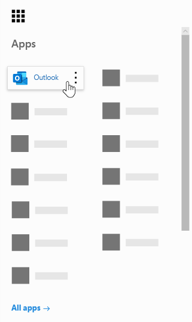

# Microsoft Bookings 常见问题Microsoft Bookings Frequently Asked Questions

## 常规General

### 什么是 Microsoft Bookings？What is Microsoft Bookings?

Microsoft Bookings 是一款 Microsoft 365 应用，可轻松安排和管理约会。Microsoft Bookings is a Microsoft 365 app that makes scheduling and managing appointments easy. Bookings 包括基于 Web 的预订日历，并且与 Outlook 集成以优化员工的日历，从而让客户能够灵活地预订最适合他们的时间。Bookings includes a Web-based booking calendar and integrates with Outlook to optimize your staff’s calendar, giving your customers flexibility to book a time that works best for them. 自动通知电子邮件可减少无显示，并且组织通过减少重复的计划任务来节省时间。Automated notification emails reduce no-shows, and organizations save time with a reduction in repetitive scheduling tasks. Bookings 可帮助你通过 Skype 或 Microsoft Teams 轻松进行虚拟约会，并帮助你通过 Teams 中的 Bookings 应用管理日常日程安排。Bookings helps you easily conduct virtual appointments via Skype or Microsoft Teams, and helps you manage day-to-day scheduling via the Bookings app in Teams. Bookings 具有自定义的内置功能，旨在满足任何组织的多个部分的需求。With built-in ability to customize, Bookings is designed to meet the needs of multiple parts of any organization.

### 如何使用 Microsoft Bookings？How do I use Microsoft Bookings?

Bookings 是一种联机服务，因此无需下载任何内容。Bookings is an online service, so you don't need to download anything. 只需转到 Microsoft 365 Web 体验中的应用选择器。Just go to the app chooser within the Microsoft 365 Web experience. 管理员还可使用 Bookings 配套应用随时了解客户及其约会的最新信息。Administrators can also use the Bookings companion app to stay current with the latest information about customers and their appointments.

### 谁有权访问 Microsoft Bookings？Who has access to Microsoft Bookings?

默认情况下，预订适用于全球 Microsoft 365 商业高级版、Microsoft 365 商业标准版、A3、A5、E3 和 E5 客户。Bookings is available and active by default for Microsoft 365 Business Premium, Microsoft 365 Business Standard, A3, A5, E3, and E5 customers worldwide. Bookings 也可在由世纪银行运营的 Office 365 中提供。Bookings is also available in Office 365 operated by 21Vianet.

### 我的客户会看到我的个人日历或企业日历吗？Will my customers see my personal or business calendar?

你的客户将只能看到你在线发布的预订日历，用于选择注册的服务、时间以及员工。Your customers will only see the Bookings calendar that you publish online for the services, times, and staff that you choose to register.

### 如何更改"管理人员"下的可预订属性？How do I change a bookable attribute under Manage staff?

添加员工后，他们将收到一封电子邮件以接受或拒绝请求。When staff members were added, they would have received an email to accept or reject the request. 他们可以打开同一封电子邮件并选择"拒绝"，使其不可预订。They can open the same email and select "Reject" to make them non-bookable. 我们当前无法从应用内部切换此功能。We currently do not have a way to toggle this from inside the app.

### 最终用户如何访问 Bookings 应用？How do end users access the Bookings app?

任何获得 Microsoft 365 商业高级版、Microsoft 365 商业标准版、A3、A5、E3、E5 许可或已添加为管理员或查看者角色员工的人员都可以在 Microsoft 365 Web 体验内访问应用选择器中的 Bookings。Anyone who is licensed for Microsoft 365 Business Premium, Microsoft 365 Business Standard, A3, A5, E3, E5, or is added as a staff member in either the Administrator or Viewer roles can access Bookings in the app chooser within the Microsoft 365 Web experience. 此外，还有适用于 iOS 和 Android 的配套应用。There is also a companion app available for iOS and Android.

### 能否在您自己的网站中使用 Bookings？Can I use Bookings in my own Web site?

是的。Yes. 我们提供了一种通过 iFrame 在网站中嵌入 Bookings 日历的方法。We provide a way for you to embed your Bookings calendar in your site via an iFrame. 链接嵌入代码位于 Bookings 应用内的 **Bookings** 页面选项卡中。Link embedding code is located in the **Bookings page** tab within the Bookings app.

### 即使我的企业没有网页，我能否使用 Bookings？Can I use Bookings even if I don’t have a Web page for my business?

是的。Yes. 我们在 Web 应用中的"预订"页面 **选项卡中** 提供一个指向预订页面的链接。We provide a link to your booking page within the **Booking page** tab in the Web app. 你只需将链接提供给客户或客户，他们将看到你的企业的最新可用性信息。You just need to provide that link to your customers or clients, and they will see the latest availability information for your business. 或者，可以在社交媒体中共享预订页面，甚至可以使用嵌入功能将其托管在 iFrame 中。Alternatively, you can share the booking page in social media or even use the embed feature to host it in an iFrame. 您还可以通过禁用直接搜索引擎索引并限制仅对组织中那些用户的访问权限来控制谁可以访问页面。You also have the ability to control who can access the page by disabling direct search engine indexing and restricting access to only those within your organization.

### 我们的 IT 部门是否可以控制最终用户是否可以访问 Bookings？Can our IT department control whether end users can access Bookings?

默认情况下，Bookings 在 Microsoft 365 商业高级版、Microsoft 365 商业标准版、M365 A3/A5 和 E3/E5 租户中可用，但管理员可以在 Microsoft 365 管理中心中将其关闭（如果他们选择）。Bookings is available in Microsoft 365 Business Premium, Microsoft 365 Business Standard, M365 A3/A5 and E3/E5 tenants by default, but administrators can turn it off in the Microsoft 365 admin center if they choose. 为此， [请按照以下说明操作](turn-bookings-on-or-off.md)。To do so, [follow these instructions](turn-bookings-on-or-off.md).

如果客户希望禁用租户中某些符合条件的许可证对 Bookings 的访问，他们可以使用组策略来限制许可证，或者实施 OWA 邮箱策略来限制能够创建新的 Bookings 日历的用户。If a customer wants to disable access to Bookings for certain eligible licenses in their tenant, they can either use a group policy to restrict licenses or implement an OWA Mailbox policy that will restrict who is able to create new Bookings calendars.

如果使用 OWA 邮箱策略禁用对 Bookings 的访问，则所有用户都将拥有 Bookings 许可证，但是，当他们尝试访问该应用时，只有在他们是策略的一部分或已作为员工添加到现有 Bookings 日历时，他们才能成功。If you use an OWA Mailbox policy to disable access to Bookings, all users will have a Bookings license, however when they attempt to access the app, they will only be successful if they are part of the policy or if they have been added to an existing Bookings calendar as staff. " [仅](turn-bookings-on-or-off.md) 允许所选用户创建 Bookings 日历"部分的详细信息。Details [here](turn-bookings-on-or-off.md) in the “Allow only selected users to create Bookings calendars” section.

### Bookings 是否可自定义？Is Bookings customizable?

是的，Bookings 是可自定义的，可用于各种不同的方案。Yes, Bookings is customizable and can be used for a variety of different scenarios. 设置 Bookings 日历时，可以自定义基于 Web 的计划页、业务信息、员工详细信息、服务类型和计划策略的许多方面。When setting up a Bookings calendar, many aspects of the Web-based scheduling page, your business information, staff details, service types, and scheduling policies can be customized.

### Microsoft Teams 中是否提供原始 Bookings Web 应用的所有功能？Is all the functionality of the original Bookings Web app available in Microsoft Teams?

现在，Bookings 的轻型版本在 Teams 中作为应用提供。A lightweight version of Bookings is now available as an app in Teams. 请在此处找到初始 [通知](https://www.microsoft.com/microsoft-365/blog/2020/03/06/empowering-care-teams-with-new-tools-in-microsoft-365/)。Please find the initial announcement [here](https://www.microsoft.com/microsoft-365/blog/2020/03/06/empowering-care-teams-with-new-tools-in-microsoft-365/). Web 应用中提供了深层链接功能，设置完成后，无需离开 Teams 即可使用 Bookings。There is deep link functionality to pop out in the Web app, and after setup, day-to-day use of Bookings can be done without ever leaving Teams. 信息跨平台流动。Information flows across platforms.

### Bookings 是小型企业产品/服务还是企业产品/服务？Is Bookings a small business offering or an Enterprise offering or both?

对于企业客户和小型企业客户，Bookings 是一个理想的解决方案，适用于各种行业。Bookings is an ideal solution for both Enterprise and small business customers, across a variety of industries. 用例包括：Use cases include:

- 金融服务Financial services
    - 一些consultations
    - 银行与保险服务banking and insurance services
    - 税务归档tax filings

- 人力资源 (人力资源) Human resources (HR)
    - 候选人面试candidate interviews
    - 载入onboarding
    - benefits assistancebenefits assistance
    - 培训和研讨会training and seminars

- 医疗Healthcare
    - 患者访问patient visits
    - 提供程序到提供程序的协作provider-to-provider collaboration
    - 保险咨询insurance consults

- 政府&公共部门Government & Public Sector
    - 诉讼听审和试用court hearings and trials
    - 公共服务public services
    - 部门约会department appointments

- 教育 -- K-12Education -- K-12
    - 家长-教师会议parent-teacher conferences
    - 学校大会堂school town hall
    - 学生- 学生访问student-counselor visits

- 教育 -- 高级教育Education -- Higher Ed
    - 办公时间office hours
    - 管理tutoring
    - 学生服务student services
    - 考试注册exam sign-up

- 零售Retail
    - 辅助购物assisted shopping
    - 任务计划contractor scheduling
    - 设计服务design services

- 一般企业版和小型企业版需求General Enterprise and small business needs
    - 客户和客户端会议customer and client meetings
    - 技术支持tech support
    - 法律审查legal reviews
    - facilitiesfacilities

## 定价和许可Pricing and licensing

### 如何获取 Microsoft Bookings？How do I get Microsoft Bookings?

对于拥有 Microsoft 365 商业高级版、Microsoft 365 商业标准版、A3、A5、E3 和 E5 许可证以及 iOS 和 Android 配套应用的客户，Bookings 在 Microsoft 365 中可用。Bookings is available in Microsoft 365 for customers with Microsoft 365 Business Premium, Microsoft 365 Business Standard, A3, A5, E3, and E5 licenses, along with an iOS and Android companion app. 预订不作为独立应用提供。Bookings is not available as a standalone app. Outlook Web App或 Outlook 网页的 Outlook，因为它在 Outlook 中存储数据，所以必须启用 Bookings。Outlook Web App or Outlook on the web must be enabled to use Bookings, as it stores data within Outlook.

Bookings 许可证为产品提供完整功能，包括创建和管理日历。A Bookings license provides full functionality to the product, including creating and managing calendars. 它还使用户能够在将现有日历添加为管理员或查看者角色中的员工时查看和编辑现有日历。It also enables the ability for users to view and edit existing calendars, when those users are added as staff in an Administrator or Viewer role.

### 是否需要将我的电子邮件帐户从当前提供商迁移到 Microsoft 365？Do I need to migrate my email account from my current provider to Microsoft 365?

你可以保留当前提供商，但 Bookings 会向 Microsoft 365 帐户中使用的电子邮件发送所有通知。You can keep your current provider, but Bookings will send all notifications to the email used in your Microsoft 365 account.

### 我的员工能否在没有 Microsoft 365 帐户的情况下使用 Bookings？Can my employees use Bookings without a Microsoft 365 account?

是的。Yes. 可以使用任何电子邮件添加员工，当有人预订约会时，他们仍将收到电子邮件确认和日历邀请。You can add your staff with any email, and they will still get the email confirmation and the calendar invite when someone books an appointment with them.

### 能否在同一 Microsoft 365 帐户下创建多个 Bookings 日历，并切换它们？Can I create more than one Bookings calendar under the same Microsoft 365 account and switch between them?

是的。Yes. 可以使用一个帐户创建和管理多个 Bookings 日历。You can create and manage more than one Bookings calendar with one account. 您可以使用 Bookings Web 应用中业务名称旁边的发号在两者之间切换。You can switch between them using the caret next to the business name in the Bookings Web app.

### 如果我的组织具有 F1/F3、E1 和 E3/E5 的混合许可证，如何？What if my organization has mixed licenses with F1/F3, E1, and E3/E5?

我们了解许多组织混合了 Microsoft 365 许可。We recognize that many organizations have a mixture of Microsoft 365 licensing. 例如，客户可能拥有总部员工 M365 E3 许可证，但 M365 E1 (F1 或 F3) 其应用商店员工的许可证。For example, a customer may have M365 E3 licenses for employees in their headquarters, but M365 E1 (or F1 or F3) licenses for their store employees.

本示例中，拥有 M365 E3 许可证的总部员工具有对 Bookings 的完全访问权限，这意味着他们可以创建新的日历、编辑设置、添加员工、发布预订页面、在日历内创建和管理约会以及拉取报告。In this example, the headquarters employees with an M365 E3 license have full access to Bookings, which means they can create new calendars, edit settings, add staff, publish a booking page, create and manage appointments within the calendar, and pull reports.

那些拥有 E1/F1/F3 许可证或没有许可证的应用商店员工仍可以添加为来宾角色的日历中的员工，然后预订约会，并且他们在预订时将收到确认电子邮件。Those store employees with E1/F1/F3 licenses, or with no licenses, can still be added as staff to calendars in a Guest role and then booked for appointments, and they will receive confirmation emails when they are booked. 仍可以在"员工"选项卡中列出的可用/计划时间预订这些人员。Bookings 日历可用性按设置的小时数和服务小时数限制可预订时间。They can still be booked during their available/scheduled hours as listed in the staff tab. The Bookings calendar availability constrains bookable times by their set hours and service hours.

如果此时已经通过 Bookings Web 应用安排了约会，则应用商店员工在 Bookings 中也显示为不可用。The store employees will also display as unavailable in Bookings if an appointment has already been scheduled at that time through the Bookings Web app. 通过 Bookings 预订的约会将反映为预订内员工日历上的忙碌情况。Appointments booked via Bookings will reflect as busy on a staff member's calendar within Bookings. 如果员工位于同一租户内，则具有未启用 Bookings 许可证的员工仍可能会影响他们在 Bookings 中的可用性。Staff with a non-Bookings enabled license can still have their personal calendar impact their availability in Bookings, provided they are within the same tenant.

"来宾"角色中的用户可以查看客户在初始约会创建过程中提供的任何信息。People in the Guests role can view any of the information the customer has provided within the initial appointment creation. 例如，如果需要预订约会的应用商店代表在约会之前致电客户，他们将可以访问客户在日程安排过程中提供的信息。For example, if the store representative who is booked for the appointment is required to call the customer prior to the appointment, they will have access to the information the customer provides during the scheduling process. 已预订的员工将有权访问确认电子邮件中显示的所有信息，以及 .ics 日历事件 (例如客户电话号码（如果已输入) ）。The staff member who is booked will have access to all information that appears in the confirmation email, as well as the .ics calendar event (such as the customer phone number if it was entered).

来宾角色中的人员将无法访问 Bookings Web 应用来更改设置或查看和管理约会， (、取消和重新安排) 。People in the Guest role will not have the ability to access the Bookings Web app to change settings or to view and manage appointments (add, cancel, and reschedule). 但是，他们可以代表客户使用自助式页面进行约会，方式与客户进行约会的方式相同。However, they can make appointments on behalf of customers using the Self-service page, in the same way that a customer would make an appointment.

我们建议使用符合 Bookings 资格的许可证授权每个商店的业务经理或管理员设置和管理页面和约会。We recommend licensing a business manager or administrator of each store with a Bookings-eligible license to set up and manage pages and appointments. 然后，其余员工与使用 Bookings 许可的员工合作，以便重新安排或取消预订。The rest of the staff would then work with the employee licensed with Bookings in order to reschedule or cancel a booking.

## 产品功能Product features

### 我的 Microsoft 365 租户中在哪里显示 Bookings 日历？\*\*Where do Bookings calendars show up in my Microsoft 365 tenant?\*\*

每个新的 Bookings 日历在 Exchange 中创建相应的邮箱，以及 Azure Active Directory (AAD) 中的相关条目，其中条目列为未授权用户。Each new Bookings calendar creates a corresponding mailbox in Exchange, as well as a related entry in Azure Active Directory (AAD), where the entry is listed as an unlicensed user.

### 能否删除以前创建的 Bookings 日历？Can I delete a previously created Bookings calendar?

若要删除 Bookings 日历，必须删除 Exchange 中的关联邮箱。In order to delete a Bookings calendar you must delete the associated mailbox in Exchange.

### 如果我创建了日历，而其他人可以访问 Bookings，他们能否查看我的日历？If I create a calendar and someone else has access to Bookings, would they be able to see my calendar?

仅有权访问通过 Web 应用 () 创建的 Bookings 日历的人员是已添加为管理员或查看者角色的人员。The only people who have access to Bookings calendars that you create (through the Web app) is anyone who has been added as staff, in either an Administrator or Viewer role. 租户管理员将能够查看 Exchange 和 AAD 中所有 Bookings 邮箱的列表。Tenant admins will be able to see a list of all Bookings mailboxes in Exchange and AAD.

### 视频会议是否集成到 Bookings 应用中？Are video conferencing meetings integrated into the Bookings app?

使用 Skype 或 Microsoft Teams 客户端时，Bookings 中提供联机会议。Online meetings are available within Bookings when using the Skype or Microsoft Teams clients. 可以在服务级别启用联机会议，并且你选择 (Skype 或 Teams) 的会议客户端将为已预订的员工默认设置的会议客户端。Online meetings can be enabled at the service-level, and the meeting client you choose (Skype or Teams) will be the one set by default for a booked staff member. 若要加入联机会议，每个新约会都将有一个附加到约会的唯一会议链接，此外，事件和确认电子邮件中包含简单的加入选项。To join the online meetings, each new appointment will have a unique meeting link attached to the appointment, and in addition, easy join options are included in the event and in confirmation emails.

### 计划策略如何工作？How does scheduling policy work?

名为 **"最大提前时间** "的设置可提前确定 (可以) 天数的最短提前时间。A setting called **Maximum lead time** determines the farthest in advance (measured in days) that a booking can be made. 对于预定和取消，最短提前时间 (最短提前时间之间必须至少有 24 小时（以小时) 最短提前时间）。There must be at least 24 hours between **Minimum lead time** (the minimum lead time, in hours, for bookings and cancellations) and Maximum lead time. 如果最小提前期设置为 0 小时，则最大提前期可以设置为 1 天，在这种情况下，这意味着客户可以取消预定直到预定开始的时间，并且客户只能在第二天进行约会时安排预定。Maximum lead time can be set to one day if Minimum lead time is set to 0 hours, which in this case means a customer can cancel a booking up until the time that it starts, and customers can only schedule bookings if the appointment is within the next day.

:::image type="content" source="media/bookings-faq-scheduling.png" alt-text="Bookings 中的日程安排":::

### Bookings 如何跨时区工作？How does Bookings work across time zones?

默认情况下，所有时间都在本地时区 (时区) 时区。All times are in the business time zone (your local time zone) by default. 这意味着您为 Bookings 日历配置的任何设置（如工作时间）都将在此时区显示。This means any setting you configure for a Bookings calendar, such as working hours, will appear in this time zone. 自助式页面能够显示最终用户时区的所有约会时间，如果需要，可以将其关闭。The Self-service page has the ability to display all the appointment times in the end-user's time zone, which can be turned off if desired. 如果 **"预订"** 页选项卡上"总是显示业务时区中的时间段未选中"，则访问该页面的人将在其自己的本地时区看到时间段。If **Always show time slots in business time zone** remains unchecked on the Bookings page tab, then people visiting the page will see time slots in their own local time zones.

:::image type="content" source="media/bookings-faq-region.png" alt-text="预订区域设置和时区设置":::

没有设置在 Bookings 中为员工设置时区。There is no provision to set time zone for staff in Bookings. 员工时区（因此为工作时间）将用业务时区表示。Staff time zone, and thus business hours, will be in the business time zone.

### 电子邮件通知能否作为租户域名发送？Can email notifications be sent as the tenant domain name?

电子邮件地址在 Microsoft 365 设置级别进行控制和管理，并取决于其域配置设置。The email addresses are controlled and managed at the Microsoft 365 settings level and depend on the domain configuration settings there. 有关详细信息，请参阅 [此处](https://docs.microsoft.com/powershell/module/exchange/get-accepteddomain)。More information can be found [here](https://docs.microsoft.com/powershell/module/exchange/get-accepteddomain).

### 能否发送短信取决于不同的服务或特定配置？Is the ability to send SMS messages dependent on a different service or specific configuration?

SMS 消息目前北美可用，Skype 或 Twilio 帐户将用于短信传递。SMS messages are currently available in North America, and a Skype or Twilio account will be used for SMS delivery.

### 预订约会如何显示在某个人的日历上？How can Bookings appointments show up on a person’s calendar?

预订确认将同时发送到服务提供商和客户收件箱。The confirmation of the booking is sent to both the service provider’s and customer’s inboxes. 确认电子邮件包含 \*.ics 文件附件，然后可以使用所有相关约会详细信息添加到用户的日历中。The confirmation email contains an \*.ics file attachment, which can then be added to the user’s calendar with all relevant appointment details.

### 什么触发服务提供商或员工和客户电子邮件？What triggers service provider or staff and customer emails?

根据 Bookings Web 应用中"服务"选项卡中的设置触发电子邮件。Emails are triggered based on settings in the Services tab in the Bookings Web app. 客户在自助服务页面上或 Bookings Web 应用中的"日历"选项卡上进行预订将触发确认和/或提醒电子邮件。A booking made by the customer on the Self-service page, or on the Calendar tab in the Bookings Web app, will trigger a confirmation and/or a reminder email. 当某人通过确认电子邮件或 Web 应用中的"管理预订"按钮更改预订时，也会发生相同的情况。The same thing will happen when someone makes a change to the booking via the **Manage booking** button in the confirmation email or within the Web app. 提醒电子邮件在约会之前的指定时间段发送，如 Bookings Web 应用中的"服务"选项卡中详述。Reminder emails are sent at a specified time period prior to an appointment, as detailed in the Services tab in the Bookings Web app.

### 能否预订 1：0 而不是 1：1 的课堂风格约会？Can I book classroom-style appointments that are 1:many instead of 1:1?

是的，我们有一个组预订功能，允许多个人在同一时间预订同一个约会 (如参加健身课程) 。Yes, we have a group bookings functionality that allows multiple people to book the same appointment at the same time (such as for a fitness class). 此功能在此处进行了 [详细介绍](https://techcommunity.microsoft.com/t5/microsoft-bookings-blog/microsoft-bookings-now-supports-online-meetings-and-group/ba-p/1214120)。This functionality is described in detail [here](https://techcommunity.microsoft.com/t5/microsoft-bookings-blog/microsoft-bookings-now-supports-online-meetings-and-group/ba-p/1214120).

### 日历能否保持未发布 (不面向公众) 但指定用户可以访问？Can calendars remain unpublished (not public-facing) but still accessible to designated users?

是的。Yes. Web 应用中的"预订"页面选项卡上有一个复选框：需要我的组织使用 **Microsoft 365 或 Office 365 帐户进行预订**。There is a check box on the Booking page tab in the Web app: **Require a Microsoft 365 or Office 365 account from my organization to book**. 选中此复选框将自助式页面访问权限限制为仅访问租户内的页面。Selecting this check box restricts Self-service page access to only those that are within your tenant. 位于 Web 应用内以创建和管理的 Bookings 日历只能由作为员工添加到具有管理员或查看者角色的人员访问。The Bookings calendar that sits within the Web app for creation and management can only be accessed by those individuals added as staff to the page with Administrator or Viewer roles.

:::image type="content" source="media/bookings-faq-access-ctrl.png" alt-text="Bookings 中的预订页面访问控制":::

### 主页更新频率如何？How frequently does the Home page update?

每当加载 Web 应用时，都会检索链接到主页的最新数据。The latest data linked to your Home page is retrieved  whenever the Web app is loaded. 有关 Bookings 跟踪的信息类型的更多详细信息，请参阅此 [支持文章](metrics-and-activity-tracking.md)。For further details on the type of information tracked by Bookings, see this [support article](metrics-and-activity-tracking.md).

### 我能否关闭"请假"电子邮件通知？Can I turn off the email notifications for Time Off?

在 Bookings Web 应用中记录"请假"将始终触发向员工发送的通知电子邮件。Recording Time Off within the Bookings Web app will always trigger a notification email to staff members. 如果任何员工对通知感到困惑，建议在"请假"通知的备注或标题中添加更多详细信息，以更好地通知员工管理员方面发生的情况。If any staff members are confused about the notification, we recommend you add more detail in the notes or title of the Time Off notification, to better inform staff about what is occurring on the admin side.

### 能否克隆或复制 Bookings 日历，并可以模板化它们以轻松缩放？Can Bookings calendars be cloned or duplicated, and can they be templatized for easy scaling?

此过程将使用 Graph API 获取邮箱详细信息，然后使用这些详细信息创建新邮箱。The process would be to use the Graph API to get mailbox details, and then use those details to create a new mailbox. API 文档 [位于此处](https://docs.microsoft.com/graph/api/resources/booking-api-overview?view=graph-rest-beta)。API documentation is [here](https://docs.microsoft.com/graph/api/resources/booking-api-overview?view=graph-rest-beta).

### Bookings 中提供了哪些报告？What reporting is available in Bookings?

分配了管理员角色的所有 Bookings 员工都可以下载以选项卡分隔 (。TSV) 文件，包含过去 120 天内进行的所有预订。All Bookings staff assigned to the Administrator role can download a tab-separated values (.TSV) file with all bookings made in the past 120 days. 预订报告可在中下载。"预订"页的"主页"选项卡中的 TSV 表单。Bookings reports can be downloaded in .TSV form from the Home tab of the Bookings page. Bookings API 还可用于收集此数据，以便实现更多自定义和特定目的。The Bookings API can also be used to collect this data for more customized and specific purposes.

### 一次只能共享"自助式"页面上的一项服务吗？Is it possible to share only one service on the Self-service page at a time?

可以，您可以为每个服务创建单独的 Bookings 日历，也可以转到"服务"选项卡，编辑服务，在页面顶部，你将看到仅共享特定服务的 URL 的选项。Yes, you can either create separate Bookings calendars for each service, or you can go to the Services tab, edit a service, and at the top of the page you will see an option to share a URL only for that specific service.

### 哪些选项可用于嵌入同意表单或公开这些预订约会的选项？What options are available for embedding a consent form or disclosure for those booking an appointment?

我们建议在"预订"页面中启用"客户数据使用许可"复选框，并自定义字句以正确传达组织的披露或同意要求。We recommend enabling the **Customer data usage consent** check box in the Booking page and customizing the wording to properly convey your organization's disclosure or consent requirements. 另一个选项是向服务添加一个自定义字段，其中包括指向同意表单的链接，并要求客户确认他们已完成表单，然后才能继续约会。Another option is to add a custom field to the service that includes a link to the consent form, and require customers to confirm that they have completed the form before they can proceed with making an appointment. 还可以在确认和提醒电子邮件中添加同意表单 URL 作为其他注释，但这不会阻止用户预订约会。You can also add the consent form URL as additional notes in confirmation and reminder emails, but this will not prevent users from booking an appointment.

### 对自助服务预订页面上的员工选择功能可以进行哪些更改？What changes can be made to the staff selection capability on the Self-service booking page?

客户可以通过从"预订"页面或"服务"部分取消选择"允许客户为预定选项选择特定人员"来完全删除预订时选择特定员工成员的能力。The ability for customers to select specific staff members when booking can be removed completely by de-selecting the **Allow customers to choose a specific person for the booking** option from the Booking page or the Services section. 预订将基于员工可用性自动为预订随机分配可用员工。Bookings will automatically assign an available staff member at random to the booking, based on staff availability.

### Bookings 能否支持许多并发预定请求和自助服务页面访问？Can Bookings support many concurrent booking requests and Self-service page visits?

预订可以一次支持大量访问者和预订。Booking can support a large quantity of visitors and bookings at one time. 如果页面遇到大量的流量，用户将收到"服务器繁忙"错误。If the page experiences a very large volume of traffic, users will receive a “server busy” error. 在页面加载时以及进行预订时更新约会可用性。Appointment availability is updated when the page is loaded, as well as when a booking is made. 如果多个用户尝试同时预订同一约会，Bookings 将仅允许一个人预定该时间，并通知其他潜在客户，并提示他们查找其他时间。If multiple people are trying to book the same appointment at one time, Bookings will only let one person book that time and give a notification message to the other potential customers, and prompt them to find a different time.

## 隐私Privacy

### Bookings 数据存储在何处？Where is Bookings data stored?

Bookings 是一款 Microsoft 365 应用，这意味着所有数据存储在 Microsoft 365 平台和 Exchange 中。Bookings is a Microsoft 365 app, meaning all data is stored within the Microsoft 365 platform and in Exchange. Bookings 遵循 Microsoft 设置的所有数据存储策略，这些策略是后跟所有 Office 应用的相同策略。Bookings follows all data storage policies set by Microsoft, which are the same policies followed by all Office apps. Bookings 使用 Exchange 中的共享邮箱存储客户、员工、服务和约会详细信息。Bookings uses shared mailboxes in Exchange to store customer, staff, service, and appointment details. Exchange 中共享邮箱的合规性策略也适用于 Bookings 邮箱。Compliance policies for shared mailboxes in Exchange also apply for Bookings mailboxes. 所有客户数据 (包括客户在预订) 时提供的信息在 Bookings 中捕获并存储在应用中，因此存储在 Exchange 中。All customer data (including information provided by customers when booking) is captured in Bookings and is stored within the app, thus it is stored within Exchange. Microsoft Bookings 使用 Microsoft 365 使用的相同策略，你可以在此处 [找到这些策略。](https://www.microsoft.com/online/legal/v2/?docid=22&langid=en-us)Microsoft Bookings uses the same policies used by Microsoft 365, which you can find [here.](https://www.microsoft.com/online/legal/v2/?docid=22&langid=en-us)

### 是否有一种方法可以集中管理所有用户的 Bookings 日历？Is there a way to centrally manage Bookings calendars for all users?

每个 Bookings 日历都是独立维护的。Each Bookings calendar is maintained independently. 除了单击主页上的t号后搜索下拉列表，没有合并视图。There is no consolidated view, other than the search drop-down after clicking the caret on the home page.

### 如何对用户进行身份验证？How are users authenticated?

对 Bookings Web 应用的访问权限涉及通过常规 Azure Active Directory (AAD) 身份验证。Access to the Bookings Web app involves authentication through the regular Azure Active Directory (AAD) authentication. 使用网页链接，每个人都可以使用自助式预订页面。The Self-service booking page can be made available to everyone with the Web page link. 但是，当选择"需要来自我的组织的 **Microsoft 365 或 Office 365** 帐户才能预订"设置时，该页面将限制为仅在 Microsoft 365 租户 (使用 AAD 身份验证) 。However, when the **Require a Microsoft 365 or Office 365 account from my organization** to book setting is selected, the page is restricted for use only within the Microsoft 365 tenant (using AAD authentication).

:::image type="content" source="media/bookings-faq-access-ctrl.png" alt-text="Bookings 中的预订页面访问控制":::

### 客户数据是否出于任何原因离开生产系统？Does customer data leave the production system for any reason?

是的，由于 Bookings 是 Exchange 的一部分，我们允许 Graph API 和 Exchange Web 服务 (EWS) API 供客户下载他们有权访问的数据。Yes, since Bookings is a part of Exchange, we allow Graph APIs and Exchange Web Services (EWS) APIs for the customers to download their own data to which they have access.

### 能否自定义客户回复的电子邮件地址？Is there the ability to customize email addresses for customer replies?

可以定义客户将回复发送到的电子邮件地址。There is the ability to define which email address customer send their replies to. 此设置位于"业务信息 **"选项卡** 上。通过常用的 Exchange 邮箱重命名过程，还可以在 Exchange 中更改 Bookings 邮箱名称本身。This setting is on the **Business information** tab. The Bookings mailbox name itself can also be changed within Exchange, through usual Exchange mailbox renaming processes.

### 我们希望客户在预订过程中接受我们的条款和条件。We would like for the customer to accept our terms and conditions during the booking process. 这是否可行？Is that possible?

此功能已存在，用于符合 GDPR 要求。This feature already exists for GDPR compliance. Booking 页面在发布详细信息部分下有一个自定义同意字段。The Booking page has a field for custom consent, right under the publishing details section. 只需选中该框并编写你自己的自定义同意消息，它将在自助式页面上作为必填字段显示。Just check that box and write your own custom consent message and it will show up as a required field on the Self-service page. 将记录客户同意的日期和时间。The date and time that the customer grants consent will be recorded.

此部分不支持格式文本，但认为可以在业务信息部分下添加链接，并且会显示在同意复选框正下方。This section does not support rich text, but think links can be added under the business information section and would show up just below the consent check box.

### 如何标识 Exchange 中与 Bookings 关联的邮箱？How can Bookings-associated mailboxes in Exchange be identified?

以下命令可用于检索所有 Bookings 邮箱以及有权访问这些邮箱的用户的信息。The following command can be used to retrieve information of all Bookings mailboxes and users who have access to them.

`Get-Mailbox -RecipientTypeDetails SchedulingMailbox -ResultSize:Unlimited | Get-MailboxPermission |Select-Object Identity,User,AccessRights | Where-Object {($\_.user -like '\*@\*')}`

## 技术问题Technical Questions

### 如果用户为包含联机会议的服务安排约会，如果他们将可选电子邮件地址字段留空，如何接收指向会议 Microsoft Teams 的链接？If a user schedules an appointment for a service consisting of an online meeting, how do they receive the Microsoft Teams link to the meeting if they leave the optional email address field empty?

如果系统没有客户的电子邮件信息，则确认邮件无法传递到客户，因此不会收到 Teams 链接。If the system does not have the customer's email information, there is no way for the confirmation mail to be delivered to the customer, and thus they will not receive a Teams link. 解决方案是将电子邮件地址设置为必填字段，您可以在 Bookings 的"服务"选项卡上执行。The solution is to set the email address as a required field, which you can do on the Services tab of Bookings. 请注意，每当在 Bookings 中创建新服务时，客户电子邮件字段默认设置为必填字段。Note that whenever you create a new service in Bookings, the customer email field is set as a required field by default.

### 选择"任何人"或客户无法为约会选择员工时，如何为约会分配员工？How are staff assigned to appointments when “Anyone” is selected, or when customers do not have the ability to choose a staff member for the appointment?

在这些方案中，在预订约会时可用的全部员工中，随机分配员工。Staff are assigned randomly in these scenarios, out of all staff members available at the time of the appointment being booked. 目前，无法确保随机分配的约会在员工的所有成员中均等分配，或限制分配给每个员工成员的约会数。Currently there is no way to ensure equal distribution of randomly assigned appointments across all members of the staff, or to cap the number of assigned appointments to each staff member. 如果进行大量随机分配后需要跨员工进行负载平衡，可以在 Bookings 页面的"日历"选项卡中手动完成。If there is load-balancing that needs to be done across your staff after a number of random assignments, it can be done manually in the Calendar tab within the Bookings page.

### 如果用户之前已选择加入，如何选择不接收短信？How can users opt out of receiving SMS messages if they have already opted in previously?

在预订启用了短信的约会时，客户每次预订时都会看到选中"选择加入"框的提示。When booking an appointment with SMS text messages enabled, customers will be prompted to check the opt in box each time they book. 客户还可以直接在短信提供商 (短信) 指示他们希望消息停止，然后不会向该电话号码发送任何进一步的文本。Customers can also reply directly to the SMS message (the SMS provider) indicating that they would like the messages to cease, and then no further texts will be sent to that phone number. 如果客户选择不接收来自提供商（而不是 Bookings 本身）的短信，他们将来将不再收到短信，即使从 Bookings 页面选择加入。If the customer opts out of receiving text messages from the provider, not from Bookings itself, they will no longer receive SMS messages in the future, even when opting in from the Bookings page.

## 疑难解答Troubleshooting

### 此员工的日历无法同步This staff member's calendar can't be synced

如果您收到错误"此员工的日历无法同步"，本节包含几个疑难解答过程，以帮助您解决此错误。If you receive the error, "This staff member's calendar can't be synced", this section contains several troubleshooting procedures to help you resolve the error.

> [!NOTE]
> 对于拥有 Microsoft 365 商业标准版、Microsoft 365 A3 或 Microsoft 365 A5 订阅的客户，默认情况下会启用预订。Bookings is turned on by default for customers who have the Microsoft 365 Business Standard, Microsoft 365 A3, or Microsoft 365 A5 subscriptions. 对于拥有 Office 365 企业版 E3 和 Office 365 企业版 E5 但默认关闭的客户，预订也可用。Bookings is also available to customers who have Office 365 Enterprise E3 and Office 365 Enterprise E5, but it is turned off by default. 若要开始，请参阅["获取对 Microsoft Bookings 的访问权限"。](get-access.md)To get started, see [Get access to Microsoft Bookings](get-access.md). 若要打开或关闭 Bookings，请参阅为组织打开[或关闭 Bookings。](turn-bookings-on-or-off.md)To turn Bookings on or off, see [Turn Bookings on or off for your organization](turn-bookings-on-or-off.md).

如果要查找有关同步员工日历的信息，请参阅"将员工添加到[Bookings"。](add-staff.md)If you are looking for information on syncing your staff's calendar, see [Add staff to Bookings](add-staff.md). 确保在 **"员工详细信息** "页上 **，已检查日历上的事件影响** 可用性。Make sure on the **Staff details** page, **Events on calendar affect availability** is checked.

### 员工需要更改其日历权限The staff member needs to change their calendar permissions

为了使 Bookings 与员工日历正确同步，每个员工必须共享其日历。In order for Bookings to properly sync with your staff members' calendars, each staff member must share their calendar. 每个员工都必须按照这些说明共享自己的日历。Each staff member must follow these instructions to share their own calendar.

1. 登录到 Microsoft 365，然后从应用启动器中选择 **Outlook。**Sign in to Microsoft 365, and then select **Outlook** from the app launcher.

   > [!div class="mx-imgBorder"]
   > 

1. 在页面顶部，选择"**共享** \> **日历"。**At the top of the page, select **Share** \> **Calendar**.

   

1. 在 **"组织内部人员**"部分，选择"我的组织"旁边的下拉框，然后选择"我忙碌时 **可以查看"。**In the **People inside your organization** section, select the drop-down box next to **My Organization**, and then select **Can view when I'm busy**.

   > [!NOTE]
   > 此设置与 Bookings 和您组织的其他用户共享您的忙/闲信息。This setting shares your free/busy information with Bookings and with other users in your organization. 它不包括任何其他信息，例如已安排的约会类型、计划约会的人或位置。It does not include any other information, such as what type of appointment you have scheduled, who you have scheduled the appointment with, or the location.

   > [!div class="mx-imgBorder"]
   > 

1. 选择 **“完成”**。Select **Done**.

### 在组织中找不到员工We can't find a staff member in our organization

如果员工已离开你的公司，并且你已从 Microsoft 365 或 Office 365 组织中删除他们，你仍然需要从 Bookings 中删除该用户，这样他们就不会显示在日历中，并阻止客户预订约会。If an employee has left your company and you removed them from your Microsoft 365 or Office 365 organization, you still need to remove that user from Bookings so they won't show up in the calendar and to prevent customers from booking appointments with them.

1. 登录到 Microsoft 365，然后转到 **Bookings** \> **Staff。**Sign in to Microsoft 365, and then go to **Bookings** \> **Staff**.

1. 将鼠标光标悬停在员工姓名上。Hover your mouse cursor over the staff member's name. **编辑\*\*\*\*和删除** 图标显示在"电话"**列的右侧**。**Edit** and **delete** icons appear to the right of the **Phone** column.

1. 选择 **"删除"** 图标。Select the **Delete** icon.

1. 在确认框中，选择"**确定"。**In the confirmation box, select **OK**.

> [!NOTE]
> 如果你有多个预订日历，则必须从所有这些日历中删除用户。If you have more than one booking calendar, you must remove the user from all of them.

若要检查您是否具有多个日历，请在左侧菜单中选择公司名称旁边的下拉箭头，然后选择"**打开"。**To check if you have more than one calendar, in the left menu, select the drop-down arrow next to your company name, and then select **Open**. 如果只有一个日历，则只会看到添加预订日历的选项。If you only have one calendar, then you will see only the option to add a booking calendar. 本示例显示还有一个名为"Contoso CO"的第二个日历。This example shows that there is a second calendar named "Contoso CO".

### 有一个无法识别的同步错误There's a syncing error we can't identify

这是一个暂时性错误，通常由于不稳定的 Internet 连接而发生。This is a transient error and typically occurs because of an unstable internet connection. 这些问题通常在几分钟后自行解决。These problems usually resolve themselves after a few minutes.

如果长时间后仍看到此错误或经常看到此错误，请联系支持人员。If you still see this error after an extended period of time or you are seeing it often, please contact support.

## 其他资源Additional resources

  - [Microsoft Bookings 在企业博客中扩展可用性Microsoft Bookings expands availability in the enterprises blog](https://techcommunity.microsoft.com/t5/microsoft-bookings-blog/microsoft-bookings-expands-availability-in-enterprises/ba-p/1214065)

  - [Microsoft Bookings 的工作原理视频How Microsoft Bookings Works video](https://support.office.com/article/microsoft-bookings-69c45b78-6de4-4f28-9449-cdcc18b7ae45)

  - [开始使用 Microsoft BookingsStart using Microsoft Bookings](get-access.md)

  - [打开或关闭 Microsoft BookingsTurn Microsoft Bookings on or off](turn-bookings-on-or-off.md)

  - [单独或批量添加用户Add users individually or in bulk](https://docs.microsoft.com/microsoft-365/admin/add-users/add-users?view=o365-worldwide.)

  - [向 Bookings 添加员工Add staff to Bookings](add-staff.md)

  - [定义模板后自动创建的 API 组件API components to automate after template has been defined](https://docs.microsoft.com/graph/api/bookingbusiness-post-bookingbusinesses)

  - [用于显示的 Bookings 日历的 URLURL to Bookings Calendar for Display](https://outlook.office.com/bookings/calendar)

  - [预订合规性策略Bookings compliance policies](https://docs.microsoft.com/microsoft-365/compliance/gdpr-dsr-office365?view=o365-worldwide#bookings)

  - [定制并发布预订页面Customize and publish your booking page](customize-booking-page.md)

  - [租户邮箱配置Tenant Mailbox configuration](https://docs.microsoft.com/powershell/module/exchange/get-accepteddomain)

  - [组预订Group Bookings](https://techcommunity.microsoft.com/t5/microsoft-bookings-blog/microsoft-bookings-now-supports-online-meetings-and-group/ba-p/1214120)

  - [预订指标和活动跟踪Bookings metrics and activity tracking](metrics-and-activity-tracking.md)

  - [M365 公共路线图M365 Public Roadmap](https://www.microsoft.com/microsoft-365/roadmap?filters=&searchterms=bookings)

  - 通过 [UserVoice 提交反馈](https://outlook.uservoice.com/forums/314907-microsoft-bookings/suggestions/39505261-365-admins-should-have-full-access-to-all-bookings)Submit feedback via [UserVoice](https://outlook.uservoice.com/forums/314907-microsoft-bookings/suggestions/39505261-365-admins-should-have-full-access-to-all-bookings)
