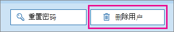

# <a name="delete-a-booking-calendar-in-bookings"></a>删除 Bookings 中的预订日历

本文介绍如何删除不需要的预订日历。 可以在会议中删除预订日历Microsoft 365 管理中心或使用 PowerShell。 Bookings 日历是 Exchange Online邮箱，因此删除相应的用户帐户以删除预订日历。

> [!IMPORTANT]
> 必须使用本主题中的 PowerShell 说明删除在 2017 年或之前创建的所有预订日历。 在 2018 年或之后创建的所有预订日历都可以在日历Microsoft 365 管理中心。

预订日历是存储有关该预订日历和数据的所有相关信息的位置，包括：

- 创建预订日历时添加的业务信息、徽标和工作时间
- 创建预订日历时添加的相关员工和服务
- 创建预订日历后添加到预订日历的所有预订和请假约会。

> [!WARNING]
> 一旦删除了预订日历，此其他信息也会永久删除，并且无法恢复。

## <a name="delete-a-booking-calendar-in-the-microsoft-365-admin-center"></a>删除预订日历Microsoft 365 管理中心

1. 转到 Microsoft 365 管理中心。

1. 在管理中心，选择" **用户** "。

   

1. 在" **活动用户**"页面上，选择要删除的用户的姓名，然后选择" **删除用户**"。

   

## <a name="delete-a-booking-calendar-using-exchange-online-powershell"></a>使用 PowerShell 删除Exchange Online日历

有关[连接 PowerShell Exchange Online](/powershell/exchange/exchange-online-powershell-v2)的先决条件和指南，请参阅 Exchange Online PowerShell。

若要执行这些步骤，您必须使用活动的 Microsoft PowerShell 命令窗口，通过选择"以管理员方式运行"选项运行。

1. 在 Windows PowerShell 窗口中，通过运行以下命令加载 EXO V2 模块：

   ```powershell
   Import-Module ExchangeOnlineManagement
   ```

   > [!NOTE]
   > 如果已[安装 EXO V2 模块](/powershell/exchange/exchange-online-powershell-v2#install-and-maintain-the-exo-v2-module)，则上一个命令将按书面工作。
   
2. 需要运行的命令使用以下语法：

   ```powershell
   Connect-ExchangeOnline -UserPrincipalName <UPN> 
   ```

   - _\<UPN\>_ 是采用用户主体名称格式的帐户（例如 `john@contoso.com`）。

3. 系统提示时，使用租户管理员凭据登录托管要永久删除Microsoft 365日历的租户。

4. 处理完此命令后，输入以下命令，获取租户中的预订邮箱列表：

   ```powershell
   Get-EXOMailbox -RecipientTypeDetails SchedulingMailbox
   ```

5. 键入以下命令：

   ```powershell
   remove-mailbox [BookingCalendarToDelete]
   ```

   > [!IMPORTANT]
   > 请注意，键入要永久删除的预订邮箱别名的确切名称。

6. 若要验证日历是否已删除，请输入以下命令：

   ```powershell
    Get-EXOMailbox -RecipientTypeDetails SchedulingMailbox
   ```

   已删除的日历不会显示在输出中。
