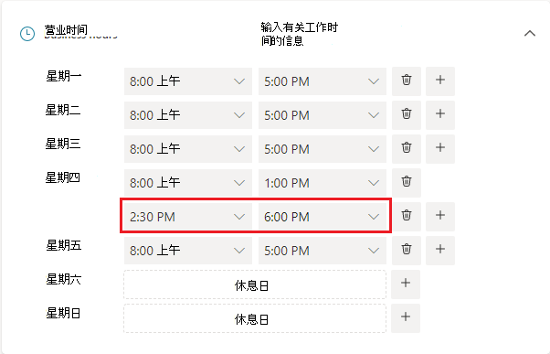
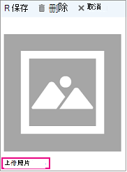

# 输入商业信息

> [!NOTE]
> 本文可帮助你与最新版本的Microsoft Bookings交互。 以前的版本将在未来几个月内停用。

在Microsoft Bookings中，Web 应用中的“业务信息”页包含你通常在企业“关于我们”页面上找到的所有详细信息。 这些详细信息包括相关名称、地址、电话号码、网站 URL、隐私策略 URL、徽标和营业时间。

此处提供的信息将显示在客户和客户端用于预订约会 (称为预订页) 以及Bookings发送给他们的消息和提醒中。 下面突出显示了预订页上的此信息的示例。

   

> [!NOTE]
> 若要开始，请参阅[获取对Microsoft Bookings的访问权限](get-access.md)。 若要打开或关闭Bookings，请参阅为[组织打开或关闭Bookings](turn-bookings-on-or-off.md)。

## 提供业务名称和联系人信息

1. 在Microsoft 365中，选择应用启动器，然后选择 **Bookings**。

1. 在导航窗格中，选择左窗格中的 **calendarBusiness**  >  信息。

1. 在 **“基本详细信息**”部分中，输入要用于Bookings日历的业务名称、地址和电话号码。

:::image type="content" source="../media/bookings-business-basic-details.png" alt-text="屏幕截图：用于输入基本业务信息的页面":::

在 **发送客户答复时**，键入首选电子邮件地址，其中应转发对预订确认和提醒的电子邮件答复。

在 **“网站 URL** ”字段中，输入企业主页的 URL。

输入 **隐私策略** 和 **条款&条件** URL。

1. 在 **“业务徽标**”部分，如果尚未将业务徽标上传到Bookings应用，请添加业务徽标。

1. 在 **“设置工作时间** ”部分中，将营业时间设置为运营时间。 这些时间是所有预订受限的时间。 可以为每个服务以及 **服务** 和 **员工页面中的** 每个工作人员设置可预订约会时间的其他时间限制。

在“业务信息”页上的“营业时间”下，使用下拉列表选择每天的开始和结束时间。 单击此项 **+** 可添加开始时间和结束时间选择器。

默认情况下，Bookings应用中的营业时间设置为上午 8 点。 到下午 5 点，星期一到星期五。 以 15 分钟的增量提供时间。 Bookings应用使用 12 小时制。

1. 选择“保存”。

### 如何为拆分班次设置小时数

可能需要阻止每天或每周的一部分来召开员工会议、更新库存或处理其他业务节奏详细信息。 Bookings应用允许将客户约会限制为指定的时间段。

例如，每个星期四从 1 点到 2：30 都会召开员工会议，并希望阻止该时间，以便所有员工都可以参加。 为此:

1. 在“业务信息”页的“营业时间”下，选择周四的开始和结束时间。 在此示例中，我们将设置上午 8：00。 到下午 1：00

1. 选择此选项 **+** 可为星期四创建新行。

   

1. 在新行中，选择下午 2：30。 开始时间和下午 6：00 结束时间。

   

1. 选择“保存”。

    当客户转到你的预订页面时，他或她会看到你的业务在周四的 1 到 2：30 关闭。

## Upload徽标

如果尚未将业务徽标上传到Bookings应用，则可以从“业务信息”页执行此操作。

1. 在“业务信息”页上，在Upload徽标下，选择 **“更改**”。

1. 选择 **Upload照片**。

   

1. 选择“保存”。
