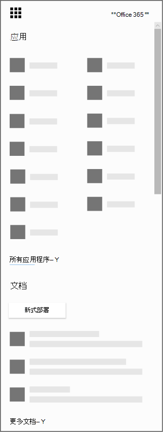

# 获取适用于 iOS 和 Android 的Microsoft Bookings应用

> [!NOTE]
> 本文可帮助你与最新版本的Microsoft Bookings交互。 以前的版本将在未来几个月内停用。

Microsoft Bookings可用作适用于 iOS 和 Android 的移动应用。 适用于 iOS 的Bookings应用在 Apple 支持的所有地区和国家/地区均可用。 可以从 [iTunes App Store](https://apps.apple.com/app/microsoft-bookings/id1065657468)下载应用。 适用于 Android 的 Bookings 应用可从美国和加拿大的 [Google Play 应用商店](https://play.google.com/store/apps/details?id=com.microsoft.exchange.bookings)下载。

## 准备工作

在开始之前，需要在 Web 上设置Bookings。

1. 在应用启动器中，选择"所有应用"，查看可供你使用的Microsoft 365应用的按字母顺序排列的列表。 可以从那里搜索特定应用

   

2. 转到 [Office主页](https://office.com)，然后从应用启动器中选择 **Bookings**。

3. 选择 **"立即获取"。**

4. 提供你拥有或运行的业务或组织的名称和类型。

5. 现已准备好为组织设置Bookings。 按照[Microsoft Bookings](bookings-overview.md)主题中的步骤完成设置Bookings。

## 下载Bookings应用

设置Bookings Web 应用后，请转到设备的联机存储，下载Bookings应用并使用管理员帐户登录。

## 仅查看模式

在Bookings中未获得读写访问权限的任何用户仍然可以在仅限视图模式下使用移动应用。 任何拥有Bookings许可证的用户，如果被添加到预订日历中，都可以查看自己的和同事的计划、约会详细信息和业务信息。 具有仅限视图访问的用户无法进行更改或编辑，也无法访问客户列表。
