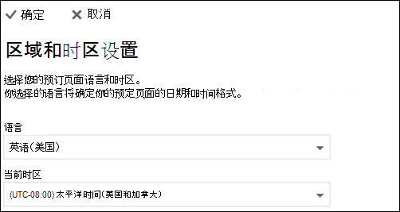

# 在Microsoft Bookings中设置语言和时区

> [!NOTE]
> 本文可帮助你与最新版本的Microsoft Bookings交互。 以前的版本将在未来几个月内停用。

如果使用的是Microsoft Bookings并在错误的时间创建预订，则可能需要更改时区设置。 同样，如果某些预订的语言错误，则可能需要更改语言设置。

Bookings有两个单独的语言和时区设置。 第一个设置控制预订日历的语言和时区，并使用登录用户的个人日历的Outlook 网页版设置进行设置。 第二个设置会影响客户使用的自助预订页面，并且使用仅控制该页面的语言和时区的"区域设置"页面进行设置。

## 设置预订日历的语言和时区

预订日历使用登录用户的语言和时区设置。 例如，如果登录用户的时区设置为东部标准时间 (EST) ，则预订日历将在 EST 中显示现有的约会开始和结束时间。 此时区最初是在创建用户的Microsoft 365和Outlook 网页版帐户时设置的。

若要设置预订日历的语言和时区，请执行以下操作：

1. 登录到Microsoft 365，并在登陆页上选择Outlook磁贴 (如以下屏幕截图) 或Microsoft 365应用Launcher中所示。

   

1. 打开Outlook后，选择屏幕右上角的 **齿轮图标** 以打开个人和帐户设置，然后在 **设置** 面板搜索框中搜索"时区"。 该面板将更新以显示此帐户的当前个人语言和时区设置。 如上所述，此设置还控制预订日历的语言和时区。

1. 通过在"语言"或"当前时区"框中选择下拉箭头并选择所需的设置来更改语言 **或时区** 。

1. 单击 **“保存”**。 设置面板关闭，Outlook 网页版重新启动，并应用新的语言和时区设置。

## 设置预订页的语言和时区

1. 在Microsoft 365中，选择应用启动器，然后选择 **Bookings**。

1. 在导航窗格中，选择 **"预订"页** ，然后选择 **"更改语言"和"时区设置**"。

   

1. 选择语言和当前时区，然后选择"确定"。

   
