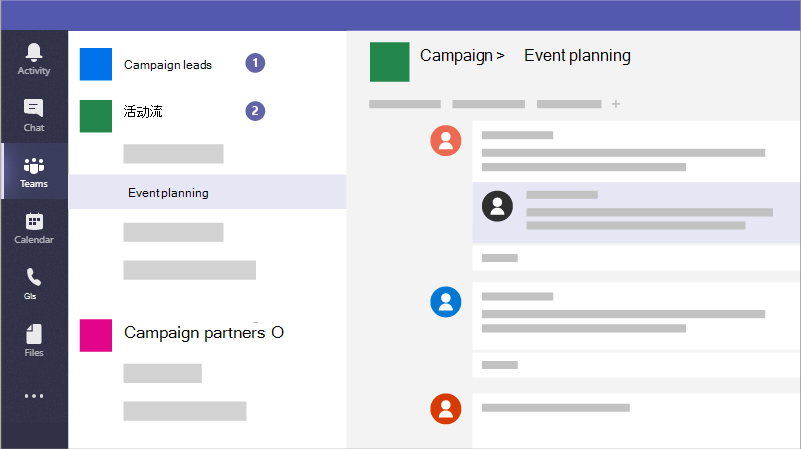

# 在企业内Microsoft Teams团队，以便你的小型企业或市场活动可以协作

Microsoft Teams是一款协作应用，可帮助员工从任何设备保持有序并展开对话。 可以使用Microsoft Teams组织外部的员工或来宾进行即时对话。 还可以拨打电话、主持会议和共享文件。

## 最佳做法

1. 为敏感信息创建私人团队。

2. 创建组织范围的团队，以与组织中的每个人通信。

3. 为特定项目创建团队，并基于应包含哪些人应用适当的保护。

4. 创建与外部合作伙伴通信的特定团队，使这些团队与业务敏感内容分开。

例如，企业、法律公司或医疗保健部门可以创建以下团队：

1. **业务团队、公司团队或业务范围团队：** 这是供每个人在日常通信中使用，并在整个企业内工作。 您可以使用此团队发布公告或共享整个公司或业务感兴趣的信息。

2. **单个团队：** 为较小的组设置团队，以协作处理其日常工作。

3. **外部通信团队：** 与供应商、合作伙伴或客户进行协调，而不让他们进入任何敏感内容。 为特定组设置不同的频道。

市场活动可以创建以下团队来安全地沟通和协作：

1. **活动潜在客户团队：** 将此功能设置为私人团队，以便只有你的主要市场活动成员可以访问它并讨论潜在的敏感问题。

2. **常规宣传活动团队：** 这是供所有人用于日常通信和工作。 个人、组或委员会可在此团队中设置频道以完成他们的工作。 例如，事件规划人员可以设置一个频道来聊天并协调宣传活动的后勤工作。

3. **合作伙伴团队：** 与供应商、合作伙伴或志愿者进行协调，而不让他们进入任何敏感内容。

创建团队时，将创建以下其他内容：

- 新组[Microsoft 365组](/MicrosoftTeams/office-365-groups)

- 一[SharePoint Online](/MicrosoftTeams/sharepoint-onedrive-interact) 网站和文档库来存储团队文件

- 共享[Exchange Online](/MicrosoftTeams/exchange-teams-interact)日历

- OneNote 笔记本

- 与其他应用Office 365，如 Planner 和 Power BI

在Microsoft Teams内，你可以找到：

1. **Teams：** 查找属于自己的频道或创建自己的频道。 可以在内部频道内召开现场会议、进行对话和共享文件。

2. **会议：** 查看在一天或一周排好电话的所有内容。 或者，安排会议。 此日历与你的日历Outlook同步。

3. **呼叫：** 在某些情况下，如果你的组织已设置它，你可以从 Microsoft Teams呼叫任何人，即使他们没有使用 Microsoft Teams。

4. **活动：** 跟进所有未读邮件、@mentions、回复等。

使用顶部的命令框搜索特定项目或人员、执行快速操作并启动应用。

## 设置

仅为业务所有者和经理或市场活动经理和候选人创建私人团队，如下所示。

> [!VIDEO https://www.microsoft.com/videoplayer/embed/RWeqWA]

创建组织范围的团队，企业或活动中的每个人都可以使用该团队进行通信和共享文件。

> [!VIDEO https://www.microsoft.com/videoplayer/embed/RE2GCG9]

创建与组织外部的来宾共享的团队，例如广告或财务。

> [!VIDEO https://www.microsoft.com/videoplayer/embed/RE1FQMp]

若要详细了解Microsoft Teams，请参阅[Microsoft Teams文档](/microsoftteams/microsoft-teams)

## 管理员设置

你必须是管理员才能创建组织范围的团队。 有关详细信息，请参阅[什么是管理员Microsoft 365？](https://support.office.com/article/what-is-an-admin-e123627e-4892-4461-b9aa-1b6d57a5cfa4?ui=en-US&rs=en-US&ad=US)。