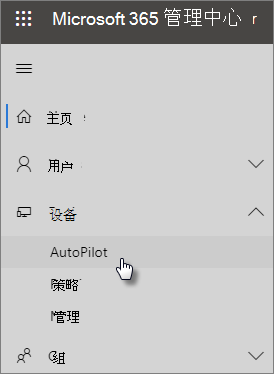

# 使用分步指南添加 Autopilot 设备和配置文件

> [!NOTE]
> Microsoft Defender 商业版 2022 年 3 Microsoft 365 商业高级版 1 开始向客户推出。 此产品/服务为设备提供其他安全功能。 [概述Microsoft Defender 商业版](../security/defender-business/mdb-overview.md)。

可以使用 Windows AutoPilot 为Windows 10设置新的 Windows 10 设备，以便当你将这些设备供员工使用时，这些设备可供使用。
  
## 设备要求

设备必须满足以下要求：
  
- Windows 10版本 1703 或更高版本
    
- 尚未体验全新体验Windows全新体验的新设备
    
## 使用设置指南创建设备和配置文件

如果你尚未创建设备组或配置文件，则开始使用最佳方法就是使用分步指南。 还可以添加 [AutoPilot 设备，](m365bp-create-and-edit-autopilot-devices.md)[并为其分配配置文件](../admin/devices/create-and-edit-autopilot-profiles.md)，而无需使用指南。 
  
1. 转到位于 <a href="https://go.microsoft.com/fwlink/p/?linkid=837890" target="_blank">https://admin.microsoft.com</a> 的管理中心。

2. 在左侧导航窗格中，选择 **设备** \> **AutoPilot**。

    
  
2. 在 **AutoPilot** 页面上，单击或点击"开始 **指南"**。
    
    
  
3. On the **Upload .csv file with list of devices** page， browse to a location where you have the prepared .CSV file， then **Open** \> **Next**. 文件必须具有三个标头：
    
    - 列 A：设备序列号
    
    - 列 B：Windows 产品 ID
    
    - 列 C：硬件哈希
    
    你可以从硬件供应商获取此信息，或者可以使用 [Get-WindowsAutoPilotInfo PowerShell](https://www.powershellgallery.com/packages/Get-WindowsAutoPilotInfo) 脚本生成 CSV 文件。 
    
    有关详细信息，请参阅 [设备列表 CSV 文件](../admin/misc/device-list.md)。还可在" **上传设备列表 .csv 文件**"页面下载示例文件。 
    
> [!NOTE]
> 此脚本使用 WMI 检索客户在 Autopilot 中注册设备Windows所需的属性。 请注意，生成的 CSV 文件不收集 Windows 产品 ID (PKID) 值是正常的，因为注册设备不需要这样做，并且输出 CSV 中的 PKID 为 NULL 完全正常。 将仅填充序列号和硬件哈希。
    
4. 在 **"分配配置文件"** 页上，您可以选择现有配置文件或创建新配置文件。 如果还没有，系统将提示你创建一个。 
    
    配置文件是可应用到单个设备或一组设备的一系列设置。
    
    默认功能是必需的，并且会自动设置。 默认功能是：
    
    - 跳过Cortana、OneDrive和 OEM 注册。
    
    - 使用公司品牌创建登录体验。
    
    - 连接你的设备Azure Active Directory帐户，并自动注册它们以由 Microsoft 365 商业高级版。
    
    有关详细信息，请参阅关于 [AutoPilot 配置文件设置](m365bp-autopilot-profile-settings.md)。 
    
5. 其他设置是" **跳过隐私设置**"和" **不允许用户成为本地管理员**"。默认情况下，这两者设置为" **关**"。 
    
    选择" **下一步**"。
    
6. **你已完成指示** 你创建 (或选择) 的配置文件将应用到通过上传设备列表创建的设备组。 设置将在设备用户下次登录时生效。 选择“关闭”。

## 相关内容

- [有关 AutoPilot 配置文件设置 (](../business-premium/m365bp-autopilot-profile-settings.md) 文章) \

- [用于保护设备和应用数据的选项 (](../admin/devices/choose-device-security.md) 文章) 
- [保护业务Microsoft 365的十大方法](../admin/security-and-compliance/secure-your-business-data.md)
