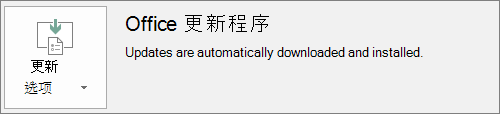

# 准备Office部署客户端Microsoft 365 商业高级版

> [!NOTE]
> Microsoft Defender 商业版 2022 年 3 Microsoft 365 商业高级版 1 开始向客户推出。 此产品/服务为设备提供其他安全功能。 [详细了解 Defender for Business](../security/defender-business/mdb-overview.md)。

## 准备在客户端计算机上自动安装 Office 应用

可以使用 Microsoft 365 商业高级版 在 Office 计算机上安装 32 位 Windows 10 应用，并使它们具有最新更新。
  
如果最终用户的计算机位于以下计算机上，则自动安装Windows 10 商业版：
  
- 没有现有的 Office 桌面应用（Word、Excel、PowerPoint、Outlook、OneNote、Publisher、Access 和 OneDrive）。
    
    或
    
- 安装了即点即用 Office 版本。
    
若要确定是否拥有即点即用版本的 Office，请在任何 Office 应用中，转到" **文件**"\>" **帐户**"（如 Outlook 中的 **Office 帐户**。 如果看到 **Office** 更新，则使用即点即用完成安装。 
  

  
 **Who此功能的好处**
  
电脑属于以下情况的最终用户：
  
- **拥有** Windows 10 商业版用户许可证、Microsoft 365企业版许可证Windows 10 创意者更新并加入Azure Active Directory。 
    
- **没有** 64 位应用Office例如 (Word、Excel、PowerPoint) 。 如果需要 64 位 Office 应用，则此功能不适合，因为不支持从 Microsoft 365 商业版管理控制台触发 64 位 2016 即点即用版本的 Office。 
    
- **没有** 任何 2016 Windows Installer (MSI) 独立应用（如 Visio 或 Project）。 Microsoft 365升级到 Office 2016 即点即用版本的企业升级，它不能用于 Office Office 2016 MSI 独立应用。 
    
下表显示了最终用户/管理员可能需要执行哪些操作，具体取决于其开始状态，才能从 Microsoft 365 商业版管理控制台成功部署 32 位即点即用版本的 Office。 

|启动 Office 安装状态|在安装企业Microsoft 365之前Office的操作|结束状态|
|:-----|:-----|:-----|
|未安装任何 Office 套件  |无  |Office运行安装 2016 32 位版本  |
|有 32 位即点即用版 Office（2016 或更低版本）且无独立应用  |无  |根据需要，升级到了最新的 32 位即点即用版 Office 2016 **\*** |
|现有 32 位单击-运行版本的 Office 和 32 位或 64 位独立 Office 应用 (例如，Visio、Project)   |无  |独立应用不受影响。 套件升级到 32 位即点即用版 Office 2016  |
|有 32 位即点即用版 Office 和任何 32 位/64 位（除 2016）MSI 独立 Office 应用  |无  |独立应用不受影响。 套件升级到 32 位即点即用版 Office 2016  |
|有任何 64 位即点即用版 Office  |卸载 64 位Office应用（如果可以将其替换为 32 位 Office应用）  |如果删除了 Office 64 位应用，则安装 32 位即点即用版 Office 2016  |
|安装有 MSI Office 2016，有/无独立应用  |卸载 MSI Office 2016。  |安装了 32 位即点即用版 Office 2016。不更改独立应用  |
|安装有 MSI Office 2013（或更低版本）和/或独立 Office 应用  |无  |32 位即点即用版 Office 2016 和预先存在的 MSI Office 安装（和独立应用）并存  |
   
 **(\*) 注意：** 由于一个已知 bug，不升级到 32 位即点即用版 Office 2016。 正在修复。 
  