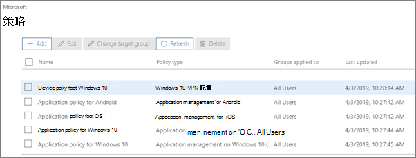
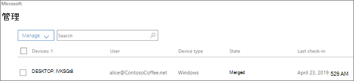

# 查看和管理策略和设备

本文适用于Microsoft 365 商业高级版。

> [!NOTE]
> Microsoft Defender 商业版 2022 年 3 Microsoft 365 商业高级版 1 开始向客户推出。 此产品/服务为设备提供其他安全功能。 [详细了解 Defender for Business](../security/defender-business/mdb-overview.md)。

## 查看和编辑设备策略

1.  转到位于 <a href="https://go.microsoft.com/fwlink/p/?linkid=837890" target="_blank">https://admin.microsoft.com</a> 的管理中心。
2. 在左侧导航上，选择 **"设备策略** \> **"**。

    在此页面上，可以创建、编辑、更改目标组或删除策略。

    
  
## 查看和管理设备

1. 在左侧导航上，选择 **"设备管理** \> **"**。 
    
    在此页面上，可以选择一个或多个设备并删除公司数据。 对于设置了设备保护设置的 Windows 10 设备，还可以选择将设备重置为出厂设置。
  
   

## 另请参阅

[保护业务Microsoft 365的十大方法](../admin/security-and-compliance/secure-your-business-data.md)