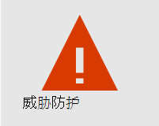
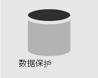
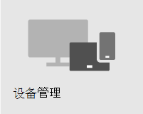

# 安全性概述

> [!VIDEO https://www.microsoft.com/videoplayer/embed/RE4mzxI?autoplay=false]

Microsoft 365 商业高级版提供了威胁防护、数据保护和设备管理功能，可帮助你保护公司免受联机威胁和未经授权的访问，以及保护和管理手机、平板电脑和计算机上的公司数据。

| [威胁防护](#threat-protection)|  [数据保护](#data-protection) |   [设备管理](#device-management) |
|--|--|--|

## 威胁防护

Microsoft 365 商业高级版包括[Office 365高级威胁防护 (ATP) ，](safe-links.md)这是一种基于云的电子邮件筛选服务，可保护你免受恶意软件、勒索软件、有害的链接等的攻击。 ATP 保险箱 链接可保护你免受电子邮件或文档链接Office URL。 ATP 保险箱 附件可保护您免受附加到邮件或文档的恶意软件和病毒的侵害。

[多重身份验证 (MFA ](turn-on-mfa.md)) 或两步验证，要求你提供第二种形式的身份验证（如验证码）以确认身份，然后才能访问资源。

[Windows Defender](/windows/security/threat-protection/overview-of-threat-mitigations-in-windows-10)为系统、文件和联机活动提供全面保护，防止病毒、恶意软件、间谍软件和其他威胁。

## 数据保护

数据保护功能Microsoft 365 商业高级版确保重要数据保持安全，并且只有授权人员才能访问这些数据。

您可以使用 [DLP (数据丢失 ](set-up-dlp.md)) 识别和管理敏感信息，如社会保险或信用卡号，以便不会错误地共享。

[Office 365 邮件加密](/microsoft-365/compliance/ome)加密和访问权限功能，以帮助确保只有预期收件人才能查看邮件内容。 Office 365 邮件加密适用于 Outlook.com、Yahoo！和 Gmail 以及其他电子邮件服务。

[Exchange Online Archiving](/office365/servicedescriptions/exchange-online-archiving-service-description/exchange-online-archiving-service-description)是一种基于云的存档解决方案，与 Microsoft Exchange 或 Exchange Online 一起提供高级存档功能，包括保留和数据冗余。 可以使用保留策略来帮助组织减少与电子邮件和其他通信相关的义务。 如果贵公司需要保留与诉讼相关的通信，可以使用In-Place保留和诉讼保留来保留相关电子邮件。

## 设备管理

Microsoft 365 商业高级版高级设备管理功能，可监视和控制用户可以使用已注册设备执行哪些操作。 这些功能包括条件访问、移动设备管理 (MDM) 、BitLocker 和自动更新。 

可以使用条件访问策略对某些用户和任务要求额外的安全措施。 例如，你可以要求使用 [MFA ](/microsoft-365/business-video/turn-on-mfa) (多重) 或阻止不支持条件访问的客户端。

借助 MDM，可帮助保护和管理用户的移动设备，如 iPhone、iPad、Android 和 Windows 手机。 你可以创建和管理设备安全策略、远程擦除设备以删除所有公司数据、将设备重置为出厂设置以及查看详细的设备报告。

你可以启用 BitLocker 加密以帮助保护设备丢失或被盗时的数据，并启用 Windows 攻击防护，以针对勒索软件提供高级保护。

你可以配置自动更新，以便将最新的安全功能和更新应用于所有用户设备。

## 建议的安全指南

如有 Microsoft 商业高级版，设置安全性并开始安全协作的最快方法是遵循此库中的指南：[面向小型企业和活动的 Microsoft 365](../campaigns/index.md)。 此指南是与 Microsoft Defending Democracy 团队合作制定的，旨在保护所有小型企业客户免受老练黑客发起的网络威胁。
