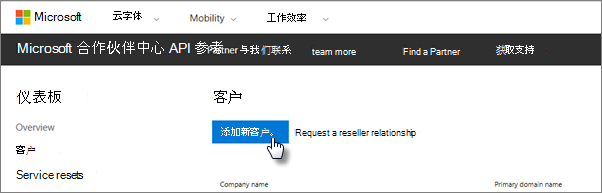

# 获取 Microsoft 365 商业版

## 从 Microsoft 获取 Microsoft 365 商业版

如果你没有合作伙伴并且想要获取 Microsoft 365 商业版，你可以在[此处购买它](https://www.microsoft.com/en-US/microsoft-365/business)。

有关详细说明，请参阅[注册 Microsoft 365 商业](sign-up.md)版。

你也可以转到[Microsoft Store](https://www.microsoft.com/en-us/store/locations/find-a-store?icid=en_US_Store_UH_FAS)购买 Microsoft 365 业务并获取设置帮助。
  
## 从 Microsoft 合作伙伴中心获取 Microsoft 365 商业版

1. 通过使用注册参加云服务提供商 (CSP) 计划时创建的凭据，登录 [Microsoft 合作伙伴中心](https://go.microsoft.com/fwlink/p/?linkid=849910)。 
    
2. 在 "合作伙伴仪表板" 中，选择 "**客户**"，然后选择您的客户或添加新客户，然后再获取 Microsoft 365 商业版。
    
    
  
3. 在 "客户**订阅**" 页上，选择 "**添加订阅**"，选择 "目录" 下的 "小型企业" 选项，然后选择 " **Microsoft 365 business**"。
    
    选择所需的许可证数（不超过 300 个）。 如果用户数超过300，请参阅[Microsoft 365 Enterprise](https://go.microsoft.com/fwlink/p/?linkid=862316) 。 
    
    
  
    完成添加新客户（包括公司名称）的其余步骤。
    

