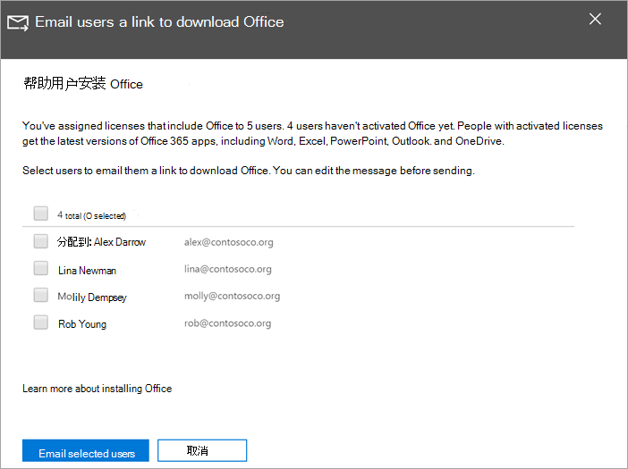

# 帮助用户在 Windows 10 设备上安装 OfficeHelp your users install Office on Windows 10 devices

可以从 Microsoft 365 管理中心在 Windows 10 PC 上快速轻松地安装 Office。You can quickly and easily install Office on Windows 10 PCs from the Microsoft 365 admin center.
  
若要了解这如何适用于以前安装的 Office 应用，请在开始之前阅读[准备 Office 客户端安装](prepare-for-office-client-deployment.md)。To understand how this works with previously installed Office apps, read [Prepare for Office client installation](prepare-for-office-client-deployment.md) before you get started.

观看有关安装 Office 应用的简短视频。Watch a short video about installing Office apps.  

> [!VIDEO https://www.microsoft.com/videoplayer/embed/acce002c-0756-4b64-ac5d-2198ee96a9b1] 

如果你发现此视频有帮助，请查看[适用于小型企业和 Microsoft 365 新用户的完整培训系列](https://support.microsoft.com/office/6ab4bbcd-79cf-4000-a0bd-d42ce4d12816)。If you found this video helpful, check out the [complete training series for small businesses and those new to Microsoft 365](https://support.microsoft.com/office/6ab4bbcd-79cf-4000-a0bd-d42ce4d12816).

## 管理 Office 部署Manage Office deployments

1. 转到 管理中心 ， <a href="https://go.microsoft.com/fwlink/p/?linkid=2024339" target="_blank">https://admin.microsoft.com</a> 然后使用全局管理员凭据登录。Go to the admin center at <a href="https://go.microsoft.com/fwlink/p/?linkid=2024339" target="_blank">https://admin.microsoft.com</a>, and sign in with global admin credentials. 

2. 转到左侧 **导航** 窗格中的"设置"，在"设置"页上，滚动到"**应用和更新"。**Go to **Setup** in the left navigation pane, and on the **Setup** page, scroll to **Apps and updates**.
    > [!NOTE]
    > 如果您的所有用户都安装了 Office 应用，则可能不会看到此卡片。You might not see this card if all of your  users have installed Office apps.
  
3. 在"**帮助用户安装其 Office 应用"** 卡上，选择"**查看**"，然后选择"**开始使用"。**On the **Help users install their Office apps** card, choose **View**, and then **Get started**.
    
4. 在 **"向用户发送电子邮件"链接以** 下载 Office 面板上，选择要通过电子邮件发送的用户，然后选择"**通过电子邮件发送所选用户"。**On the **Email users a link to download Office** panel, select the users you want to email, and then **Email selected users**.

   

## 有关设置和使用 Microsoft 365 商业高级版更多信息For more on setting up and using Microsoft 365 Business Premium

[Microsoft 365 商业版培训视频Microsoft 365 for business training videos](https://support.microsoft.com/office/6ab4bbcd-79cf-4000-a0bd-d42ce4d12816)