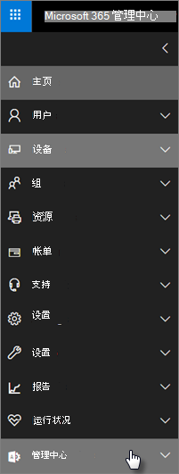

# Microsoft 365 商业高级安全性和合规性功能

Microsoft 365 商业高级版提供了简化的安全功能，以帮助保护电脑、电话和平板电脑上的数据。
    
## Microsoft 365 管理中心安全功能

您可以在管理中心中管理许多 Microsoft 365 商业高级安全功能，这使您可以更简单的方式打开或关闭这些功能。 在管理中心，您可以执行以下操作：
  
- [设置 Android 或 iOS 设备的应用程序管理设置](app-protection-settings-for-android-and-ios.md) 。 
    
    这些设置包括在设定的时间段后从非活动设备中删除文件、对工作文件进行加密、要求用户设置 PIN 等。
    
- [设置 Windows 10 设备的应用程序保护设置](protection-settings-for-windows-10-devices.md) 。 
    
    这些设置可应用于公司拥有的或个人拥有的设备上的公司数据。
    
- [设置 Windows 10 设备的设备保护设置](protection-settings-for-windows-10-pcs.md) 。 
    
    您可以启用 [BitLocker](https://go.microsoft.com/fwlink/p/?linkid=871405) 加密以在设备丢失或被盗时帮助保护数据，并启用 [Windows 漏洞防护](https://docs.microsoft.com/windows/security/threat-protection/microsoft-defender-atp/enable-exploit-protection) 以提供针对勒索软件的高级防护。 
    
- [从设备中删除公司数据](remove-company-data.md)
    
    如果设备丢失、被盗或员工离开你的公司，你可以远程擦除公司数据。
    
- [将 Windows 10 设备重置为其出厂设置](reset-devices-to-factory-settings.md) 。 
    
    您可以重置任何已应用设备保护设置的 Windows 10 设备。
    
## 其他安全功能 

Microsoft 365 商业高级版中的高级功能可帮助您保护业务，抵御网络威胁并保护敏感信息。
  
- **[Office 365 高级威胁防护](https://docs.microsoft.com/microsoft-365/security/office-365-security/office-365-atp)**
    
     (ATP) 的高级威胁防护可帮助保护您的业务不受复杂的网络钓鱼和勒索软件攻击，旨在危害员工或客户信息。 这些功能包括： 
    
  - 完善的附件扫描和 AI 分析，以检测并丢弃危险邮件。
    
  - 自动检查电子邮件中的链接以进行评估（如果它们是网络钓鱼方案的一部分）。 这使您可以安全地访问不安全的网站。

- **[Azure 门户中的 Intune 的完整功能](https://go.microsoft.com/fwlink/p/?linkid=871403)**
    
    通过在 Azure 门户中访问 Intune 管理中心，可以设置其他安全功能，如 MacOS 设备、iPhone 和 Android 设备的管理，以及 Windows 的高级设备管理，这些功能无法通过 Microsoft 365 管理中心提供。
- **与 Azure AD Premium P1 计划相同的[条件访问](https://docs.microsoft.com/azure/active-directory/conditional-access/overview)**

    条件访问可帮助保护您的组织不受登录风险、访问来自意外网络或区域设置的尝试、访问来自有风险的设备类型的尝试，等等。 在第一次身份验证完成后，将强制执行条件访问策略，并使用来自第一种身份验证事件的信号来确定是否应批准、拒绝或更多证明 (例如标识) 的第二种形式。

    条件访问功能包括：

    - 基于用户名、组和角色的访问权限
    - [基于应用程序的](https://docs.microsoft.com/azure/active-directory/conditional-access/app-based-conditional-access)访问 
    - [基于位置的访问权限](https://docs.microsoft.com/azure/active-directory/authentication/howto-registration-mfa-sspr-combined#conditional-access-policies-for-combined-registration); 仅允许来自受信任的 IP 范围或特定国家/地区的访问 
    - 需要对 access 进行 MFA
    - 阻止对使用[旧版身份验证](https://docs.microsoft.com/azure/active-directory/conditional-access/block-legacy-authentication)的应用的访问
    - 要求应用 tp 使用 [Intune 应用保护](https://docs.microsoft.com/azure/active-directory/conditional-access/app-protection-based-conditional-access)
    - 自定义身份验证（如与第三方提供商的 MFA），例如，双核。
   
    其他功能：
    - 混合 Azure AD 的[自助服务密码重置](https://docs.microsoft.com/azure/active-directory/authentication/concept-sspr-customization)
    
## 合规性功能

Microsoft 365 商业高级版订阅包括可帮助您维护合规性和法规标准的功能。

-  (DLP) **[的数据丢失防护策略概述](https://docs.microsoft.com/microsoft-365/compliance/data-loss-prevention-policies)**。 
    
    您可以设置 DLP 以自动检测敏感信息，如信用卡号、社会保险号码等，以防止无意中与公司外部共享。
    
- **[Exchange Online Archiving](https://products.office.com/exchange/microsoft-exchange-online-archiving-email)**
    
    Exchange Online 存档许可证使邮件能够通过连续数据备份轻松存档。 它存储用户的所有电子邮件，包括已删除的项目，以备日后发现或还原时需要。 此外，您还可以使用不同的保留策略来保留电子邮件数据以用于诉讼保留、电子数据展示或满足合规性要求。
    
- **[敏感度标签](https://docs.microsoft.com/microsoft-365/compliance/sensitivity-labels)**

   Microsoft 365 商业高级版包括 [Azure 信息保护计划 1](https://go.microsoft.com/fwlink/p/?linkid=871407)的所有功能。 使用此计划，可以创建 **敏感度标签** ，以允许您控制对电子邮件和文档中敏感信息的访问，其中包含 "请勿转发" 和 "不复制" 等控件。 您还可以将敏感信息分类为 "机密"，并指定如何在企业外部和内部共享保密信息。 企业级加密易于应用于电子邮件和文档，以确保信息保密。 您还可以安装适用于 Office 应用的 Azure 信息保护客户端外接程序。 有关详细信息，请参阅 [Azure 信息保护统一标记客户端](https://docs.microsoft.com/azure/information-protection/rms-client/unifiedlabelingclient-version-release-history)。 若要区分灵敏度标签，请安装 **AzInfoProtection_UL.exe**。

您可以在安全 &amp; 合规性中心和 Intune 管理中心中管理这些功能。 随着时间的推移，简化的控件将添加到 Microsoft 365 管理中心。
  
    
## 常见问题解答

 ### 这些安全功能在所有市场中是否可用？
  
是的，在销售 Microsoft 365 商业高级版的所有市场中均提供这些功能。
  
### 如何查找安全 &amp; 合规性中心？
  
1. 使用管理员凭据[登录到 Microsoft 365 商业高级版](https://portal.microsoft.com/)。 
    
2. 在左侧导航中，找到 **管理中心** 并展开它。 
    
    
  
3. 选择 " **安全 &amp; 合规性** " 以转到 "安全 &amp; 合规中心"。
