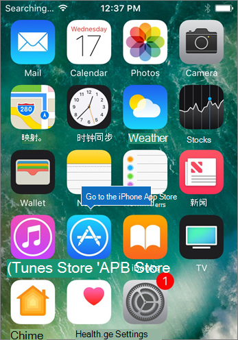
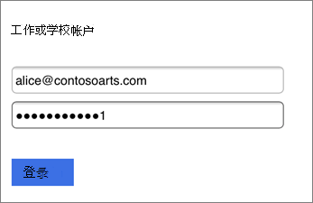
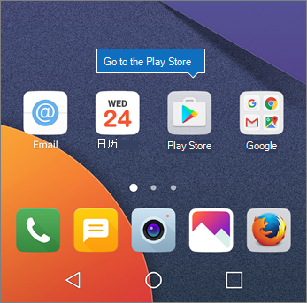
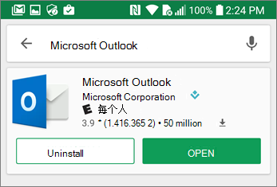
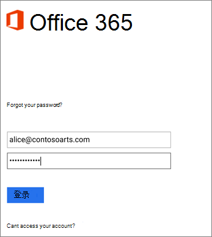
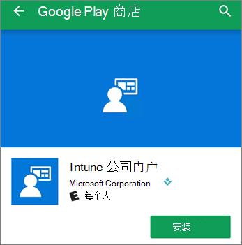

# 为商业用户设置Microsoft 365移动设备Set up mobile devices for Microsoft 365 for business users

按照标签中的说明在 iPhone 或 Android 手机上安装 Office。Follow the instructions in the tabs to install Office on an iPhone or an Android phone. 执行这些步骤后，在 Office 中创建的工作文件将受适用于Microsoft 365保护。After you follow these steps, your work files created in Office apps will be protected by Microsoft 365 for business.

此示例适用于 Outlook，但也适用于要安装的任何其他 Office 应用程序。The example is for Outlook, but applies for any other Office apps you want to install also.
  
## 设置移动设备Set up mobile devices

## [iPhoneiPhone](#tab/iPhone)
  
观看有关如何使用适用于Office在 iOS 设备上设置应用Microsoft 365视频。Watch a short video on how to set up Office apps on iOS devices with Microsoft 365 for business.  

> [!VIDEO https://www.microsoft.com/videoplayer/embed/RWee2n] 

如果你发现此视频有帮助，请查看[适用于小型企业和 Microsoft 365 新用户的完整培训系列](../business-video/index.yml)。If you found this video helpful, check out the [complete training series for small businesses and those new to Microsoft 365](../business-video/index.yml).

转到" **App Store**"，在搜索字段中键入 Microsoft Outlook。Go to **App store**, and in the search field type in Microsoft Outlook.
  

  
点击云图标以安装 Outlook。Tap the cloud icon to install Outlook.
  

  
安装完成后，点击" **打开**"按钮打开 Outlook，然后点击" **开始使用**"。When the installation is done, tap the **Open** button to open Outlook and then tap **Get Started**.
  

  
在"添加电子邮件帐户"屏幕上的"添加帐户"上输入你的工作电子邮件地址， \> 然后Microsoft 365你的企业凭据" \> **登录"。**Enter your work email address on the **Add Email Account** screen \> **Add Account**, and then enter your Microsoft 365 for business credentials \> **Sign in**.
  

  
如果你的组织正在保护应用中的文件，你将看到一个对话框，指出你的组织现在正在保护应用中的数据，你需要重新启动该应用才能继续使用它。If your organization is protecting files in apps, you'll see a dialog stating that your organization is now protecting the data in the app and you need to restart the app to continue to use it. 点击" **确定**"并关闭 Outlook。Tap **OK** and close Outlook. 
  

  
在 iPhone 上找到 Outlook，并重启。Locate Outlook on the iPhone, and restart it. 系统提示时，输入 PIN 并进行验证。When prompted, enter a PIN and verify it. 现在即可开始使用 iPhone 上的 Outlook。Outlook on your iPhone is now ready to be used.
  

  
## [AndroidAndroid](#tab/Android)
  
观看有关在 Android 设备上Outlook Office和配置的视频。Watch a video about installing Outlook and Office on Android devices.  

> [!VIDEO https://www.microsoft.com/videoplayer/embed/ecc2e9c0-bc7e-4f26-8b14-91d84dbcfef0] 

如果你发现此视频有帮助，请查看[适用于小型企业和 Microsoft 365 新用户的完整培训系列](../business-video/index.yml)。If you found this video helpful, check out the [complete training series for small businesses and those new to Microsoft 365](../business-video/index.yml).

若要在 Android 手机上开始设置，请转到 Play Store。To begin setup on your Android phone, go to the Play Store.
  

  
Enter Microsoft Outlook in the Google Play search box and tap **Install**.Enter Microsoft Outlook in the Google Play search box and tap **Install**. 完成Outlook后，点击"打开 **"。**Once Outlook is done installing, tap **Open**.
  

  
在 Outlook 应用中，点击"入门"，然后Microsoft 365你的企业电子邮件帐户"继续"， \> 然后使用你的组织凭据登录。In the Outlook app, tap **Get Started**, then add your Microsoft 365 for business email account \> **Continue**, and sign in with your organization credentials.
  

  
在提示必须安装 Intune 公司门户应用的对话框中，点击" **转到应用商店**"。In the dialog that states you must install the Intune Company Portal app, tap **Go to store**.
  

  
在 Play Store 中，安装Intune 公司门户。In Play Store, install Intune Company Portal.
  

  
再次打开 Outlook，然后输入并确认 PIN。现在即可开始使用 Outlook 应用。Open Outlook again, and enter and confirm a PIN. Your Outlook app is now ready for use.
  

## 相关内容Related content

[Microsoft 365 商业版培训视频Microsoft 365 for business training videos](../business-video/index.yml)

---
