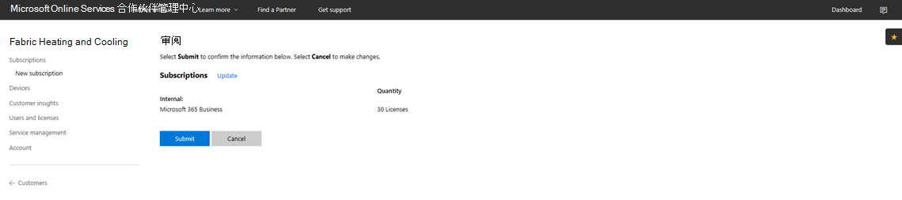

# 转换 Microsoft 365 商业版云解决方案提供商订阅

如果你有 Microsoft 365 商业版预览云解决方案提供商订阅，请按照本指南了解如何将现有预览订阅转换为 Microsoft 365 商业版 GA（通用）。

**如何将预览订阅转换为 GA**

1. 登录到<a href="https://partnercenter.microsoft.com" target="_blank">合作伙伴中心</a>。
2. 在“仪表板”中，选择 **客户**，然后找到并选择公司名称。

    将列出该公司的订阅。

    
    
3. 在公司的"订阅 **"页面上**，选择"**添加订阅"。**
4. 在"**新建订阅"** 页面上，选择"**小型企业**"，然后从Microsoft 365 **选择"商业** 版"。
5. 添加许可证号码，然后选择 **下一步: 审查** 以审查订阅，然后选择 **提交**。

    

    The **License-based subscriptions** will show **Microsoft 365 Business Preview** and **Microsoft 365 Business**. 你下一步将暂停预览订阅。

6. 选择 **Microsoft 365 商业版预览**。
7. 在 **"Microsoft 365预览版"** 页上，选择"已 **暂停**"以暂停预览订阅。

    

8. 选择 **提交** 进行确认。

    在"**订阅"** 页面上，确认 **"Microsoft 365预览"** 状态显示"已 **暂停"。**

    

9. 或者，你也可以验证许可协议。 要实现这一点，请执行下列步骤：
    1. 从公司的 **订阅** 页面上选择 **用户和许可证**。
    2. 在" **用户和许可证"** 页上，选择一个用户。
    3. 在用户页面上，查看分配许可证部分，并确认它显示Microsoft 365 **商业版**。

        

## 转换过程中和转换之后对客户和用户的影响

在转换期间和转换后，对客户和用户没有任何影响。

## 对没有进行转换的客户的影响

下表总结了对没有从 Microsoft 365 商业版预览订阅转换到 Microsoft 365 商业版订阅的客户造成的影响。

|       | 一个月之内     | 一个月到两个月 | 两个月到四个月 | 四个月以后  |
|-------|-----------------|--------------|---------------|---------------|
| **省/市/自治区** | 宽限期之内 | 已过期      | 已禁用      | 已取消设置 |
| **服务影响**                                                        |
| **Microsoft 365 管理中心** | 对功能没有影响 | 对功能没有影响 | 可添加/删除用户、购买订阅。  无法分配/撤销许可证。 | 客户的订阅和所有数据已删除。 管理员可以管理其他付费的订阅。 |
| **Office 应用**                         | 不会影响最终用户 | 不会影响最终用户 | Office 进入功能减少模式。  用户只能查看文件。 | Office 进入功能减少模式。  用户只能查看文件。 |
| **云服务（SharePoint Online、Exchange Online、Skype、团队等）** | 不会影响最终用户 | 不会影响最终用户 | 最终用户和管理员不能访问云中的数据。 | 客户的订阅和所有数据已删除。 |
| **EM+S 组件** | 不会影响管理员  不会影响最终用户 | 不会影响管理员  不会影响最终用户 | 不再强制使用功能。  请参阅[订阅到期时的移动设备影响](#mobile-device-impacts-upon-subscription-expiration)和[订阅到期时的 Windows 10 电脑影响](#windows-10-pc-impacts-upon-subscription-expiration)以了解详细信息。 | 不再强制使用功能。  请参阅[订阅到期时的移动设备影响](#mobile-device-impacts-upon-subscription-expiration)和[订阅到期时的 Windows 10 电脑影响](#windows-10-pc-impacts-upon-subscription-expiration)以了解详细信息。 |
| **Windows 10 企业版** | 不会影响管理员  不会影响最终用户 | 不会影响管理员  不会影响最终用户 | 不再强制使用功能。  请参阅[订阅到期时的移动设备影响](#mobile-device-impacts-upon-subscription-expiration)和[订阅到期时的 Windows 10 电脑影响](#windows-10-pc-impacts-upon-subscription-expiration)以了解详细信息。 | 不再强制使用功能。  请参阅[订阅到期时的移动设备影响](#mobile-device-impacts-upon-subscription-expiration)和[订阅到期时的 Windows 10 电脑影响](#windows-10-pc-impacts-upon-subscription-expiration)以了解详细信息。 |
| **Azure AD 登录到 Windows 10 电脑** | 不会影响管理员  不会影响最终用户 | 不会影响管理员  不会影响最终用户 | 不会影响管理员  不会影响最终用户 | 一旦租户被删除，用户只能使用本地凭据登录。 如果没有本地凭据，请对设备进行重镜像。 |

## 订阅到期时移动设备的影响

下表总结了应用管理策略对移动设备的影响。

|                            | 完全授权体验                      | 过期后两个月          |
|----------------------------|------------------------------------------------|------------------------------------|
| **从处于非活动状态的设备中删除工作文件** | 选定日期过后，将删除工作文件 | 工作文件保留在用户的个人设备上 |
| **强制用户将所有工作文件保存到 OneDrive for Business** | 工作文件只能保存到 OneDrive for Business | 工作文件可以保存在其他任意位置 |
| **加密工作文件** | 工作文件已加密 | 工作文件不再加密。  安全策略已删除，且应用上的 Office 数据也已删除。 |
| **需要 PIN 或指纹访问 Office 应用** | 受限制的应用访问权限 | 没有应用级别访问权限的限制 |
| **登录失败时重置 PIN** | 受限制的应用访问权限 | 没有应用级别访问权限的限制 |
| **Office 应用处于空闲状态后，要求用户重新登录** | 需要登录 | 无需登录 |
| **拒绝访问已越狱或获得 root 权限的设备上的工作文件** | 在已越狱/取得 root 权限的设备上无法访问工作文件 | 工作文件可以在已越狱/获得 root 权限的设备上访问 |
| **允许用户将 Office 应用中的内容复制到个人应用** | 复制/粘贴仅限于作为订阅的一Microsoft 365提供的应用 | 复制/粘贴适用于所有应用 |

## 订阅到期时 Windows 10 电脑的影响

下表总结了对 Windows 10 设备配置策略的影响。

|                            | 完全授权体验                      | 过期后两个月          |
|----------------------------|------------------------------------------------|------------------------------------|
| **使用 Windows Defender 帮助保护电脑免受威胁** | 打开/关闭不受用户控制 | 用户可以在电脑上Windows Defender/Windows 10屏幕 |
| **帮助保护电脑免受 Microsoft Edge 中基于 Web 的威胁** | Microsoft Edge 中的电脑保护 | 用户可以在打开/关闭电脑保护Microsoft Edge |
| **处于空闲状态时关闭设备屏幕** | 管理员定义屏幕超时间隔策略 | 屏幕超时可以由最终用户配置 |
| **允许用户从 Microsoft Store 下载应用** | 管理员定义用户是否可以从 Microsoft Store 下载应用 | 用户可以随时从 Microsoft Store 下载应用 |
| **允许用户访问 Cortana** | 管理员定义有关用户访问 Cortana 的策略 | 用来打开/关闭 Cortana 的用户设备 |
| **允许用户从 Microsoft 接收提示和广告** | 管理员定义有关用户从 Microsoft 接收提示和广告的策略 | 用户可以打开/关闭来自 Microsoft 的提示和广告 |
| **允许用户将 Office 应用中的内容复制到个人应用中** | 管理员定义策略，Windows 10设备保持最新状态 | 用户可以决定何时更新 Windows |
