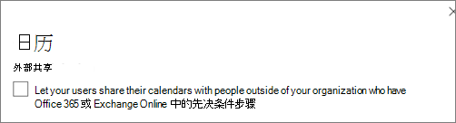

# 提高订阅的威胁Microsoft 365保护

本文可帮助你增强对 Microsoft 365 订阅的保护，以抵御网络钓鱼、恶意软件和其他威胁。 这些建议适用于对安全性需求不断增加的组织，如政治宣传活动、法律办公室和医疗保健部门。

开始之前，请检查 Microsoft 安全分数。 Microsoft 安全分数根据常规活动和安全设置分析组织的安全性，并分配分数。 首先记下当前分数。 执行本文中推荐的操作会增加分数。 目标不是达到最高分，而是注意保护环境的机会，这些机会不会对用户的工作效率产生负面影响。

有关详细信息，请参阅 [Microsoft 安全分数](../security/defender/microsoft-secure-score.md)。

## 提高邮件中恶意软件防护级别

您的Office 365环境Microsoft 365恶意软件防护，但您可以通过阻止具有通常用于恶意软件的文件类型的附件来增强此保护。 在电子邮件中加强恶意软件保护：

1. 转到安全<a href="https://go.microsoft.com/fwlink/p/?linkid=2077143" target="_blank">Office 365安全&中心</a>，然后使用管理员帐户凭据登录。

2. 在左侧导航窗格中的"威胁 **管理"** 下，选择"**策略** \> **""反恶意软件"。**

3. 双击默认策略以编辑此公司范围内的策略。

4. 单击“**设置**”。

5. 在 **"常见附件类型筛选器"下，** 选择"**打开"。** 被阻止的文件类型将在此控件正下方的窗口中列出。 请确保添加以下文件类型：

   `ade, adp, ani, bas, bat, chm, cmd, com, cpl, crt, hlp, ht, hta, inf, ins, isp, job, js, jse, lnk, mda, mdb, mde, mdz, msc, msi, msp, mst, pcd, reg, scr, sct, shs, url, vb, vbe, vbs, wsc, wsf, wsh, exe, pif`

   如果需要，稍后可以添加或删除文件类型。

6. 单击“保存”。

有关详细信息，请参阅 EOP 中的反 [恶意软件保护](../security/office-365-security/anti-malware-protection.md)。

## 防范勒索软件

勒索软件通过加密文件或锁定计算机屏幕来限制对数据的访问。 然后，它尝试通过请求"勒索"（通常采用加密货币（如"Itin"）来从犯罪中勒索资金，以交换对数据的访问。

您可以通过创建一个或多个邮件流规则来阻止通常用于勒索软件的文件扩展名 (这些扩展名已添加到邮件步骤) 中提高恶意软件防护级别，或警告通过电子邮件接收这些附件的用户。

除了在上一步中阻止的文件之外，在打开包含宏的 Office 文件附件之前创建警告用户也是一个不错的做法。 勒索软件可以隐藏在宏内，因此警告用户不要向他们不知道的人打开这些文件。

创建邮件传输规则：

1. 转到 管理中心 ， <https://admin.microsoft.com> 然后选择 管理 **中心** \> **Exchange**。

2. 在"**邮件流"** 类别中，单击"规则 **"。**

3. 单击 **+** ，然后单击"**创建新规则"。**

4. 单击 **对话框** 底部的"更多选项"以查看完整的选项集。

5. 为规则应用下表中的设置。 保留其余设置为默认设置，除非您要更改它们。

6. 单击 **“保存”**。

|Setting|在打开文件附件之前Office警告|
|---|---|
|名称|反勒索软件规则：警告用户|
|在 中应用此规则。 . .|任何附件 。 . . 文件扩展名匹配 。 . .|
|指定单词或短语|添加以下文件类型：   `dotm, docm, xlsm, sltm, xla, xlam, xll, pptm, potm, ppam, ppsm, sldm`|
|执行以下操作。 . .|使用邮件通知收件人|
|提供消息文本|不要从您不知道的人打开这些类型的文件，因为它们可能包含包含恶意代码的宏。|

有关更多信息，请参阅：

- [勒索软件：如何降低风险](https://www.microsoft.com/security/blog/2020/04/28/ransomware-groups-continue-to-target-healthcare-critical-services-heres-how-to-reduce-risk/)

- [还原OneDrive](https://support.microsoft.com//office/fa231298-759d-41cf-bcd0-25ac53eb8a15)

## 停止电子邮件的自动转发

获取用户邮箱访问权限的黑客可以通过将邮箱设置为自动转发电子邮件来窃取您的邮件。 即使没有用户感知，也可能发生此情况。 您可以通过配置邮件流规则来防止发生这种情况。

若要创建邮件传输规则，请观看此 [简短视频](https://support.office.com/article/f9d693ba-5c78-47c0-b156-8e461e062aa7) 或按照以下步骤操作：

1. 在 <a href="https://go.microsoft.com/fwlink/p/?linkid=2024339" target="_blank">"Microsoft 365 管理中心"</a>中，单击"管理 **中心** \> **Exchange"。**

2. 在"**邮件流"** 类别中，单击"规则 **"。**

3. 单击 **+** ，然后单击"**创建新规则"。**

4. 单击 **对话框** 底部的"更多选项"以查看完整的选项集。

5. 应用下表中的设置。 保留其余设置为默认设置，除非您要更改它们。

6. 单击 **“保存”**。

|Setting|在打开文件附件之前Office警告|
|---|---|
|名称|阻止电子邮件自动转发到外部域|
|如果 ...|发件人 。 . . 是外部/内部 。 . . 组织内部|
|添加条件|邮件属性 。 . . 包括邮件类型 。 . . 自动转发|
|执行以下操作...|阻止邮件 。 . . 拒绝邮件并给出说明。|
|提供消息文本|出于安全考虑，阻止在此组织外自动转发电子邮件。|

## 保护电子邮件免受网络钓鱼攻击

如果已针对您的 Office 365 或 Microsoft 365 环境配置了一个或多个自定义域，您可以配置目标防钓鱼保护。 防钓鱼保护是 Microsoft Defender Office 365的一部分，可帮助保护你的组织免受基于恶意模拟的网络钓鱼攻击和其他网络钓鱼攻击。 如果尚未配置自定义域，则无需这样做。

我们建议你通过创建一个策略来保护最重要的用户和自定义域来开始使用此保护。

若要在 Defender for Office 365 创建防钓鱼策略，请观看此简短培训视频，或完成以下步骤：

1. 转到安全<a href="https://go.microsoft.com/fwlink/p/?linkid=2077143" target="_blank">Office 365合规&中心。</a>

2. 在左侧导航窗格中，在"**威胁管理**"下，选择"策略 **"。**

3. 在"**策略"** 页面上，选择 **"防钓鱼"。**

4. 在"**防钓鱼"页面上**，选择 **"+ 创建"。** 向导将启动，可分步定义防钓鱼策略。

5. 指定策略的名称、说明和设置，如下图所示。 有关详细信息，请参阅了解 Microsoft Defender 中的防钓鱼策略[Office 365选项](../security/office-365-security/set-up-anti-phishing-policies.md)。

6. 查看设置后，选择"创建此策略" **或** " **保存**"（如果适用）。

|设置或选项|推荐设置|
|---|---|
|名称|域和最有价值的员工|
|说明|确保不会模拟最重要的员工和域。|
|添加要保护的用户|选择 **+ 添加条件，收件人是**。 键入用户名或输入业务所有者、合作伙伴或候选人、经理和其他重要员工成员的电子邮件地址。 您最多可以添加 20 个要防止模拟的内部和外部地址。|
|添加要保护的域|选择 **+ 添加条件，收件人域为**。 输入与订阅关联的自定义域Microsoft 365（如果已定义）。 可以输入多个域。|
|选择操作|如果电子邮件由模拟用户发送：选择"将邮件重定向到其他电子邮件地址"，然后键入安全管理员的电子邮件地址;例如 *，Alice   @contoso.com*。   如果电子邮件是由模拟域发送的：请选择“隔离邮件”。|
|邮箱智能|默认情况下，创建新的反钓鱼策略时，将选择邮箱智能。 最好将此设置保留为“打开”。|
|添加受信任的发件人和域|可以在此处添加您自己的域，或任何其他受信任域。|
|应用于|选择“收件人域为”。 在“以下任何项”中，选择“选择”。 选择“+ 添加”。 选中域名称旁边的复选框，例如 *contoso。  com*，在列表中，**然后选择添加**。 选择“**完成**”。|

有关详细信息，请参阅在 Defender for [Office 365 中设置防钓鱼Office 365。](../security/office-365-security/set-up-anti-phishing-policies.md)

## 使用 Defender for Office 365 防止恶意附件、文件和Office 365

首先，请确保在管理中心中，你已打开新的管理中心 <https://admin.microsoft.com> 预览。 打开文本"新管理中心"**旁边的切换。**

   

如果尚未在租户中看到带卡的"安装"页面，请参阅安全与合规中心&这些步骤。 请参阅[在安全保险箱](#set-up-safe-attachments-in-the-security--compliance-center)合规&设置附件和在安全与保险箱中心中设置&[链接](#set-up-safe-links-in-the-security--compliance-center)。

1. 在左侧导航中，选择"设置 **"。**
2. 在" **设置"** 页上， **选择"** 从高级威胁 **卡增强保护"上的"查看** "。

   

3. On the **Increase protection from advanced threats** page， choose Get **started**.
4. 在打开的窗格中，选中电子邮件中的链接和附件、扫描 **SharePoint、OneDrive** 和 Teams 中的文件以及扫描 Office 桌面和 **Office Online** 应用中的链接下扫描恶意内容旁边的复选框。 

   在 **"电子邮件中的链接和附件"** 下，键入"所有用户"或要扫描其电子邮件的特定用户。

   

5. 选择 **"创建策略**"以打开保险箱和保险箱链接"。

### 在安全保险箱合规中心&附件

人们定期发送、接收和共享附件，如文档、演示文稿、电子表格等。 通过查看电子邮件来判断附件是安全还是恶意并不总是那么容易。 Microsoft Defender for Office 365包括保险箱附件保护，但此保护默认未打开。 我们建议您创建一个新规则以开始使用此保护。 此保护扩展到 SharePoint、OneDrive 和 Microsoft Teams 中的文件。

若要创建保险箱附件策略，请观看此[简短](https://support.office.com/article/e7e68934-23dc-4b9c-b714-e82e27a8f8a5)视频，或完成以下步骤：

1. 转到Office 365<a href="https://go.microsoft.com/fwlink/p/?linkid=2077143" target="_blank">安全&中心，</a>然后使用管理员帐户登录。

2. 在左侧导航窗格中，在"**威胁管理**"下，选择"策略 **"。**

3. 在"策略"页面上，选择 **"保险箱附件"。**

4. 在"保险箱"页上，通过选中"打开 **ATP for SharePoint、OneDrive** 和 Microsoft Teams"复选框来广泛应用此保护。

5. 选择 **+** 以创建新策略。

6. 应用下表中的设置。

7. 查看设置后，选择"创建 **此策略"或** " **保存**"（如果适用）。

|设置或选项|推荐设置|
|---|---|
|名称|使用检测到的恶意软件阻止当前和将来的电子邮件。|
|说明|使用检测到的恶意软件阻止当前和未来的电子邮件和附件。|
|保存附件未知恶意软件响应|选择 **"阻止 - 阻止当前和将来的电子邮件和带检测到的恶意软件的附件"。**|
|检测时重定向附件|启用重定向 (选中此框)    输入管理员帐户或邮箱设置以隔离。   如果恶意软件扫描附件出现时间过或出现错误，请应用 (选中此框) 。|
|应用于|收件人域为 。 . . 选择你的域。|

有关详细信息，请参阅在 Defender for [Office 365 中设置防钓鱼Office 365。](../security/office-365-security/set-up-anti-phishing-policies.md)

### 在安全保险箱合规中心设置&链接

黑客有时会在电子邮件或其他文件中的链接中隐藏恶意网站。 保险箱链接是 Microsoft Defender for Office 365 的一部分，可通过提供电子邮件和 Office 文档中的 Web 地址 (URL) 点击时间验证来帮助保护你的组织。 保护通过链接保险箱定义。

我们建议您执行以下操作：

- 修改默认策略以提高保护。

- 添加面向域中所有收件人的新策略。

若要设置保险箱链接，请观看此[简短培训视频](https://support.office.com/article/61492713-53c2-47da-a6e7-fa97479e97fa)，或完成以下步骤：

1. 转到Office 365<a href="https://go.microsoft.com/fwlink/p/?linkid=2077143" target="_blank">安全&中心，</a>然后使用管理员帐户登录。

2. 在左侧导航窗格中，在"**威胁管理**"下，选择"策略 **"。**

3. 在"策略"页面上，选择 **"保险箱链接"。**

修改默认策略：

1. 在"保险箱链接"页上的"**适用于整个** 组织的策略"下，选择"**默认策略**"。

2. 在 **设置适用于** 电子邮件以外的内容"下，选择 **"Microsoft 365 企业应用版、Office for iOS 和 Android"。**

3. 单击 **“保存”**。

要创建面向域中所有收件人的新策略，请执行：

1. 在"保险箱链接"页上的"适用于整个组织的策略"**下**，单击 **+** 以创建新策略。

2. 应用下表中列出的设置。

3. 单击 **“保存”**。

|设置或选项|推荐设置|
|---|---|
|名称|保险箱域中所有收件人的链接策略|
|为邮件中的未知潜在恶意 URL 选择操作|选择打开 - 当用户单击链接时，URL 将被重写，并针对 **已知恶意链接列表进行检查**。|
|使用保险箱附件扫描可下载内容|选中此框。|
|应用于|收件人域为 。 . . 选择你的域。|

有关详细信息，请参阅 defender for[保险箱 中的链接Office 365。](../security/office-365-security/safe-links.md)

## 打开统一审核日志

在安全与审核日志中心启用 & 搜索后，可以在日志中保留管理员和其他用户活动并搜索。

必须分配有"审核日志"角色Exchange Online，审核日志订阅中打开或Microsoft 365搜索。 默认情况下，此角色分配给管理中心中"权限"页上的"合规性管理<a href="https://go.microsoft.com/fwlink/p/?linkid=2059104" target="_blank">"Exchange组</a>。 默认情况下，Microsoft 365中的全局管理员是此组的成员。

1. 若要打开"审核日志"，请转到 的管理中心 ，然后选择左侧导航中"管理中心" <https://admin.microsoft.com> 下的"安全性"。 
2. On the **Microsoft 365 Security** page， choose **More resources**， and then **Open** on the Office 365 Security & **Compliance Center** card.

    
3. 在"安全性和合规性"页上，选择"**搜索"，** 然后选择"**审核日志搜索"。**
4. 在"审核日志搜索"页 **的顶部**，选择 **"启用审核"。**

启用此功能后，你可以搜索文件、文件夹和许多活动。 有关详细信息，请参阅[搜索审核日志。](../compliance/search-the-audit-log-in-security-and-compliance.md)

## 为文件和文件夹调整SharePoint OneDrive匿名共享设置

 (默认匿名链接过期时间更改为 14 天，将默认共享类型更改为"特定人员") 若要更改 OneDrive 和 SharePoint：

1. 转到 管理中心 ，然后选择左侧导航 <https://admin.microsoft.com> SharePoint管理 **中心** 下选择" 管理中心"。 
2. In the SharePoint admin center， go to **Policies** \> **Sharing**.
3. 在"共享"页面上的"文件和文件夹链接"下，选择"特定人员"，在"任何人"链接的高级设置下，选择"这些链接必须在这几天内过期"，然后键入 14 (或您希望将链接生存期限制为) 的另一天数。 

   

## 活动警报

可以使用活动警报跟踪管理员和用户活动，并检测组织中恶意软件和数据丢失防护事件。 你的订阅包括一组默认策略，但你也可以创建自定义策略。 有关详细信息，请参阅警报 [策略](../compliance/alert-policies.md)。 例如，如果您将一个重要文件存储在 SharePoint您不希望任何人在外部共享，您可以创建一条通知，提醒您是否有人共享它。

下图显示了此策略中包含的默认Microsoft 365。

## 禁用或管理日历共享

您可以阻止组织成员共享其日历，也可以管理他们可以共享的信息。 例如，您可以将共享限制为仅忙/闲时间。

1. 转到管理中心， <https://admin.microsoft.com> 然后选择"设置 \> **组织设置**  >  <a href="https://go.microsoft.com/fwlink/p/?linkid=2053743" target="_blank">**服务"。**</a>

1. 选择 **"** 日历"，然后选择组织成员是否可以与外部拥有日历Office 365或Exchange共享日历。

   如果选择"与任何人共享"选项，还可以决定仅共享忙/闲信息。

3. 选择 **页面** 底部的"保存更改"。

   下图显示了不允许的日历共享。

   

   下图显示了通过仅包含忙/闲信息的电子邮件链接允许日历共享时的设置。

   

如果允许用户共享其日历，请参阅以下说明[，了解如何从](https://support.office.com/article/7ecef8ae-139c-40d9-bae2-a23977ee58d5)Outlook 网页版。
