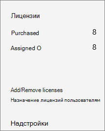
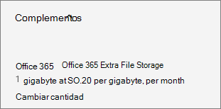

# 为你的订阅添加存储空间Add storage space for your subscription

如果你的 SharePoint Online 网站集存储空间即将用完，并且你的计划符合条件，则可以为你的订阅增加存储空间。If you start to run out of storage for your SharePoint Online site collections, you can add storage to your subscription if your plan is eligible. 如果在可用加载项列表中看不到**Office 365 额外文件存储空间**，说明您的计划不符合条件。If you don't see the **Office 365 Extra File Storage** in the list of available add-ons, it means your plan is not eligible. 有关详细信息，请参阅["我的计划是否符合条件？"](#is-my-plan-eligible-for-office-365-extra-file-storage)For more information, see [Is my plan eligible?](#is-my-plan-eligible-for-office-365-extra-file-storage)

## 查看可用存储View available storage

::: moniker range="o365-worldwide"

1. 转到[新的 SharePoint 管理中心的“活动网站”页](https://admin.microsoft.com/sharepoint?page=siteManagement&modern=true)，然后使用在组织中具有[管理员权限](https://docs.microsoft.com/sharepoint/sharepoint-admin-role)的帐户进行登录。Go to the [Active sites page of the new SharePoint admin center](https://admin.microsoft.com/sharepoint?page=siteManagement&modern=true), and sign in with an account that has [admin permissions](https://docs.microsoft.com/sharepoint/sharepoint-admin-role) for your organization.

2. 在页面的右上方，查看所有站点使用的存储量以及订阅的总存储空间。In the upper right of the page, see the amount of storage used across all sites, and the total storage for your subscription. （如果您的组织已在 Office 365 中配置了多地理位置，则此栏还显示跨所有地理位置使用的存储量。）(If your organization has configured Multi-Geo in Office 365, the bar also shows the amount of storage used across all geo locations.) 

::: moniker-end

::: moniker range="o365-germany"

1. 以https://portal.office.de全局或 SharePoint 管理员的身份登录，然后选择 "管理员" 磁贴打开管理中心。Sign in to https://portal.office.de as a global or SharePoint admin, and then select the Admin tile to open the admin center. （如果您看到一条消息，表明您没有访问该页面的权限，则您的组织中没有 Microsoft 365 管理员权限。）(If you see a message that you don't have permission to access the page, you don't have Microsoft 365 administrator permissions in your organization.)

2. 在左窗格中的 "**管理中心**" 下，选择 " **SharePoint**"。In the left pane, under **Admin centers**, select **SharePoint**. 如果看到经典 SharePoint 管理中心，请选择页面顶部的“**立即打开**”，打开新的 SharePoint 管理中心。If the classic SharePoint admin center appears, select **Open it now** at the top of the page to open the new SharePoint admin center.

3. 在新的 SharePoint 管理中心的左侧窗格中，选择“**活动网站数**”。In the left pane of the new SharePoint admin center, select **Active sites**.

4. 在页面的右上方，查看所有站点使用的存储量以及订阅的总存储空间。In the upper right of the page, see the amount of storage used across all sites, and the total storage for your subscription.

::: moniker-end

::: moniker range="o365-21vianet"

1. 以https://login.partner.microsoftonline.cn/全局或 SharePoint 管理员的身份登录，然后选择 "管理员" 磁贴打开管理中心。Sign in to https://login.partner.microsoftonline.cn/ as a global or SharePoint admin, and then select the Admin tile to open the admin center. （如果您看到一条消息，表明您没有访问该页面的权限，则您的组织中没有 Microsoft 365 管理员权限。）(If you see a message that you don't have permission to access the page, you don't have Microsoft 365 administrator permissions in your organization.)

2. 在左窗格中的 "**管理中心**" 下，选择 " **SharePoint**"。In the left pane, under **Admin centers**, select **SharePoint**. 如果看到经典 SharePoint 管理中心，请选择页面顶部的“**立即打开**”，打开新的 SharePoint 管理中心。If the classic SharePoint admin center appears, select **Open it now** at the top of the page to open the new SharePoint admin center.

3. 在新的 SharePoint 管理中心的左侧窗格中，选择“**活动网站数**”。In the left pane of the new SharePoint admin center, select **Active sites**.

4. 在页面的右上方，查看所有站点使用的存储量以及订阅的总存储空间。In the upper right of the page, see the amount of storage used across all sites, and the total storage for your subscription.  

::: moniker-end

> [!NOTE]
> 使用的存储不包括在过去的24-48 小时内所做的更改。The storage used doesn't include changes made within the last 24-48 hours.

在确定要使用的存储空间后，可以为订阅添加或删除存储空间。After you've determined how much storage you're using, you can add or remove storage space for your subscription. 若要了解添加存储空间需要多少成本，请按照本文中的步骤操作，并在购买之前查看定价信息。To find out how much it will cost to add storage space, follow the steps in this article, and review the pricing information before you purchase.
  
有关设置网站集存储限制的信息，请参阅[管理网站集存储限制](https://docs.microsoft.com/sharepoint/manage-site-collection-storage-limits)。For information about setting site collection storage limits, see [Manage site collection storage limits](https://docs.microsoft.com/sharepoint/manage-site-collection-storage-limits).
  
## 向订阅添加存储空间Add storage to your subscription

如果还没有为订阅购买额外的存储空间，可以执行此操作。If you haven't yet purchased extra storage for your subscription, you can do that.

::: moniker range="o365-worldwide"

1. 在 "管理中心" 中，转到 "**付费** \> <a href="https://go.microsoft.com/fwlink/p/?linkid=868433" target="_blank">购买服务</a>" 页。In the admin center, go to the **Billing** \> <a href="https://go.microsoft.com/fwlink/p/?linkid=868433" target="_blank">Purchase services</a> page.

2. 在 "**购买服务**" 页的底部，选择 "**加载项**"。At the bottom of the **Purchase services** page, select **Add-ons**.

3. 选择 " **Office 365 额外文件存储**"。Select **Office 365 Extra File Storage**.

4. 在 " **Office 365 额外文件存储**" 页上，如果显示，请选择基本订阅，然后输入要添加的存储的 gb 数。On the **Office 365 Extra File Storage** page, if shown, choose the base subscription, then enter the number of gigabytes of storage you want to add.

5. 选择 "**立即签出**"。Select **Check out now**.

6. 在 "**此外观如何？** " 页上，验证所选存储的 gb 数，查看定价信息，然后选择 "**下一步**"。On the **How does this look?** page, verify the number of gigabytes of storage you selected, review the pricing information, and then select **Next**.

7. 在 "**完成订单**" 页上，验证总数。On the **Complete order** page, verify the total. 如果需要进行任何更改，请选择 "**编辑订单**"。If you need to make any changes, select **Edit order**. 如果订单要求进行信用检查，请选中 "" 复选框。If the order requires a credit check, select the check box. 完成后，请选择 "**下订单** \> "**转到 "管理员主页**"。When you're finished, select **Place order** \> **Go to Admin Home**.

::: moniker-end

::: moniker range="o365-germany"

1. 在管理中心中，转到 "**记帐** \><a href="https://go.microsoft.com/fwlink/p/?linkid=847745" target="_blank">订阅</a>" 页。  In the admin center, go to the **Billing** \>  <a href="https://go.microsoft.com/fwlink/p/?linkid=847745" target="_blank">Subscriptions</a> page.

2. 在 "**订阅**" 页上，选择要向其添加存储空间的订阅，然后选择 "**加载项**"。On the **Subscriptions** page, choose the subscription to which  you want to add storage space, then select **Add-ons**.

    
  
    > [!NOTE]
    > 如果您看不到**加载项**，并且订阅是通过合作伙伴购买的，请选择 "**批量许可服务中心（VLSC）**"。If you don't see **Add-ons**, and your subscription was purchased through a partner, select **Volume Licensing Service Center (VLSC)**.
  
3. 选择 "**购买加载项**"。Select **Buy add-ons**.

    
  
4. 在 "**购买服务**" 页上，鼠标移过或点击 " **Office 365 额外文件存储**"，然后选择 "**立即购买**"。On the **Purchase services** page, mouse over or tap **Office 365 Extra File Storage**, then select **Buy now**.
  
5. 输入所需的用户许可证数，如果显示，请选择基本订阅。Enter the number of user licenses that you need and, if shown, choose a base subscription. 选择 "**立即签出**"。Select **Check out now**.
  
6. 在 "**此外观如何？** " 页上，验证所选存储的 gb 数，查看定价信息，然后选择 "**下一步**"。On the **How does this look?** page, verify the number of gigabytes of storage you selected, review the pricing information, and then select **Next**.

7. 在 "**完成订单**" 页上，选择 "**下订单**"。On the **Complete order** page, select **Place order**.

::: moniker-end

::: moniker range="o365-21vianet"

1. 在管理中心，转到“**账单**”\>“<a href="https://go.microsoft.com/fwlink/p/?linkid=850626" target="_blank">订阅</a>”页面。In the admin center, go to the **Billing** \> <a href="https://go.microsoft.com/fwlink/p/?linkid=850626" target="_blank">Subscriptions</a> page.

2. 在 "**订阅**" 页上，选择要向其添加存储空间的订阅，然后选择 "**加载项**"。On the **Subscriptions** page, choose the subscription to which  you want to add storage space, then select **Add-ons**.

    
  
    > [!NOTE]
    > 如果您看不到**加载项**，并且订阅是通过合作伙伴购买的，请选择 "**批量许可服务中心（VLSC）**"。If you don't see **Add-ons**, and your subscription was purchased through a partner, select **Volume Licensing Service Center (VLSC)**.
  
3. 选择 "**购买加载项**"。Select **Buy add-ons**.

    
  
4. 在 "**购买服务**" 页上，鼠标移过或点击 " **Office 365 额外文件存储**"，然后选择 "**立即购买**"。On the **Purchase services** page, mouse over or tap **Office 365 Extra File Storage**, then select **Buy now**.
  
5. 输入所需的用户许可证数，如果显示，请选择基本订阅。Enter the number of user licenses that you need and, if shown, choose a base subscription. 选择 "**立即签出**"。Select **Check out now**.
  
6. 在 "**此外观如何？** " 页上，验证所选存储的 gb 数，查看定价信息，然后选择 "**下一步**"。On the **How does this look?** page, verify the number of gigabytes of storage you selected, review the pricing information, and then select **Next**.

7. 在 "**完成订单**" 页上，选择 "**下订单**"。On the **Complete order** page, select **Place order**.

::: moniker-end

## 增加或减少存储空间Increase or decrease storage

如果您已通过**Office 365 额外文件存储**附加设备购买了额外的文件存储，则可以使用这些步骤增加或减少订阅的额外存储空间。If you have already purchased extra file storage via the **Office 365 Extra File Storage** add-on, you can use these steps to increase or decrease the extra storage space for your subscription. 可以将存储减小为低达 1 gb。You can reduce the storage to as low as 1 gigabyte. 若要删除所有额外的存储空间，需要[联系支持人员](../admin/contact-support-for-business-products.md)。To remove all of the extra storage space, you need to [contact support](../admin/contact-support-for-business-products.md).

::: moniker range="o365-worldwide"

1. 在管理中心中，转到 "**付费** \> <a href="https://go.microsoft.com/fwlink/p/?linkid=842054" target="_blank">产品</a>" 页面。In the admin center, go to the **Billing** \> <a href="https://go.microsoft.com/fwlink/p/?linkid=842054" target="_blank">Your products</a> page.

2. 选择包含**Office 365 额外文件存储附加设备**的订阅。Choose the subscription that contains the **Office 365 Extra File Storage** add-on.

3. 选择 "**加载项**"，然后选择 "**更改数量**"。Select **Add-ons**, then choose **Change quantity**.

4. 在 "**添加/删除 gb** " 窗格中，输入订阅所需的总 gb 数，然后选择 "**提交更改**"。In the **Add/Remove gigabytes** pane, enter the total gigabytes you want for the subscription, then select **Submit change**.

::: moniker-end

::: moniker range="o365-germany"

1. 在管理中心，转到“**账单**”\>“<a href="https://go.microsoft.com/fwlink/p/?linkid=847745" target="_blank">订阅</a>”页面。In the admin center, go to the **Billing** \> <a href="https://go.microsoft.com/fwlink/p/?linkid=847745" target="_blank">Subscriptions</a> page.

2. 在 "**订阅**" 页上，选择 "**加载项**"。On the **Subscriptions** page, select **Add-ons**.

    
  
    > [!NOTE]
    > 如果您看不到**加载项**，并且订阅是通过合作伙伴购买的，请选择 "**批量许可服务中心（VLSC）**"。If you don't see **Add-ons**, and your subscription was purchased through a partner, select **Volume Licensing Service Center (VLSC)**.
  
3. 在 " **Office 365 额外文件存储**" 下，选择 "**更改数量**"。Under **Office 365 Extra File Storage**, select **Change quantity**.

    
  
4. 在右侧窗格中，输入所需的 gb 的总数，然后选择 "**提交**"。In the right pane, enter the total number of gigabytes that you need, then select **Submit**.

    例如，如果你目前拥有 200 GB 的额外文件存储空间，但你只需要 100 GB，则可以在框中输入" **100**"。For example, if you currently have 200 gigabytes of extra file storage but you only need 100 gigabytes, then you would enter **100** in the box.

5. 选择“关闭”\*\*\*\*。Select **Close**.

::: moniker-end

::: moniker range="o365-21vianet"

1. 在管理中心，转到“**账单**”\>“<a href="https://go.microsoft.com/fwlink/p/?linkid=850626" target="_blank">订阅</a>”页面。In the admin center, go to the **Billing** \> <a href="https://go.microsoft.com/fwlink/p/?linkid=850626" target="_blank">Subscriptions</a> page.

2. 在 "**订阅**" 页上，选择 "**加载项**"。On the **Subscriptions** page, select **Add-ons**.

    
  
    > [!NOTE]
    > 如果您看不到**加载项**，并且订阅是通过合作伙伴购买的，请选择 "**批量许可服务中心（VLSC）**"。If you don't see **Add-ons**, and your subscription was purchased through a partner, select **Volume Licensing Service Center (VLSC)**.
  
3. 在 " **Office 365 额外文件存储**" 下，选择 "**更改数量**"。Under **Office 365 Extra File Storage**, select **Change quantity**.

    
  
4. 在右侧窗格中，输入所需的 gb 的总数，然后选择 "**提交**"。In the right pane, enter the total number of gigabytes that you need, then select **Submit**.

    例如，如果你目前拥有 200 GB 的额外文件存储空间，但你只需要 100 GB，则可以在框中输入" **100**"。For example, if you currently have 200 gigabytes of extra file storage but you only need 100 gigabytes, then you would enter **100** in the box.

5. 选择“关闭”\*\*\*\*。Select **Close**.

::: moniker-end

## 我的计划是否符合使用 Office 365 额外文件存储空间的条件？Is my plan eligible for Office 365 Extra File Storage?

Office 365 额外文件存储空间可以用于以下订阅：Office 365 Extra File Storage is available for the following subscriptions:
  
- Office 365 企业版 E1Office 365 Enterprise E1

- Office 365 企业版 E2Office 365 Enterprise E2

- Office 365 企业版 E3Office 365 Enterprise E3

- Office 365 企业版 E4Office 365 Enterprise E4

- Office 365 企业版 E5Office 365 Enterprise E5

- Office for web 与 SharePoint 计划1Office for the web with SharePoint Plan 1

- 使用 SharePoint 计划2的网站的 OfficeOffice for the web with SharePoint Plan 2

- SharePoint Online 计划 1SharePoint Online Plan 1

- SharePoint Online 计划 2SharePoint Online Plan 2

- Microsoft 365 商业基础版Microsoft 365 Business Basic

- Microsoft 365 商业标准版Microsoft 365 Business Standard

- Microsoft 365 商业高级版Microsoft 365 Business Premium

- Microsoft 365 E3Microsoft 365 E3

- Microsoft 365 E5Microsoft 365 E5

- Microsoft 365 F1Microsoft 365 F1

> [!NOTE]
> Office 365 额外文件存储也适用于 GCC、GCC 和 DOD 计划。Office 365 Extra File Storage is also available for GCC, GCC High, and DOD plans.
