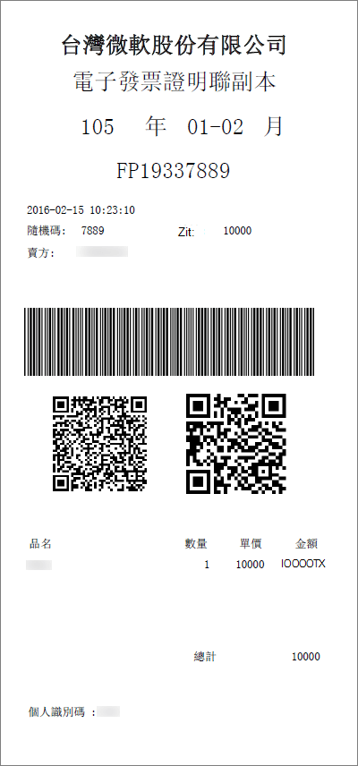

# 了解适用于 Office 365 for business 的电子发票（中国台湾）Understand your e-Invoice for Office 365 for business (Taiwan)

电子发票是买方购买后由卖方签发的电子发票（根据台湾税务主管机构的电子发票要求）。e-Invoice is electronic invoice issued by seller after buyer purchases in accordance with Taiwan Tax Authority's e-Invoice requirements. 将信息传输到台湾税务机构的电子发票云以进行记录保留。Information is transmitted to Taiwan Tax Authority's Electronic Invoice Cloud for record keeping. 有关中国台湾电子发票的相关信息，请参阅此处：<a href="https://www.einvoice.nat.gov.tw/" target="_blank">財政部電子發票整合服務平台</a>For Taiwan e-Invoice related information, please refer here: <a href="https://www.einvoice.nat.gov.tw/" target="_blank">財政部電子發票整合服務平台</a>
  
电子发票的示例副本包括：A sample copy of e-Invoice is included here:
  

  
## 我的税率是多少？What is my tax rate?

对于商业购买，我们除了按照中国台湾税务主管机构规定的费用之外，还会应用税。For commercial purchases, we apply taxes in addition to the quoted price of our subscriptions at a rate prescribed by Taiwan Tax Authority. 有关任何与税相关的问题或规划，请与你的税务顾问一起使用。For any tax related questions or planning, please work with your tax advisor.
  
## 何时将为我的 Office 365 服务启动 e 发票？When will e-Invoice start for my Office 365 services?

Microsoft 将在**9 月15日**将当前 computerized 发票替换为电子发票。Microsoft will replace current computerized invoice with e-Invoice on **September 15th**. 对于在9月15日之前的记帐，将直接向客户发送纸面副本税务发票。For billing prior to September 15th, paper copy tax invoices are mailed directly to customers. 在9月15日之后，电子发票将在 Microsoft 365 管理中心提供，以供你查看、下载和打印，并且不再向你直接邮寄。After September 15th, e-Invoice will be offered in your Microsoft 365 admin center for view, download, and print, and will no longer be mailed directly to you. 
  
## 我可以在哪里找到我的电子发票？Where can I find my e-Invoice?

您可以查看、下载和打印你的电子发票在你的帐单准备就绪后，通过你的管理中心，与你的月度帐单结合使用。You can view, download, and print your e-Invoice the day after your bill is ready, through your admin center, together with your monthly bill. [查看你的帐单](view-your-bill-or-invoice.md)。[View your bill](view-your-bill-or-invoice.md).
  
## 如何更新我的增值税 ID？How do I update my VAT ID?

你可以在载入时更新 VAT ID，或在你板载后通过管理中心更新。You can update your VAT ID at the time of onboarding, or through your admin center after you onboard.
  
在帐户创建过程中，在**步骤 1**中，欢迎，让我们知道你，**第2页**，在什么地方使用？，在**服务收件人地址**信息的下方，可以添加你的8位**VAT ID**。At the time of account creation, in **Step 1**, Welcome, Let's get to know you, **page 2**, Where will you be using this?, below **Service Recipient Address** information, you can add your 8 digit **VAT ID**. 如果您没有 VAT ID，请输入 "00000000"。If you do not have a VAT ID, please enter "00000000".
  
创建帐户后，您可以通过执行以下步骤，通过管理中心更新 VAT ID：After you have created your account, you may update your VAT ID through your admin center by following these steps:
  
1. 在管理中心，转到“**账单**”\>“<a href="https://go.microsoft.com/fwlink/p/?linkid=842054" target="_blank">产品和服务</a>”页面。In the admin center, go to the **Billing** \> <a href="https://go.microsoft.com/fwlink/p/?linkid=842054" target="_blank">Products & services</a> page.
    
2. 选择一个订阅，然后选择 "**更多操作**"。Select a subscription, then select **More Actions**.
    
3. 选择 "**更新服务收件人地址**" 和 "更新**税号**信息"。Select **Update Service Recipient Address**, and update **TAX ID** information. 
    
## 如何请求电子发票纸张副本？How do I request an e-Invoice paper copy?

如果你的收据在幸运时签发（仅对没有 VAT ID 的客户可用），我们将通过注册的邮件直接向文件中的地址发送硬副本。If your receipt won Lucky Draw (only available to customers without VAT ID), we will send a hard copy directly to the addresses on file by registered mail.
  
否则，如果需要电子发票的官方纸张副本，请[联系支持人员](../../admin/contact-support-for-business-products.md)。Otherwise, if you need the official paper copy of your e-Invoice, please [contact support](../../admin/contact-support-for-business-products.md). 收到你的请求后，我们将把电子发票的纸张副本邮寄到文件上的地址。After we receive your request, we will mail the paper copy of the e-Invoice to the address on file.
  
## 更多问题？More questions?

[連絡客戶支援連絡客戶支援](../../admin/contact-support-for-business-products.md)