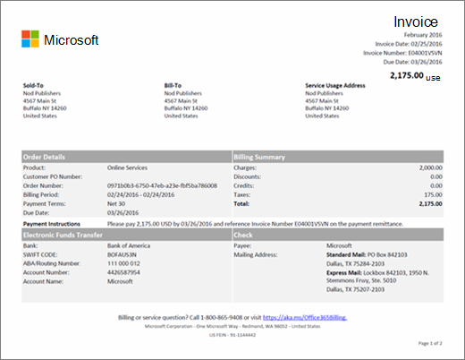
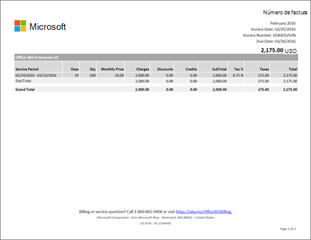

# 了解你的 Microsoft 365 商业版账单或发票

> [!IMPORTANT]
> 截至 2021 年 1 月 26 日，不再支持比利时、法国、意大利、卢森堡、葡萄牙、西班牙和美国客户的新银行账户。 如果你是其中一个国家/地区的现有客户，则可以继续使用现有银行帐户支付订阅，并且可以向其中添加新订阅（前提是该银行帐户的信誉良好）。

不管是月度还是年度账单（取决于你在购买时的订阅选项），你将收到电子邮件，告知新的账单记录可在管理员中心查看。 [了解如何查找和查看账单或发票](view-your-bill-or-invoice.md)。
  
你的发票包含两页。第 1 页是发票摘要，包含有关发票、订单、到期金额、付款方式和联系支持人员的方式等一般信息。
  

  
第 2 页包含有关每个订阅的帐单活动的详细信息。
  

  
有关发票中所含字段和术语的说明，请参阅本文稍后部分中的[发票字段术语](#invoice-field-glossary)。
  
## 了解帐单概念

在查看发票之前，有必要了解一些关键的帐单概念。
  
### 发票余额和订单余额

 **发票余额** 是指发票上显示的数额，且仅表示针对该特定计费周期的到期金额。 总 **订单余额** 是所有未付款发票的总和。 可在管理中心 的“**帐单**”中查看订单余额。
  
### 记帐频率和开票频率

 **记帐频率** 是指向你收费的频率。 订阅每月或每年收费一次，具体取决于在购买订阅期间选择的付款选项。 **开票频率** 是指你收到发票的频率。 如果你选择每年计费，则每年仅会收到一张发票，除非你的订阅活动需要收费或用信用卡付款。
  
如果你有多个订单，则每份订单都会出具一张发票。
  
## 发票字段术语

下表介绍了发票上可能显示的字段。此处列出的某些字段可能未在发票中显示，具体取决于是通过发票还是通过信用卡或银行帐户付款。
  
> [!NOTE]
> 某些国家或地区不支持银行帐户支付。
  
|**名称**|**说明**|
|:-----|:-----|
|年度价格|订阅每月或每年计费一次。 如果你在购买订阅期间选择了每年计费，则发票上将显示年度许可证价格。 如果想要更改记帐频率，则必须取消订阅并使用新的记帐频率进行购买。|
|计费周期|计费周期是指自上次发票日期起的时间段。服务期是就你使用服务进行收费的时间段。|
|帐单寄往地址|这是你帐单部门的地址，通常与售达地址相同。 若要更新帐单邮寄地址，请参阅[更改帐单邮寄地址](change-your-billing-addresses.md)。|
|费用|发票的第 1 页将汇总发票计费周期的所有费用。第 2 页显示每个订阅的详细费用。|
|支票|如果你通过发票支付，并且你所在国家/地区支持支票付款，则第 1 页的底部将包括付款寄往地址的相关信息。请参考支票上的发票号。|
|贷项|发票的第 1 页将汇总发票计费周期的所有贷项。第 2 页显示每个订阅的详细贷项。|
|客户 PO 编号|你的采购订单 (PO) 编号。如果你更新 PO 编号，则之后的发票将显示该项。[更改采购订单编号](#change-your-purchase-order-number)  **注意** 不得在现有发票上添加采购订单编号。           |
|天数|每个计费交易都与服务期相关联。"天数"列指示该服务期的天数。|
|折扣|发票的第 1 页将汇总发票计费周期的所有折扣。第 2 页显示每个订阅的详细折扣。|
|截止日期|发票的付款截止日期。如果订阅使用信用卡或银行帐户进行支付，我们将在发票日期后向信用卡或银行帐户收费。  **注意** 某些国家或地区不支持银行帐户支付。           |
|电子资金转帐|如果选择了“发票”作为订阅付款方式，则第 1 页将包含用于电子（汇款、ACH、SEPA 等）付款的 Microsoft 银行帐户信息。 通常，银行会出具你在发送付款时填写的参考字段。 请参考此字段中显示的发票编号。|
|总计|此行包括所有费用、折扣、贷项、分类汇总和税款的总和，以及发票上针对所有订阅的全部列。|
|发票日期|发票的创建日期。发票日期是指计费周期结束后的日期。例如，如果你的计费周期为 1 月 15 日 - 2 月 14 日，则你的发票日期为 2 月 15 日。|
|发票号|分配给你发票的唯一编号。请参考你付款的发票号。|
|月度价格|订阅每月或每年计费一次。 如果在购买订阅期间选择了按月付款，则发票上将显示月度许可证价格。 如果想要更改记帐频率，则必须取消订阅并使用新的记帐频率进行购买。|
|订单编号|每次购买新订阅时，都会创建一份订单。每月都会收到每份订单的发票。|
|付款说明|如果你使用信用卡支付，将会看见"不支付 - 已向存档信用卡收费。"如果通过发票支付，则将看到通过电子资金转帐 (EFT) 和支票（如适用）支付的说明。|
|付款期限|自发票截止付款日期起的天数。标准为 30 天。|
|产品|发票第 1 页中的"联机服务"是用于描述你的订阅的通用名称。第 2 页上将显示每个订阅的名称。|
|数量|服务期间购买的许可证数量。|
|服务期|服务期是就你使用服务进行收费的时间段。帐单期是自上次发票日期后的时间段。|
|服务使用地址|表示正在使用服务的地址，通常与你的售达地址相同。 若要更新服务使用地址，请参阅[更改帐单邮寄地址](change-your-billing-addresses.md)。|
|售达地址|你的公司名称和地址。若要更新此信息，请参阅[更改你组织的地址、技术联系人电子邮件和其他信息](../../admin/manage/change-address-contact-and-more.md)。  |
|分类汇总|发票上列出的每个订阅都具有针对所有费用、折扣、贷项、分类汇总和税款的单独分类汇总行，以及所有针对该订阅的列。|
|税款|发票的第 1 页显示税款总额。第 2 页显示所采用的税率，以及各行项目的税款总额。如果你的发票包含税款而你的公司是免税的，请[联系支持人员](../../admin/get-help-support.md)。  |
|总计|发票计费周期的到期金额。|

## 更改采购订单编号

如果通过发票付款，可以添加或更改订阅的采购订单 (PO) 编号。
  
> [!NOTE]
> 不得在现有发票上添加 PO 编号。该 PO 编号将显示在以后的所有发票上。

::: moniker range="o365-worldwide"

1. 在管理中心中，转到“**计费**”\>“<a href="https://go.microsoft.com/fwlink/p/?linkid=842054" target="_blank">你的产品</a>”页面。

::: moniker-end

::: moniker range="o365-21vianet"

1. 在管理中心中，转到“**计费**”\>“<a href="https://go.microsoft.com/fwlink/p/?linkid=850626" target="_blank">你的产品</a>”页面。

::: moniker-end

1. 在“**产品**”选项卡上，选择要更改的订阅。

1. 在订阅详细信息页面上的订阅 **和付款设置** 部分中，选择编辑 **发票**。

1. 在"编辑通过语音 **支付的详细信息"** 窗格底部，输入 PO 编号，然后选择"保存 **"。**

## 相关内容

[Learn how to find and view your bill or invoice](view-your-bill-or-invoice.md) (article) \
[Microsoft 365 商业版（墨西哥）的帐单信息](mexico-billing-info.md) （文章）\
[更改帐单邮寄地址](change-your-billing-addresses.md) (文章) \
[更改组织地址、技术联系人电子邮件和其他信息](../../admin/manage/change-address-contact-and-more.md) ， (文章) \
[支付商业Microsoft 365订阅费用 (](pay-for-your-subscription.md)文章) \
[Minecraft:Education Edition 付款方式](/education/windows/school-get-minecraft)（文章）
