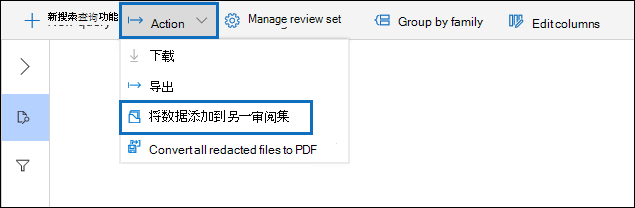

# 从另一审阅集将数据添加到审阅集

在某些情况下，可能需要从一个审阅集选择文档，在另一个审阅集单独处理它们。 如果已经挑选审阅集中的内容，并且要对数据子集运行分析，此方法尤其有用。

按照本文中的工作流将内容从一个审阅集添加到另一个审阅集。

## 创建审阅集

在启动之前，你需要创建一个审阅集以将数据添加到该审阅集。  可以在案例的"审阅集 **"选项卡上添加一** 个新的审阅集。 有关详细信息，请参阅创建 [审阅集](managing-review-sets.md#create-a-review-set)。

## 步骤 1：确定要添加到其他审阅集的内容

通过在源审阅集中选择特定文档，或者通过选择由审阅集查询返回的所有项目，可以将一个审阅集中的内容添加到另一个审阅集。 如果要添加选定项目，请选择项目，选择"**操作**"，然后选择"**添加到另一审阅集"。**

## 步骤 2：指定用于添加到另一审阅集的选项

在" **添加到其他审阅集选项** "飞出页中，选择要将项目添加到的审阅集。 选择是添加"**所有搜索结果"还是**"**所选项目"。**  其他信息提供了一些选项，用于包含项目的所有元数据，以及是否包含标记 (，在将文档添加到新审阅集时，从源审阅集选中"标签"复选框) 。  

单击"**确定"** 后， (一个名为"将数据添加到另一审阅) ，以将内容添加到另一审阅集。 您可以转到"作业 **"** 选项卡并监视此作业的进度。 有关详细信息，请参阅管理 [作业](managing-jobs-ediscovery20.md)。
