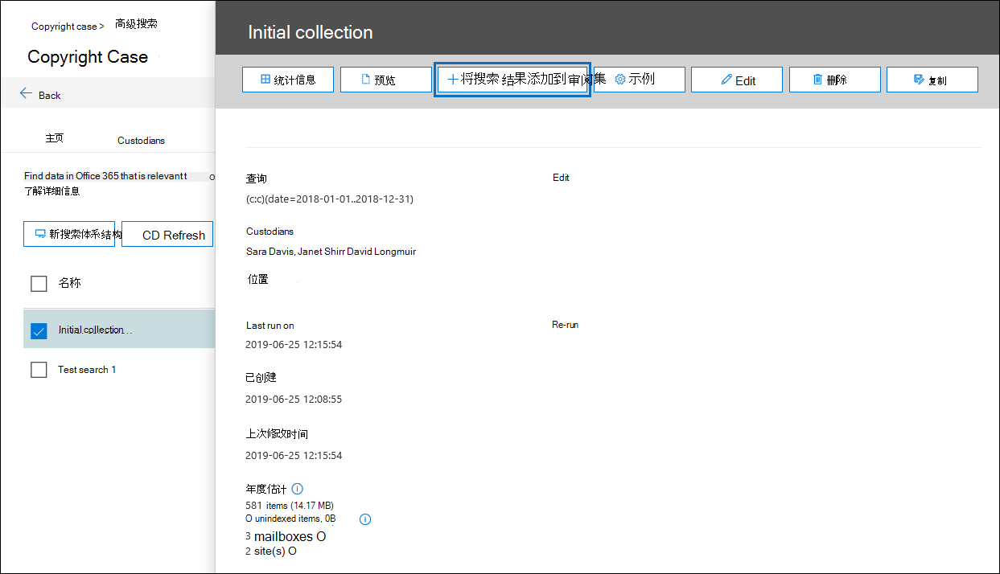

# 将搜索结果添加到审阅集Add search results to a review set

当您对搜索结果感到满意并准备好查看和分析这些搜索结果时，您可以将其添加到审阅集（在案例中）。When you're satisfied with the results of a search and you're ready to review and analyze those search results, you can add them to a review set in the case. 将原始数据复制到评审集还可为您提供高级分析工具，如主题检测、接近重复检测和电子邮件线程标识，从而促进评审和分析过程。Copying the original data to the review set also facilitates the review and analysis process by providing you with advanced analytics tools such as themes detection, near-duplicate detection, and email thread identification. 您还可以将非 Office 365 数据源中的数据添加到检查集，以便除了从 Office 365 收集的数据之外，还可以查看数据。You can also add data from non-Office 365 data sources to a review set so that you can review that data in addition to the data you collect from Office 365. 

将搜索结果添加到审阅集时（在 "**审阅集**" 选项卡上列出了一个事例中的审阅集）时，将发生以下情况：When you add the results of a search to a review set (the review sets in a case are listed on the **Review sets** tab), the following things occur:

- 将再次运行搜索。The search is run again. 这意味着复制到评审集的实际搜索结果可能与上次运行搜索时返回的估计结果不同。This means the actual search results copied to the review set may be different than the estimated results that were returned when the search was last run.

- 搜索结果中的所有项目都将从 live Office 365 服务中的原始数据源复制，并复制到 Microsoft 云中的安全 Azure 存储位置。All items in the search results are copied from the original data source in the live Office 365 services, and copied to a secure Azure Storage location in the Microsoft cloud.

- 将对所有项目（包括内容和元数据）进行重新编制索引，以便审核集中的所有数据在对事例数据的审阅期间完全可搜索。All items (including the content and metadata) are re-indexed so that all data in the review set is fully searchable during the review of the case data. 当您在案例调查过程中搜索评审集中的数据时，对数据进行重新编制索引将导致彻底且快速的搜索。Re-indexing the data results in thorough and fast searches when you search the data in the review set during the case investigation.

若要将数据添加到审阅集，请单击 "**搜索**" 选项卡上的搜索，然后单击浮出控件页面上的 "**将结果添加到审阅集**"。To add data to a review set, click a search on the **Searches** tab, and then click **Add results to review set** on the flyout page.

您可以添加到现有的审阅集，也可以创建新的审阅集。You can add to an existing review set or create a new review set.  如果添加到新的审阅集，请指定名称，然后单击 "**添加**"。If adding to a new review set, specify the name and then click **Add**.

向评审集添加数据是一个长期运行的过程。Adding data to a review set is a long-running process. 此过程包括从 Office 365 中的原始数据源（例如，从邮箱和网站）中收集项目，将它们复制到 Azure 存储位置（此复制过程也称为 "*摄取*"），然后对项目重新编制索引。This process includes gathering items from the original data sources in Office 365 (for example, from mailboxes and sites), copying them to the Azure Storage location (this copying process is also called *ingestion*), and then re-indexing the items. 您可以在 "**作业**" 选项卡或 "**搜索**" 选项卡上通过监视 "添加的**数据到评审集**" 列中的状态来跟踪进度。You can track the progress on the **Jobs** tab or on the **Searches** tab by monitoring the status in the **Added data to review set** column. 完成审阅集处理后，单击该事例中的 "**查看集**" 选项卡，然后单击 "检查设置" 以启动筛选、查看、标记和导出评审集中数据的过程。After the review set processing is completed, click the **Review sets** tab in the case, and click the review set to start the process of filtering, reviewing, tagging, and exporting data in the review set.

## 向评审集添加示例Add a sample to a review set

如果要在将所有搜索结果添加到审阅集之前更全面地验证搜索结果，您可以将搜索结果的示例添加到审阅集，而不是添加所有内容。If you want to validate the results of a search more thoroughly before adding all of them to a review set, you can add a sample of the search results to a review set instead of adding everything.

若要向审阅集添加示例，请单击 "**搜索**" 选项卡上的搜索，然后单击浮出控件页面上的 "**示例**"。To add a sample to a review set, click a search on the **Searches** tab and click **Sample** on the flyout page. 在 "**采样参数**" 页上，选择下列选项之一：On the **Sampling parameters** page, choose one of the following options:

- **可信度百分比**和**可信度间隔百分比**-添加到审阅集的项目将由您设置的统计参数决定。**Confidence level %** and **Confidence interval %** - The items added to the review set will be determined by the statistical parameters that you set. 如果您通常在采样结果时使用置信度和间隔，请在下拉框中进行指定。If you typically use a confidence level and interval when sampling results, specify them in the drop-down boxes. 否则，使用默认设置。Otherwise, use the default settings.

- **随机样本百分比**-添加到审阅集的项目基于由搜索返回的总项目数的指定百分比的随机选择。**Random sample %** - The items added to the review set is based on a random selection of the specified percentage of the total number of items returned by the search.

选择并配置前面的选项之一后，选择要向其中添加示例的审阅集，然后单击 "**发送**"。After selecting and configuring one of the previous options, choose a review set to add the sample to and then click **Send**. 同样，您可以在 "**作业**" 选项卡或 "**搜索**" 选项卡上通过监视 "添加的**数据到评审集**" 列中的状态来跟踪进度。Again, you can track the progress on the **Jobs** tab or on the **Searches** tab by monitoring the status in the **Added data to review set** column.

## 光学字符识别Optical character recognition

将搜索结果添加到审阅集时，高级电子数据展示中的光学字符识别（OCR）功能会自动从图像中提取文本，并包括包含添加到评审集的数据的图像文本。When you add search results to a review set, optical character recognition (OCR) functionality in Advanced eDiscovery automatically extracts text from images, and includes the image text with the data that's added to a review set. 您可以在审阅集中的选定图像文件的文本查看器中查看提取的文本。You can view the extracted text in the Text viewer of the selected image file in the review set. 这样，您就可以对图像中的文本进行进一步的审阅和分析。This lets you conduct further review and analysis on text in images. 稀疏文件、电子邮件附件和嵌入图像支持 OCR。OCR is supported for loose files, email attachments, and embedded images. 有关 OCR 支持的图像文件格式的列表，请参阅[高级电子数据展示中支持的文件类型](supported-filetypes-ediscovery20.md#image)。For a list of image file formats that are supported for OCR, see [Supported file types in Advanced eDiscovery](supported-filetypes-ediscovery20.md#image).

您必须为在高级电子数据展示中创建的每个事例启用 OCR 功能。You have to enable OCR functionality for each case that you create in Advanced eDiscovery. 有关详细信息，请参阅[配置搜索和分析设置](configure-search-and-analytics-settings-in-advanced-ediscovery.md#optical-character-recognition-ocr)。For more information, see [Configure search and analytics settings](configure-search-and-analytics-settings-in-advanced-ediscovery.md#optical-character-recognition-ocr).
