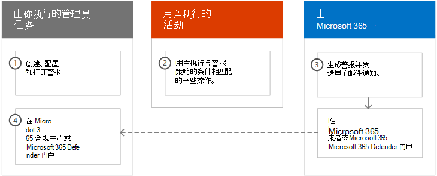
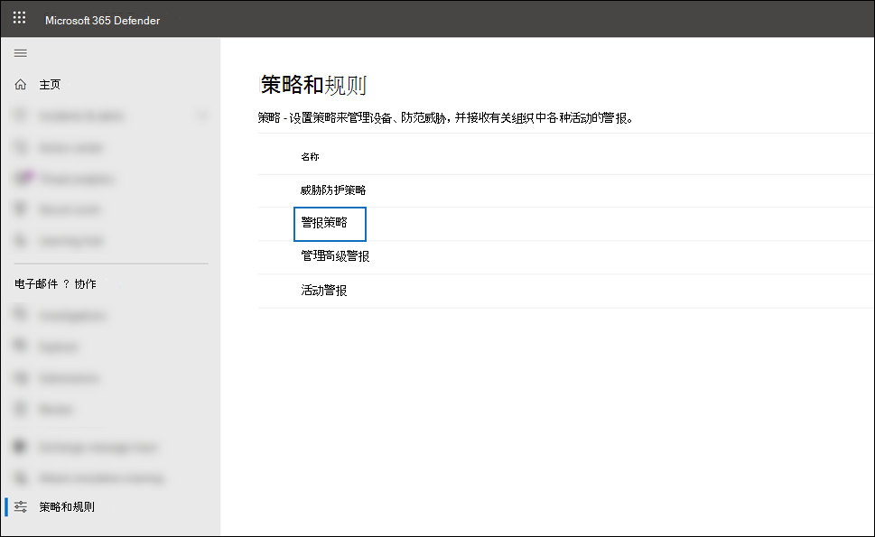
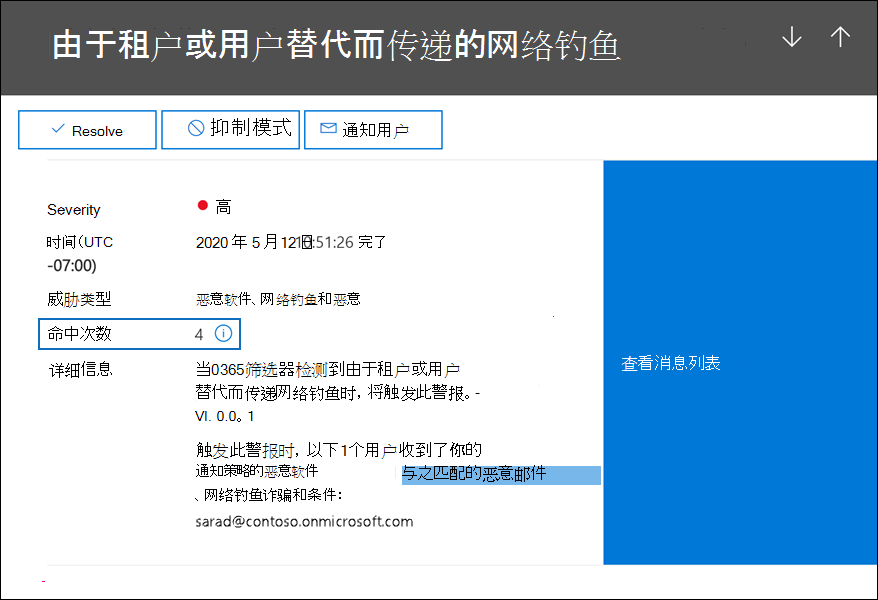
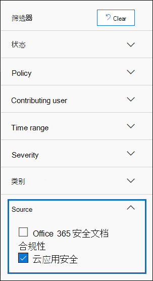

# <a name="alert-policies-in-microsoft-365"></a>Microsoft 365 中的警报策略

可以使用 Microsoft 365 合规中心 或 Microsoft 365 Defender 门户中的警报策略和警报仪表板工具创建警报策略，然后查看当用户执行与警报策略的条件相匹配的活动时生成的警报。 有几个默认警报策略可帮助您监视活动，如在 Exchange Online 中分配管理员权限、恶意软件攻击、网络钓鱼活动以及异常级别的文件删除和外部共享。

通过警报策略，您可以对策略触发的警报进行分类，将策略应用于您组织的所有用户，为何时触发警报设置阈值级别，以及决定是否在触发警报时接收电子邮件通知。 还有一个"警报"页面，您可以在其中查看和筛选警报、设置警报状态以帮助管理警报，然后在解决或解决基本事件后消除警报。

> [!NOTE]
> 警报策略适用于具有 Microsoft 365 企业版、Office 365 企业版 或 Office 365 美国政府版 E1/F1/G1、E3/F3/G3 或 E5/G5 订阅的组织。 高级功能仅适用于具有 E5/G5 订阅的组织，或者具有 E1/F1/G1 或 E3/F3/G3 订阅以及适用于 Office 365 P2 或 Microsoft 365 E5 合规 或 E5 电子数据展示和审核附加订阅的 Microsoft Defender 的组织。 本主题重点介绍了需要 E5/G5 或加载项订阅的功能。 另请注意，警报策略在 Office 365 GCC、GCC High 和 DoD 美国政府环境中可用。

## <a name="how-alert-policies-work"></a>警报策略如何工作

下面简要概述了警报策略如何工作，以及当用户或管理员活动与警报策略的条件相匹配时触发的警报。



1. 贵组织的管理员通过使用警报策略页面或 Microsoft 365 合规中心 门户创建、配置和启用Microsoft 365 Defender策略。  您还可以使用安全与合规中心 PowerShell 中的 [New-ProtectionAlert](/powershell/module/exchange/new-protectionalert) cmdlet &警报策略。

   若要创建警报策略，你必须在安全或 Defender 门户中分配"管理警报"角色Microsoft 365 合规中心"组织配置"角色。

   > [!NOTE]
   > 创建或更新警报策略后最多需要 24 小时，策略才能触发警报。 这是因为策略必须同步到警报检测引擎。

2. 用户执行与警报策略的条件相匹配的活动。 对于恶意软件攻击，发送给组织中用户的受感染电子邮件将触发警报。

3. Microsoft 365生成警报，该警报显示在 defender 或 Defender门户中的Microsoft 365 合规中心页面上。 此外，如果为警报策略启用了电子邮件通知，Microsoft 将向收件人列表发送通知。 管理员或其他用户可在"通知"页面上看到的警报由分配给用户的角色确定。 有关详细信息，请参阅 [查看警报所需的 RBAC 权限](#rbac-permissions-required-to-view-alerts)。

4. 管理员在合规中心管理警报。 管理警报包括分配警报状态以帮助跟踪和管理任何调查。

## <a name="alert-policy-settings"></a>警报策略设置

警报策略包含一组规则和条件，用于定义生成警报的用户或管理员活动、触发警报的用户列表（如果他们执行活动）以及一个定义触发通知之前必须发生活动次数的阈值。 还可以对策略进行分类，并为其分配严重性级别。 这两个设置有助于管理警报策略 (策略条件与) 匹配时触发的警报，因为可以在管理策略和查看合规中心中的警报时筛选这些设置。 例如，可以查看与同一类别的条件匹配的警报，或查看严重性级别相同的警报。

查看和创建警报策略：

### <a name="microsoft-365-compliance-center"></a>Microsoft 365 合规中心

转到 ， <https://compliance.microsoft.com> 然后选择策略  >  **警报**  >  **警报策略**。 或者，你可以直接转到 <https://compliance.microsoft.com/alertpolicies> 。


### <a name="microsoft-365-defender-portal"></a>Microsoft 365 Defender 门户

转到电子邮件 <https://security.microsoft.com> 和协作下 **&选择****策略&规则**  >  **警报策略**。 或者，你可以直接转到 <https://security.microsoft.com/alertpolicies> 。



> [!NOTE]
> 你必须分配有管理View-Only角色，以查看合规中心或 Defender 门户中的警报策略。 您必须分配有"管理警报"角色，以创建和编辑警报策略。 有关详细信息，请参阅 [安全与合规中心中的权限](../security/office-365-security/permissions-in-the-security-and-compliance-center.md)。

警报策略由以下设置和条件组成。

- **警报正在跟踪的活动**。 您可以创建一个策略来跟踪活动，或在某些情况下创建一些相关活动，例如通过共享文件、分配访问权限或创建匿名链接与外部用户共享文件。 当用户执行策略定义的活动时，将基于警报阈值设置触发警报。

    > [!NOTE]
    > 你可以跟踪的活动取决于你组织的活动Office 365 企业版或Office 365美国政府计划。 通常，与恶意软件市场活动和网络钓鱼攻击相关的活动需要 E5/G5 订阅或 E1/F1/G1 或 E3/F3/G3 订阅以及 Office 365 计划 2 附加订阅的[Defender。](../security/office-365-security/defender-for-office-365.md)

- **活动条件**。 对于大多数活动，你可以定义触发警报所必须满足的其他条件。 常见条件包括 IP 地址 (以便当用户在具有特定 IP 地址的计算机上或 IP 地址范围) 内执行活动时触发警报、特定用户执行该活动时是否触发警报，以及是否对特定文件名或 URL 执行活动。 还可以配置在组织中任何用户执行活动时触发警报的条件。 可用条件取决于所选活动。

还可以将用户标记定义为警报策略的条件。 这会引发策略触发的警报，以包含受影响用户的上下文。 可以使用系统用户标记或自定义用户标记。 有关详细信息，请参阅 Microsoft Defender for Office 365 中的[用户标记](/microsoft-365/security/office-365-security/user-tags)。

- **触发警报时**。 您可以配置一个设置，该设置定义在触发警报之前可以发生活动的时间。 这样，你可以设置一个策略，每当活动符合策略条件、超过特定阈值时，或者当警报正在跟踪的活动发生异常时，组织都会生成警报。

    

    如果根据异常活动选择设置，Microsoft 将建立一个基线值，用于定义选定活动的正常频率。 建立此基线最多需要 7 天，在此期间不会生成警报。 建立基线后，当警报策略跟踪的活动频率大大超过基线值时，将触发警报。 对于与审核相关的 (，如文件和文件夹) ，可以基于单个用户或基于组织中所有用户建立基线;对于与恶意软件相关的活动，您可以基于单个恶意软件系列、单个收件人或组织的所有邮件建立基线。

    > [!NOTE]
    > 基于阈值或基于异常活动配置警报策略的能力要求使用 E5/G5 订阅，或具有适用于 Office 365 P2、Microsoft 365 E5 合规 或 Microsoft 365 电子数据展示和审核加载项订阅的 Microsoft Defender 的 E1/F1/G1 或 E3/F3/G3 订阅。 具有 E1/F1/G1 和 E3/F3/G3 订阅的组织只能创建警报策略，其中每次发生活动时都会触发警报。

- **警报类别**。 为了帮助跟踪和管理策略生成的警报，你可以为策略分配以下类别之一。

  - 数据丢失防护

  - 信息管理政策

  - 邮件流

  - 权限

  - 威胁管理

  - 其他

  当发生与警报策略的条件相匹配的活动时，生成的警报将用此设置中定义的类别进行标记。 这允许你跟踪和管理合规性中心中"警报"页面上具有相同类别设置的警报，因为您可以基于类别对警报进行排序和筛选。

- **警报严重性**。 与警报类别类似，你可以为警报策略 (**低**、中、高) 严重性属性。   与警报类别一样，当发生与警报策略的条件相匹配的活动时，生成的警报会使用为提醒策略设置的相同严重性级别进行标记。 同样，这允许你跟踪和管理"警报"页上具有相同严重性 **设置的警报。** 例如，可以筛选警报列表，以便只显示高严重性的警报。 

    > [!TIP]
    > 在设置警报策略时，请考虑为可能导致严重负面影响的活动分配更严重的严重性，例如，在传送给用户后检测恶意软件、查看敏感数据或分类数据、与外部用户共享数据，或其他可能导致数据丢失或安全威胁的活动。 这可以帮助您确定警报的优先级，以及调查和解决基础原因时要采取的操作。

- **电子邮件通知**。 您可以设置该策略，以便当触发 (时) 发送电子邮件通知或将电子邮件通知发送到用户列表。 还可以设置每日通知限制，以便当达到最大通知数后，不会在这一天向通知发送更多通知。 除了电子邮件通知之外，您或其他管理员可以在"通知"页上查看由策略 **触发** 的通知。 请考虑为特定类别或具有较高严重性设置的警报策略启用电子邮件通知。

## <a name="default-alert-policies"></a>默认警报策略

Microsoft 提供了内置警报策略，可帮助Exchange权限滥用、恶意软件活动、潜在的外部和内部威胁以及信息治理风险。 在 **警报策略** 页面上，这些内置策略的名称以粗体显示，并且策略类型定义为 **系统**。 默认情况下，这些策略是打开的。 你可以关闭这些策略 (或) ，设置要发送电子邮件通知的收件人列表，并设置每日通知限制。 无法编辑这些策略的其他设置。

下表列出并描述了可用的默认警报策略以及每个策略分配到的类别。 类别用于确定用户可以在"通知"页上查看哪些警报。 有关详细信息，请参阅 [查看警报所需的 RBAC 权限](#rbac-permissions-required-to-view-alerts)。

该表还指明了Office 365 企业版一Office 365美国政府计划所需的计划。 如果您的组织具有除 E1/F1/G1 或 E3/F3/G3 订阅之外的适当附加订阅，则某些默认警报策略可用。

| 默认警报策略 | 说明 | Category | Enterprise订阅 |
|:-----|:-----|:-----|:-----|
|**检测到潜在恶意 URL 单击**|当组织的链接单击恶意链接[保险箱用户时](../security/office-365-security/safe-links.md)生成警报。 当 Microsoft Defender 为 Office 365 标识 URL 裁定更改时，或当用户根据组织的 Microsoft 365 for Business 保险箱 链接策略) 替代 保险箱 链接页面 (时，将触发此事件。 此警报策略具有 **"高** 严重性"设置。 For Defender for Office 365 P2， E5， G5 customers， this alert automatically triggers [automated investigation and response in Office 365](../security/office-365-security/office-365-air.md). 有关触发此警报的事件详细信息，请参阅设置链接保险箱[策略](../security/office-365-security/set-up-safe-links-policies.md)。|威胁管理|适用于 P2 附加Office 365订阅的 E5/G5 或 Defender|
|**管理员提交结果已完成**|当管理员提交完成已 [提交](../security/office-365-security/admin-submission.md) 实体的重新扫描时，生成警报。 每次从管理员提交呈现重新扫描结果时，都会触发警报。 这些警报旨在提醒你查看以前的提交结果[](https://compliance.microsoft.com/reportsubmission)，提交用户报告的邮件，获取最新的策略检查和重新扫描裁定，并帮助你确定你的组织中筛选策略是否具有预期的影响。 此策略具有 **信息** 严重性设置。|威胁管理|E1/F1、E3/F3 或 E5|
|**管理员触发的电子邮件手动调查**|当管理员触发来自威胁资源管理器的电子邮件的手动调查时，生成警报。 有关详细信息，请参阅 [示例：安全管理员从威胁资源管理器触发调查](../security/office-365-security/automated-investigation-response-office.md#example-a-security-administrator-triggers-an-investigation-from-threat-explorer)。 此警报通知您的组织已启动调查。 该警报提供有关触发它的人的信息，并包含指向调查的链接。 此策略具有 **信息** 严重性设置。|威胁管理| 适用于 P2 加载项订阅Office 365 E5/G5 或 Microsoft Defender| 
|**创建转发/重定向规则**|当组织中有人为邮箱创建收件箱规则以将邮件转发或重定向到其他电子邮件帐户时，生成警报。 此策略仅跟踪使用 PowerShell Outlook 网页版 (以前称为Outlook Web App) 或Exchange Online创建的收件箱规则。 此策略具有 **信息** 严重性设置。 有关使用收件箱规则转发和重定向电子邮件Outlook 网页版，请参阅使用 Outlook 网页版 中的规则将邮件自动转发[到另一个帐户](https://support.office.com/article/1433e3a0-7fb0-4999-b536-50e05cb67fed)。|威胁管理|E1/F1/G1、E3/F3/G3 或 E5/G5|
|**电子数据展示搜索已启动或已导出**|当某人使用安全与合规中心的内容搜索工具时生成警报。 执行以下内容搜索活动时将触发警报： <br/><br/>* 内容搜索已启动<br/>* 导出内容搜索的结果<br/>* 导出内容搜索报告<br/><br/>与电子数据展示案例一起执行以前的内容搜索活动时，也会触发警报。 此策略具有 **信息** 严重性设置。 有关内容搜索活动详细信息，请参阅在搜索中搜索电子[数据审核日志。](search-for-ediscovery-activities-in-the-audit-log.md#ediscovery-activities)|威胁管理|E1/F1/G1、E3/F3/G3 或 E5/G5|
|**提升Exchange管理员权限**|在组织内部为某人分配管理权限时，Exchange Online警报。 例如，将用户添加到组织中"组织管理"角色Exchange Online。 此策略具有 **"低** 严重性"设置。|权限|E1/F1/G1、E3/F3/G3 或 E5/G5|
|**送达后，删除包含恶意文件的电子邮件**|当包含恶意文件的任何邮件传递到您组织的邮箱时，生成警报。 如果发生此事件，Microsoft 会使用零时差自动清除 从Exchange Online邮箱[中删除受感染的邮件](../security/office-365-security/zero-hour-auto-purge.md)。 此策略具有 **信息** 严重性设置，并自动触发自动调查和响应 [Office 365。](../security/office-365-security/office-365-air.md) 有关此新策略详细信息，请参阅[Microsoft Defender for Office 365 中的新警报策略](new-defender-alert-policies.md)。|威胁管理|适用于 P2 加载项订阅Office 365 E5/G5 或 Microsoft Defender|
|**送达后删除的包含恶意 URL 的电子邮件**|当包含恶意 URL 的任何邮件传递到您组织的邮箱时，将生成警报。 如果发生此事件，Microsoft 会使用零时差自动清除 从Exchange Online邮箱[中删除受感染的邮件](../security/office-365-security/zero-hour-auto-purge.md)。 此策略具有 **信息** 严重性设置，并自动触发自动调查和响应 [Office 365。](../security/office-365-security/office-365-air.md) 有关此新策略详细信息，请参阅[Microsoft Defender for Office 365 中的新警报策略](new-defender-alert-policies.md)。|威胁管理|适用于 P2 附加Office 365订阅的 E5/G5 或 Defender|
|**来自活动的电子邮件已送达，随后删除**|当与市场活动关联的任何邮件传递到您组织的邮箱时[](../security/office-365-security/campaigns.md)，生成警报。 如果发生此事件，Microsoft 会使用零时差自动清除 从Exchange Online邮箱[中删除受感染的邮件](../security/office-365-security/zero-hour-auto-purge.md)。 此策略具有 **信息** 严重性设置，并自动触发自动调查和响应 [Office 365。](../security/office-365-security/office-365-air.md) 有关此新策略详细信息，请参阅[Microsoft Defender for Office 365 中的新警报策略](new-defender-alert-policies.md)。|威胁管理|适用于 P2 附加Office 365订阅的 E5/G5 或 Defender|
|**电子邮件在送达后删除**|当不包含恶意实体（URL 或文件 (或文件) ，或与市场活动关联的任何恶意邮件传递到您组织的邮箱时，将生成警报。 如果发生此事件，Microsoft 会使用零时差自动清除 从Exchange Online邮箱[中删除受感染的邮件](../security/office-365-security/zero-hour-auto-purge.md)。 此策略具有 **信息** 严重性设置，并自动触发自动调查和响应 [Office 365。](../security/office-365-security/office-365-air.md) 有关此新策略详细信息，请参阅[Microsoft Defender for Office 365 中的新警报策略](new-defender-alert-policies.md)。|威胁管理|适用于 P2 附加Office 365订阅的 E5/G5 或 Defender|
|**用户报告为恶意软件或网络钓鱼的电子邮件**|当贵组织的用户使用报告邮件外接程序将邮件报告为网络钓鱼电子邮件时，生成警报。 此策略具有 **"低** 严重性"设置。 有关此外接程序详细信息，请参阅 [使用报告邮件外接程序](https://support.office.com/article/b5caa9f1-cdf3-4443-af8c-ff724ea719d2)。 For Defender for Office 365 P2， E5， G5 customers， this alert automatically triggers [automated investigation and response in Office 365](../security/office-365-security/office-365-air.md).|威胁管理|E1/F1/G1、E3/F3/G3 或 E5/G5|
|**超出电子邮件发送限制**|如果组织中有人发送的邮件超过出站垃圾邮件策略允许的邮件数，则生成警报。 这通常表示用户正在发送过多电子邮件或帐户可能受到威胁。 此 **策略具有中等** 严重性设置。 如果收到此警报策略生成的警报，则建议检查用户帐户 [是否受到威胁](../security/office-365-security/responding-to-a-compromised-email-account.md)。|威胁管理|E1/F1/G1、E3/F3/G3 或 E5/G5|
|**表单因潜在的网络钓鱼尝试被阻止**|如果由于检测到重复的网络钓鱼尝试行为而限制您组织中的某人共享表单和使用 Microsoft Forms 收集响应，则生成警报。 此策略具有 **高严重性** 设置。|威胁管理|E1、E3/F3 或 E5|
|**已标记并确认为网络钓鱼的表单**|如果从组织内部在 Microsoft Forms 中创建的表单通过报告滥用被识别为潜在网络钓鱼，并且 Microsoft 确认为网络钓鱼，将生成警报。 此策略具有 **高** 严重性设置。|威胁管理|E1、E3/F3 或 E5|
|**邮件已延迟**|当 Microsoft 无法通过使用连接器将电子邮件发送到本地组织或合作伙伴服务器时，生成警报。 发生这种情况时，邮件将排入队列Office 365。 当 2，000 条或多条消息排入队列超过一小时时，将触发此警报。 此策略具有 **高** 严重性设置。|邮件流|E1/F1/G1、E3/F3/G3 或 E5/G5|
|**传递后检测到的恶意软件活动**|将大量包含恶意软件的邮件传递到您组织的邮箱时，生成警报。 如果发生此事件，Microsoft 会从邮箱中删除受感染Exchange Online邮件。 此策略具有 **高** 严重性设置。|威胁管理|适用于 P2 加载项订阅Office 365 E5/G5 或 Microsoft Defender|
|**检测到并阻止恶意软件活动**|当某人试图向组织用户发送大量包含某种恶意软件的电子邮件时，生成警报。 如果发生此事件，Microsoft 将阻止受感染的邮件，并且不会传递到邮箱。 此策略具有 **"低** 严重性"设置。|威胁管理|适用于 P2 附加Office 365订阅的 E5/G5 或 Defender|
|**在垃圾邮件和垃圾邮件中SharePoint恶意软件OneDrive**|当在位于组织中 SharePoint 或 OneDrive 帐户的文件中检测到异常大量的恶意软件或病毒时，生成警报。 此策略具有 **高** 严重性设置。|威胁管理|适用于 P2 附加Office 365订阅的 E5/G5 或 Defender|
|**由于 ZAP 已禁用，因此未删除恶意软件**| 当 Microsoft 检测到向邮箱传递恶意软件邮件时生成警报，因为Zero-Hour电子邮件的自动清除功能。 此策略具有 **信息** 严重性设置。 |威胁管理|适用于 P2 附加Office 365订阅的 E5/G5 或 Defender|
|**由于禁用用户的"垃圾邮件"文件夹而传递的网络钓鱼**|当 Microsoft 检测到禁用用户的"垃圾邮件"文件夹时，生成警报，从而允许将高可信度网络钓鱼邮件发送到邮箱。 此策略具有 **信息** 严重性设置。|威胁管理|E1/F1/G1、E3/F3/G3 或 E5/G5|
|**由于 ETR 覆盖而传递的网络钓鱼**|当 Microsoft 检测到允许将高可信度网络钓鱼邮件Exchange到 (ETR) 传输规则时，生成警报。 此策略具有 **信息** 严重性设置。 有关邮件流规则Exchange规则 (邮件流规则) ，请参阅邮件流规则 ([中的) 规则](/exchange/security-and-compliance/mail-flow-rules/mail-flow-rules)Exchange Online。|威胁管理|E1/F1/G1、E3/F3/G3 或 E5/G5|
|**由于 IP 允许策略而传递的网络钓鱼**|当 Microsoft 检测到允许将高可信度网络钓鱼邮件发送到邮箱的 IP 允许策略时，生成警报。 此策略具有 **信息** 严重性设置。 有关 IP 允许策略和连接 (筛选) ，请参阅配置默认连接筛选器策略[- Office 365。](../security/office-365-security/configure-the-connection-filter-policy.md)|威胁管理|E1/F1/G1、E3/F3/G3 或 E5/G5|
|**由于 ZAP 已禁用，因此未进行钓鱼**| 当 Microsoft 检测到将高可信度网络钓鱼邮件发送到邮箱时生成警报，因为Zero-Hour网络钓鱼邮件的自动清除功能。 此策略具有 **信息** 严重性设置。|威胁管理|适用于 P2 附加Office 365订阅的 E5/G5 或 Defender|
|**由于租户或用户覆盖**<sup>1</sup>而传递的网络钓鱼|当 Microsoft 检测到管理员或用户覆盖允许将网络钓鱼邮件发送到邮箱时，生成警报。 替代示例包括允许来自特定发件人或域的邮件的收件箱或邮件流规则，或者允许来自特定发件人或域的邮件的反垃圾邮件策略。 此策略具有 **高** 严重性设置。|威胁管理|适用于 P2 附加Office 365订阅的 E5/G5 或 Defender|
|**可疑电子邮件转发活动**|当组织中有人向可疑外部帐户自动前向电子邮件时，生成警报。 这是一个针对行为的早期警告，该行为可能指示帐户受到威胁，但不够严重，无法限制用户。 此策略具有 **高** 严重性设置。 尽管这种情况很少见，但此策略生成的警报可能是异常情况。 建议检查用户帐户 [是否遭到入侵](../security/office-365-security/responding-to-a-compromised-email-account.md)。|威胁管理|E1/F1/G1、E3/F3/G3 或 E5/G5|
|**检测到可疑的电子邮件发送模式**|如果组织中有人已发送可疑电子邮件，并且存在被限制发送电子邮件的风险，则生成警报。 这是一个针对行为的早期警告，该行为可能指示帐户受到威胁，但不够严重，无法限制用户。 此 **策略具有中等** 严重性设置。 尽管这种情况很少见，但此策略生成的警报可能是异常情况。 但是，建议检查用户帐户 [是否遭到入侵](../security/office-365-security/responding-to-a-compromised-email-account.md)。|威胁管理|E1/F1/G1、E3/F3/G3 或 E5/G5  |
|**限制发送电子邮件的租户**|当来自组织的电子邮件通信被检测为可疑且 Microsoft 已限制你的组织发送电子邮件时，生成警报。 调查任何可能受到威胁的用户和管理员帐户、新连接器或开放中继，然后联系 Microsoft 支持以取消阻止你的组织。 此策略具有 **高** 严重性设置。 有关阻止组织的原因的详细信息，请参阅修复电子邮件送达问题，以修复电子邮件中错误代码[为 5.7.7xx Exchange Online。](/Exchange/mail-flow-best-practices/non-delivery-reports-in-exchange-online/fix-error-code-5-7-700-through-5-7-750)|威胁管理|E1/F1/G1、E3/F3/G3 或 E5/G5|
|**异常外部用户文件活动**|当组织外部的用户对 SharePoint 或 OneDrive 中的文件执行了非常大量的活动时，生成警报。 这包括访问文件、下载文件和删除文件等活动。 此策略具有 **高** 严重性设置。|信息管理政策|E5/G5、适用于 Office 365 P2 的 Microsoft Defender 或 Microsoft 365 E5 附加订阅|
|**外部文件共享的异常量**|与组织外部的用户共享SharePoint或OneDrive数量非常多的文件时，生成警报。 此 **策略具有中等** 严重性设置。|信息管理政策|E5/G5、Defender for Office 365 P2 或 Microsoft 365 E5 加载项订阅|
|**异常的文件删除量**|当在很短的时间内在邮件中删除了非常多的文件时SharePoint OneDrive生成警报。 此 **策略具有中等** 严重性设置。|信息管理政策|E5/G5、Defender for Office 365 P2 或 Microsoft 365 E5 加载项订阅|
|**报告为钓鱼的电子邮件异常增加**|当组织中使用 Outlook 报告邮件外接程序将邮件报告为网络钓鱼邮件的数量显著增加时，生成警报。 此 **策略具有中等** 严重性设置。 有关此外接程序详细信息，请参阅 [使用报告邮件外接程序](https://support.office.com/article/b5caa9f1-cdf3-4443-af8c-ff724ea719d2)。|威胁管理|适用于 P2 附加Office 365订阅的 E5/G5 或 Defender|
|**传递到收件箱/文件夹**<sup>1、2</sup>的用户 <sup>模拟网络钓鱼</sup>|当 Microsoft 检测到管理员或用户覆盖允许将用户模拟网络钓鱼邮件发送到邮箱的收件箱 (或其他用户访问的文件夹时) 警报。 替代示例包括允许来自特定发件人或域的邮件的收件箱或邮件流规则，或者允许来自特定发件人或域的邮件的反垃圾邮件策略。 此 **策略具有中等** 严重性设置。|威胁管理|适用于 P2 附加Office 365订阅的 E5/G5 或 Defender|
|**被限制发送电子邮件的用户**|当组织内部人员被限制发送出站邮件时，生成警报。 这通常会导致帐户遭到入侵，并且该用户列在用户帐户的"受限用户"Microsoft 365 合规中心。   (若要访问此页面，请转到威胁管理 **>查看>受限**) 。 此策略具有 **高** 严重性设置。 有关受限用户的信息，请参阅在发送垃圾邮件后从阻止列表中删除用户、域或 [IP 地址](/office365/securitycompliance/removing-user-from-restricted-users-portal-after-spam)。|威胁管理|E1/F1/G1、E3/F3/G3 或 E5/G5|
|**用户被限制共享表单和收集响应**|如果由于检测到重复的网络钓鱼尝试行为而限制您组织中的某人共享表单和使用 Microsoft Forms 收集响应，则生成警报。 此策略具有 **高** 严重性设置。|威胁管理|E1、E3/F3 或 E5|

> [!NOTE]
> <sup>1</sup> 我们已根据客户反馈暂时删除了此默认警报策略。 我们正在努力改进它，并将于近期将其替换为新版本。 在此之前，可以使用以下设置创建自定义警报策略以替换此功能： <ul><li>活动是在送达时检测到的钓鱼电子邮件</li> <li>邮件不是 ZAP</li> <li>邮件方向为 Inbound</li> <li>邮件传递状态为"已送达"</li> <li>检测技术包括恶意 URL 保留、URL 触发、高级钓鱼筛选器、常规钓鱼筛选器、域模拟、用户模拟和品牌模拟</li></ul> 有关网站中的防钓鱼Office 365，请参阅设置防钓鱼[和防钓鱼策略](../security/office-365-security/set-up-anti-phishing-policies.md)。<br/><br/><sup>2</sup> 若要重新创建此警报策略，请按照上一脚注中的指南操作，但选择"用户模拟"作为唯一的检测技术。

某些内置策略监视的异常活动基于与之前描述的警报阈值设置相同的过程。 Microsoft 建立了一个基线值，用于定义"常规"活动的正常频率。 然后，当内置警报策略跟踪的活动频率大大超过基线值时，将触发警报。

## <a name="viewing-alerts"></a>查看警报

当组织中用户执行的活动与警报策略的设置相匹配时，会生成警报，并显示在合规中心或 Defender 门户的警报页面上。 根据警报策略的设置，当触发警报时，还会向指定用户列表发送电子邮件通知。 对于每个警报，"警报"页上的仪表板将显示相应警报策略的名称、警报策略) 中定义的警报 (的严重性和类别，以及导致生成警报的活动发生次数。 此值基于警报策略的阈值设置。 仪表板还会显示每个警报的状态。 有关使用 status 属性管理警报的信息，请参阅 [管理警报](#managing-alerts)。

查看警报：

### <a name="microsoft-365-compliance-center"></a>Microsoft 365 合规中心

 转到 ， <https://compliance.microsoft.com> 然后选择警报。 或者，你可以直接转到 <https://compliance.microsoft.com/compliancealerts> 。


### <a name="microsoft-365-defender-portal"></a>Microsoft 365 Defender 门户

转到 ， <https://security.microsoft.com> 然后选择事件 **&警报**  >  **。** 或者，你可以直接转到 <https://security.microsoft.com/alerts> 。


您可以使用以下筛选器查看"警报"页上所有 **警报的** 子集。

- **状态。** 使用此筛选器显示分配了特定状态的警报。 默认状态为"活动 **"。** 您或其他管理员可以更改状态值。

- **策略。** 使用此筛选器可显示与一个或多个警报策略的设置匹配的警报。 或者可以显示所有警报策略的所有警报。

- **时间范围。** 使用此筛选器可显示特定日期和时间范围内生成的警报。

- **严重性。** 使用此筛选器显示分配了特定严重性的警报。

- **类别。** 使用此筛选器显示来自一个或多个警报类别的警报。

- **标记。** 使用此筛选器显示来自一个或多个用户标记的警报。 标记基于标记的邮箱或显示在警报中的用户进行反映。 有关详细信息[，请参阅 Office 356 ATP](../security/office-365-security/user-tags.md)中的用户标记。

- **源。** 使用此筛选器可显示合规中心中的警报策略触发的警报或由策略或Office 365 云应用安全触发的警报。 有关警报Office 365 云应用安全，请参阅查看[云应用安全警报](#viewing-cloud-app-security-alerts)。

> [!IMPORTANT]
> 按用户标记进行筛选和排序目前处于公共预览阶段。
> 在商业发行之前，可能会对其进行重大修改。 Microsoft 对提供的信息不做出明示或暗示的担保。

## <a name="alert-aggregation"></a>警报聚合

当在短时间内发生与警报策略条件匹配的多个事件时，它们将被称为警报聚合的进程添加到 *现有警报* 中。 当事件触发警报时，警报将生成并显示在警报页面上，并发送通知。 如果同一事件在聚合间隔内发生，则Microsoft 365向现有警报添加有关新事件的详细信息，而不是触发新警报。 警报聚合的目标是帮助减少警报"疲劳"，让你关注同一事件较少的警报并采取措施。

聚合间隔的长度取决于你的Office 365或Microsoft 365订阅。

|订阅|聚合间隔|
|:---------|:---------:|
|Office 365 或 Microsoft 365 E5/G5|1 分钟|
|Defender for Office 365 计划 2 |1 分钟|
|E5 合规性加载项或 E5 发现和审核加载项|1 分钟|
|Office 365或 Microsoft 365 E1/F1/G1 或 E3/F3/G3|15 分钟|
|Defender for Office 365 计划 1 或 Exchange Online Protection|15 分钟|


当与同一警报策略匹配的事件在聚合间隔内发生时，有关后续事件的详细信息将添加到原始警报中。 对于所有事件，有关聚合事件的信息将显示在详细信息字段中，并且与聚合间隔一起发生的事件数显示在活动/命中计数字段中。 可以通过查看活动列表来查看有关所有聚合事件实例的信息。

以下屏幕截图显示了包含四个聚合事件的警报。 活动列表包含有关与警报相关的四封电子邮件的信息。



对于警报聚合，请牢记以下事项：

- 未聚合由 **"检测到潜在恶意 URL 单击"** 触发的警报 [默认警报策略](#default-alert-policies) 。 这是因为此策略触发的警报对于每个用户和电子邮件都是唯一的。

- 目前，命中 **计数** 警报属性不指示所有警报策略的聚合事件数。 对于由这些警报策略触发的警报，可以通过单击警报上的"查看邮件列表"或"**查看** 活动"来查看聚合事件。 我们正在努力使"命中计数警报"属性中列出的聚合事件数可用于所有警报策略。

## <a name="rbac-permissions-required-to-view-alerts"></a>查看警报所需的 RBAC 权限

基于角色的访问控制 (RBAC) 分配给您组织中用户的权限可确定用户可以在"警报"页上 **看到哪些警报** 。 如何完成此操作？ 分配给用户的管理角色 (基于用户在 Microsoft 365 合规中心 或 Microsoft 365 Defender 门户) 中的角色组成员身份确定用户可以在"警报"页上看到的 **警报** 类别。 下面是一些示例：

- 记录管理角色组的成员只能查看由分配了信息管理类别的警报策略 **生成的** 警报。

- 合规性管理员角色组的成员无法查看由分配了威胁管理类别的警报策略 **生成的警报。**

- 电子数据展示管理员角色组的成员无法查看任何警报，因为任何分配的角色都未提供查看任何警报类别警报的权限。

此 (基于 RBAC 权限) 允许你确定哪些警报 (组织中特定工作角色的用户可以查看和管理) 。

下表列出了查看六个不同警报类别中的警报所需的角色。 表中的第一列列出了 Microsoft 365 合规中心 或 Microsoft 365 Defender 门户中的所有角色。  一个选中标记指示分配了该角色的用户可以查看顶部行中列出的相应警报类别中的警报。

To see which category a default alert policy is assigned to， see the table in [Default alert policies](#default-alert-policies).

|角色|信息管理政策|数据丢失防护|邮件流|权限|威胁管理|其他|
|:---------|:---------:|:---------:|:---------:|:---------:|:---------:|:---------:|
|审核日志|||||||
|案例管理|||||||
|合规管理员|||||||
|合规性搜索|||||||
|设备管理|||||||
|处置管理|||||||
|DLP 合规性管理|||||||
|导出|||||||
|Hold|||||||
|信息保护分析师|||||||
|信息保护调查人员|||||||
|管理通知|||||||
|组织配置|||||||
|预览|||||||
|记录管理|||||||
|保留管理|||||||
|审阅|||||||
|RMS 解密|||||||
|角色管理|||||||
|搜索和清除|||||||
|安全管理员|||||||
|安全信息读取者||||||
|服务保障视图|||||||
|监管审核管理员|||||||
|仅供查看审核日志|||||||
|View-Only设备管理|||||||
|View-Only DLP 合规性管理|||||||
|View-Only管理警报|||||||
|仅查看收件人|||||||
|View-Only记录管理|||||||
|View-Only保留管理|||||||


> [!TIP]
> 若要查看分配给每个默认角色组的角色，请运行安全与合规中心 PowerShell &命令：
> 
> ```powershell
> $RoleGroups = Get-RoleGroup
> ```
> 
> ```powershell
> $RoleGroups | foreach {Write-Output -InputObject `r`n,$_.Name,"-----------------------"; Get-RoleGroup $_.Identity | Select-Object -ExpandProperty Roles}
> ```
>
> 还可以查看分配给角色组的角色，Microsoft 365 合规中心或Microsoft 365 Defender角色。 转到" **权限"** 页，然后选择角色组。 分配的角色在飞出页面上列出。

## <a name="managing-alerts"></a>管理警报

生成警报并显示在合规中心的警报页面上后，你可以对警报进行会审、调查和解决。 授予用户对警报的访问权限的相同 [RBAC](#rbac-permissions-required-to-view-alerts) 权限也允许用户管理警报。

以下是您可以执行以管理警报的一些任务。

- **为警报分配状态。** 你可以为警报分配以下状态之一：Active **(默认值**) 、**正在** 调查、已解决或 **已消除**。 然后，可以基于此设置进行筛选，以显示具有相同状态设置的警报。 此状态设置可帮助跟踪警报管理过程。

- **查看警报详细信息。** 可以选择警报以显示包含警报详细信息的飞出页面。 详细信息取决于相应的警报策略，但通常包括以下内容：

  - 触发警报的实际操作的名称，如 cmdlet 或 审核日志 操作。

  - 触发警报的活动的说明。

  - 用户 (触发) 的用户列表或列表。 这仅包含在设置为跟踪单个用户或单个活动的提醒策略中。

  - 执行警报所跟踪的活动次数。 此数字可能与"警报"页上列出的相关警报的实际数量不匹配，因为可能触发了更多警报。

  - 指向活动列表的链接，其中包括触发警报的每个活动的项目。 此列表的每个条目都标识活动发生的时间、实际操作的名称 (如"FileDeleted") 、执行活动的用户、对象 (（如文件、电子数据展示案例或邮箱) ，该活动执行于其中）以及用户计算机的 IP 地址。 对于与恶意软件相关的警报，此链接指向邮件列表。

  - 名称 (和链接) 相应的警报策略的名称。

- **禁止电子邮件通知。** 你可以关闭 (或禁止) 从警报的飞出页面发送电子邮件通知。 当您禁止电子邮件通知时，当发生与警报策略的条件匹配的活动或事件时，Microsoft 不会发送通知。 但是，当用户执行的活动与警报策略的条件匹配时，将触发警报。 您还可以通过编辑警报策略来关闭电子邮件通知。

- **解决警报。** 可以在警报的飞出页面上将警报标记为已解决 (将警报的状态设置为"已解决) "。  除非您更改筛选器，否则已解决的警报不会显示在 **"警报"** 页上。

## <a name="viewing-cloud-app-security-alerts"></a>查看云应用安全警报

由策略触发Office 365 云应用安全现在显示在合规中心的"**警报**"页面上。 这包括活动策略触发的警报，以及由活动策略中的异常检测策略触发Office 365 云应用安全。 这意味着可以查看合规中心内的所有警报。 Office 365 云应用安全 E5 Office 365 企业版或美国政府 G5 Office 365组织可用。 有关详细信息，请参阅概述[云应用安全。](/cloud-app-security/what-is-cloud-app-security)

已Microsoft Cloud App Security 企业移动性 + 安全性 E5 订阅的一部分或作为独立服务的组织还可以在 Microsoft 365 合规中心 或 Microsoft 365 Defender 门户中查看与 Microsoft 365 应用和服务相关的 云应用安全 警报。

若要仅显示云应用安全中心或 Defender 门户中的警报，请使用源筛选器并选择"云应用安全"。  



与合规性中心中的警报策略触发的警报类似，可以选择一个云应用安全显示一个包含警报详细信息的飞出页面。 警报包括一个链接，用于查看详细信息和管理 云应用安全 门户中的警报，以及指向触发云应用安全的相应策略的链接。 请参阅[监视 云应用安全](/cloud-app-security/monitor-alerts)中的警报。


> [!IMPORTANT]
> 在合规中心云应用安全警报的状态不会更新安全中心门户中同一警报的云应用安全状态。 例如，如果在合规中心将警报状态标记为"已解决"，则安全中心门户云应用安全状态不变。 若要解决或消除云应用安全警报，请管理 云应用安全 门户中的警报。
