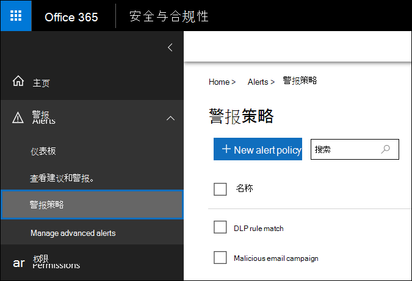
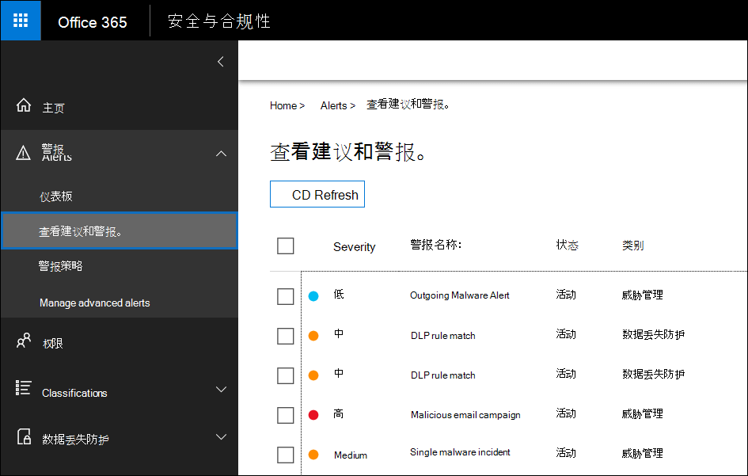

# <a name="alert-policies-in-the-security-and-compliance-center"></a><span data-ttu-id="7b34f-104">安全与合规中心中的警报策略</span><span class="sxs-lookup"><span data-stu-id="7b34f-104">Alert policies in the security and compliance center</span></span>

<span data-ttu-id="7b34f-105">您可以使用 Office 365 和 Microsoft 365 安全与合规中心中的新警报策略和警报仪表板工具创建通知策略，然后查看在用户执行符合警报策略条件的活动时生成的警报。</span><span class="sxs-lookup"><span data-stu-id="7b34f-105">You can use the new alert policy and alert dashboard tools in the Office 365 and Microsoft 365 security and compliance centers to create alert policies and then view the alerts generated when users perform activities that match the conditions of an alert policy.</span></span> 

<span data-ttu-id="7b34f-106">通知策略建立在上，并可通过让您对警报策略进行分类、将策略应用于组织中的所有用户、在触发警报时设置阈值级别以及决定是否接收电子邮件来扩展活动警报的功能。通知.</span><span class="sxs-lookup"><span data-stu-id="7b34f-106">Alert policies build on and expand the functionality of activity alerts by letting you categorize the alert policy, apply the policy to all users in your organization, set a threshold level for when an alert is triggered, and decide whether to receive email notifications.</span></span> <span data-ttu-id="7b34f-107">在安全与合规中心中还有一个 "**查看通知**" 页，您可以在其中查看和筛选警报、设置通知状态以帮助您管理通知，然后在解决或解决基础事件后取消通知。</span><span class="sxs-lookup"><span data-stu-id="7b34f-107">There's also a **View alerts** page in the security and compliance center where you can view and filter alerts, set an alert status to help you manage alerts, and then dismiss alerts after you've addressed or resolved the underlying incident.</span></span> <span data-ttu-id="7b34f-108">我们还扩展了您可以为其创建通知的事件的类型。</span><span class="sxs-lookup"><span data-stu-id="7b34f-108">We've also expanded the type of events that you can create alerts for.</span></span> <span data-ttu-id="7b34f-109">例如，您可以创建通知策略来跟踪恶意软件活动和数据丢失事件。</span><span class="sxs-lookup"><span data-stu-id="7b34f-109">For example, you can create alert policies to track malware activity and data loss incidents.</span></span> <span data-ttu-id="7b34f-110">我们还提供了多个默认的通知策略，可帮助您监视诸如在 Exchange Online 中分配管理员权限、恶意软件攻击、网络钓鱼活动以及文件删除和外部共享的异常级别等活动。</span><span class="sxs-lookup"><span data-stu-id="7b34f-110">We've also included several default alert policies that help you monitor activities such as assigning admin privileges in Exchange Online, malware attacks, phishing campaigns, and unusual levels of file deletions and external sharing.</span></span>

> [!NOTE]
> <span data-ttu-id="7b34f-111">通知策略适用于具有 Microsoft 365、Office 365 企业版或 Office 365 美国政府 E1/F1/G1、E3/G3 或 E5/G5 订阅的组织。</span><span class="sxs-lookup"><span data-stu-id="7b34f-111">Alert policies are available for organizations with a Microsoft 365, Office 365 Enterprise, or Office 365 US Government E1/F1/G1, E3/G3, or E5/G5 subscription.</span></span> <span data-ttu-id="7b34f-112">高级功能仅适用于具有 E5/G5 订阅的组织，或具有 E1/F1/G1 或 E3/G3 订阅的组织，以及 Office 365 高级威胁防护（ATP） P2 或 Office 365 高级合规性附加订阅。</span><span class="sxs-lookup"><span data-stu-id="7b34f-112">Advanced functionality is only available for organizations with an E5/G5 subscription, or for organizations that have an E1/F1/G1 or E3/G3 subscription and an Office 365 Advanced Threat Protection (ATP) P2 or Office 365 Advanced Compliance add-on subscription.</span></span> <span data-ttu-id="7b34f-113">本主题中突出显示了需要 E5/G5 或附加订阅的功能。</span><span class="sxs-lookup"><span data-stu-id="7b34f-113">The functionality that requires an E5/G5 or add-on subscription is highlighted in this topic.</span></span> <span data-ttu-id="7b34f-114">另请注意，在 Office 365 GCC、GCC High 和 DoD 美国政府环境中提供了警报策略。</span><span class="sxs-lookup"><span data-stu-id="7b34f-114">Also note that alert policies are available in Office 365 GCC, GCC High, and DoD US government environments.</span></span>

## <a name="how-alert-policies-work"></a><span data-ttu-id="7b34f-115">警报策略的工作原理</span><span class="sxs-lookup"><span data-stu-id="7b34f-115">How alert policies work</span></span>

<span data-ttu-id="7b34f-116">下面简要概述了警报策略的工作方式，以及当用户或管理员活动符合警报策略条件时触发的警报。</span><span class="sxs-lookup"><span data-stu-id="7b34f-116">Here's a quick overview of how alert policies work and the alerts that are triggers when user or admin activity matches the conditions of an alert policy.</span></span>


1. <span data-ttu-id="7b34f-118">您的组织中的管理员使用 "安全与合规中心" 中的 "**警报策略**" 页创建、配置和打开一个警报策略。</span><span class="sxs-lookup"><span data-stu-id="7b34f-118">An admin in your organization creates, configures, and turns on an alert policy by using the **Alert policies** page in the security and compliance center.</span></span> <span data-ttu-id="7b34f-119">您还可以使用 Security & 合规性中心 PowerShell 中的**remove-protectionalert** cmdlet 创建警报策略。</span><span class="sxs-lookup"><span data-stu-id="7b34f-119">You can also create alert policies by using the **New-ProtectionAlert** cmdlet in Security & Compliance Center PowerShell.</span></span> <span data-ttu-id="7b34f-120">若要创建通知策略，您必须在 "安全与合规中心" 中为 "管理警报" 角色或 "组织配置" 角色分配。</span><span class="sxs-lookup"><span data-stu-id="7b34f-120">To create alert policies, you have to be assigned the Manage Alerts role or the Organization Configuration role in the security and compliance center.</span></span>

2. <span data-ttu-id="7b34f-121">用户执行符合通知策略条件的活动。</span><span class="sxs-lookup"><span data-stu-id="7b34f-121">A user performs an activity that matches the conditions of an alert policy.</span></span> <span data-ttu-id="7b34f-122">对于恶意软件攻击，向组织中的用户发送的受感染的电子邮件将触发警报。</span><span class="sxs-lookup"><span data-stu-id="7b34f-122">In the case of malware attacks, infected email messages sent to users in your organization trigger an alert.</span></span>

3. <span data-ttu-id="7b34f-123">Office 365 生成一个警报，该警报显示在安全与合规中心的 "**查看通知**" 页上。</span><span class="sxs-lookup"><span data-stu-id="7b34f-123">Office 365 generates an alert that's displayed on the **View alerts** page in the security and compliance center.</span></span> <span data-ttu-id="7b34f-124">此外，如果为通知策略启用了电子邮件通知，Office 365 会向收件人列表发送通知。</span><span class="sxs-lookup"><span data-stu-id="7b34f-124">Also, if email notifications are enabled for the alert policy, Office 365 sends a notification to a list of recipients.</span></span> <span data-ttu-id="7b34f-125">管理员或其他用户可以在 "查看通知" 页面上看到的警报由分配给该用户的角色决定。</span><span class="sxs-lookup"><span data-stu-id="7b34f-125">The alerts that an admin or other users can see that on the View alerts page is determined by the roles assigned to the user.</span></span> <span data-ttu-id="7b34f-126">有关详细信息，请参阅[查看通知所需的 RBAC 权限](#rbac-permissions-required-to-view-alerts)部分。</span><span class="sxs-lookup"><span data-stu-id="7b34f-126">For more information, see the [RBAC permissions required to view alerts](#rbac-permissions-required-to-view-alerts) section.</span></span>

4. <span data-ttu-id="7b34f-127">管理员管理安全与合规中心中的警报。</span><span class="sxs-lookup"><span data-stu-id="7b34f-127">An admin manages alerts in the security and compliance center.</span></span> <span data-ttu-id="7b34f-128">管理警报包括分配通知状态以帮助跟踪和管理任何调查。</span><span class="sxs-lookup"><span data-stu-id="7b34f-128">Managing alerts consists of assigning an alert status to help track and manage any investigation.</span></span>

## <a name="alert-policy-settings"></a><span data-ttu-id="7b34f-129">通知策略设置</span><span class="sxs-lookup"><span data-stu-id="7b34f-129">Alert policy settings</span></span>

<span data-ttu-id="7b34f-130">警报策略由一组规则和条件组成，用于定义生成警报的用户或管理员活动、触发警报的用户的列表（如果它们执行活动）以及定义在通知之前活动发生次数的阈值。 触发。</span><span class="sxs-lookup"><span data-stu-id="7b34f-130">An alert policy consists of a set of rules and conditions that define the user or admin activity that generates an alert, a list of users who trigger the alert if they perform the activity, and a threshold that defines how many times the activity has to occur before an alert is triggered.</span></span> <span data-ttu-id="7b34f-131">您还可以对策略进行分类并为其分配一个严重性级别。</span><span class="sxs-lookup"><span data-stu-id="7b34f-131">You also categorize the policy and assign it a severity level.</span></span> <span data-ttu-id="7b34f-132">这两个设置可帮助您管理通知策略（以及在策略条件匹配时触发的警报），因为在管理策略和查看安全与合规中心中的警报时，可以对这些设置进行筛选。</span><span class="sxs-lookup"><span data-stu-id="7b34f-132">These two settings help you manage alert policies (and the alerts that are triggered when the policy conditions are matched) because you can filter on these settings when managing policies and viewing alerts in the security and compliance center.</span></span> <span data-ttu-id="7b34f-133">例如，您可以查看与相同类别中的条件匹配的警报或查看具有相同严重性级别的警报。</span><span class="sxs-lookup"><span data-stu-id="7b34f-133">For example, you can view alerts that match the conditions from the same category or view alerts with the same severity level.</span></span>

<span data-ttu-id="7b34f-134">若要查看和创建通知策略，请[https://protection.office.com](https://protection.office.com)转到，然后选择 "**警报** \> **警报策略**"。</span><span class="sxs-lookup"><span data-stu-id="7b34f-134">To view and create alert policies, go to [https://protection.office.com](https://protection.office.com) and then select **Alerts** \> **Alert policies**.</span></span>



<span data-ttu-id="7b34f-136">警报策略由以下设置和条件组成。</span><span class="sxs-lookup"><span data-stu-id="7b34f-136">An alert policy consists of the following settings and conditions.</span></span>

- <span data-ttu-id="7b34f-137">**活动：警报跟踪**-您可以创建用于跟踪活动的策略，也可以在某些情况下创建用于跟踪活动的策略，这些活动包括共享文件、分配访问权限或创建匿名链接的外部用户共享文件。</span><span class="sxs-lookup"><span data-stu-id="7b34f-137">**Activity the alert is tracking** - You create a policy to track an activity or in some cases a few related activities, such a sharing a file with an external user by sharing it, assigning access permissions, or creating an anonymous link.</span></span> <span data-ttu-id="7b34f-138">当用户执行策略定义的活动时，将根据警报阈值设置触发警报。</span><span class="sxs-lookup"><span data-stu-id="7b34f-138">When a user performs the activity defined by the policy, an alert is triggered based on the alert threshold settings.</span></span>

    > [!NOTE]
    > <span data-ttu-id="7b34f-139">您可以跟踪的活动取决于组织的 Office 365 企业版或 Office 365 美国政府版计划。</span><span class="sxs-lookup"><span data-stu-id="7b34f-139">The activities that you can track depend on your organization's Office 365 Enterprise or Office 365 US Government plan.</span></span> <span data-ttu-id="7b34f-140">一般情况下，与恶意软件市场和网络钓鱼攻击相关的活动需要 E5/G5 订阅或具有 " [Office 365 高级威胁防护](../security/office-365-security/office-365-atp.md)计划 2" 附加订阅的 "E1/F1/G1" 或 "E3/G3 订阅"。</span><span class="sxs-lookup"><span data-stu-id="7b34f-140">In general, activities related to malware campaigns and phishing attacks require an E5/G5 subscription or an E1/F1/G1 or E3/G3 subscription with an [Office 365 Advanced Threat Protection](../security/office-365-security/office-365-atp.md) Plan 2 add-on subscription.</span></span>

- <span data-ttu-id="7b34f-141">**活动条件**-对于大多数活动，您可以定义触发警报时必须满足的其他条件。</span><span class="sxs-lookup"><span data-stu-id="7b34f-141">**Activity conditions** - For most activities, you can define additional conditions that must be met to trigger an alert.</span></span> <span data-ttu-id="7b34f-142">常见条件包括 IP 地址（以便当用户在具有特定 IP 地址或 IP 地址范围内的计算机上执行活动时，将触发警报）、特定用户或用户执行该活动时是否触发警报以及是否将对特定文件名或 URL 执行活动。</span><span class="sxs-lookup"><span data-stu-id="7b34f-142">Common conditions include IP addresses (so that an alert is triggered when the user performs the activity on a computer with a specific IP address or within an IP address range), whether an alert is triggered if a specific user or users perform that activity, and whether the activity is performed on a specific file name or URL.</span></span> <span data-ttu-id="7b34f-143">您还可以配置在组织中的任何用户执行活动时触发警报的条件。</span><span class="sxs-lookup"><span data-stu-id="7b34f-143">You can also configure a condition that triggers an alert when the activity is performed by any user in your organization.</span></span> <span data-ttu-id="7b34f-144">可用的条件取决于所选的活动。</span><span class="sxs-lookup"><span data-stu-id="7b34f-144">The available conditions are dependent on the selected activity.</span></span>

- <span data-ttu-id="7b34f-145">**触发警报时**-您可以配置一个设置，用于定义在触发警报之前活动发生的频率。</span><span class="sxs-lookup"><span data-stu-id="7b34f-145">**When the alert is triggered** - You can configure a setting that defines how often an activity can occur before an alert is triggered.</span></span> <span data-ttu-id="7b34f-146">这使您可以设置一个策略，使其在每次活动匹配策略条件时生成警报，当超出某个阈值时，或者当触发警报时，您的组织的活动将变得不正常。</span><span class="sxs-lookup"><span data-stu-id="7b34f-146">This allows you to set up a policy to generate an alert every time an activity matches the policy conditions, when a certain threshold is exceeded, or when the occurrence of the activity the alert is tracking becomes unusual for your organization.</span></span>

    

    <span data-ttu-id="7b34f-148">如果您选择基于异常活动的设置，Office 365 将建立一个定义所选活动的正常频率的比较基准值。</span><span class="sxs-lookup"><span data-stu-id="7b34f-148">If you select the setting based on unusual activity, Office 365 establishes a baseline value that defines the normal frequency for the selected activity.</span></span> <span data-ttu-id="7b34f-149">建立此基准花费的时间最长为7天，在此过程中不会生成警报。</span><span class="sxs-lookup"><span data-stu-id="7b34f-149">It takes up to seven days to establish this baseline, during which alerts won't be generated.</span></span> <span data-ttu-id="7b34f-150">建立基准之后，当通知策略跟踪的活动的频率大大超过比较基准值时，将触发警报。</span><span class="sxs-lookup"><span data-stu-id="7b34f-150">After the baseline is established, an alert is triggered when the frequency of the activity tracked by the alert policy greatly exceeds the baseline value.</span></span> <span data-ttu-id="7b34f-151">对于与审核相关的活动（如文件和文件夹活动），您可以基于单个用户或组织中的所有用户建立基准。对于与恶意软件相关的活动，您可以基于单个恶意软件系列、单个收件人或组织中的所有邮件建立基准。</span><span class="sxs-lookup"><span data-stu-id="7b34f-151">For auditing-related activities (such as file and folder activities), you can establish a baseline based on a single user or based on all users in your organization; for malware-related activities, you can establish a baseline based on a single malware family, a single recipient, or all messages in your organization.</span></span>

    > [!NOTE]
    > <span data-ttu-id="7b34f-152">根据阈值或基于异常活动配置警报策略的功能需要 E5/G5 订阅，或者具有 Office 365 ATP P2 或高级合规性附加订阅的 E1/F1/G1 或 E3/G3 订阅。</span><span class="sxs-lookup"><span data-stu-id="7b34f-152">The ability to configure alert policies based on a threshold or based on unusual activity requires an E5/G5 subscription, or an E1/F1/G1 or E3/G3 subscription with an Office 365 ATP P2 or Advanced Compliance add-on subscription.</span></span> <span data-ttu-id="7b34f-153">具有 E1/F1/G1 和 E3/G3 订阅的组织只能创建一个警报策略，在每次发生活动时都会触发警报。</span><span class="sxs-lookup"><span data-stu-id="7b34f-153">Organizations with an E1/F1/G1 and E3/G3 subscription can only create an alert policy where an alert is triggered every time that an activity occurs.</span></span>

- <span data-ttu-id="7b34f-154">**警报类别**-若要帮助跟踪和管理策略生成的警报，可以将以下类别之一分配给策略。</span><span class="sxs-lookup"><span data-stu-id="7b34f-154">**Alert category** - To help with tracking and managing the alerts generated by a policy, you can assign one of the following categories to a policy.</span></span>

  - <span data-ttu-id="7b34f-155">数据丢失防护</span><span class="sxs-lookup"><span data-stu-id="7b34f-155">Data loss prevention</span></span>

  - <span data-ttu-id="7b34f-156">信息治理</span><span class="sxs-lookup"><span data-stu-id="7b34f-156">Information governance</span></span>

  - <span data-ttu-id="7b34f-157">邮件流</span><span class="sxs-lookup"><span data-stu-id="7b34f-157">Mail flow</span></span>

  - <span data-ttu-id="7b34f-158">权限</span><span class="sxs-lookup"><span data-stu-id="7b34f-158">Permissions</span></span>

  - <span data-ttu-id="7b34f-159">威胁管理</span><span class="sxs-lookup"><span data-stu-id="7b34f-159">Threat management</span></span>

  - <span data-ttu-id="7b34f-160">其他</span><span class="sxs-lookup"><span data-stu-id="7b34f-160">Others</span></span>

  <span data-ttu-id="7b34f-161">当发生符合通知策略条件的活动时，将使用此设置中定义的类别标记生成的警报。</span><span class="sxs-lookup"><span data-stu-id="7b34f-161">When an activity occurs that matches the conditions of the alert policy, the alert that's generated is tagged with the category defined in this setting.</span></span> <span data-ttu-id="7b34f-162">这样，您就可以在安全与合规中心中的 "**查看通知**" 页面上跟踪和管理具有相同类别设置的通知，因为您可以根据类别对通知进行排序和筛选。</span><span class="sxs-lookup"><span data-stu-id="7b34f-162">This allows you to track and manage alerts that have the same category setting on the **View alerts** page in the security and compliance center because you can sort and filter alerts based on category.</span></span>

- <span data-ttu-id="7b34f-163">**警报严重性**-类似于警报类别，您将严重性属性（**低**、**中**、**高**或**信息**）分配给警报策略。</span><span class="sxs-lookup"><span data-stu-id="7b34f-163">**Alert severity** - Similar to the alert category, you assign a severity attribute (**Low**, **Medium**, **High**, or **Informational**) to alert policies.</span></span> <span data-ttu-id="7b34f-164">与警报类别一样，当发生符合通知策略条件的活动时，将使用为警报策略设置的相同严重性级别标记生成的警报。</span><span class="sxs-lookup"><span data-stu-id="7b34f-164">Like the alert category, when an activity occurs that matches the conditions of the alert policy, the alert that's generated is tagged with the same severity level that's set for the alert policy.</span></span> <span data-ttu-id="7b34f-165">同样，这使您可以跟踪和管理 "**查看通知**" 页面上具有相同严重性设置的警报。</span><span class="sxs-lookup"><span data-stu-id="7b34f-165">Again, this allows you to track and manage alerts that have the same severity setting on the **View alerts** page.</span></span> <span data-ttu-id="7b34f-166">例如，可以筛选警报列表，以便只显示严重性为**高**的警报。</span><span class="sxs-lookup"><span data-stu-id="7b34f-166">For example, you can filter the list of alerts so that only alerts with a **High** severity are displayed.</span></span>

    > [!TIP]
    > <span data-ttu-id="7b34f-167">在设置通知策略时，请考虑为活动分配较高的严重性，这可能会导致严重的负面后果，例如，在传递给用户、查看敏感数据或保密数据、与外部用户共享数据时检测到恶意软件。或其他可能导致数据丢失或安全威胁的活动。</span><span class="sxs-lookup"><span data-stu-id="7b34f-167">When setting up an alert policy, consider assigning a higher severity to activities that can result in severely negative consequences, such as detection of malware after delivery to users, viewing of sensitive or classified data, sharing data with external users, or other activities that can result in data loss or security threats.</span></span> <span data-ttu-id="7b34f-168">这可帮助你确定通知优先级以及你要调查和解决基本原因所采取的操作。</span><span class="sxs-lookup"><span data-stu-id="7b34f-168">This can help you prioritize alerts and the actions you take to investigate and resolve the underlying causes.</span></span>

- <span data-ttu-id="7b34f-169">**电子邮件通知**-你可以设置策略，以便在触发警报时向用户列表发送（或不发送）电子邮件通知。</span><span class="sxs-lookup"><span data-stu-id="7b34f-169">**Email notifications** - You can set up the policy so that email notifications are sent (or not sent) to a list of users when an alert is triggered.</span></span> <span data-ttu-id="7b34f-170">您还可以设置每日通知限制，以便在达到最大通知数后，在该天内不会为警报发送更多通知。</span><span class="sxs-lookup"><span data-stu-id="7b34f-170">You can also set a daily notification limit so that once the maximum number of notifications has been reached, no more notifications are sent for the alert during that day.</span></span> <span data-ttu-id="7b34f-171">除了电子邮件通知之外，您或其他管理员可以查看由 "**查看通知**" 页面上的策略触发的警报。</span><span class="sxs-lookup"><span data-stu-id="7b34f-171">In addition to email notifications, you or other administrators can view the alerts that are triggered by a policy on the **View alerts** page.</span></span> <span data-ttu-id="7b34f-172">考虑为特定类别的警报策略启用电子邮件通知，或者使用较高严重性设置的电子邮件通知。</span><span class="sxs-lookup"><span data-stu-id="7b34f-172">Consider enabling email notifications for alert policies of a specific category or that have a higher severity setting.</span></span>

## <a name="default-alert-policies"></a><span data-ttu-id="7b34f-173">默认通知策略</span><span class="sxs-lookup"><span data-stu-id="7b34f-173">Default alert policies</span></span>

<span data-ttu-id="7b34f-174">Office 365 提供了内置的通知策略，可帮助确定 Exchange 管理员权限滥用、恶意软件活动、潜在的外部和内部威胁以及信息治理风险。</span><span class="sxs-lookup"><span data-stu-id="7b34f-174">Office 365 provides built-in alert policies that help identify Exchange admin permissions abuse, malware activity, potential external and internal threats, and information governance risks.</span></span> <span data-ttu-id="7b34f-175">在 "**通知策略**" 页上，这些内置策略的名称以粗体显示，并且策略类型定义为 " **System**"。</span><span class="sxs-lookup"><span data-stu-id="7b34f-175">On the **Alert policies** page, the names of these built-in policies are in bold and the policy type is defined as **System**.</span></span> <span data-ttu-id="7b34f-176">默认情况下，这些策略处于打开状态。</span><span class="sxs-lookup"><span data-stu-id="7b34f-176">These policies are turned on by default.</span></span> <span data-ttu-id="7b34f-177">您可以关闭这些策略（或重新打开），设置要向其发送电子邮件通知的收件人列表，并设置每日通知限制。</span><span class="sxs-lookup"><span data-stu-id="7b34f-177">You can turn off these policies (or back on again), set up a list of recipients to send email notifications to, and set a daily notification limit.</span></span> <span data-ttu-id="7b34f-178">无法编辑这些策略的其他设置。</span><span class="sxs-lookup"><span data-stu-id="7b34f-178">The other settings for these policies can't be edited.</span></span>

<span data-ttu-id="7b34f-179">下表列出并说明了可用的默认通知策略以及分配给每个策略的类别。</span><span class="sxs-lookup"><span data-stu-id="7b34f-179">The following table lists and describes the available default alert policies and the category each policy is assigned to.</span></span> <span data-ttu-id="7b34f-180">类别用于确定用户可在 "查看通知" 页面上查看的通知。</span><span class="sxs-lookup"><span data-stu-id="7b34f-180">The category is used to determine which alerts a user can view on the View alerts page.</span></span> <span data-ttu-id="7b34f-181">有关详细信息，请参阅[查看通知所需的 RBAC 权限](#rbac-permissions-required-to-view-alerts)部分。</span><span class="sxs-lookup"><span data-stu-id="7b34f-181">For more information, see the [RBAC permissions required to view alerts](#rbac-permissions-required-to-view-alerts) section.</span></span>

<span data-ttu-id="7b34f-182">该表还指明了每个 Office 365 企业版和 Office 365 美国政府部门需要的计划。</span><span class="sxs-lookup"><span data-stu-id="7b34f-182">The table also indicates the Office 365 Enterprise and Office 365 US Government plan required for each one.</span></span> <span data-ttu-id="7b34f-183">如果您的组织具有相应的附加订阅，除了 E1/F1/G1 或 E3/G3 订阅之外，还可以使用某些默认的通知策略。</span><span class="sxs-lookup"><span data-stu-id="7b34f-183">Some default alert policies are available if your organization has the appropriate add-on subscription in addition to an E1/F1/G1 or E3/G3 subscription.</span></span>

|<span data-ttu-id="7b34f-184">**默认通知策略**</span><span class="sxs-lookup"><span data-stu-id="7b34f-184">**Default alert policy**</span></span>|<span data-ttu-id="7b34f-185">**说明**</span><span class="sxs-lookup"><span data-stu-id="7b34f-185">**Description**</span></span>|<span data-ttu-id="7b34f-186">**Category**</span><span class="sxs-lookup"><span data-stu-id="7b34f-186">**Category**</span></span>|<span data-ttu-id="7b34f-187">**Office 365 企业版订阅**</span><span class="sxs-lookup"><span data-stu-id="7b34f-187">**Office 365 Enterprise subscription**</span></span>|
|:-----|:-----|:-----|:-----|
|<span data-ttu-id="7b34f-188">**检测到潜在的恶意 URL 单击**</span><span class="sxs-lookup"><span data-stu-id="7b34f-188">**A potentially malicious URL click was detected**</span></span>|<span data-ttu-id="7b34f-189">当组织中的用户受[Office 365 ATP 安全链接](../security/office-365-security/atp-safe-links.md)的保护时，将生成警报。单击恶意链接。</span><span class="sxs-lookup"><span data-stu-id="7b34f-189">Generates an alert when a user protected by [Office 365 ATP Safe Links](../security/office-365-security/atp-safe-links.md) in your organization clicks a malicious link.</span></span> <span data-ttu-id="7b34f-190">当通过 Office 365 ATP 标识 URL 判定更改时，或者用户替代 Office 365 ATP 安全链接页面（基于组织的 Office 365 ATP 安全链接策略）时，将触发此事件。</span><span class="sxs-lookup"><span data-stu-id="7b34f-190">This event is triggered when URL verdict changes are identified by Office 365 ATP or when users override the Office 365 ATP Safe Links pages (based on your organization's Office 365 ATP Safe Links policy).</span></span> <span data-ttu-id="7b34f-191">此通知策略具有**高**严重性设置。</span><span class="sxs-lookup"><span data-stu-id="7b34f-191">This alert policy has a **High** severity setting.</span></span> <span data-ttu-id="7b34f-192">对于 Office 365 ATP P2，E5，G5 客户，此通知会自动触发[Office 365 中的自动调查和响应](https://go.microsoft.com/fwlink/?linkid=2084737)。</span><span class="sxs-lookup"><span data-stu-id="7b34f-192">For Office 365 ATP P2, E5, G5 customers, this alert automatically triggers [automated investigation and response in Office 365](https://go.microsoft.com/fwlink/?linkid=2084737).</span></span> <span data-ttu-id="7b34f-193">有关触发此警报的事件的详细信息，请参阅[设置 Office 365 ATP 安全链接策略](../security/office-365-security/set-up-atp-safe-links-policies.md)。</span><span class="sxs-lookup"><span data-stu-id="7b34f-193">For more information on events that trigger this alert, see [Set up Office 365 ATP Safe Links policies](../security/office-365-security/set-up-atp-safe-links-policies.md).</span></span>|<span data-ttu-id="7b34f-194">威胁管理</span><span class="sxs-lookup"><span data-stu-id="7b34f-194">Threat management</span></span>|<span data-ttu-id="7b34f-195">E5/G5 或 Office 365 ATP P2 附加订阅</span><span class="sxs-lookup"><span data-stu-id="7b34f-195">E5/G5 or Office 365 ATP P2 add-on subscription</span></span>|
|<span data-ttu-id="7b34f-196">**管理员提交结果已完成**</span><span class="sxs-lookup"><span data-stu-id="7b34f-196">**Admin Submission result completed**</span></span>|<span data-ttu-id="7b34f-197">当[管理员提交](../security/office-365-security/admin-submission.md)完成已提交实体的重新扫描时生成警报。</span><span class="sxs-lookup"><span data-stu-id="7b34f-197">Generates an alert when an [Admin Submission](../security/office-365-security/admin-submission.md) completes the rescan of the submitted entity.</span></span> <span data-ttu-id="7b34f-198">每次从管理员提交中呈现重新扫描结果时，都会触发警报。</span><span class="sxs-lookup"><span data-stu-id="7b34f-198">An alert will be triggered every time a rescan result is rendered from an Admin Submission.</span></span> <span data-ttu-id="7b34f-199">这些警报旨在提醒您[查看以前提交的结果](https://protection.office.com/reportsubmission)、提交用户报告的邮件以获取最新的策略检查并重新扫描 verdicts，并帮助您确定组织中的筛选策略是否有预期的影响。</span><span class="sxs-lookup"><span data-stu-id="7b34f-199">These alerts are meant to remind you to [review the results of previous submissions](https://protection.office.com/reportsubmission), submit user reported messages to get the latest policy check and rescan verdicts, and help you determine if the filtering policies in your organization are having the intended impact.</span></span> <span data-ttu-id="7b34f-200">此策略的严重性设置**较低**。</span><span class="sxs-lookup"><span data-stu-id="7b34f-200">This policy has a **Low** severity setting.</span></span>|<span data-ttu-id="7b34f-201">威胁管理</span><span class="sxs-lookup"><span data-stu-id="7b34f-201">Threat management</span></span>|<span data-ttu-id="7b34f-202">E1/F1、E3 或 E5</span><span class="sxs-lookup"><span data-stu-id="7b34f-202">E1/F1, E3, or E5</span></span>|
|<span data-ttu-id="7b34f-203">**创建转发/重定向规则**</span><span class="sxs-lookup"><span data-stu-id="7b34f-203">**Creation of forwarding/redirect rule**</span></span>|<span data-ttu-id="7b34f-204">当组织中的某个人为其邮箱创建了将邮件转发或重定向到其他电子邮件帐户的收件箱规则时，将生成警报。</span><span class="sxs-lookup"><span data-stu-id="7b34f-204">Generates an alert when someone in your organization creates an inbox rule for their mailbox that forwards or redirects messages to another email account.</span></span> <span data-ttu-id="7b34f-205">此策略仅跟踪使用 web 上的 Outlook （以前称为 Outlook Web App）或 Exchange Online PowerShell 创建的收件箱规则。</span><span class="sxs-lookup"><span data-stu-id="7b34f-205">This policy only tracks inbox rules that are created using Outlook on the web (formerly known as Outlook Web App) or Exchange Online PowerShell.</span></span> <span data-ttu-id="7b34f-206">此策略的严重性设置**较低**。</span><span class="sxs-lookup"><span data-stu-id="7b34f-206">This policy has a **Low** severity setting.</span></span> <span data-ttu-id="7b34f-207">有关在 Outlook 网页版中使用收件箱规则转发和重定向电子邮件的详细信息，请参阅[使用 web 上的 outlook 中的规则将邮件自动转发到其他帐户](https://support.office.com/article/1433e3a0-7fb0-4999-b536-50e05cb67fed)。</span><span class="sxs-lookup"><span data-stu-id="7b34f-207">For more information about using inbox rules to forward and redirect email in Outlook on the web, see [Use rules in Outlook on the web to automatically forward messages to another account](https://support.office.com/article/1433e3a0-7fb0-4999-b536-50e05cb67fed).</span></span>|<span data-ttu-id="7b34f-208">威胁管理</span><span class="sxs-lookup"><span data-stu-id="7b34f-208">Threat management</span></span>|<span data-ttu-id="7b34f-209">E1/F1/G1、E3/G3 或 E5/G5</span><span class="sxs-lookup"><span data-stu-id="7b34f-209">E1/F1/G1, E3/G3, or E5/G5</span></span>|
|<span data-ttu-id="7b34f-210">**启动或导出的电子数据展示搜索**</span><span class="sxs-lookup"><span data-stu-id="7b34f-210">**eDiscovery search started or exported**</span></span>|<span data-ttu-id="7b34f-211">当有人使用安全与合规中心中的内容搜索工具时，将生成警报。</span><span class="sxs-lookup"><span data-stu-id="7b34f-211">Generates an alert when someone uses the Content search tool in the Security and compliance center.</span></span> <span data-ttu-id="7b34f-212">执行以下内容搜索活动时，将触发警报：</span><span class="sxs-lookup"><span data-stu-id="7b34f-212">An alert is triggered when the following content search activities are performed:</span></span> <br/><br/><span data-ttu-id="7b34f-213">•已启动内容搜索</span><span class="sxs-lookup"><span data-stu-id="7b34f-213">• A content search is started</span></span><br/><span data-ttu-id="7b34f-214">•将导出内容搜索的结果</span><span class="sxs-lookup"><span data-stu-id="7b34f-214">• The results of a content search are exported</span></span><br/><span data-ttu-id="7b34f-215">•导出内容搜索报告</span><span class="sxs-lookup"><span data-stu-id="7b34f-215">• A content search report is exported</span></span><br/><br/><span data-ttu-id="7b34f-216">在与电子数据展示事例相关联的前一内容搜索活动执行时，也会触发警报。</span><span class="sxs-lookup"><span data-stu-id="7b34f-216">Alerts are also triggered when the previous content search activities are performed in association with an eDiscovery case.</span></span> <span data-ttu-id="7b34f-217">此策略的严重性设置为**中等**。</span><span class="sxs-lookup"><span data-stu-id="7b34f-217">This policy has a **Medium** severity setting.</span></span> <span data-ttu-id="7b34f-218">有关内容搜索活动的详细信息，请参阅[在 Office 365 审核日志中搜索电子数据展示活动](search-for-ediscovery-activities-in-the-audit-log.md#ediscovery-activities)。</span><span class="sxs-lookup"><span data-stu-id="7b34f-218">For more information about content search activities, see [Search for eDiscovery activities in the Office 365 audit log](search-for-ediscovery-activities-in-the-audit-log.md#ediscovery-activities).</span></span>|<span data-ttu-id="7b34f-219">威胁管理</span><span class="sxs-lookup"><span data-stu-id="7b34f-219">Threat management</span></span>|<span data-ttu-id="7b34f-220">E1/F1/G1、E3/G3 或 E5/G5</span><span class="sxs-lookup"><span data-stu-id="7b34f-220">E1/F1/G1, E3/G3, or E5/G5</span></span>|
|<span data-ttu-id="7b34f-221">**Exchange 管理员权限提升**</span><span class="sxs-lookup"><span data-stu-id="7b34f-221">**Elevation of Exchange admin privilege**</span></span>|<span data-ttu-id="7b34f-222">在 Exchange Online 组织中向某人分配管理权限时生成警报。</span><span class="sxs-lookup"><span data-stu-id="7b34f-222">Generates an alert when someone is assigned administrative permissions in your Exchange Online organization.</span></span> <span data-ttu-id="7b34f-223">例如，当用户添加到 Exchange Online 中的 "组织管理" 角色组时。</span><span class="sxs-lookup"><span data-stu-id="7b34f-223">For example, when a user is added to the Organization Management role group in Exchange Online.</span></span> <span data-ttu-id="7b34f-224">此策略的严重性设置**较低**。</span><span class="sxs-lookup"><span data-stu-id="7b34f-224">This policy has a **Low** severity setting.</span></span>|<span data-ttu-id="7b34f-225">权限</span><span class="sxs-lookup"><span data-stu-id="7b34f-225">Permissions</span></span>|<span data-ttu-id="7b34f-226">E1/F1/G1、E3/G3 或 E5/G5</span><span class="sxs-lookup"><span data-stu-id="7b34f-226">E1/F1/G1, E3/G3, or E5/G5</span></span>|
|<span data-ttu-id="7b34f-227">**包含在传递后删除的恶意软件的电子邮件**</span><span class="sxs-lookup"><span data-stu-id="7b34f-227">**Email messages containing malware removed after delivery**</span></span>|<span data-ttu-id="7b34f-228">在将包含恶意软件的任何邮件传递到组织中的邮箱时生成警报。</span><span class="sxs-lookup"><span data-stu-id="7b34f-228">Generates an alert when any messages containing malware are delivered to mailboxes in your organization.</span></span> <span data-ttu-id="7b34f-229">如果发生此事件，Office 365 将使用[零小时自动清除](../security/office-365-security/zero-hour-auto-purge.md)从 Exchange Online 邮箱中删除受感染的邮件。</span><span class="sxs-lookup"><span data-stu-id="7b34f-229">If this event occurs, Office 365 removes the infected messages from Exchange Online mailboxes using [Zero-hour auto purge](../security/office-365-security/zero-hour-auto-purge.md).</span></span> <span data-ttu-id="7b34f-230">此策略具有**信息性**严重性设置，并自动触发[Office 365 中的自动调查和响应](https://go.microsoft.com/fwlink/?linkid=2084737)。</span><span class="sxs-lookup"><span data-stu-id="7b34f-230">This policy has an **Informational** severity setting and automatically triggers [automated investigation and response in Office 365](https://go.microsoft.com/fwlink/?linkid=2084737).</span></span>|<span data-ttu-id="7b34f-231">威胁管理</span><span class="sxs-lookup"><span data-stu-id="7b34f-231">Threat management</span></span>|<span data-ttu-id="7b34f-232">E5/G5 或 Office 365 ATP P2 附加订阅</span><span class="sxs-lookup"><span data-stu-id="7b34f-232">E5/G5 or Office 365 ATP P2 add-on subscription</span></span>|
|<span data-ttu-id="7b34f-233">**包含投递后删除的网络钓鱼 Url 的电子邮件**</span><span class="sxs-lookup"><span data-stu-id="7b34f-233">**Email messages containing phish URLs removed after delivery**</span></span>|<span data-ttu-id="7b34f-234">在将包含网络钓鱼的任何邮件传递到组织中的邮箱时生成警报。</span><span class="sxs-lookup"><span data-stu-id="7b34f-234">Generates an alert when any messages containing phish are delivered to mailboxes in your organization.</span></span> <span data-ttu-id="7b34f-235">如果发生此事件，Office 365 将使用[零小时自动清除](../security/office-365-security/zero-hour-auto-purge.md)从 Exchange Online 邮箱中删除受感染的邮件。</span><span class="sxs-lookup"><span data-stu-id="7b34f-235">If this event occurs, Office 365 removes the infected messages from Exchange Online mailboxes using [Zero-hour auto purge](../security/office-365-security/zero-hour-auto-purge.md).</span></span> <span data-ttu-id="7b34f-236">此策略具有**信息性**严重性设置，并自动触发[Office 365 中的自动调查和响应](https://go.microsoft.com/fwlink/?linkid=2084737)。</span><span class="sxs-lookup"><span data-stu-id="7b34f-236">This policy has an **Informational** severity setting and automatically triggers [automated investigation and response in Office 365](https://go.microsoft.com/fwlink/?linkid=2084737).</span></span>|<span data-ttu-id="7b34f-237">威胁管理</span><span class="sxs-lookup"><span data-stu-id="7b34f-237">Threat management</span></span>|<span data-ttu-id="7b34f-238">E5/G5 或 Office 365 ATP P2 附加订阅</span><span class="sxs-lookup"><span data-stu-id="7b34f-238">E5/G5 or Office 365 ATP P2 add-on subscription</span></span>|
|<span data-ttu-id="7b34f-239">**用户报告为恶意软件或网络钓鱼的电子邮件**</span><span class="sxs-lookup"><span data-stu-id="7b34f-239">**Email reported by user as malware or phish**</span></span>|<span data-ttu-id="7b34f-240">当组织中的用户将邮件报告为使用报告邮件加载项的仿冒电子邮件时，将生成警报。</span><span class="sxs-lookup"><span data-stu-id="7b34f-240">Generates an alert when users in your organization  report messages as phishing email using the Report Message add-in.</span></span> <span data-ttu-id="7b34f-241">此策略有一个**信息性**严重性设置。</span><span class="sxs-lookup"><span data-stu-id="7b34f-241">This policy has an **Informational** severity setting.</span></span> <span data-ttu-id="7b34f-242">有关此加载项的详细信息，请参阅[使用报告消息外接程序](https://support.office.com/article/b5caa9f1-cdf3-4443-af8c-ff724ea719d2)。</span><span class="sxs-lookup"><span data-stu-id="7b34f-242">For more information about this add-in, see [Use the Report Message add-in](https://support.office.com/article/b5caa9f1-cdf3-4443-af8c-ff724ea719d2).</span></span> <span data-ttu-id="7b34f-243">对于 Office 365 ATP P2，E5，G5 客户，此通知会自动触发[Office 365 中的自动调查和响应](https://go.microsoft.com/fwlink/?linkid=2084737)。</span><span class="sxs-lookup"><span data-stu-id="7b34f-243">For Office 365 ATP P2, E5, G5 customers, this alert automatically triggers [automated investigation and response in Office 365](https://go.microsoft.com/fwlink/?linkid=2084737).</span></span>|<span data-ttu-id="7b34f-244">威胁管理</span><span class="sxs-lookup"><span data-stu-id="7b34f-244">Threat management</span></span>|<span data-ttu-id="7b34f-245">E1/F1/G1、E3/G3 或 E5/G5</span><span class="sxs-lookup"><span data-stu-id="7b34f-245">E1/F1/G1, E3/G3, or E5/G5</span></span>|
|<span data-ttu-id="7b34f-246">**超过电子邮件发送限制**</span><span class="sxs-lookup"><span data-stu-id="7b34f-246">**Email sending limit exceeded**</span></span>|<span data-ttu-id="7b34f-247">当组织中的某个人发送了超过出站垃圾邮件策略允许的邮件时，将生成警报。</span><span class="sxs-lookup"><span data-stu-id="7b34f-247">Generates an alert when someone in your organization has sent more mail than is allowed by the outbound spam policy.</span></span> <span data-ttu-id="7b34f-248">这通常表示用户发送过多电子邮件或帐户可能会受到威胁。</span><span class="sxs-lookup"><span data-stu-id="7b34f-248">This is usually an indication the user is sending too much email or that the account may be compromised.</span></span> <span data-ttu-id="7b34f-249">此策略的严重性设置为**中等**。</span><span class="sxs-lookup"><span data-stu-id="7b34f-249">This policy has a **Medium** severity setting.</span></span> <span data-ttu-id="7b34f-250">如果你收到此警报策略生成的警报，最好[检查用户帐户是否受到威胁](../security/office-365-security/responding-to-a-compromised-email-account.md)。</span><span class="sxs-lookup"><span data-stu-id="7b34f-250">If you get an alert generated by this alert policy, it's a good idea to [check whether the user account is compromised](../security/office-365-security/responding-to-a-compromised-email-account.md).</span></span>|<span data-ttu-id="7b34f-251">威胁管理</span><span class="sxs-lookup"><span data-stu-id="7b34f-251">Threat management</span></span>|<span data-ttu-id="7b34f-252">E1/F1/G1、E3/G3 或 E5/G5</span><span class="sxs-lookup"><span data-stu-id="7b34f-252">E1/F1/G1, E3/G3, or E5/G5</span></span>|
|<span data-ttu-id="7b34f-253">**邮件已延迟**</span><span class="sxs-lookup"><span data-stu-id="7b34f-253">**Messages have been delayed**</span></span>|<span data-ttu-id="7b34f-254">当 Office 365 无法使用连接器将电子邮件发送到内部部署组织或合作伙伴服务器时生成警报。</span><span class="sxs-lookup"><span data-stu-id="7b34f-254">Generates an alert when Office 365 can't deliver email messages to your on-premises organization or a partner server by using a connector.</span></span> <span data-ttu-id="7b34f-255">当发生这种情况时，邮件将在 Office 365 中排队。</span><span class="sxs-lookup"><span data-stu-id="7b34f-255">When this happens, the message is queued in Office 365.</span></span> <span data-ttu-id="7b34f-256">当队列中有2000个或更多的邮件超过一小时时，将触发此警报。</span><span class="sxs-lookup"><span data-stu-id="7b34f-256">This alert is triggered when there are 2,000 messages or more that have been queued for more than an hour.</span></span> <span data-ttu-id="7b34f-257">此策略具有**高**严重性设置。</span><span class="sxs-lookup"><span data-stu-id="7b34f-257">This policy has a **High** severity setting.</span></span>|<span data-ttu-id="7b34f-258">邮件流</span><span class="sxs-lookup"><span data-stu-id="7b34f-258">Mail flow</span></span>|<span data-ttu-id="7b34f-259">E1/F1/G1、E3/G3 或 E5/G5</span><span class="sxs-lookup"><span data-stu-id="7b34f-259">E1/F1/G1, E3/G3, or E5/G5</span></span>|
|<span data-ttu-id="7b34f-260">**传递后检测到恶意软件市场**</span><span class="sxs-lookup"><span data-stu-id="7b34f-260">**Malware campaign detected after delivery**</span></span>|<span data-ttu-id="7b34f-261">当包含恶意软件的大量邮件传递到组织中的邮箱时，将生成警报。</span><span class="sxs-lookup"><span data-stu-id="7b34f-261">Generates an alert when an unusually large number of messages containing malware are delivered to mailboxes in your organization.</span></span> <span data-ttu-id="7b34f-262">如果发生此事件，Office 365 将从 Exchange Online 邮箱中删除受感染的邮件。</span><span class="sxs-lookup"><span data-stu-id="7b34f-262">If this event occurs, Office 365 removes the infected messages from Exchange Online mailboxes.</span></span> <span data-ttu-id="7b34f-263">此策略具有**高**严重性设置。</span><span class="sxs-lookup"><span data-stu-id="7b34f-263">This policy has a **High** severity setting.</span></span>|<span data-ttu-id="7b34f-264">威胁管理</span><span class="sxs-lookup"><span data-stu-id="7b34f-264">Threat management</span></span>|<span data-ttu-id="7b34f-265">E5/G5 或 Office 365 ATP P2 附加订阅</span><span class="sxs-lookup"><span data-stu-id="7b34f-265">E5/G5 or Office 365 ATP P2 add-on subscription</span></span>|
|<span data-ttu-id="7b34f-266">**检测到恶意软件市场活动并阻止**</span><span class="sxs-lookup"><span data-stu-id="7b34f-266">**Malware campaign detected and blocked**</span></span>|<span data-ttu-id="7b34f-267">当有人试图向组织中的用户发送包含特定类型的恶意软件的大量电子邮件时生成警报。</span><span class="sxs-lookup"><span data-stu-id="7b34f-267">Generates an alert when someone has attempted to send an unusually large number of email messages containing a certain type of malware to users in your organization.</span></span> <span data-ttu-id="7b34f-268">如果发生此事件，则受感染的邮件将被 Office 365 阻止，且不会传递到邮箱。</span><span class="sxs-lookup"><span data-stu-id="7b34f-268">If this event occurs, the infected messages are blocked by Office 365 and not delivered to mailboxes.</span></span> <span data-ttu-id="7b34f-269">此策略的严重性设置**较低**。</span><span class="sxs-lookup"><span data-stu-id="7b34f-269">This policy has a **Low** severity setting.</span></span>|<span data-ttu-id="7b34f-270">威胁管理</span><span class="sxs-lookup"><span data-stu-id="7b34f-270">Threat management</span></span>|<span data-ttu-id="7b34f-271">E5/G5 或 Office 365 ATP P2 附加订阅</span><span class="sxs-lookup"><span data-stu-id="7b34f-271">E5/G5 or Office 365 ATP P2 add-on subscription</span></span>|
|<span data-ttu-id="7b34f-272">**SharePoint 和 OneDrive 中检测到的恶意软件市场**</span><span class="sxs-lookup"><span data-stu-id="7b34f-272">**Malware campaign detected in SharePoint and OneDrive**</span></span>|<span data-ttu-id="7b34f-273">当组织中的 SharePoint 网站或 OneDrive 帐户中的文件中检测到异常数量的恶意软件或病毒时，将生成警报。</span><span class="sxs-lookup"><span data-stu-id="7b34f-273">Generates an alert when an unusually high volume of malware or viruses is detected in files located in SharePoint sites or OneDrive accounts in your organization.</span></span> <span data-ttu-id="7b34f-274">此策略具有**高**严重性设置。</span><span class="sxs-lookup"><span data-stu-id="7b34f-274">This policy has a **High** severity setting.</span></span>|<span data-ttu-id="7b34f-275">威胁管理</span><span class="sxs-lookup"><span data-stu-id="7b34f-275">Threat management</span></span>|<span data-ttu-id="7b34f-276">E5/G5 或 Office 365 ATP P2 附加订阅</span><span class="sxs-lookup"><span data-stu-id="7b34f-276">E5/G5 or Office 365 ATP P2 add-on subscription</span></span>|
|<span data-ttu-id="7b34f-277">**由于租户或用户替代**<sup>1</sup>而传递的网络钓鱼</span><span class="sxs-lookup"><span data-stu-id="7b34f-277">**Phish delivered due to tenant or user override**<sup>1</sup></span></span>|<span data-ttu-id="7b34f-278">当 Office 365 检测到管理员或用户替代允许将仿冒邮件传递到邮箱时，将生成警报。</span><span class="sxs-lookup"><span data-stu-id="7b34f-278">Generates an alert when Office 365 detects an admin or user override allowed the delivery of a phishing message to a mailbox.</span></span> <span data-ttu-id="7b34f-279">替代的示例包括允许来自特定发件人或域的邮件的收件箱或邮件流规则，或者允许来自特定发件人或域的邮件的反垃圾邮件策略。</span><span class="sxs-lookup"><span data-stu-id="7b34f-279">Examples of overrides include an inbox or mail flow rule that allows messages from a specific sender or domain, or an anti-spam policy that allows messages from specific senders or domains.</span></span> <span data-ttu-id="7b34f-280">此策略具有**高**严重性设置。</span><span class="sxs-lookup"><span data-stu-id="7b34f-280">This policy has a **High** severity setting.</span></span>|<span data-ttu-id="7b34f-281">威胁管理</span><span class="sxs-lookup"><span data-stu-id="7b34f-281">Threat management</span></span>|<span data-ttu-id="7b34f-282">E5/G5 或 Office 365 ATP P2 附加订阅</span><span class="sxs-lookup"><span data-stu-id="7b34f-282">E5/G5 or Office 365 ATP P2 add-on subscription</span></span>|
|<span data-ttu-id="7b34f-283">**检测到可疑的电子邮件发送模式**</span><span class="sxs-lookup"><span data-stu-id="7b34f-283">**Suspicious email sending patterns detected**</span></span>|<span data-ttu-id="7b34f-284">当组织中的某个人发送了可疑电子邮件，并且受到限制发送电子邮件的风险时，将生成警报。</span><span class="sxs-lookup"><span data-stu-id="7b34f-284">Generates an alert when someone in your organization has sent suspicious email and is at risk of being restricted from sending email.</span></span> <span data-ttu-id="7b34f-285">这是一种针对可能表示帐户受到威胁但不够严重以限制用户的行为的早期警告。</span><span class="sxs-lookup"><span data-stu-id="7b34f-285">This is an early warning for behavior that may indicate that the account is compromised, but not severe enough to restrict the user.</span></span> <span data-ttu-id="7b34f-286">此策略的严重性设置为**中等**。</span><span class="sxs-lookup"><span data-stu-id="7b34f-286">This policy has a **Medium** severity setting.</span></span> <span data-ttu-id="7b34f-287">尽管极少数情况下，此策略生成的警报也可能是异常情况。</span><span class="sxs-lookup"><span data-stu-id="7b34f-287">Although it's rare, an alert generated by this policy may be an anomaly.</span></span> <span data-ttu-id="7b34f-288">但是，最好[检查用户帐户是否受到威胁](../security/office-365-security/responding-to-a-compromised-email-account.md)。</span><span class="sxs-lookup"><span data-stu-id="7b34f-288">However, it's a good idea to [check whether the user account is compromised](../security/office-365-security/responding-to-a-compromised-email-account.md).</span></span>|<span data-ttu-id="7b34f-289">威胁管理</span><span class="sxs-lookup"><span data-stu-id="7b34f-289">Threat management</span></span>|<span data-ttu-id="7b34f-290">E1/F1/G1、E3/G3 或 E5/G5</span><span class="sxs-lookup"><span data-stu-id="7b34f-290">E1/F1/G1, E3/G3, or E5/G5</span></span>  |
|<span data-ttu-id="7b34f-291">**受限制的租户发送电子邮件**</span><span class="sxs-lookup"><span data-stu-id="7b34f-291">**Tenant restricted from sending email**</span></span>|<span data-ttu-id="7b34f-292">如果组织中的大多数电子邮件流量检测到可疑，并且 Microsoft 已将组织限制为发送电子邮件，则会生成警报。</span><span class="sxs-lookup"><span data-stu-id="7b34f-292">Generates an alert when most of the email traffic from your organization has been detected as suspicious and Microsoft has restricted your organization from sending email.</span></span> <span data-ttu-id="7b34f-293">调查任何可能受到威胁的用户和管理员帐户、新连接器或开放中继，然后与 Microsoft 支持部门联系以取消阻止您的组织。</span><span class="sxs-lookup"><span data-stu-id="7b34f-293">Investigate any potentially compromised user and admin accounts, new connectors, or open relays, and then contact Microsoft Support to unblock your organization.</span></span> <span data-ttu-id="7b34f-294">此策略具有**高**严重性设置。</span><span class="sxs-lookup"><span data-stu-id="7b34f-294">This policy has a **High** severity setting.</span></span> <span data-ttu-id="7b34f-295">有关阻止组织的原因的详细信息，请参阅[修复电子邮件传递问题，了解 Exchange Online 中的错误代码 5.7.7 xx](https://go.microsoft.com/fwlink/?linkid=2022138)。</span><span class="sxs-lookup"><span data-stu-id="7b34f-295">For more information about why organizations are blocked, see [Fix email delivery issues for error code 5.7.7xx in Exchange Online](https://go.microsoft.com/fwlink/?linkid=2022138).</span></span>|<span data-ttu-id="7b34f-296">威胁管理</span><span class="sxs-lookup"><span data-stu-id="7b34f-296">Threat management</span></span>|<span data-ttu-id="7b34f-297">E1/F1/G1、E3/G3 或 E5/G5</span><span class="sxs-lookup"><span data-stu-id="7b34f-297">E1/F1/G1, E3/G3, or E5/G5</span></span>|
|<span data-ttu-id="7b34f-298">**异常外部用户文件活动**</span><span class="sxs-lookup"><span data-stu-id="7b34f-298">**Unusual external user file activity**</span></span>|<span data-ttu-id="7b34f-299">当您的组织外部的用户对 SharePoint 或 OneDrive 中的文件执行异常数量的活动时，将生成警报。</span><span class="sxs-lookup"><span data-stu-id="7b34f-299">Generates an alert when an unusually large number of activities are performed on files in SharePoint or OneDrive by users outside of your organization.</span></span> <span data-ttu-id="7b34f-300">这包括访问文件、下载文件和删除文件等活动。</span><span class="sxs-lookup"><span data-stu-id="7b34f-300">This includes activities such as accessing files, downloading files, and deleting files.</span></span> <span data-ttu-id="7b34f-301">此策略具有**高**严重性设置。</span><span class="sxs-lookup"><span data-stu-id="7b34f-301">This policy has a **High** severity setting.</span></span>|<span data-ttu-id="7b34f-302">信息治理</span><span class="sxs-lookup"><span data-stu-id="7b34f-302">Information governance</span></span>|<span data-ttu-id="7b34f-303">E5/G5、Office 365 ATP P2 或高级合规性附加订阅</span><span class="sxs-lookup"><span data-stu-id="7b34f-303">E5/G5, Office 365 ATP P2, or Advanced Compliance add-on subscription</span></span>|
|<span data-ttu-id="7b34f-304">**外部文件共享的数量不寻常**</span><span class="sxs-lookup"><span data-stu-id="7b34f-304">**Unusual volume of external file sharing**</span></span>|<span data-ttu-id="7b34f-305">当与组织外部的用户共享 SharePoint 或 OneDrive 中的大量文件时生成警报。</span><span class="sxs-lookup"><span data-stu-id="7b34f-305">Generates an alert when an unusually large number of files in SharePoint or OneDrive are shared with users outside of your organization.</span></span> <span data-ttu-id="7b34f-306">此策略的严重性设置为**中等**。</span><span class="sxs-lookup"><span data-stu-id="7b34f-306">This policy has a **Medium** severity setting.</span></span>|<span data-ttu-id="7b34f-307">信息治理</span><span class="sxs-lookup"><span data-stu-id="7b34f-307">Information governance</span></span>|<span data-ttu-id="7b34f-308">E5/G5、Office 365 ATP P2 或高级合规性附加订阅</span><span class="sxs-lookup"><span data-stu-id="7b34f-308">E5/G5, Office 365 ATP P2, or Advanced Compliance add-on subscription</span></span>|
|<span data-ttu-id="7b34f-309">**文件删除的异常量**</span><span class="sxs-lookup"><span data-stu-id="7b34f-309">**Unusual volume of file deletion**</span></span>|<span data-ttu-id="7b34f-310">当在短时间内在 SharePoint 或 OneDrive 中删除大量文件时生成警报。</span><span class="sxs-lookup"><span data-stu-id="7b34f-310">Generates an alert when an unusually large number of files are deleted in SharePoint or OneDrive within a short time frame.</span></span> <span data-ttu-id="7b34f-311">此策略的严重性设置为**中等**。</span><span class="sxs-lookup"><span data-stu-id="7b34f-311">This policy has a **Medium** severity setting.</span></span>|<span data-ttu-id="7b34f-312">信息治理</span><span class="sxs-lookup"><span data-stu-id="7b34f-312">Information governance</span></span>|<span data-ttu-id="7b34f-313">E5/G5、Office 365 ATP P2 或高级合规性附加订阅</span><span class="sxs-lookup"><span data-stu-id="7b34f-313">E5/G5, Office 365 ATP P2, or Advanced Compliance add-on subscription</span></span>|
|<span data-ttu-id="7b34f-314">**被报告为网络钓鱼的电子邮件增加了异常**</span><span class="sxs-lookup"><span data-stu-id="7b34f-314">**Unusual increase in email reported as phish**</span></span>|<span data-ttu-id="7b34f-315">当组织中的人员数量显著增加时，使用 Outlook 中的报告邮件外接程序将邮件报告为网络钓鱼邮件时，将生成警报。</span><span class="sxs-lookup"><span data-stu-id="7b34f-315">Generates an alert when there's a significant increase in the number of people in your organization using the Report Message add-in in Outlook to report messages as phishing mail.</span></span> <span data-ttu-id="7b34f-316">此策略具有**高**严重性设置。</span><span class="sxs-lookup"><span data-stu-id="7b34f-316">This policy has a **High** severity setting.</span></span> <span data-ttu-id="7b34f-317">有关此加载项的详细信息，请参阅[使用报告消息外接程序](https://support.office.com/article/b5caa9f1-cdf3-4443-af8c-ff724ea719d2)。</span><span class="sxs-lookup"><span data-stu-id="7b34f-317">For more information about this add-in, see [Use the Report Message add-in](https://support.office.com/article/b5caa9f1-cdf3-4443-af8c-ff724ea719d2).</span></span>|<span data-ttu-id="7b34f-318">威胁管理</span><span class="sxs-lookup"><span data-stu-id="7b34f-318">Threat management</span></span>|<span data-ttu-id="7b34f-319">E5/G5 或 Office 365 ATP P2 附加订阅</span><span class="sxs-lookup"><span data-stu-id="7b34f-319">E5/G5 or Office 365 ATP P2 add-on subscription</span></span>|
|<span data-ttu-id="7b34f-320">**用户模拟网络钓鱼传递到收件箱/文件夹**<sup>1、</sup><sup>2</sup></span><span class="sxs-lookup"><span data-stu-id="7b34f-320">**User impersonation phish delivered to inbox/folder**<sup>1,</sup><sup>2</sup></span></span>|<span data-ttu-id="7b34f-321">当 Office 365 检测到管理员或用户替代允许将用户模拟仿冒邮件传递到邮箱的收件箱（或其他用户可访问的文件夹）时，将生成警报。</span><span class="sxs-lookup"><span data-stu-id="7b34f-321">Generates an alert when Office 365 detects that an admin or user override has allowed the delivery of a user impersonation phishing message to the inbox (or other user-accessible folder) of a mailbox.</span></span> <span data-ttu-id="7b34f-322">替代的示例包括允许来自特定发件人或域的邮件的收件箱或邮件流规则，或者允许来自特定发件人或域的邮件的反垃圾邮件策略。</span><span class="sxs-lookup"><span data-stu-id="7b34f-322">Examples of overrides include an inbox or mail flow rule that allows messages from a specific sender or domain, or an anti-spam policy that allows messages from specific senders or domains.</span></span> <span data-ttu-id="7b34f-323">此策略的严重性设置为**中等**。</span><span class="sxs-lookup"><span data-stu-id="7b34f-323">This policy has a **Medium** severity setting.</span></span>|<span data-ttu-id="7b34f-324">威胁管理</span><span class="sxs-lookup"><span data-stu-id="7b34f-324">Threat management</span></span>|<span data-ttu-id="7b34f-325">E5/G5 或 Office 365 ATP P2 附加订阅</span><span class="sxs-lookup"><span data-stu-id="7b34f-325">E5/G5 or Office 365 ATP P2 add-on subscription</span></span>|
|<span data-ttu-id="7b34f-326">**限制用户发送电子邮件**</span><span class="sxs-lookup"><span data-stu-id="7b34f-326">**User restricted from sending email**</span></span>|<span data-ttu-id="7b34f-327">当组织中的某个人受到限制而无法发送出站邮件时，将生成警报。</span><span class="sxs-lookup"><span data-stu-id="7b34f-327">Generates an alert when someone in your organization is restricted from sending outbound mail.</span></span> <span data-ttu-id="7b34f-328">这通常会在帐户受到威胁时出现，而用户在安全 & 合规性中心的 "**受限用户**" 页上列出。</span><span class="sxs-lookup"><span data-stu-id="7b34f-328">This typically results when an account is compromised, and the user is listed on the **Restricted Users** page in the Security & Compliance Center.</span></span> <span data-ttu-id="7b34f-329">（若要访问此页面，请转到**威胁管理 > 审查 > 受限制的用户**）。</span><span class="sxs-lookup"><span data-stu-id="7b34f-329">(To access this page, go to **Threat management > Review > Restricted Users**).</span></span> <span data-ttu-id="7b34f-330">此策略具有**高**严重性设置。</span><span class="sxs-lookup"><span data-stu-id="7b34f-330">This policy has a **High** severity setting.</span></span> <span data-ttu-id="7b34f-331">有关受限用户的详细信息，请参阅[发送垃圾电子邮件后，从阻止列表中删除用户、域或 IP 地址](https://docs.microsoft.com/office365/securitycompliance/removing-user-from-restricted-users-portal-after-spam)。</span><span class="sxs-lookup"><span data-stu-id="7b34f-331">For more information about restricted users, see [Removing a user, domain, or IP address from a block list after sending spam email](https://docs.microsoft.com/office365/securitycompliance/removing-user-from-restricted-users-portal-after-spam).</span></span>|<span data-ttu-id="7b34f-332">威胁管理</span><span class="sxs-lookup"><span data-stu-id="7b34f-332">Threat management</span></span>|<span data-ttu-id="7b34f-333">E1/F1/G1、E3/G3 或 E5/G5</span><span class="sxs-lookup"><span data-stu-id="7b34f-333">E1/F1/G1, E3/G3, or E5/G5</span></span>|
|||||

> [!NOTE]
> <span data-ttu-id="7b34f-334"><sup>1</sup>我们暂时删除了此默认的基于客户反馈的警报策略。</span><span class="sxs-lookup"><span data-stu-id="7b34f-334"><sup>1</sup> We've temporarily removed this default alert policy based on customer feedback.</span></span> <span data-ttu-id="7b34f-335">我们正在努力改进它，并在不久的将来将其替换为新版本。</span><span class="sxs-lookup"><span data-stu-id="7b34f-335">We're working to improve it, and will replace it with a new version in the near future.</span></span> <span data-ttu-id="7b34f-336">在此之前，可以使用以下设置创建自定义警报策略以替换此功能：</span><span class="sxs-lookup"><span data-stu-id="7b34f-336">Until then, you can create a custom alert policy to replace this functionality by using the following settings:</span></span><br/><span data-ttu-id="7b34f-337">&nbsp;•在传递时检测到的活动是网络钓鱼电子邮件</span><span class="sxs-lookup"><span data-stu-id="7b34f-337">&nbsp; • Activity is Phish email detected at time of delivery</span></span><br/><span data-ttu-id="7b34f-338">&nbsp;•邮件不是 ZAP</span><span class="sxs-lookup"><span data-stu-id="7b34f-338">&nbsp; • Mail is not ZAP'd</span></span><br/><span data-ttu-id="7b34f-339">&nbsp;•邮件方向为入站</span><span class="sxs-lookup"><span data-stu-id="7b34f-339">&nbsp; • Mail direction is Inbound</span></span><br/><span data-ttu-id="7b34f-340">&nbsp;•传递邮件传递状态</span><span class="sxs-lookup"><span data-stu-id="7b34f-340">&nbsp; • Mail delivery status is Delivered</span></span><br/><span data-ttu-id="7b34f-341">&nbsp;•检测技术是恶意 URL 保留、URL 沙箱、高级网络钓鱼筛选器、常规网络钓鱼筛选器、域模拟、用户模拟和品牌模拟</span><span class="sxs-lookup"><span data-stu-id="7b34f-341">&nbsp; • Detection technology is Malicious URL retention, URL detonation, Advanced phish filter, General phish filter, Domain impersonation, User impersonation, and Brand impersonation</span></span><br/><br/><span data-ttu-id="7b34f-342">&nbsp;&nbsp;&nbsp;有关 Office 365 中的反网络钓鱼的详细信息，请参阅[设置反网络钓鱼和反网络钓鱼策略](../security/office-365-security/set-up-anti-phishing-policies.md)。</span><span class="sxs-lookup"><span data-stu-id="7b34f-342">&nbsp;&nbsp;&nbsp;For more information about anti-phishing in Office 365, see [Set up anti-phishing and anti-phishing policies](../security/office-365-security/set-up-anti-phishing-policies.md).</span></span><br/><br/><span data-ttu-id="7b34f-343"><sup>2</sup>若要重新创建此通知策略，请按照上一脚注中的指导进行操作，但选择 "用户模拟" 作为唯一的检测技术。</span><span class="sxs-lookup"><span data-stu-id="7b34f-343"><sup>2</sup> To recreate this alert policy, follow the guidance in the previous footnote, but choose User impersonation as the only Detection technology.</span></span>

<span data-ttu-id="7b34f-344">某些内置策略监视的异常活动取决于与前面所述的警报阈值设置相同的过程。</span><span class="sxs-lookup"><span data-stu-id="7b34f-344">The unusual activity monitored by some of the built-in policies is based on the same process as the alert threshold setting that was previously described.</span></span> <span data-ttu-id="7b34f-345">Office 365 建立了一个比较基准值，用于定义 "常规" 活动的正常频率。</span><span class="sxs-lookup"><span data-stu-id="7b34f-345">Office 365 establishes a baseline value that defines the normal frequency for "usual" activity.</span></span> <span data-ttu-id="7b34f-346">如果内置通知策略跟踪的活动频率大大超过了基线值，则会触发警报。</span><span class="sxs-lookup"><span data-stu-id="7b34f-346">Alerts are then triggered when the frequency of activities tracked by the built-in alert policy greatly exceeds the baseline value.</span></span>

## <a name="viewing-alerts"></a><span data-ttu-id="7b34f-347">查看警报</span><span class="sxs-lookup"><span data-stu-id="7b34f-347">Viewing alerts</span></span>

<span data-ttu-id="7b34f-348">当组织中的用户执行的活动与某个通知策略的设置相匹配时，将生成一个警报，并显示在安全与合规中心的 "**查看通知**" 页上。</span><span class="sxs-lookup"><span data-stu-id="7b34f-348">When an activity performed by users in your organization matches the settings of an alert policy, an alert is generated and displayed on the **View alerts** page in the security and compliance center.</span></span> <span data-ttu-id="7b34f-349">根据通知策略的设置，当触发警报时，还会向指定用户的列表发送电子邮件通知。</span><span class="sxs-lookup"><span data-stu-id="7b34f-349">Depending on the settings of an alert policy, an email notification is also sent to a list of specified users when an alert is triggered.</span></span> <span data-ttu-id="7b34f-350">对于每个警报，"**查看通知**" 页面上的仪表板显示相应的通知策略的名称、警报的严重性和类别（在警报策略中定义）以及导致生成警报的活动发生次数。</span><span class="sxs-lookup"><span data-stu-id="7b34f-350">For each alert, the dashboard on the **View alerts** page displays the name of the corresponding alert policy, the severity and category for the alert (defined in the alert policy), and the number of times an activity has occurred that resulted in the alert being generated.</span></span> <span data-ttu-id="7b34f-351">此值基于警报策略的阈值设置。</span><span class="sxs-lookup"><span data-stu-id="7b34f-351">This value is based on the threshold setting of the alert policy.</span></span> <span data-ttu-id="7b34f-352">仪表板还显示每个警报的状态。</span><span class="sxs-lookup"><span data-stu-id="7b34f-352">The dashboard also shows the status for each alert.</span></span> <span data-ttu-id="7b34f-353">有关使用 status 属性管理通知的详细信息，请参阅 "[管理通知](#managing-alerts)" 部分。</span><span class="sxs-lookup"><span data-stu-id="7b34f-353">For more information about using the status property to manage alerts, see the [Managing alerts](#managing-alerts) section.</span></span>

<span data-ttu-id="7b34f-354">若要查看警报，请[https://protection.office.com](https://protection.office.com)转到，然后选择 "**通知** \> " "**查看警报**"。</span><span class="sxs-lookup"><span data-stu-id="7b34f-354">To view alerts, go to [https://protection.office.com](https://protection.office.com) and then select **Alerts** \> **View alerts**.</span></span>



<span data-ttu-id="7b34f-356">您可以使用以下筛选器查看 "**查看通知**" 页面上所有警报的子集。</span><span class="sxs-lookup"><span data-stu-id="7b34f-356">You can use the following filters to view a subset of all the alerts on the **View alerts** page.</span></span>

- <span data-ttu-id="7b34f-357">**状态值.**</span><span class="sxs-lookup"><span data-stu-id="7b34f-357">**Status.**</span></span> <span data-ttu-id="7b34f-358">使用此筛选器可显示为其分配了特定状态的警报。</span><span class="sxs-lookup"><span data-stu-id="7b34f-358">Use this filter to show alerts that are assigned a particular status.</span></span> <span data-ttu-id="7b34f-359">默认状态为 "**活动**"。</span><span class="sxs-lookup"><span data-stu-id="7b34f-359">The default status is **Active**.</span></span> <span data-ttu-id="7b34f-360">您或其他管理员可以更改状态值。</span><span class="sxs-lookup"><span data-stu-id="7b34f-360">You or other administrators can change the status value.</span></span>

- <span data-ttu-id="7b34f-361">**政策.**</span><span class="sxs-lookup"><span data-stu-id="7b34f-361">**Policy.**</span></span> <span data-ttu-id="7b34f-362">使用此筛选器显示与一个或多个警报策略的设置相匹配的警报。</span><span class="sxs-lookup"><span data-stu-id="7b34f-362">Use this filter to show alerts that match the setting of one or more alert policies.</span></span> <span data-ttu-id="7b34f-363">或者，您可以显示所有通知策略的所有警报。</span><span class="sxs-lookup"><span data-stu-id="7b34f-363">Or you can display all alerts for all alert policies.</span></span>

- <span data-ttu-id="7b34f-364">**时间范围。**</span><span class="sxs-lookup"><span data-stu-id="7b34f-364">**Time range.**</span></span> <span data-ttu-id="7b34f-365">使用此筛选器显示在特定日期和时间范围内生成的警报。</span><span class="sxs-lookup"><span data-stu-id="7b34f-365">Use this filter to show alerts that were generated within a specific date and time range.</span></span>

- <span data-ttu-id="7b34f-366">**度.**</span><span class="sxs-lookup"><span data-stu-id="7b34f-366">**Severity.**</span></span> <span data-ttu-id="7b34f-367">使用此筛选器可显示为其分配了特定严重性的警报。</span><span class="sxs-lookup"><span data-stu-id="7b34f-367">Use this filter to show alerts that are assigned a specific severity.</span></span>

- <span data-ttu-id="7b34f-368">**类别.**</span><span class="sxs-lookup"><span data-stu-id="7b34f-368">**Category.**</span></span> <span data-ttu-id="7b34f-369">使用此筛选器显示来自一个或多个警报类别的警报。</span><span class="sxs-lookup"><span data-stu-id="7b34f-369">Use this filter to show alerts from one or more alert categories.</span></span>

- <span data-ttu-id="7b34f-370">**源.**</span><span class="sxs-lookup"><span data-stu-id="7b34f-370">**Source.**</span></span> <span data-ttu-id="7b34f-371">使用此筛选器显示由 Office 365 云应用安全策略触发的安全与合规中心或警报触发的警报策略触发的警报。</span><span class="sxs-lookup"><span data-stu-id="7b34f-371">Use this filter to show alerts triggered by alert policies in the security and compliance center or alerts triggered by Office 365 Cloud App Security policies, or both.</span></span> <span data-ttu-id="7b34f-372">有关 Office 365 云应用安全警报的详细信息，请参阅 "[查看云应用安全警报](#viewing-cloud-app-security-alerts)" 部分。</span><span class="sxs-lookup"><span data-stu-id="7b34f-372">For more information about Office 365 Cloud App Security alerts, see the [Viewing Cloud App Security alerts](#viewing-cloud-app-security-alerts) section.</span></span>

## <a name="rbac-permissions-required-to-view-alerts"></a><span data-ttu-id="7b34f-373">查看警报所需的 RBAC 权限</span><span class="sxs-lookup"><span data-stu-id="7b34f-373">RBAC permissions required to view alerts</span></span>

<span data-ttu-id="7b34f-374">分配给组织中用户的基于角色的访问控制（RBAC）权限决定了用户可以在 "**查看通知**" 页面上看到的通知。</span><span class="sxs-lookup"><span data-stu-id="7b34f-374">The Role Based Access Control (RBAC) permissions assigned to users in your organization determine which alerts a user can see on the **View alerts** page.</span></span> <span data-ttu-id="7b34f-375">这是如何实现的？</span><span class="sxs-lookup"><span data-stu-id="7b34f-375">How is this accomplished?</span></span> <span data-ttu-id="7b34f-376">分配给用户的管理角色（基于安全 & 合规中心的角色组中的成员身份）确定用户可以在 "**查看通知**" 页面上看到的通知类别。</span><span class="sxs-lookup"><span data-stu-id="7b34f-376">The management roles assigned to users (based on their membership in role groups in the Security & Compliance Center) determine which alert categories a user can see on the **View alerts** page.</span></span> <span data-ttu-id="7b34f-377">下面是一些示例：</span><span class="sxs-lookup"><span data-stu-id="7b34f-377">Here are some examples:</span></span>

- <span data-ttu-id="7b34f-378">记录管理角色组的成员只能查看为其分配了 "**信息管理**" 类别的警报策略生成的警报。</span><span class="sxs-lookup"><span data-stu-id="7b34f-378">Members of the Records Management role group can view only the alerts that are generated by alert policies that are assigned the **Information governance** category.</span></span>

- <span data-ttu-id="7b34f-379">合规性管理员角色组的成员无法查看被分配了**威胁管理**类别的警报策略生成的警报。</span><span class="sxs-lookup"><span data-stu-id="7b34f-379">Members of the Compliance Administrator  role group can't view alerts that are generated by alert policies that are assigned the **Threat management** category.</span></span>

- <span data-ttu-id="7b34f-380">电子数据展示管理器角色组的成员无法查看任何通知，因为分配的角色没有提供查看任何警报类别中的通知的权限。</span><span class="sxs-lookup"><span data-stu-id="7b34f-380">Members of the eDiscovery Manager role group can't view any alerts because none of the assigned roles provide permission to view alerts from any alert category.</span></span>

<span data-ttu-id="7b34f-381">此设计（基于 RBAC 权限）可让你确定组织中的特定工作角色中的用户可以查看（和管理）哪些警报。</span><span class="sxs-lookup"><span data-stu-id="7b34f-381">This design (based on RBAC permissions) lets you determine which alerts can be  viewed (and managed) by users in specific job roles in your organization.</span></span>

<span data-ttu-id="7b34f-382">下表列出了查看来自六种不同警报类别的警报所需的角色。</span><span class="sxs-lookup"><span data-stu-id="7b34f-382">The following table lists the roles that are required to view alerts from the six different alert categories.</span></span> <span data-ttu-id="7b34f-383">表中的第一列列出安全性 & 合规性中心中的所有角色。</span><span class="sxs-lookup"><span data-stu-id="7b34f-383">The first column in the tables lists all roles in the Security & Compliance Center.</span></span>  <span data-ttu-id="7b34f-384">复选标记表示分配了该角色的用户可以从位于顶部行中列出的相应警报类别中查看通知。</span><span class="sxs-lookup"><span data-stu-id="7b34f-384">A check mark indicates that a user who is assigned that role can view alerts from the corresponding alert category listed in the top row.</span></span>

<span data-ttu-id="7b34f-385">若要查看向其分配默认通知策略的类别，请参阅 "[默认警报策略](#default-alert-policies)" 部分中的表。</span><span class="sxs-lookup"><span data-stu-id="7b34f-385">To see which category a default alert policy is assigned to, see the table in the [Default alert policies](#default-alert-policies) section.</span></span>

|&nbsp;|<span data-ttu-id="7b34f-386">信息治理</span><span class="sxs-lookup"><span data-stu-id="7b34f-386">Information governance</span></span>|<span data-ttu-id="7b34f-387">数据丢失防护</span><span class="sxs-lookup"><span data-stu-id="7b34f-387">Data loss prevention</span></span>|<span data-ttu-id="7b34f-388">邮件流</span><span class="sxs-lookup"><span data-stu-id="7b34f-388">Mail flow</span></span>|<span data-ttu-id="7b34f-389">权限</span><span class="sxs-lookup"><span data-stu-id="7b34f-389">Permissions</span></span>|<span data-ttu-id="7b34f-390">威胁管理</span><span class="sxs-lookup"><span data-stu-id="7b34f-390">Threat management</span></span>|<span data-ttu-id="7b34f-391">其他</span><span class="sxs-lookup"><span data-stu-id="7b34f-391">Others</span></span>|
|:---------|:---------:|:---------:|:---------:|:---------:|:---------:|:---------:|
|<span data-ttu-id="7b34f-392">审核日志</span><span class="sxs-lookup"><span data-stu-id="7b34f-392">Audit Logs</span></span>|||||||
|<span data-ttu-id="7b34f-393">案例管理</span><span class="sxs-lookup"><span data-stu-id="7b34f-393">Case Management</span></span>|||||||
|<span data-ttu-id="7b34f-394">合规性管理员</span><span class="sxs-lookup"><span data-stu-id="7b34f-394">Compliance Administrator</span></span>|||||||
|<span data-ttu-id="7b34f-399">合规性搜索</span><span class="sxs-lookup"><span data-stu-id="7b34f-399">Compliance Search</span></span>|||||||
|<span data-ttu-id="7b34f-400">设备管理</span><span class="sxs-lookup"><span data-stu-id="7b34f-400">Device Management</span></span>|||||||
|<span data-ttu-id="7b34f-401">处置管理</span><span class="sxs-lookup"><span data-stu-id="7b34f-401">Disposition Management</span></span>|||||||
|<span data-ttu-id="7b34f-402">DLP 合规性管理</span><span class="sxs-lookup"><span data-stu-id="7b34f-402">DLP Compliance Management</span></span>|||||||
|<span data-ttu-id="7b34f-404">导出</span><span class="sxs-lookup"><span data-stu-id="7b34f-404">Export</span></span>|||||||
|<span data-ttu-id="7b34f-405">Hold</span><span class="sxs-lookup"><span data-stu-id="7b34f-405">Hold</span></span>|||||||
|<span data-ttu-id="7b34f-406">管理通知</span><span class="sxs-lookup"><span data-stu-id="7b34f-406">Manage Alerts</span></span>|||||||
|<span data-ttu-id="7b34f-408">组织配置</span><span class="sxs-lookup"><span data-stu-id="7b34f-408">Organization Configuration</span></span>|||||||
|<span data-ttu-id="7b34f-410">预览</span><span class="sxs-lookup"><span data-stu-id="7b34f-410">Preview</span></span>|||||||
|<span data-ttu-id="7b34f-411">记录管理</span><span class="sxs-lookup"><span data-stu-id="7b34f-411">Record Management</span></span>|||||||
|<span data-ttu-id="7b34f-413">保留管理</span><span class="sxs-lookup"><span data-stu-id="7b34f-413">Retention Management</span></span>|||||||
|<span data-ttu-id="7b34f-415">审阅</span><span class="sxs-lookup"><span data-stu-id="7b34f-415">Review</span></span>|||||||
|<span data-ttu-id="7b34f-416">RMS 解密</span><span class="sxs-lookup"><span data-stu-id="7b34f-416">RMS Decrypt</span></span>|||||||
|<span data-ttu-id="7b34f-417">角色管理</span><span class="sxs-lookup"><span data-stu-id="7b34f-417">Role Management</span></span>|||||||
|<span data-ttu-id="7b34f-419">搜索和清除</span><span class="sxs-lookup"><span data-stu-id="7b34f-419">Search And Purge</span></span>|||||||
|<span data-ttu-id="7b34f-420">安全管理员</span><span class="sxs-lookup"><span data-stu-id="7b34f-420">Security Administrator</span></span>|||||||
|<span data-ttu-id="7b34f-425">安全读取者</span><span class="sxs-lookup"><span data-stu-id="7b34f-425">Security Reader</span></span>||||||
|<span data-ttu-id="7b34f-430">服务保证视图</span><span class="sxs-lookup"><span data-stu-id="7b34f-430">Service Assurance View</span></span>|||||||
|<span data-ttu-id="7b34f-431">监管审核管理员</span><span class="sxs-lookup"><span data-stu-id="7b34f-431">Supervisory Review Administrator</span></span>|||||||
|<span data-ttu-id="7b34f-432">仅查看审核日志</span><span class="sxs-lookup"><span data-stu-id="7b34f-432">View-Only Audit Logs</span></span>|||||||
|<span data-ttu-id="7b34f-433">仅查看设备管理</span><span class="sxs-lookup"><span data-stu-id="7b34f-433">View-Only Device Management</span></span>|||||||
|<span data-ttu-id="7b34f-434">仅查看 DLP 合规性管理</span><span class="sxs-lookup"><span data-stu-id="7b34f-434">View-Only DLP Compliance Management</span></span>|||||||
|<span data-ttu-id="7b34f-436">仅查看管理通知</span><span class="sxs-lookup"><span data-stu-id="7b34f-436">View-Only Manage Alerts</span></span>|||||||
|<span data-ttu-id="7b34f-438">仅查看收件人</span><span class="sxs-lookup"><span data-stu-id="7b34f-438">View-Only Recipients</span></span>|||  ||||
|<span data-ttu-id="7b34f-440">仅查看记录管理</span><span class="sxs-lookup"><span data-stu-id="7b34f-440">View-Only Record Management</span></span>|||||||
|<span data-ttu-id="7b34f-442">仅查看保留管理</span><span class="sxs-lookup"><span data-stu-id="7b34f-442">View-Only Retention Management</span></span>|||||||
|||||||

<span data-ttu-id="7b34f-444">**提示：** 若要查看分配给每个默认角色组的角色，请在 Security & 合规性中心 PowerShell 中运行以下命令：</span><span class="sxs-lookup"><span data-stu-id="7b34f-444">**Tip:** To view the roles that are assigned to each of the default role groups, run the following commands in Security & Compliance Center PowerShell:</span></span>

```PowerShell
$RoleGroups = Get-RoleGroup
```

```PowerShell
$RoleGroups | foreach {Write-Output -InputObject `r`n,$_.Name,"-----------------------"; Get-RoleGroup $_.Identity | Select-Object -ExpandProperty Roles}
```

<span data-ttu-id="7b34f-445">您还可以查看分配到安全 & 合规性中心中的角色组的角色。</span><span class="sxs-lookup"><span data-stu-id="7b34f-445">You can also view the roles assigned to a role group in the Security & Compliance Center.</span></span> <span data-ttu-id="7b34f-446">转到 "**权限**" 页，并选择一个角色组。</span><span class="sxs-lookup"><span data-stu-id="7b34f-446">Go to the **Permissions** page, and select a role group.</span></span> <span data-ttu-id="7b34f-447">在弹出页面上列出了所分配的角色。</span><span class="sxs-lookup"><span data-stu-id="7b34f-447">The assigned roles are listed on the flyout page.</span></span>

## <a name="managing-alerts"></a><span data-ttu-id="7b34f-448">管理通知</span><span class="sxs-lookup"><span data-stu-id="7b34f-448">Managing alerts</span></span>

<span data-ttu-id="7b34f-449">在安全与合规中心的 "**查看通知**" 页上生成并显示通知后，您可以对其进行会审、调查和解决。</span><span class="sxs-lookup"><span data-stu-id="7b34f-449">After alerts have been generated and displayed on the **View alerts** page in the security and compliance center, you can triage, investigate, and resolve them.</span></span> <span data-ttu-id="7b34f-450">下面是您可以执行的一些任务来管理通知。</span><span class="sxs-lookup"><span data-stu-id="7b34f-450">Here are some tasks you can perform to manage alerts.</span></span>

- <span data-ttu-id="7b34f-451">**将状态分配给警报。**</span><span class="sxs-lookup"><span data-stu-id="7b34f-451">**Assign a status to alerts.**</span></span> <span data-ttu-id="7b34f-452">您可以将下列状态之一分配给警报： **Active** （默认值）、**调查**、**解决**或**消除**。</span><span class="sxs-lookup"><span data-stu-id="7b34f-452">You can assign one of the following statuses to alerts: **Active** (the default value), **Investigating**, **Resolved**, or **Dismissed**.</span></span> <span data-ttu-id="7b34f-453">然后，可以对此设置进行筛选，以显示相同状态设置的警报。</span><span class="sxs-lookup"><span data-stu-id="7b34f-453">Then, you can filter on this setting to display alerts with the same status setting.</span></span> <span data-ttu-id="7b34f-454">此状态设置可帮助跟踪通知的管理过程。</span><span class="sxs-lookup"><span data-stu-id="7b34f-454">This status setting can help track the process of managing alerts.</span></span>

- <span data-ttu-id="7b34f-455">**查看警报详细信息。**</span><span class="sxs-lookup"><span data-stu-id="7b34f-455">**View alert details.**</span></span> <span data-ttu-id="7b34f-456">您可以选择一个警报以显示一个弹出页面，其中包含有关该警报的详细信息。</span><span class="sxs-lookup"><span data-stu-id="7b34f-456">You can select an alert to display a flyout page with details about the alert.</span></span> <span data-ttu-id="7b34f-457">详细信息取决于相应的警报策略，但它通常包含以下内容：触发警报的实际操作的名称（如 cmdlet）、触发警报的活动说明、用户（或用户列表）触发警报的发件人数，以及相应的警报策略的名称（和链接）。</span><span class="sxs-lookup"><span data-stu-id="7b34f-457">The detailed information depends on the corresponding alert policy, but it typically includes the following: name of the actual operation that triggered the alert (such as a cmdlet), a description of the activity that triggered the alert, the user (or list of users) who triggered the alert, and the name (and link to) of the corresponding alert policy.</span></span>

  - <span data-ttu-id="7b34f-458">触发警报的实际操作的名称，如 cmdlet 或审核日志操作。</span><span class="sxs-lookup"><span data-stu-id="7b34f-458">The name of the actual operation that triggered the alert, such as a cmdlet or an audit log operation.</span></span>

  - <span data-ttu-id="7b34f-459">触发警报的活动的说明。</span><span class="sxs-lookup"><span data-stu-id="7b34f-459">A description of the activity that triggered the alert.</span></span>

  - <span data-ttu-id="7b34f-460">触发警报的用户。</span><span class="sxs-lookup"><span data-stu-id="7b34f-460">The user who triggered the alert.</span></span> <span data-ttu-id="7b34f-461">仅包含为跟踪单个用户或单个活动而设置的警报策略。</span><span class="sxs-lookup"><span data-stu-id="7b34f-461">This is included only for alert policies that are set up to track a single user or a single activity.</span></span>

  - <span data-ttu-id="7b34f-462">由警报跟踪活动的次数。</span><span class="sxs-lookup"><span data-stu-id="7b34f-462">The number of times the activity tracked by the alert was performed.</span></span> <span data-ttu-id="7b34f-463">此数字可能与 "查看通知" 页面上列出的实际相关警报的数量不匹配，因为可能会触发更多警报。</span><span class="sxs-lookup"><span data-stu-id="7b34f-463">This number may not match that actual number of related alerts listed on the View alerts page because more alerts may have been triggered.</span></span>

  - <span data-ttu-id="7b34f-464">指向活动列表的链接，该活动列表包含触发通知的每个活动的项目。</span><span class="sxs-lookup"><span data-stu-id="7b34f-464">A link to an activity list that includes an item for each activity that was performed that triggered the alert.</span></span> <span data-ttu-id="7b34f-465">此列表中的每个条目标识活动发生的时间、实际操作的名称（如 "FileDeleted"）和执行活动的用户、执行活动所依据的对象（如文件、电子数据展示案例或邮箱）以及 IP用户计算机的地址。</span><span class="sxs-lookup"><span data-stu-id="7b34f-465">Each entry in this list identifies when the activity occurred, the name of actual operation (such as "FileDeleted"), and the user who performed the activity, the object (such as a file, an eDiscovery case, or a mailbox) that the activity was performed on, and the IP address of the user's computer.</span></span> <span data-ttu-id="7b34f-466">对于与恶意软件相关的警报，此链接指向一个邮件列表。</span><span class="sxs-lookup"><span data-stu-id="7b34f-466">For malware-related alerts, this links to a message list.</span></span>

  - <span data-ttu-id="7b34f-467">相应的警报策略的名称（和链接）。</span><span class="sxs-lookup"><span data-stu-id="7b34f-467">The name (and link to) of the corresponding alert policy.</span></span>

- <span data-ttu-id="7b34f-468">**禁止电子邮件通知。**</span><span class="sxs-lookup"><span data-stu-id="7b34f-468">**Suppress email notifications.**</span></span> <span data-ttu-id="7b34f-469">您可以关闭（或隐含）警报的飞出页面上的电子邮件通知。</span><span class="sxs-lookup"><span data-stu-id="7b34f-469">You can turn off (or suppress) email notifications from the flyout page for an alert.</span></span> <span data-ttu-id="7b34f-470">当您禁止电子邮件通知时，Office 365 将不会在符合通知策略条件的活动或事件时发送通知。</span><span class="sxs-lookup"><span data-stu-id="7b34f-470">When you suppress email notifications, Office 365 won't send notifications when activities or events that match the conditions of the alert policy.</span></span> <span data-ttu-id="7b34f-471">但当用户执行的活动与警报策略条件相匹配时，将触发警报。</span><span class="sxs-lookup"><span data-stu-id="7b34f-471">But alerts will be triggered when activities performed by users match the conditions of the alert policy.</span></span> <span data-ttu-id="7b34f-472">您还可以通过编辑警报策略来关闭电子邮件通知。</span><span class="sxs-lookup"><span data-stu-id="7b34f-472">You can also turn off email notifications by editing the alert policy.</span></span>

- <span data-ttu-id="7b34f-473">**解决警报。**</span><span class="sxs-lookup"><span data-stu-id="7b34f-473">**Resolve alerts.**</span></span> <span data-ttu-id="7b34f-474">您可以将警报标记为在弹出页面上解析为 "已解决" 警报（将警报的状态设置为 "**已解决**"）。</span><span class="sxs-lookup"><span data-stu-id="7b34f-474">You can mark an alert as resolved on the flyout page for an alert (which sets the status of the alert to **Resolved**).</span></span> <span data-ttu-id="7b34f-475">除非您更改筛选器，否则 "**查看通知**" 页面上不会显示已解决的警报。</span><span class="sxs-lookup"><span data-stu-id="7b34f-475">Unless you change the filter, resolved alerts aren't displayed on the **View alerts** page.</span></span>

## <a name="viewing-cloud-app-security-alerts"></a><span data-ttu-id="7b34f-476">查看云应用安全警报</span><span class="sxs-lookup"><span data-stu-id="7b34f-476">Viewing Cloud App Security alerts</span></span>

<span data-ttu-id="7b34f-477">Office 365 云应用安全策略触发的警报现在显示在安全与合规中心的 "**查看通知**" 页面上。</span><span class="sxs-lookup"><span data-stu-id="7b34f-477">Alerts that are triggered by Office 365 Cloud App Security policies are now displayed on the **View alerts** page in the security and compliance center.</span></span> <span data-ttu-id="7b34f-478">这包括由 Office 365 云应用安全中的异常检测策略触发的活动策略和警报触发的警报。</span><span class="sxs-lookup"><span data-stu-id="7b34f-478">This includes alerts that are triggered by activity policies and alerts that are triggered by anomaly detection policies in Office 365 Cloud App Security.</span></span> <span data-ttu-id="7b34f-479">这意味着您可以查看安全与合规中心中的所有警报。</span><span class="sxs-lookup"><span data-stu-id="7b34f-479">This means you can view all alerts in the security and compliance center.</span></span> <span data-ttu-id="7b34f-480">Office 365 云应用安全仅适用于具有 Office 365 企业版 E5 或 Office 365 美国政府版的组织的组织。</span><span class="sxs-lookup"><span data-stu-id="7b34f-480">Office 365 Cloud App Security is only available for organizations with an Office 365 Enterprise E5 or Office 365 US Government G5 subscription.</span></span> <span data-ttu-id="7b34f-481">有关详细信息，请参阅[Cloud App Security 概述](https://docs.microsoft.com/cloud-app-security/what-is-cloud-app-security)。</span><span class="sxs-lookup"><span data-stu-id="7b34f-481">For more information, see [Overview of Cloud App Security](https://docs.microsoft.com/cloud-app-security/what-is-cloud-app-security).</span></span>

<span data-ttu-id="7b34f-482">将 Microsoft 云应用安全作为企业移动性 + 安全 E5 订阅的一部分或作为独立服务的组织还可以查看与安全 & 合规中心中的 Office 365 应用程序和服务相关的云应用安全警报。</span><span class="sxs-lookup"><span data-stu-id="7b34f-482">Organizations that have Microsoft Cloud App Security as part of an Enterprise Mobility + Security E5 subscription or as a standalone service can also view Cloud App Security alerts that are related to Office 365 apps and services in the Security & Compliance Center.</span></span>

<span data-ttu-id="7b34f-483">若要仅显示安全与合规中心中的云应用安全警报，请使用**源**筛选器并选择 "**云应用安全性**"。</span><span class="sxs-lookup"><span data-stu-id="7b34f-483">To display only Cloud App Security alerts in the security and compliance center, use the **Source** filter and select **Cloud App Security**.</span></span>


<span data-ttu-id="7b34f-485">与安全与合规中心中的警报策略触发的警报类似，您可以选择一个云应用安全警报以显示一个弹出页面，其中包含有关该警报的详细信息。</span><span class="sxs-lookup"><span data-stu-id="7b34f-485">Similar to an alert triggered by an alert policy in the security and compliance center, you can select a Cloud App Security alert to display a flyout page with details about the alert.</span></span> <span data-ttu-id="7b34f-486">此警报包含一个链接，可用于查看详细信息和在云应用安全门户中管理通知以及指向触发警报的相应云应用安全策略的链接。</span><span class="sxs-lookup"><span data-stu-id="7b34f-486">The alert includes a link to view the details and manage the alert in the Cloud App Security portal and a link to the corresponding Cloud App Security policy that triggered the alert.</span></span> <span data-ttu-id="7b34f-487">请参阅[在云应用安全中监视警报](https://docs.microsoft.com/cloud-app-security/monitor-alerts)。</span><span class="sxs-lookup"><span data-stu-id="7b34f-487">See [Monitor alerts in Cloud App Security](https://docs.microsoft.com/cloud-app-security/monitor-alerts).</span></span>


> [!IMPORTANT]
> <span data-ttu-id="7b34f-489">更改 "安全与合规中心" 中的云应用安全警报的状态不会更新云应用安全门户中的同一警报的解决状态。</span><span class="sxs-lookup"><span data-stu-id="7b34f-489">Changing the status of a Cloud App Security alert in the security and compliance center won't update the resolution status for the same alert in the Cloud App Security portal.</span></span> <span data-ttu-id="7b34f-490">例如，如果将警报的状态标记为 "安全与合规中心" 中的 "**已解决**"，则云应用安全门户中的通知状态将保持不变。</span><span class="sxs-lookup"><span data-stu-id="7b34f-490">For example, if you mark the status of the alert as **Resolved** in the security and compliance center, the status of the alert in the Cloud App Security portal is unchanged.</span></span> <span data-ttu-id="7b34f-491">若要解决或消除云应用安全警报，请在云应用安全门户中管理警报。</span><span class="sxs-lookup"><span data-stu-id="7b34f-491">To resolve or dismiss a Cloud App Security alert, manage the alert in the Cloud App Security portal.</span></span>
