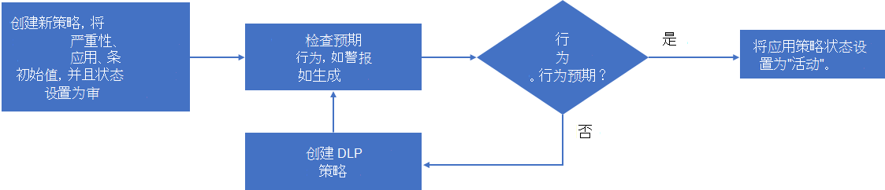

# 创建应用策略

>*[Microsoft 365 安全与合规性许可指南](https://aka.ms/ComplianceSD)。*

除了一组用于检测异常应用行为和生成警报的内置功能外，Microsoft 应用治理中的应用策略也可以帮助你:

- 指定应用治理可以提醒应用行为以进行自动或手动修正的条件。
- 为组织实施应用合规性策略。

可以根据提供的可自定义模板创建应用策略，也可以创建自己的自定义应用策略。

要创建新的应用策略，请转到“**Microsoft 365 合规中心”>“应用治理”>“概述”页面>“策略**”:

- 要使用专为应用使用设计的模板新建应用策略，请选择 **创建应用使用策略** 下的“**创建策略**”。
- 要使用专为应用权限设计的模板新建应用策略，请选择 **创建应用权限策略** 下的 **创建策略**。
- 要新建应用认证的应用策略或创建自定义策略，请选择 **新建**。

## 应用策略模板

要基于应用策略模板新建应用策略，请在 **选择应用策略模板页面** 中选择应用模板类别，选择模板名称，然后选择 **下一步**。

应用治理有三种应用策略模板。

### 应用用户和数据访问

应用治理包含这些用于生成应用使用警报的模板。

 

****

|模板名称|说明|
|---|---|
|具有大量数据访问的新应用|突出显示具有大量数据访问的最近注册应用，以确保这些数据模式符合预期。 
 默认情况下，此策略将标记过去 7 天内注册并且在该期间数据访问超过 1 GB 的所有应用。此策略可通过更多条件和操作进行自定义。|
|||

### 应用权限

应用治理包含这些用于生成应用权限警报的模板。

 

****

|模板名称|说明|
|---|---|
|特权过多的应用|突出显示授予的权限超过那些应用使用的权限的应用，以确定可能减少权限的机会。 
 默认情况下，如果 90 天内未使用，此策略将标记所有标记为“特权过多”的应用。 可以使用更多条件和操作自定义此时间段过滤器。|
|具有高特权权限的新应用|突出显示所有具有高特权权限的新应用，以确定可能需要进一步调查的潜在高占用空间应用。 
 默认情况下，此策略将标记所有在过去 7 天内注册的、具有高范围权限的应用。|
 |具有非图形权限的新应用|突出显示所有具有非 Graph API 权限的新应用，以识别和查看可能未获取最新安全更新或将来可能不受支持的 API。
 
 默认情况下，此策略将标记所有在过去 7 天内注册的、具有非 Graph 权限的应用。|
|||

### M365 认证

应用治理包含这些用于生成 M365 认证警报的模板。

 

****

|模板名称|说明|
|---|---|
|未经认证的新应用|突出显示尚未通过 M365 认证流程的新应用，以确保其在租户中符合预期。 
 默认情况下，此策略将标记所有在过去 7 天内注册且未经认证的应用。|
|||

## 自定义应用策略

当需要执行某个内置模板尚未完成的操作时，请使用自定义应用策略。

要新建自定义应用策略，请先在 **策略** 页面中选择 **新建**。 在 **选择应用策略模板页面**，选择 **自定义** 类别、**自定义策略** 模板，然后选择 **下一步**。

在 **名称和说明** 页面，配置以下内容:

- 策略名称

- 策略说明

- 选择策略严重性，设置此策略生成的警报的严重性。

  - High
  - Medium
  - 低

在 **选择策略设置和条件** 页面，对于 **选择此策略适用的应用**，选择:

- 所有应用
- 选择特定应用

  允许选择一个或多个应用的窗格。选择 **添加**。

选择 **下一步**。

在 **选择策略设置和条件** 页面，选择 **设置策略的新条件**，然后选择 **下一步**。

**创建规则** 窗格允许选择新规则的条件。 选择 **添加条件** 并从条件列表中进行选择，然后指定条件的值。 可以添加多个条件。

以下是自定义应用策略的可用条件。

 

****

|条件|接受的条件值|详细信息|
|---|---|---|
|应用注册年龄|过去 X 天内||
|应用认证|基本合规性、MCAS 合规性或 N/A|[Microsoft 365 认证](/microsoft-365-app-certification/docs/enterprise-app-certification-guide)|
|发布者验证|是或否|[发布者验证](/azure/active-directory/develop/publisher-verification-overview)|
|应用程序权限|从列表中选择一个或多个 API 权限|[Microsoft Graph 权限参考](/graph/permissions-reference)|
|委托的权限|从列表中选择一个或多个 API 权限|[Microsoft Graph 权限参考](/graph/permissions-reference)|
|高权限|是或否|这是基于 MCAS 使用的相同逻辑的内部指定。|
|特权过多的应用|是或否|授予的权限超过那些应用使用的权限的应用。|
|非图形 API 权限|是或否|具有非图形 API 权限的应用。|
|应用数据访问|每小时数据访问量超过 X GB||
|应用数据访问趋势|过去 7 天内数据使用量增加 X%||
|应用 API 访问|每小时 API 调用数超过 X||
|应用 API 访问趋势|过去 7 天内 API 调用数增加 X%||
|同意的用户|同意的用户(超过或不足)X||
|同意的优先用户|是或否|具有 [优先级帐户](/microsoft-365/admin/setup/priority-accounts) 的用户。|
|应用同意者|从列表中选择用户||
|认可用户的角色|选择一个或多个: Teams 管理员、目录读取者、安全信息读取者、合规性管理员、安全管理员、帮助台管理员、SharePoint 管理员、Exchange 管理员、全局读取者、全局管理员、合规性数据管理员、用户管理员、服务支持管理员|允许多个选择。 
 此列表中应提供具有已分配成员的 Azure AD 角色。|
|已访问的工作负载|OneDrive 和/或 SharePoint 和/或 Exchange|允许多个选择。|
|错误率|在过去 7 天内，错误率大于 X%，其中 X 为管理员定义的值||
||||

必须满足所有指定的条件，此应用策略才能生成警报。

指定条件后，选择 **保存**，然后选择 **下一步**。

在 **定义策略操作** 页面，如果你希望应用治理在生成基于此策略的警报时禁用应用，请选择 **禁用应用**，然后选择 **下一步**。

在 **定义策略状态** 页面，选择以下其中一个选项:

- **审核模式**: 评估策略但不执行配置的操作。 审核模式策略在策略列表中显示为 **审核** 状态。
- **活动**: 评估策略并执行配置的操作。
- **非活动**: 不评估策略且不执行配置的操作。

## 创建自定义策略

应用治理提供了一些基本模板，可帮助轻松创建有用的策略来监视租户中的应用。

1. 在应用治理页面上，选择“**策略**”选项卡。
1. 选择“**创建策略**”。
1. 在“**类别**”下，选择“**自定义**”。 在“**模板**”下，选择“**自定义策略**”。 选择“**下一步**”。
1. 输入策略名称，键入说明，然后在“**策略严重性**”下拉列表中选择一个严重性。选择“**下一步**”。
1. 选择“**否，我想要自定义策略**”，然后选择“**下一步**”。
1. 选择是希望此策略应用于租户中的所有应用，还是选择特定应用。 如果你为此策略选择特定应用，请选择“**添加应用**”，然后从列表中选择所需的应用。 在“**选择应用**”窗格中，可以选择将应用此策略的多个应用，然后选择“**添加**”。 对列表满意后，选择“**下一步**”。
1. 选择“**为策略设置新条件**”，然后选择“**编辑条件**”。 选择“**添加条件**”并从列表中选择一个条件，然后选择要应用的条件。 重复上述步骤以添加更多条件。 选择“**保存**”以保存规则，完成规则添加后，选择“**下一步**”。
1. 默认情况下，此策略将在满足条件时触发警报。 你可以选择在触发策略时采取措施，如“**禁用应用**”。 应用操作时要谨慎，因为策略可能会影响用户和合法的应用使用。 选择“**下一步**”。
1. 选择策略状态：
    - **审核** - 策略评估处于活动状态，但策略操作已禁用。
    - **活动** - 策略评估和操作处于活动状态。
    - **非活动** - 策略评估和操作处于禁用状态。
  
    如需测试新策略，应使用“审核”模式。选择“**下一步**”。
1. 仔细检查自定义策略的所有参数。 在满意后，选择“**提交**”。 你还可以返回并更改设置，只需在任意设置下选择“**编辑**”即可。

## 测试并监视新的应用策略

现在，应用策略已经创建，你应在 **策略** 页面中进行监视，以确保在测试期间其注册的活动警报数和警报总数符合预期。

如果警报数为预期之外的低值，请编辑应用策略的设置，以确保在设置其状态之前进行正确配置。

以下是新建策略、测试策略并使其处于活动状态的流程的示例:

1. 新建策略，将严重性、应用、条件以及操作设置为初始值，并将状态设置为 **审核模式**。
2. 检查预期行为，例如生成的警报。
3. 如果行为不符合预期，请根据需要编辑策略应用、条件以及操作设置，并返回步骤 2。
4. 如果行为符合预期，请编辑策略并将其状态更改为 **活动**。

## 下一步

[管理应用策略。](app-governance-app-policies-manage.md)
