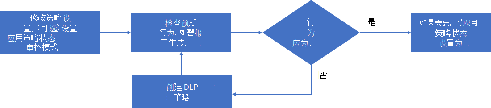

# 管理应用策略

>*[Microsoft 365 安全性与合规性许可指南](https://aka.ms/ComplianceSD)。*

若要及时了解组织正在使用的最新应用、响应基于应用的新攻击，以及针对应用合规性需求进行持续更改，可能需要通过以下方式管理应用策略：

- 创建针对新应用的新策略
- 更改现有策略的状态（活动、非活动、审核模式）
- 更改现有策略的条件
- 更改用于自动修正警报的现有策略的操作

以下是管理现有策略的流程示例：

1. 编辑策略：

  - 更改策略的设置。
  - 如果需要，请将状态更改为“**审核模式**”以进行测试。

2. 检查预期行为，例如生成的警报。
1. 如果该行为不是预期行为，请返回到步骤 1。
1. 如果该行为是预期行为，请编辑策略并将其状态更改为“活动”（如果需要）。

## 编辑应用策略配置

若要更改现有应用策略的配置，请执行以下操作：

- 在策略列表中选择策略，然后在应用策略窗格中选择“**编辑**”。
- 为列表中的策略选择垂直省略号，然后选择“**编辑**”。

对于“**编辑策略**”页面，请逐步浏览页面并进行相应的更改：

- **说明**：更改说明，让用户可以更轻松地理解策略的用途。
- **严重性**
- **策略设置**：更改应用策略的应用集， 也可以选择使用现有条件或修改条件。
- **操作**：更改策略生成的警报的自动修正操作。
- **状态**：更改策略状态。

## 删除应用策略

若要删除应用策略，你可以：

- 在策略列表中选择策略，然后在应用策略窗格中选择“**删除**”。
- 选择列表中策略的垂直省略号，然后选择“**删除**”。

或者，也可以将应用策略的状态更改为“非活动”。 处于非活动状态的策略将不会生成警报。 例如，重命名应用策略以指示其有用，并将其状态设置为“非活动”，而不是删除具有一组特定条件的应用策略，这些条件对将来的策略非常有用。 你可以稍后返回该策略，并针对类似应用对其进行修改，然后将其状态设置为“审核模式”或“非活动”。
