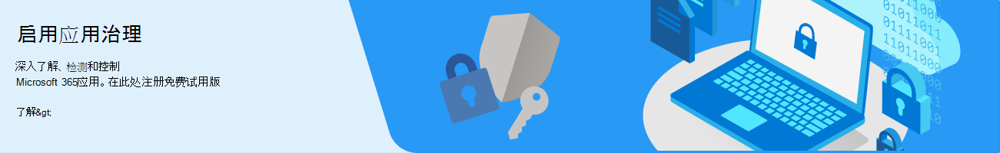

# 开始使用应用治理（预览版）

要开始将应用治理加载项用于 Microsoft Cloud App Security，需要执行三个步骤：

1. [验证许可和管理员先决条件](#licensing-and-administrator-role-prerequisites)。
1. [注册应用治理试用版](#sign-up-for-free-trial-of-app-governance)。
1. [Add MCAS 集成](#add-integration-with-mcas)。

## 注册应用治理免费试用版

对于现有的 Microsoft 365 客户：

1. 导航到 [“免费试用注册页”](https://admin.microsoft.com/Commerce/Trial.aspx?OfferId=20be85b6-b196-402c-82b4-36b4e72862dc)。
1. 完成添加应用程序治理的步骤。 注册很简单，如下图所示。

<!--
:::image type="content" source="../media/manage-app-protection-governance/sign-up-page.png" alt-text="Simple steps to add app governance to your account.":::
-->

如果还不是 Microsoft 365 客户，则可以注册免费试用版：

1. 在此页面顶部，选择  **“免费账户”**  按钮。
1. 在  **试用 Microsoft 365 商业版** 下选择 **“免费试用 1 个月”**。
1. 完成注册步骤。

## 添加与 MCAS 的集成

先决条件：

- Office 365 已在云应用安全中连接
- Office 365 Azure AD 应用已启用

要启用与云应用安全的应用治理同步，请执行以下步骤:

1. 转到 Microsoft Cloud App Security 门户 - [https://portal.cloudappsecurity.com](https://portal.cloudappsecurity.com)
1. 选择齿轮图标（右上角），然后选择“**设置**”。
1. 在 **威胁防护** 下，选择“**应用治理**”。
1. 选择“**启用应用治理集成**”，然后选择“**保存**”。

要验证与 MCAS 的集成是否可用，请查找下面列出的应用治理策略以显示在 MCAS 中。 启用集成后，新策略可能需要几分钟才能显示。

- Microsoft 365 OAuth 应用信誉
- Microsoft 365 OAuth 网络钓鱼检测
- Microsoft 365 OAuth 应用治理

## 许可和管理员角色先决条件

1. 验证账户是否有[适当的许可级别](#licensing-for-app-governance)。应用治理是 Microsoft Cloud App Security (MCAS) 的附加功能，因此 MCAS 必须作为独立产品或作为各种许可证包的一部分存在于帐户中。
1. 必须具有下面列出的 [管理员角色](#administrator-roles) 之一才能访问门户中的应用治理页面。
1. 组织的帐单地址必须在[北美、欧洲或非洲的支持地区](app-governance-countries.md) 之一，以便激活免费试用。

### 应用治理许可

在开始使用应用治理之前，应该先确认 [Microsoft 365 管理中心 - 订阅](https://admin.microsoft.com/Adminportal/Home?source=applauncher#/subscriptions) 和任何加载项。 若要访问和使用应用治理，你的组织必须拥有以下订阅或加载项之一：

- Microsoft Cloud App Security
- Microsoft 365 E5/A5
- Microsoft 365 E5/A5 合规
- Microsoft 365 E5/A5 信息保护和治理
- Microsoft 365 E5/A5 安全性
- Microsoft 365 F5 合规加载项
- Microsoft 365 F5 安全性 + 合规加载项

### 管理员角色

> [!NOTE]
> 只有全局管理员可以激活应用治理免费试用版。

要查看应用治理页面或管理策略和设置，需要以下管理员角色之一：

-  应用程序管理员
- 云 应用程序管理员
- 公司管理员
- 合规管理员
- 合规数据管理员
- 合规信息读取者（只读）
- 全局读取者
- 安全管理员
- 安全操作员
- 安全信息读取者（只读）

以下是每个角色的能力。

| 角色 | 阅读仪表板 | 读取所有应用 |读取策略 | 创建、更新或删除策略 | 读取警报 | 更新警报 | 读取设置 | 更新设置 | 读取修正 | 更新修正 |
|:-------|:-----|:-------|:-------|:-------|:-------|:-------|:-------|:-------|:-------|:-------|
| 应用程序管理员 |  |  |  |  |  |  |  |  |  |  |
| 云应用程序管理员 |  | | | | | | | | | |
| 公司管理员 |  |  |  |  |  |  |  |  |  |  |
| 合规管理员 |  |  |  |  |  |  |  |  |  | |
| 合规数据管理员 |  |  |  |  |  |  |  |  |  | |
| 合规信息读取者 |  |  |  |  |  |  |  |  | | |
| 全局读取者  |  |  |  |  |  |  |  |  | | |
| 安全管理员 |  |  |  |  |  |  |  |  |  | |
| 安全操作员 |  |  |  |  |  |  |  |  |  | |
| 安全信息读取者  |  |  |  |  |  |  |  |  |  | |
|||||||||| | |

有关每个角色的其他信息，请参阅[管理员角色权限](/azure/active-directory/roles/permissions-reference)。

## 正在取消试用版

如果未参与个人预览，并且希望取消应用治理试用版，则可以与 CXE 联系人通信，或使用以下步骤：

1. 在 Microsoft 365 管理中心中，转到“**账单**” > “<a href="https://go.microsoft.com/fwlink/p/?linkid=842054" target="_blank">**你的产品**</a>”。
1. 导航到应用治理试用版，单击三个点，然后选择“**取消订阅**”。
1. 在生成的浮出窗格中，提供取消原因、任何其他反馈，然后选择“**取消订阅**”。
1. 在生成的弹出屏幕中选择“**取消订阅**”。你的试用版已取消，你将失去对应用治理的访问权限，并将删除你的应用治理数据（用于创建应用治理见解和检测的日志数据 - 不会影响电子邮件或其他文件）。

## 公共预览版的已知问题

应用治理团队已确定预览版的以下已知问题： 

- Microsoft Defender 和应用治理警报之间的双向同步 - 目前，在 Defender 中已解决的警报也必须在应用治理中手动解决。
