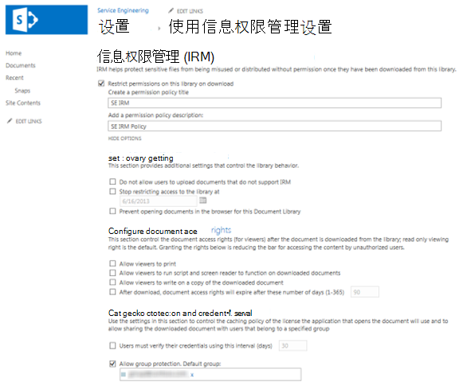

# 将信息权限管理 (IRM) 列表或库

您可以使用信息权限管理 (IRM) 来帮助控制和保护从列表或库下载的文件。 此功能仅在 Microsoft 全局云中受支持。 国家云部署中的SharePoint和库不支持 IRM。
  
## 应用 IRM 之前管理员准备工作

- Azure 信息 (Azure RMS) Azure 权限管理服务，本地等效项 Active Directory Rights Management Services (AD RMS) 支持网站的信息权限管理。 无需单独安装或其他安装。

- 在将 IRM 应用到列表或库之前，需要为网站启用 IRM。 需要管理员权限才能启用 IRM。

- 若要将 IRM 应用于列表或库，您必须具有该列表或库的管理员权限。

- 如果使用的是 SharePoint Online，用户在下载受 IRM 保护的较大文件时可能会遇到超时。 为避免超时，请使用 Office 程序应用 IRM 保护，将较大的文件存储在不使用 IRM 的 SharePoint 库中。

> [!NOTE]
> 如果使用的是 SharePoint Server 2013，则服务器管理员必须在所有前端 Web 服务器上为组织中人员希望使用 IRM 保护的每种文件类型安装保护程序。
  
## 将 IRM 应用于列表或库

  
1. 转到要配置 IRM 的列表或库。

2. 在功能区上，选择"库 **"** 选项卡，然后选择"库 **设置"。**  (如果您在列表中工作，请选择"列表"选项卡，然后选择"列表 **设置) 。** 
    
    
  
3. 在 **"权限和管理"下**，选择 **"信息权限管理"。** 如果未显示"信息权限管理"链接，则可能无法为您的网站启用 IRM。 请与服务器管理员联系，看看能否为网站启用 IRM。 图片 **库不会** 显示"信息权限管理"链接。

4. 在"**信息权限** 管理设置页上，选中"下载时限制对此库中的文档的权限"复选框，以将受限权限应用于用户从此列表或库中下载的文档。

5. 在 **"创建权限策略标题"框中** ，输入策略的描述性名称。 使用可帮助您从其他策略识别此策略的名称。 例如，使用 **"公司机密** "将受限权限应用于包含机密公司文档的列表或库。

6. 在 **"添加权限策略** 说明"框中，键入对使用此列表或库的用户显示的说明，说明他们应如何处理此列表或库中的文档。 例如，如果要将访问这些文档中的信息限制为内部员工，可以键入"仅与其他员工讨论本文档的内容"。 

7. 若要对此列表或库中的文档应用其他限制，请选择"显示选项"，然后执行下列任一操作： 

|**为此:**|**为此：**|
|:-----|:-----|
|允许用户从此列表或库中打印文档|选中" **允许查看者打印"** 复选框。|
|允许至少具有"查看项目"权限的用户对文档运行嵌入的代码或宏。|选中" **允许查看者运行脚本和屏幕阅读器对下载的文档** 运行功能"复选框。如果选择此选项，则用户可以运行代码来提取文档的内容。           |
|如果要将内容访问限制为指定时间段，请选择此选项。 如果选择此选项，访问内容的用户发布许可证将在指定天数后过期，用户需要返回到服务器以验证其凭据并下载新副本。|选中"下载后，文档访问权限将在这些天数 **(1-365)** 过期"复选框，然后指定您希望文档可查看的天数。|
| 阻止用户将不支持 IRM 的文档上载到此列表或库。 如果选择此选项，用户将无法上载以下任一文件类型：未在所有前端 Web 服务器上安装相应 IRM 保护程序的文件类型。 Server 2010 SharePoint无法解密的文件类型。 在另一个程序中受 IRM 保护的文件类型。|选中 **"不允许用户上载不支持 IRM** 的文档"复选框。|
|特定日期从此列表或库中删除受限权限。|选中 **"停止限制对库的访问"** 复选框，然后选择您需要的日期。|
|控制为授权打开文档的程序缓存凭据的时间间隔。|选中" **用户必须使用此间隔** (天) 验证其凭据"复选框，然后输入缓存凭据的间隔（以天为单位）。|
|允许组保护，以便用户可以与同一组的成员共享。|选择 **"允许组保护**"，然后输入组的名称进行共享。|

8. 选择完想要的选项后，选择"确定 **"。**
  
## 什么是信息权限管理？

信息权限 (IRM) 使您可以限制用户可以对从列表或库下载的文件采取的操作。 IRM 对下载的文件进行加密并限制允许解密这些文件的用户和程序组。 IRM 还可限制允许读取文件的用户的权限，以便这些用户无法执行打印文件的副本或复制文件中的文本等操作。
  
可以在列表或库上使用 IRM 来限制敏感内容的传播。 例如，如果您要创建一个文档库来与选定的营销代表共享有关即将推出的产品的信息，您可以使用 IRM 来防止这些人员与公司内的其他员工共享此内容。
  
在站点上，将 IRM 应用于整个列表或库，而不是单个文件。 这样一来，可以更轻松地确保为一组文档或文件提供一致的保护级别。 因此，IRM 可帮助组织强制执行公司策略，以控制机密或专有信息的使用和分发。
  
> [!NOTE]
> 此页上有关信息权限管理的信息将取代任何 Microsoft SharePoint Server 2013 和 SharePoint Server 2016 许可条款协议中引用"信息权限管理"的任何术语。 
  
### IRM 如何帮助保护内容

IRM 有助于通过以下方式保护受限内容：
  
- 有助于防止授权查看器复制、修改、打印、传真或复制和粘贴内容以未经授权使用
    
- 有助于防止授权查看器使用 Microsoft 技术中的打印屏幕功能复制Windows
    
- 有助于防止未经授权的查看器在从服务器下载内容后以电子邮件方式发送内容时查看内容
    
- 将内容访问限制在指定的时段内，在此时间段后，用户必须确认其凭据并再次下载内容
    
- 帮助强制执行公司策略，以管理组织内容的使用和分发
    
### IRM 无法帮助保护内容

IRM 无法保护受限内容免受以下限制：
  
- 恶意程序（如特洛伊木马、击键记录程序和某些类型的间谍软件）清除、盗窃、捕获或传输
    
- 由于计算机病毒的操作而丢失或损坏
    
- 手动复制或重新设置屏幕上显示的内容的字体
    
- 屏幕上显示的内容的数字或电影制作
    
- 使用第三方屏幕捕获程序进行复制
    
- 使用第三 (捕获程序或复制) 复制内容元数据和列值
  
## IRM 如何用于列表和库

IRM 保护应用于列表或库级别的文件。 当为库启用 IRM 时，权限管理将应用于该库中的所有文件。 当为列表启用 IRM 时，权限管理仅适用于附加到列表项的文件，而不是实际列表项。
  
当用户在启用 IRM 的列表或库中下载文件时，文件会进行加密，以便只有授权人员才能查看它们。 每个权限管理文件还包含对查看该文件的人施加限制的发布许可证。 典型限制包括使文件成为只读、禁用文本复制、阻止用户保存本地副本以及阻止用户打印文件。 可读取支持 IRM 的文件类型的客户端程序使用权限管理文件内的颁发许可证来强制执行这些限制。 这是权限管理文件即使在从服务器下载后仍保留其保护的方式。
  
从列表或库下载文件时应用于文件的限制类型基于单个用户对包含该文件的网站的权限。 下表说明了网站权限如何与 IRM 权限对应。
  
|**权限**|**IRM 权限**|
|:-----|:-----|
|管理权限、管理网站|**完全控制** (客户端程序) ：此权限通常允许用户读取、编辑、复制、保存和修改权限管理内容的权限。|
|编辑项目、管理列表、添加和自定义页面|**编辑**、复制和 **保存**：只有在列表或库的信息权限管理设置选中"允许用户打印文档"复选框时，用户才能打印文件。|
|查看项目|**读取**：用户可以读取文档，但不能复制或修改其内容。 只有在列表或库的"信息权限管理"页上选中了"允许用户打印文档"设置用户才能打印。|
|其他|没有直接对应于 IRM 权限的其他权限。|
   
在 SharePoint Server 2013 中为列表或库启用 IRM 时，只能保护在所有前端 Web 服务器上安装了保护程序的列表或库中的文件类型。 保护程序是控制特定文件格式权限管理文件的加密和解密的程序。 SharePoint包括以下文件类型的保护程序：
  
- Microsoft OfficeInfoPath 表单
    
- 以下程序 97-2003 文件格式Microsoft Office Word、Excel 和 PowerPoint
    
- 以下Office的 Open XML 格式Microsoft Office Word、Excel 和 PowerPoint
    
- XML 纸张规范 (XPS) 格式
    
如果组织计划使用 IRM 保护除上面列出的文件类型之外的其他任何文件类型，则服务器管理员必须安装这些其他文件格式的保护程序。
  

